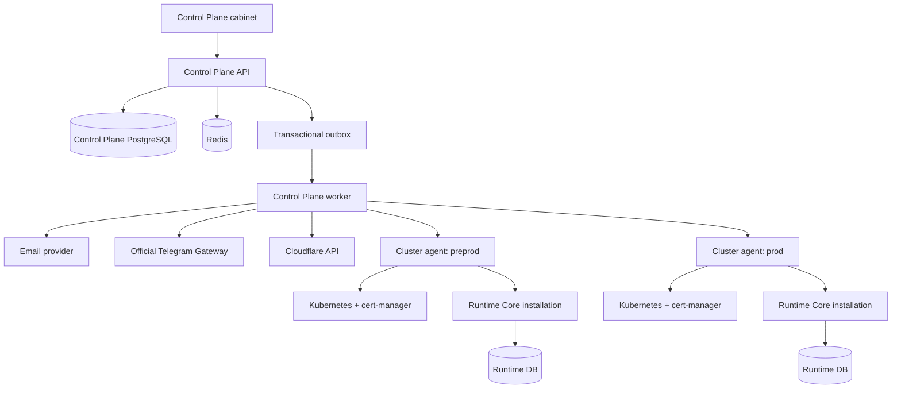
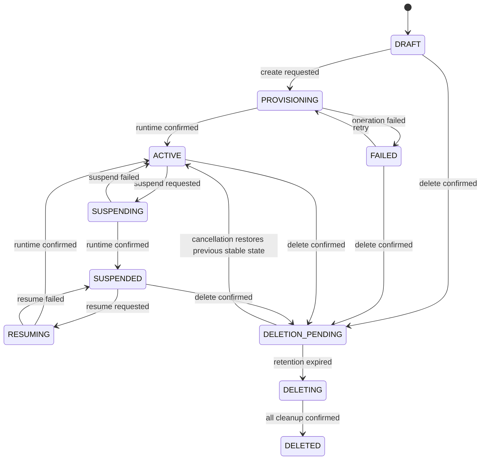
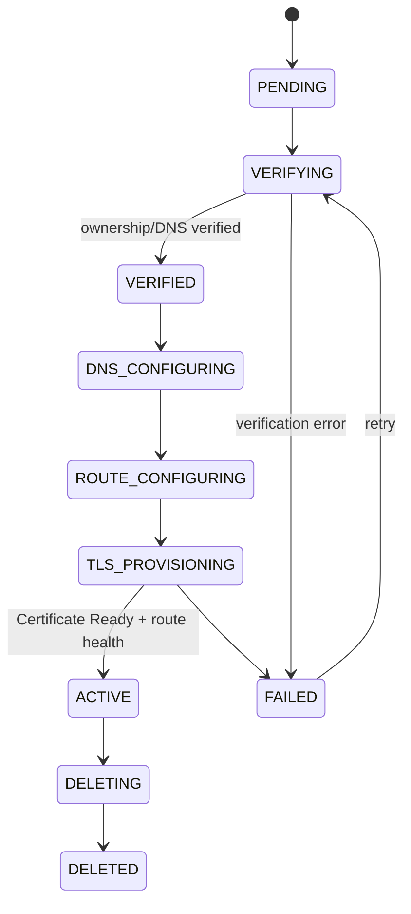

# План реализации DNK Control Plane

## 1. Назначение документа

Этот документ задаёт целевую архитектуру и последовательность реализации
от текущего каркаса до production-ready Control Plane.

План рассчитан на поэтапную поставку вертикальных срезов. После каждого этапа
система должна оставаться собираемой, тестируемой и пригодной для продолжения
работы. Длительные операции не маскируются синхронным HTTP-вызовом: они
представляются отдельными операциями с наблюдаемым статусом.

Текущий каталог содержит только:

- границы backend-модулей;
- минимальный FastAPI health endpoint;
- место для отдельного кабинета;
- черновые Helm values для `preprod` и `prod`;
- место для версионируемого контракта Runtime Management API.

Бизнес-функциональность из этого документа ещё не реализована.

## 2. Целевой результат

Control Plane должен позволять:

1. Зарегистрировать глобального пользователя.
2. Войти по email OTP, phone OTP через официальный Telegram Gateway, Google или
   GitHub.
3. Хранить глобальный профиль пользователя и глобальный профиль платформы.
4. Создавать клиентов и tenants, видеть состояние provisioning.
5. Управлять membership и безопасно передавать роль `OWNER`.
6. Приостанавливать и удалять tenant через наблюдаемую асинхронную операцию.
7. Регистрировать Cluster и Single/Box installations.
8. Размещать tenant на installation и сверять desired/actual state.
9. Выделять platform subdomain и управлять custom domains.
10. Использовать Cloudflare как первый DNS provider.
11. Создавать Kubernetes route и заказывать сертификат через cert-manager
    `Issuer`/`ClusterIssuer`.
12. Предоставлять простой кабинет для всех перечисленных операций.
13. Деплоиться одним Helm chart в независимые `preprod` и `prod` окружения.
14. В перспективе хранить тариф, подписку и зеркало счетов, не смешивая billing
    с tenant lifecycle.

## 3. Архитектурное решение

Control Plane является отдельным приложением, отдельным security boundary и
владельцем отдельной PostgreSQL. Он может находиться в одном monorepo с Runtime
Core, но должен собираться, тестироваться и деплоиться независимо.



API, worker и scheduler используют один backend package и один container image,
но запускаются разными командами и Kubernetes workloads.

### 3.1. Базовые правила границ

- Control Plane не импортирует код из корневого `src/` Runtime Core.
- Runtime Core не импортирует доменные сущности Control Plane.
- Приложения не используют общую БД и не читают таблицы друг друга.
- Интеграция выполняется через versioned HTTP/agent contract и события.
- Control Plane хранит desired state, installation сообщает actual state.
- Runtime обслуживает пользовательский traffic без синхронной зависимости от
  доступности Control Plane.
- Внешние provider credentials хранятся в Vault/External Secrets; в БД хранится
  только `secret_ref`.
- Изменения DNS, Kubernetes и Runtime выполняются повторяемо и идемпотентно.

### 3.2. Источники истины

| Данные | Источник истины | Проекция/потребитель |
| --- | --- | --- |
| Глобальный пользователь и профиль | Control Plane | Cabinet |
| Login identities, OTP, OAuth, sessions | Control Plane | Cabinet |
| Публичный профиль платформы | Control Plane | Cabinet/login page |
| Customer и billing metadata | Control Plane | Cabinet/billing provider |
| Глобальный Tenant и membership | Control Plane | Runtime projection |
| Tenant owner | Control Plane | Audit/cabinet |
| Installation, placement, release state | Control Plane | Cluster agent |
| Tenant runtime data и runtime schema | Runtime Core | Tenant applications |
| Tenant-local users и permissions | Runtime Core | Runtime console |
| Domain binding и DNS intent | Control Plane | Cloudflare/cluster agent |
| Локальное host-to-tenant разрешение | Runtime Core | Runtime requests |
| Kubernetes desired state | Control Plane | Cluster agent |
| Kubernetes actual state | Kubernetes/agent | Control Plane snapshot |
| TLS certificate actual state | cert-manager | Control Plane snapshot |
| Audit trail | Control Plane | Security/operations |

## 4. Модули и модели

Ниже приведена предварительная модель. Точные типы и индексы фиксируются в
миграциях соответствующего этапа.

### 4.1. `identity_access`

Основные сущности:

- `UserAccount`: глобальная учётная запись, status, timestamps.
- `UserProfile`: display name, avatar, locale, timezone.
- `AccountEmail`: normalized email, primary/verified flags.
- `AccountPhone`: номер в E.164, primary/verified/login flags.
- `ExternalIdentity`: provider, provider subject, provider metadata.
- `OtpChallenge`: purpose, target hash, code hash, TTL, attempts, consumed time.
- `Session`: user, token hash, expiry, last activity, revocation.

Один пользователь может иметь несколько способов входа. Identity связывается
с существующим account только после доказанного владения обеими сторонами.

### 4.2. `system_profile`

Singleton `SystemProfile` содержит:

- название и branding платформы;
- public cabinet/runtime URLs;
- support email/links;
- default locale/timezone;
- список разрешённых auth providers;
- public registration policy;
- ссылки на секреты и provider configuration IDs, но не сами секреты.

Изменения требуют platform-admin роли и попадают в audit.

### 4.3. `customers`

- `Customer`: коммерческий/юридический клиент.
- `CustomerMembership`: пользователи, имеющие доступ к клиенту.
- `CustomerProfile`: billing email, company fields, country, tax metadata.

Customer оплачивает сервис; Tenant является техническим workspace. Передача
Tenant owner не должна неявно менять Customer или billing owner.

### 4.4. `tenancy`

- `Tenant`: глобальный ID, customer ID, name, slug, status, desired config.
- `TenantMembership`: tenant ID, user ID, role, status.
- `OwnershipTransfer`: from/to user, status, expiry, confirmation metadata.
- `TenantDeletionRequest`: requested by, retention deadline, operation ID.

Роли первого этапа:

```text
OWNER > ADMIN > MEMBER > VIEWER
```

Инварианты:

- у каждого не удалённого tenant ровно один active `OWNER`;
- `Tenant.owner_membership_id` указывает на active membership, а `OWNER`
  является effective role; fallback role membership — `ADMIN`;
- передача выполняется транзакционно с блокировкой tenant/membership;
- recipient должен иметь подтверждённый глобальный account;
- операция требует recent authentication/OTP;
- прежний owner становится `ADMIN`;
- transfer и delete всегда записываются в audit.

### 4.5. `installations`

- `Installation`: mode `CLUSTER|SINGLE`, environment, region, status.
- `InstallationCredential`: credential ID, scopes, secret hash/ref, rotation.
- `InstallationHeartbeat`: version, health, capacity, last seen.
- `InstallationCapability`: поддерживаемые management API/features.
- `TenantPlacement`: global tenant → installation → local tenant ID.

Control Plane выбирает placement по environment, mode, capacity, region,
release version и capabilities. В Single/Box нормой является один customer на
installation; Cluster может обслуживать tenants нескольких customers.

### 4.6. `provisioning`

- `ProvisioningOperation`: type, target, status, idempotency key, error.
- `ProvisioningStep`: последовательность шагов и компенсаций.
- `InstallationCommand`: команда, payload version, expiry, attempts.
- `OutboxMessage`: событие, готовое к надёжной публикации.

Типы первой версии:

```text
CREATE_TENANT
SUSPEND_TENANT
RESUME_TENANT
DELETE_TENANT
ATTACH_DOMAIN
DETACH_DOMAIN
RECONCILE_DOMAIN
RECONCILE_INSTALLATION
```

### 4.7. `domains` и `dns`

- `DomainBinding`: tenant, installation, hostname, kind, service, statuses.
- `DomainVerification`: method, token hash/value, expiry, attempts.
- `DnsProviderAccount`: provider and `secret_ref`.
- `DnsRecordIntent`: type, name, value, TTL, provider record ID, desired state.
- `DnsReconciliation`: attempt, provider response metadata, error.

Hostname нормализуется через IDNA, хранится lowercase и имеет глобальный unique
constraint среди active bindings.

### 4.8. `cluster_management`

- `ClusterTarget`: environment, agent/endpoint, issuer refs, secret refs.
- `RouteIntent`: host, runtime service, path, desired state.
- `CertificateIntent`: DNS names, secret name, issuer ref, desired state.
- `ClusterResourceSnapshot`: kind/name/namespace/resource version/status.

Каждый созданный ресурс получает детерминированное имя и labels:

```text
app.kubernetes.io/managed-by=dnk-control-plane
dnk.io/resource-id=<control-plane-resource-id>
dnk.io/tenant-id=<tenant-id>
```

Менеджер изменяет и удаляет только ресурсы, которыми владеет по labels и
annotations.

### 4.9. `billing`

- `Plan` и `Entitlement`.
- `Subscription`.
- `BillingAccount`.
- `Invoice` как локальное read model внешнего billing provider.
- `BillingWebhookReceipt` для идемпотентной обработки webhook.

Billing не блокирует создание базовой архитектуры, но его таблицы не должны
появляться внутри `tenants` или `customers` в виде случайного JSON.

## 5. State machines

Канонический каталог состояний и переходов хранится в
`contracts/lifecycle/state-machines.yaml` и проверяется тестами контрактов.

### 5.1. Tenant



`FAILED` обязательно хранит machine-readable `error_code`, безопасное сообщение
для UI и ссылку на последнюю operation. Фактическое состояние installation не
перезаписывается optimistic предположением Control Plane.

Во время `DELETION_PENDING` login/write заблокированы. Ошибка необратимого
cleanup оставляет tenant в `DELETING`; retry отражается состоянием operation, а
не ложным возвратом tenant в `FAILED`.

### 5.2. Provisioning operation

```text
PENDING -> RUNNING -> SUCCEEDED
                   -> RETRY_SCHEDULED -> RUNNING
                   -> FAILED
PENDING/RUNNING -> CANCELLED, только для поддерживаемых операций
```

### 5.3. Domain



Для platform subdomain ownership считается доверенным, но DNS, route, TLS и
health steps всё равно наблюдаются отдельно.

### 5.4. Installation

```text
REGISTERING -> ONLINE -> DEGRADED -> OFFLINE -> DECOMMISSIONED
                   \----------------^ heartbeat recovered
```

`OFFLINE` не удаляет installation и не останавливает Runtime Core. Control Plane
приостанавливает новые placements и показывает устаревшее actual state.

## 6. Авторизация

### 6.1. Общие требования

- Browser session в `HttpOnly`, `Secure`, `SameSite=Lax` cookie.
- CSRF protection для state-changing browser requests.
- Session token хранится в БД только как hash.
- OTP code хранится только как keyed hash, никогда не логируется.
- TTL OTP по умолчанию 5 минут, cooldown resend 60 секунд.
- Не больше 5 попыток на challenge.
- Rate limits по account/contact/IP/device fingerprint.
- После успешной проверки challenge становится одноразово consumed.
- Sensitive операции требуют recent authentication, например не старше 10 минут.
- OAuth flow использует `state`; Google OIDC дополнительно `nonce` и PKCE.
- Изменение primary email/phone, link/unlink provider и owner transfer попадают
  в security audit.

Конкретные лимиты должны быть configurable и уточняться security review.

### 6.2. Email OTP registration/login

```text
POST /api/v1/auth/email/challenges
POST /api/v1/auth/email/challenges/{id}/confirm
POST /api/v1/auth/logout
GET  /api/v1/me
PATCH /api/v1/me/profile
```

Flow:

1. Нормализовать email и применить rate limit без раскрытия существования account.
2. Создать challenge и enqueue notification через outbox.
3. Отправить код транзакционным email provider.
4. Проверить hash/TTL/attempts атомарно.
5. Создать account при разрешённой public registration либо открыть session
   существующего account.
6. Пометить email verified и challenge consumed в одной транзакции.

### 6.3. Phone OTP через Telegram

Phone OTP отправляется через официальный Telegram Gateway API. Номер
нормализуется в E.164; challenge хранит только keyed hashes и encrypted delivery
envelope. TTL кода — 5 минут, максимум 5 попыток, resend cooldown — 60 секунд.
Provider response/status проверяется по официальному контракту и защищается от
повторной обработки. SMS и Telegram Bot не являются неявными fallback в v1.

### 6.4. Google и GitHub

```text
GET /api/v1/auth/oauth/{provider}/start
GET /api/v1/auth/oauth/{provider}/callback
POST /api/v1/me/identities/{provider}/link
DELETE /api/v1/me/identities/{provider}
```

Правила account linking:

- уникальность `(provider, provider_subject)`;
- callback проверяет state, redirect URI и provider response;
- Google identity использует стабильный `sub`, не email как идентификатор;
- для GitHub запрашивается подтверждённый email, если public email отсутствует;
- совпавший email не должен автоматически объединять accounts без утверждённой
  политики и дополнительного подтверждения;
- нельзя удалить последний рабочий способ входа;
- OAuth secrets различаются между preprod и prod.

## 7. Tenant lifecycle и ownership

### 7.1. Создание

```text
POST /api/v1/tenants
GET  /api/v1/tenants/{tenant_id}
GET  /api/v1/operations/{operation_id}
```

`POST` создаёт global tenant, membership OWNER, placement request и
`CREATE_TENANT` operation в одной локальной транзакции. Ответ:

```http
HTTP/1.1 202 Accepted
Location: /api/v1/operations/<operation-id>
```

UI показывает progression по operation steps. Повтор client request с тем же
`Idempotency-Key` возвращает исходный tenant/operation.

### 7.2. Передача owner

Owner transfer всегда двухфазный:

1. Owner выбирает active tenant member.
2. Повторно подтверждает sensitive action OTP/OAuth re-auth.
3. Создаётся `OwnershipTransfer(PENDING, expires_at=24h)`.
4. Recipient принимает передачу.
5. В одной транзакции recipient становится OWNER, предыдущий owner — ADMIN.
6. Записываются audit и notification events.

```text
POST /api/v1/tenants/{id}/owner-transfers
POST /api/v1/tenants/{id}/owner-transfers/{transfer_id}/accept
POST /api/v1/tenants/{id}/owner-transfers/{transfer_id}/cancel
```

### 7.3. Удаление

Удаление является saga, а не `DELETE FROM tenants`:

1. Re-auth и явное подтверждение tenant name.
2. Tenant получает `DELETION_PENDING`, сохраняет предыдущее стабильное состояние,
   а новые login/write operations блокируются.
3. В течение 30 дней удаление можно отменить с восстановлением состояния.
4. После retention tenant получает `DELETING`, Runtime подтверждает suspend/purge.
5. Удаляются управляемые DNS records, Certificate и Ingress.
6. Tenant становится `DELETED` только после подтверждения всего cleanup; audit и
   минимальный tombstone сохраняются.

Ошибка cleanup оставляет tenant в `DELETING`, а operation переходит в retry flow.

## 8. Runtime Management API

Существующий Runtime endpoint создания tenant остаётся legacy отправной точкой.
Целевой command contract версионирован, подписан и идемпотентен.

```text
POST   /management/v1/commands/{command_id}/execute
GET    /management/v1/commands/{command_id}
GET    /management/v1/installation/capabilities
GET    /management/v1/installation/health
GET    /management/v1/installation/version
```

Обязательные свойства:

- `Idempotency-Key` и `operation_id` для mutation;
- stable `external_id` из Control Plane;
- compact JWS `EdDSA/Ed25519` с обязательным `kid`, audience, installation ID и
  TTL 5 минут;
- agent доставляет signed command без изменения payload;
- deadlines, retry-safe responses и machine-readable errors;
- contract tests в обоих приложениях;
- backward-compatible evolution через версию API/payload.

Cluster и Box используют единый mTLS agent pull protocol:

```text
POST /agent/v1/bootstrap
POST /agent/v1/certificates/rotate
POST /agent/v1/heartbeats
GET  /agent/v1/commands?cursor=<cursor>&limit=50&wait_seconds=30
POST /agent/v1/commands/{command_id}/ack
POST /agent/v1/commands/{command_id}/result
```

Нормальная работа Runtime не должна прекращаться при потере связи с Control
Plane. Откладываются только административные команды и обновление actual state.

## 9. DNS manager

### 9.1. Provider abstraction

Application port должен поддерживать:

```text
resolve_zone(hostname)
upsert_record(record_intent)
delete_record(provider_record_id)
get_record(provider_record_id)
list_relevant_records(zone_id, name)
```

Cloudflare adapter является первым implementation. Token получает минимальные
права Zone Read + DNS Edit только для нужной zone. Provider API request ID и
response status пишутся в telemetry, секреты — никогда.

Должен существовать только один writer для конкретной записи. Нельзя
одновременно разрешить Control Plane, ExternalDNS, ArgoCD и ручному `kubectl`
управлять одним DNS record set.

### 9.2. Platform subdomains

Поддержать две стратегии:

- `PER_TENANT`: явный CNAME/A record на tenant, проще аудит MVP;
- `WILDCARD`: один `*.preprod.example.com`/`*.example.com`, лучше масштабируется.

Domain binding создаётся в любом случае. Стратегия выбирается на уровне
environment/zone, а не условием внутри tenant use case.

Slug резервируется в БД до внешнего DNS call. DNS retries используют один
record intent и provider record ID, чтобы не плодить дубликаты.

### 9.3. Custom domains

Режимы:

1. `EXTERNAL_MANUAL`: UI показывает TXT ownership challenge и CNAME/A target;
   пользователь меняет DNS сам.
2. `CONNECTED_CLOUDFLARE`: customer предоставляет scoped credential/delegation,
   Control Plane создаёт записи автоматически.
3. `PLATFORM_ZONE`: домен находится в zone платформы и полностью управляется CP.

Control Plane не может обещать автоматическое изменение произвольного custom
domain без делегированного provider credential.

## 10. Kubernetes manager и SSL

### 10.1. Модель доступа

API pod не получает `cluster-admin`. Для каждого управляемого кластера
разворачивается agent/controller с ограниченным ServiceAccount. Он получает
desired commands, применяет разрешённые ресурсы и возвращает snapshots/status.

Control Plane не хранит kubeconfig и не вызывает Kubernetes API напрямую.
Preprod/prod agents имеют разные mTLS identities и namespace-scoped RBAC.

Разрешённые ресурсы первой версии:

- `networking.k8s.io/v1` `Ingress` через `ingress-nginx`;
- `Certificate` cert-manager;
- чтение `CertificateRequest`, `Order`, `Challenge` для диагностики;
- чтение Service/Endpoint readiness;
- опционально Namespace, только если tenant deployment действительно
  namespace-isolated.

### 10.2. Reconciliation domain

1. Убедиться, что DNS указывает на ingress target.
2. Server-Side Apply route с ownership labels.
3. Создать `Certificate` с детерминированным `secretName`.
4. Указать настроенный `issuerRef`.
5. Дождаться `Certificate Ready=True`.
6. Проверить HTTPS health/SNI.
7. Только после этого сделать DomainBinding `ACTIVE`.

Пример intent, а не готовый template:

```yaml
apiVersion: cert-manager.io/v1
kind: Certificate
metadata:
  name: tenant-domain-<short-id>
  labels:
    app.kubernetes.io/managed-by: dnk-control-plane
spec:
  secretName: tenant-domain-<short-id>-tls
  dnsNames:
    - tenant.example.com
  issuerRef:
    kind: ClusterIssuer
    name: letsencrypt-production
```

Для platform subdomains целевой вариант — wildcard certificate. Для custom
domains создаются отдельные Certificates либо контролируемые SAN groups.

### 10.3. Drift и безопасность удаления

- Reconciler периодически сравнивает desired/actual state.
- Manual drift либо исправляется, либо помечается policy violation.
- Ресурс без ownership labels не удаляется автоматически.
- Перед delete проверяются UID/labels/resource ID.
- Все apply/delete actions записываются в audit с actor `cluster-agent`.
- Issuer создаётся platform operations отдельно; tenant flow только ссылается
  на разрешённый issuer.

## 11. Helm и два окружения

Один chart используется с разными values:

```text
control-plane/deploy/helm/dnk-control-plane/
├── Chart.yaml
├── values.yaml
├── values-preprod.yaml
├── values-prod.yaml
└── templates/
```

Минимальный набор templates:

- API Deployment, Service и probes;
- worker Deployment;
- scheduler Deployment либо CronJobs;
- migration Job;
- cabinet Deployment, Service, Ingress;
- ServiceAccounts и RBAC;
- ConfigMap и ExternalSecret references;
- NetworkPolicy;
- PodDisruptionBudget для prod;
- ServiceMonitor/PodMonitor при наличии Prometheus Operator.

### 11.1. Изоляция окружений

| Ресурс | Preprod | Prod |
| --- | --- | --- |
| Kubernetes | общий cluster, изолированный namespace/controller | общий cluster, изолированный namespace/controller |
| Namespace | `dnk-control-plane-preprod` | `dnk-control-plane-prod` |
| IngressClass | `nginx-preprod` | `nginx-prod` |
| PostgreSQL | отдельная DB/instance | отдельная HA DB/instance |
| Redis/broker | отдельные credentials/resources | отдельные credentials/resources |
| Domain/zone | `control-preprod...` | `control...` |
| OAuth apps | отдельные redirect URIs/secrets | production apps/secrets |
| Cloudflare token | ограничен preprod zone | ограничен prod zone |
| cert-manager | staging issuer | production issuer |
| Email/Telegram | test sender/Gateway credentials | production sender/Gateway credentials |

Один Kubernetes cluster является принятым риском: namespaces, отдельные
ingress-nginx controllers/LB, RBAC, NetworkPolicy и credentials уменьшают, но не
устраняют blast radius cluster-level compromise.

### 11.2. Promotion

```text
feature/* -> CI
pre-release -> deploy preprod automatically
release/tag -> manual production approval -> deploy prod
```

В prod продвигается тот же immutable image digest, который прошёл preprod, без
повторной сборки. Rollback выполняется возвратом GitOps state на предыдущий
digest. Миграции должны быть backward-compatible с предыдущей версией API во
время rolling update.

## 12. Наблюдаемость и security baseline

### 12.1. Метрики

- API latency/error rate по route, без contact/tenant IDs в labels.
- OTP requested/delivered/confirmed/failed/rate-limited.
- OAuth callback failures по provider/error category.
- Provisioning duration/result/retry count по operation type.
- Installation heartbeat age и command backlog.
- DNS provider latency/errors.
- Domain verification и certificate issuance duration.
- Reconciliation drift/error count.
- Outbox age и dead-letter count.

### 12.2. Логи и tracing

- structured JSON logs;
- `request_id`, `operation_id`, `command_id`, `installation_id`;
- OpenTelemetry trace между API, worker и provider adapter;
- redaction email/phone/token/cookie/OTP/provider payload secrets;
- отдельное append-only audit storage/retention policy.

### 12.3. Backups и recovery

- автоматические encrypted PostgreSQL backups;
- регулярная restore drill в изолированное окружение;
- документированный RPO/RTO;
- provider records и Kubernetes resources восстанавливаются reconciliation,
  а не считаются единственной копией desired state;
- rotation installation/OAuth/Cloudflare credentials.

## 13. Последовательный implementation backlog

Этапы выполняются по порядку. Нельзя начинать автоматическое удаление, DNS или
Kubernetes mutation до появления operations, idempotency и audit.

### Этап 0. Архитектурный baseline

Цель: устранить неоднозначности до создания таблиц и внешних интеграций.

Задачи:

- [x] Принять ADR: отдельная Control Plane DB и запрет cross-import с Runtime.
- [x] Принять ADR: API + workers как modular monolith, один backend image.
- [x] Утвердить термины `UserAccount`, `Customer`, `Tenant`, `Installation`,
  `TenantPlacement`.
- [x] Утвердить state machines из этого документа.
- [x] Зафиксировать официальный Telegram Gateway как phone OTP transport.
- [x] Выбрать `Ingress` + `ingress-nginx` как основной route resource.
- [x] Выбрать environment-scoped agent с mTLS и единым pull protocol.
- [x] Зафиксировать 30-дневный tenant deletion retention и 365-дневный audit retention.
- [x] Создать threat model для auth, owner transfer, provider credentials и
  cluster access.
- [x] Создать OpenAPI 3.1 contracts для Agent Control и Runtime Management.

Готово, когда:

- решения не требуют прямого доступа CP к Runtime DB;
- у каждого aggregate указан owner module;
- lifecycle transitions и destructive actions утверждены;
- contract содержит idempotency и machine-readable errors.

### Этап 1. Backend foundation

Цель: получить runnable service с настоящими infrastructure boundaries.

Задачи:

- [ ] Добавить typed settings с группами database, Redis, broker, auth,
  providers и observability.
- [ ] Добавить отдельные PostgreSQL database/user и async connection pool.
- [ ] Добавить Alembic; запретить `metadata.create_all()` вне тестов.
- [ ] Реализовать Unit of Work и transaction boundary.
- [ ] Реализовать transactional outbox tables/repository/publisher worker.
- [ ] Добавить Redis для rate limits, ephemeral link state и distributed locks,
  но не использовать его как единственный источник постоянных данных.
- [ ] Добавить worker и scheduler entrypoints.
- [ ] Расширить `/health/ready` проверками обязательных dependencies.
- [ ] Добавить Dockerfile и локальный compose: PostgreSQL, Redis, broker,
  Mailpit и fake provider adapters.
- [ ] Добавить architecture boundary tests.
- [ ] Добавить backend CI: format, lint, typecheck, migrations check, tests.

Готово, когда:

- пустая БД поднимается только миграциями;
- API и worker запускаются разными командами из одного image;
- outbox event переживает restart и публикуется один или несколько раз;
- consumer test доказывает идемпотентность duplicate delivery.

### Этап 2. Deployment baseline: preprod и prod

Цель: развернуть безопасный пустой сервис до накопления функциональности.

Задачи:

- [ ] Реализовать Helm templates из раздела 11.
- [ ] Добавить schema validation для values.
- [ ] Настроить External Secrets/Vault integration.
- [ ] Создать отдельные namespaces/service accounts/DBs для preprod и prod.
- [ ] Настроить GitHub environments: `preprod`, `production`.
- [ ] Добавить CI `helm lint` и `helm template` для обоих values.
- [ ] Собрать immutable backend image.
- [ ] Настроить GitOps/ArgoCD: preprod auto-sync, prod manual approval.
- [ ] Проверить migration Job, readiness, rolling update и rollback.

Готово, когда:

- один commit автоматически доходит до preprod;
- production deploy требует approval и использует уже проверенный digest;
- secrets отсутствуют в Git и rendered manifests;
- rollback возвращает health API без ручного `kubectl edit`.

### Этап 3. Global account, profile и email OTP

Цель: первый полный auth slice от UI до email provider.

Задачи:

- [ ] Создать migrations `user_accounts`, `user_profiles`, `account_emails`,
  `otp_challenges`, `sessions`.
- [ ] Реализовать email normalization и case-insensitive unique constraint.
- [ ] Реализовать challenge service с hash, TTL, attempts и single-use.
- [ ] Реализовать rate limiting и enumeration-safe responses.
- [ ] Добавить email delivery port, adapter и outbox worker.
- [ ] Реализовать registration/login/logout/current profile endpoints.
- [ ] Реализовать secure session cookie и CSRF.
- [ ] Bootstrap отдельного frontend build.
- [ ] Сделать login, OTP confirm и profile pages.
- [ ] Добавить unit, integration и browser E2E tests.

Готово, когда:

- новый пользователь входит через реальное preprod письмо;
- повторное использование OTP невозможно;
- brute force/rate limit тесты проходят;
- session revocation немедленно блокирует запрос;
- секретные значения отсутствуют в логах и audit.

### Этап 4. Google, GitHub и Phone/Telegram

Цель: добавить остальные требуемые login methods без account takeover рисков.

Задачи:

- [ ] Создать `external_identities` и `account_phones` migrations.
- [ ] Реализовать OAuth provider port и Google adapter.
- [ ] Реализовать GitHub adapter с получением verified email.
- [ ] Реализовать state/nonce/PKCE, callback error handling и provider-specific
  scopes.
- [ ] Реализовать explicit identity link/unlink и запрет удаления последнего
  login method.
- [ ] Реализовать официальный Telegram Gateway adapter и OTP delivery flow.
- [ ] Реализовать проверку provider response/status и replay guard.
- [ ] Добавить UI buttons, linking settings и recovery/error states.
- [ ] Создать отдельные provider applications/secrets для preprod и prod.

Готово, когда:

- один account безопасно использует несколько identities;
- collision по email не объединяет accounts неявно;
- Telegram Gateway request/response нельзя подменить или повторно обработать;
- callback/replay/expired state negative tests проходят.

### Этап 5. System profile и customers

Цель: отделить глобальную identity, platform settings и коммерческого клиента.

Задачи:

- [ ] Создать singleton `system_profile` с optimistic version.
- [ ] Реализовать platform-admin authorization и audit.
- [ ] Создать `customers`, `customer_profiles`, `customer_memberships`.
- [ ] Создавать Personal Customer при первом onboarding либо дать явный выбор
  согласно утверждённой product policy.
- [ ] Добавить current customer context без помещения customer ID в доверенный
  клиентский header.
- [ ] Реализовать profile/customer/platform settings screens.

Готово, когда:

- пользовательский профиль не смешан с platform singleton;
- customer access проверяется на backend для каждого ресурса;
- platform settings не содержат plaintext secrets;
- изменения доступны в audit с actor и before/after safe fields.

### Этап 6. Tenants, membership, owner transfer и lifecycle

Цель: реализовать global tenant model до подключения Runtime provisioning.

Задачи:

- [ ] Создать tenant/membership/owner transfer/deletion request migrations.
- [ ] Добавить unique slug reservation и normalized display rules.
- [ ] Реализовать RBAC `OWNER/ADMIN/MEMBER/VIEWER`.
- [ ] Гарантировать одного active owner partial unique constraint + use case.
- [ ] Реализовать create/list/detail/update tenant.
- [ ] Реализовать invite/activate/deactivate membership.
- [ ] Реализовать owner transfer с re-auth, transaction lock и audit.
- [ ] Реализовать logical suspend/delete request как operation intent.
- [ ] Добавить concurrency tests двух одновременных owner transfers.

Готово, когда:

- невозможно оставить tenant без owner или с двумя owners;
- unauthorized customer/member не читает и не меняет tenant;
- duplicate create с idempotency key не создаёт второй tenant;
- lifecycle history объясняет каждое изменение статуса.

### Этап 7. Cabinet MVP

Цель: дать пользователю простой рабочий кабинет, не ожидая DNS/K8s финала.

Задачи:

- [ ] Реализовать auth и cabinet layouts.
- [ ] Реализовать route guards и восстановление session.
- [ ] Страницы: profile, customer switcher, tenant list/create/detail.
- [ ] Показать tenant desired/actual status и operation timeline.
- [ ] Реализовать membership и owner transfer dialogs.
- [ ] Реализовать suspend/delete confirmation UX.
- [ ] Добавить accessible loading/empty/error/retry states.
- [ ] Добавить responsive desktop/mobile layout.
- [ ] Добавить frontend error correlation по request/operation ID.

Готово, когда:

- пользователь выполняет основной tenant flow без Swagger;
- destructive actions требуют явного подтверждения и re-auth;
- UI не показывает optimistic `ACTIVE` до подтверждения backend operation;
- frontend typecheck, unit и E2E tests входят в CI.

### Этап 8. Installation registry и agent identity

Цель: безопасно зарегистрировать Cluster и Single installations.

Задачи:

- [ ] Создать installation, credential, capability, heartbeat, placement tables.
- [ ] Реализовать one-time bootstrap token.
- [ ] Выдать installation-specific credential со scopes и rotation.
- [ ] Реализовать register/heartbeat/capabilities endpoints.
- [ ] Реализовать online/degraded/offline calculation.
- [ ] Реализовать placement eligibility policy.
- [ ] Добавить agent pull protocol для Box/NAT.
- [ ] Показывать installations, versions, health и capacity в cabinet.

Готово, когда:

- credential installation A не авторизует команды installation B;
- offline installation не получает новые placements;
- потеря CP не останавливает Runtime user traffic;
- credential rotation выполняется без downtime.

### Этап 9. Runtime provisioning

Цель: довести create/suspend/resume/delete до фактического Runtime Core.

Задачи:

- [ ] Реализовать versioned runtime-management OpenAPI и generated client.
- [ ] Добавить в Runtime Core idempotent create по global tenant ID.
- [ ] Добавить Runtime status/suspend/resume/delete endpoints.
- [ ] Добавить per-installation auth; вывести shared API key из целевой схемы.
- [ ] Реализовать operation/step runner с timeout, retry и backoff.
- [ ] Сохранять local tenant ID и actual state в `TenantPlacement`.
- [ ] Реализовать periodic reconciliation для lost responses/drift.
- [ ] Реализовать retention-aware delete saga.
- [ ] Добавить contract tests и failure injection tests.

Готово, когда:

- duplicate/retry create не создаёт второй runtime tenant/schema/admin;
- CP восстанавливает правильный статус после timeout с успешным Runtime result;
- failed step виден в cabinet и безопасно retryable;
- delete не ставит `DELETED` до подтверждённого cleanup.

### Этап 10. Cloudflare и platform subdomains

Цель: автоматически выдавать tenant platform hostname.

Задачи:

- [ ] Создать domain/DNS intent/reconciliation tables.
- [ ] Реализовать `DnsProviderPort` и Cloudflare adapter.
- [ ] Настроить separate scoped tokens/zones для preprod и prod.
- [ ] Реализовать configurable `PER_TENANT|WILDCARD` strategy.
- [ ] Связать tenant create saga с DomainBinding и DNS intent.
- [ ] Реализовать retry/idempotent upsert/delete.
- [ ] Добавить provider sandbox/controlled zone integration tests.
- [ ] Добавить domain status и diagnostics в cabinet.

Готово, когда:

- tenant получает уникальный platform hostname;
- повтор reconcile не создаёт duplicate records;
- preprod worker технически не может изменить prod zone;
- provider outage оставляет retryable operation, а не ложный `ACTIVE`.

### Этап 11. Custom domains

Цель: подключить пользовательские домены с доказательством владения.

Задачи:

- [ ] Реализовать TXT challenge generation/expiration/rotation.
- [ ] Реализовать authoritative DNS verification с защитой от stale cache.
- [ ] Показывать точные требуемые TXT/CNAME/A records в UI.
- [ ] Реализовать `EXTERNAL_MANUAL` flow.
- [ ] Реализовать подключение scoped Cloudflare account как отдельный optional
  flow; credential хранить во внешнем secret store.
- [ ] Проверять CAA и диагностировать проблемы до certificate request.
- [ ] Реализовать detach/delete без удаления чужих DNS records.

Готово, когда:

- неподтверждённый пользователь не может занять чужой hostname;
- UI различает ownership, DNS, routing и TLS failures;
- CP удаляет только record, созданный/принятый под его управление;
- истёкший verification token нельзя использовать повторно.

### Этап 12. Kubernetes routing и cert-manager SSL

Цель: завершить domain flow рабочим HTTPS endpoint.

Задачи:

- [ ] Реализовать cluster target и resource snapshot tables.
- [ ] Реализовать environment-scoped agent с mTLS pull protocol.
- [ ] Создать least-privilege RBAC и NetworkPolicy.
- [ ] Реализовать `networking.k8s.io/v1` Ingress через `ingress-nginx`.
- [ ] Реализовать Certificate intent с environment issuer ref.
- [ ] Реализовать readiness/watch и понятную диагностику cert-manager.
- [ ] Реализовать HTTPS/SNI health check до Domain `ACTIVE`.
- [ ] Реализовать drift reconciliation и ownership-safe deletion.
- [ ] Проверить staging issuer в preprod и production issuer в prod.

Готово, когда:

- platform/custom domain открывается по HTTPS;
- Certificate Ready и route health видны в cabinet;
- agent не имеет cluster-admin;
- CP не удаляет вручную созданный чужой ресурс;
- reconciliation восстанавливает управляемый resource после drift/delete.

### Этап 13. Billing, subscriptions и invoices

Цель: закрыть коммерческую часть исходного Control Plane scope.

Задачи:

- [ ] Утвердить billing provider и source-of-truth policy.
- [ ] Создать plan/entitlement/subscription/invoice read-model migrations.
- [ ] Реализовать idempotent webhook inbox.
- [ ] Привязать subscription к Customer, а entitlements — к provisioning policy.
- [ ] Не удалять tenant автоматически при первом payment failure; использовать
  отдельную grace/suspension policy.
- [ ] Добавить billing pages, invoice list и secure provider portal link.
- [ ] Добавить reconciliation с provider и финансовый audit trail.

Готово, когда:

- повтор webhook не создаёт duplicate invoice/state transition;
- billing status объясним и сверяется с provider;
- provisioning использует versioned entitlements;
- финансовые и технические статусы не смешаны в одном tenant field.

### Этап 14. Production hardening и GA

Цель: подтвердить эксплуатационную готовность целевого состояния.

Задачи:

- [ ] Провести threat-model review и external security review auth flows.
- [ ] Провести load tests API, OTP, outbox, provisioning и reconciliation.
- [ ] Настроить alerts/SLO dashboards и on-call runbooks.
- [ ] Проверить backup restore, DB failover и credential rotation drills.
- [ ] Провести Cloudflare/Kubernetes provider outage exercises.
- [ ] Провести tenant delete/restore/retention drill на synthetic data.
- [ ] Добавить dead-letter replay tooling с audit.
- [ ] Проверить accessibility и основные browser/mobile flows.
- [ ] Документировать incident response и break-glass access.
- [ ] Удалить временные bootstrap/shared credentials.

Готово, когда:

- preprod регулярно принимает тот же artifact, что идёт в prod;
- rollback и restore проверены практикой;
- все destructive/external mutations наблюдаемы и audited;
- runtime продолжает работать при недоступном Control Plane;
- security, SLO и recovery критерии подписаны владельцами системы.

## 14. Обязательные тестовые уровни

Каждый этап добавляет тесты на своём уровне:

1. Domain unit tests: invariants и state transitions.
2. Application tests: ports/stubs, authorization, idempotency.
3. Repository integration tests на PostgreSQL, включая constraints/concurrency.
4. Adapter contract tests для email, Telegram, OAuth, Cloudflare и Kubernetes.
5. Runtime management consumer/provider contract tests.
6. Worker tests: duplicate delivery, retry, crash/restart, dead letter.
7. Frontend unit/typecheck и browser E2E.
8. Helm lint/template для preprod/prod и deployment smoke tests.
9. Synthetic end-to-end: registration → tenant → domain → HTTPS → delete.

Live provider tests не запускаются на каждый PR. Они работают по расписанию в
изолированных preprod accounts/zones/clusters с автоматической очисткой.

## 15. Definition of Done целевого состояния

Control Plane можно считать достигшим целевого состояния, когда одновременно
выполняются условия:

- все четыре login methods работают с безопасным linking/recovery;
- глобальный profile отделён от tenant-local Runtime identity;
- у tenant всегда ровно один owner, transfer concurrency-safe и audited;
- create/suspend/resume/delete проходят через idempotent operations;
- Cluster и Single installations имеют отдельные credentials и heartbeat;
- Cloudflare управляет platform DNS, custom domain требует ownership proof;
- Kubernetes route и cert-manager certificate reconciled до HTTPS health;
- preprod/prod изолированы и деплоятся одним chart с разными values;
- prod использует artifact, проверенный в preprod;
- UI показывает desired state, actual state, progress и actionable failures;
- billing/invoices не смешаны с runtime tenant data;
- backup/restore, rollback, credential rotation и outage runbooks проверены;
- недоступность Control Plane не нарушает основной runtime user traffic.
