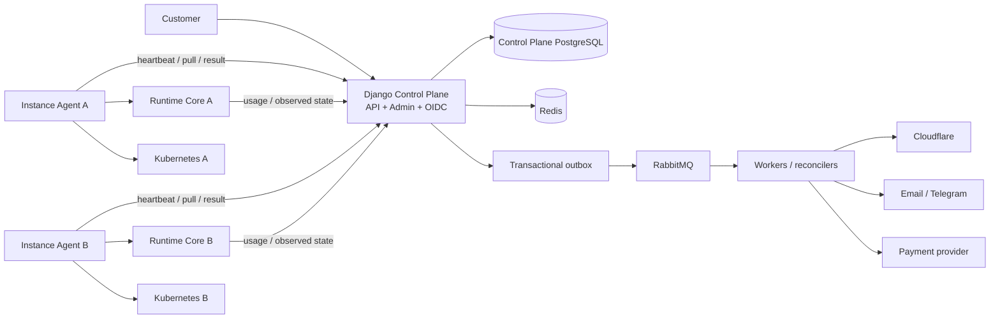
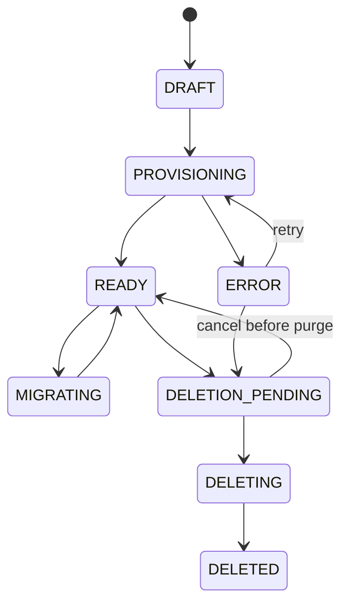

# План реализации DNK Control Plane

| Поле | Значение |
| --- | --- |
| Статус | Draft для архитектурного согласования |
| Последняя сверка | 2026-07-12 |
| Baseline репозитория | `89490c4` (`feat(control_plane): initialize Django project`) |
| Целевой домен | `dniko.net` |

## 1. Назначение

Документ описывает поэтапное создание production-ready Control Plane на Django
для управления глобальными пользователями SaaS-продукта, tenants, изолированными
Runtime Instance, доменами, Kubernetes routing, единой авторизацией и billing.

Control Plane находится в одном monorepo с `dnk-runtime-core`, но является
самостоятельным приложением: имеет отдельные зависимости, PostgreSQL, container
image, Helm chart и release lifecycle. После каждого этапа система должна
оставаться разворачиваемой, тестируемой и пригодной для безопасного продолжения
разработки.

## 2. Терминология

### 2.1. Customer

`Customer` — глобальный пользователь SaaS-продукта. Это человек, который может:

- зарегистрироваться и войти в Control Plane;
- владеть одним или несколькими Tenant;
- быть Member в других Tenant;
- иметь несколько подтвержденных способов входа;
- оплачивать услуги через один или несколько Billing Account.

В Django `Customer` является custom user model:

```python
AUTH_USER_MODEL = "customers.Customer"
```

Все внешние ключи на глобального пользователя объявляются через
`settings.AUTH_USER_MODEL`. Стабильный UUID Customer используется как OIDC
`sub`.

Слово `client` в проекте используется только технически: OAuth/OIDC client,
HTTP client или generated API client. Техническая модель OAuth/OIDC называется
`OidcClientApplication`, а не `Client`.

### 2.2. Остальные понятия

| Понятие | Значение |
| --- | --- |
| `Tenant` | Изолированное SaaS-пространство с данными и бизнес-логикой. |
| `TenantMembership` | Участие Customer в Tenant с ролью `OWNER` или `MEMBER`. |
| `Owner` | Customer, который управляет Tenant, участниками, доменами и billing. |
| `Member` | Customer с обычным доступом к tenant runtime. |
| `Instance` | Сервер/Kubernetes installation, на котором работает Runtime cluster. |
| `Instance Agent` | Компонент внутри Instance, исполняющий management-команды. |
| `TenantPlacement` | Связь глобального Tenant с Instance и runtime tenant ID. |
| `Operation` | Долговременная операция: create, freeze, delete, domain attach, migration. |
| `BillingAccount` | Финансовый контур и плательщик; не authentication principal. |
| `OidcClientApplication` | Технический OIDC relying party с `client_id`. |
| `ServicePrincipal` | Машинная identity конкретной Instance/Agent. |

Если позже потребуется компания или юридическое лицо, модель должна называться
`Organization` или `LegalEntity`, а не `Customer`.

## 3. Текущее состояние репозитория

### 3.1. Django scaffold

В `control_plane/` уже существует Django 6 scaffold, но пока это стандартный
проект:

- SQLite;
- `DEBUG=True` и hardcoded `SECRET_KEY`;
- нет custom user model;
- нет domain apps, REST API, workers и бизнес-migrations;
- нет отдельного Dockerfile и Helm chart.

Источник: [`control_plane/control_plane/settings.py`](../control_plane/settings.py).

### 3.2. Runtime tenancy и identity

Текущий Runtime Core:

- синхронно создает tenant, primary domain, tenant-local user и PostgreSQL
  schema в одном Unit of Work;
- сразу выставляет tenant статус `active`;
- поддерживает только `active` и `freeze`;
- защищает management-вызов одним общим `CONTROL_PLANE_API_KEY`;
- не имеет idempotent create, delete, export/import, migration и observed-state
  management API;
- хранит tenant-local `User`, а не глобального Customer;
- использует allow-all authorization service по умолчанию.

Фактический create endpoint собирается как:

```text
/api/console + /tenants + /create-tenant
= POST /api/console/tenants/create-tenant
```

Документация указывает `/api/admin/create-tenant`. Расхождение необходимо
устранить до интеграции.

Связанные источники:

- [`src/modules/router.py`](../../src/modules/router.py);
- [`src/modules/tenancy/presentation/http/router.py`](../../src/modules/tenancy/presentation/http/router.py);
- [`src/modules/tenancy/application/tenant/use_case/create_tenant.py`](../../src/modules/tenancy/application/tenant/use_case/create_tenant.py);
- [`src/modules/tenancy/domain/tenant/value_object/tenant_status.py`](../../src/modules/tenancy/domain/tenant/value_object/tenant_status.py);
- [`src/modules/identity/domain/user/entity.py`](../../src/modules/identity/domain/user/entity.py);
- [`src/modules/shared/infrastructure/access/allow_all_authorization_service.py`](../../src/modules/shared/infrastructure/access/allow_all_authorization_service.py).

### 3.3. Полезная база Runtime

Уже существуют PostgreSQL outbox/inbox, RabbitMQ publisher, versioned
`IntegrationEvent`, host-to-tenant resolution и развитая `TenantDomain` model.
Их следует расширять, но Control Plane не импортирует runtime Python-классы:
между приложениями используются только versioned HTTP/event contracts.

## 4. Архитектурные принципы

1. **Отдельный security boundary.** Control Plane и Runtime используют разные
   PostgreSQL и credentials.
2. **Desired/observed state.** Control Plane хранит требуемое состояние, Instance
   сообщает фактически примененное.
3. **Асинхронные операции.** HTTP mutation создает `Operation` и возвращает
   `202 Accepted`.
4. **Идемпотентность.** Каждая команда имеет `command_id`, idempotency key,
   schema version и payload digest.
5. **Fencing.** `placement_epoch` блокирует старую Instance после migration.
6. **Transactional outbox.** DB mutation и намерение опубликовать событие
   фиксируются одной транзакцией.
7. **Автономность Runtime.** Недоступность Control Plane не останавливает
   работающий tenant traffic.
8. **Нет kubeconfig в Control Plane.** Kubernetes меняет Instance Agent с
   минимальным RBAC.
9. **Минимальные секреты.** В БД хранятся `secret_ref` и metadata, но не provider
   tokens/signing private keys.
10. **Audit first.** Destructive, security, billing и provider mutations имеют
    actor, reason и correlation ID.

## 5. Целевая архитектура



API, workers и scheduler используют один backend package/image, но запускаются
разными Kubernetes workloads.

## 6. Источники истины

| Данные | Источник истины | Проекции/потребители |
| --- | --- | --- |
| Customer/profile/identities | Control Plane | Admin, API, OIDC |
| Tenant и membership | Control Plane | Runtime projection |
| Tenant placement | Control Plane | Agent, Runtime |
| Tenant business data | Runtime Instance | Tenant applications |
| DNS intent | Control Plane | Cloudflare |
| DNS actual state | Cloudflare | Control Plane snapshot |
| Route/certificate intent | Control Plane | Instance Agent |
| Route/certificate actual state | Kubernetes/cert-manager | Control Plane snapshot |
| Usage source events | Runtime | Control Plane usage ledger |
| Usage ledger/tariff | Control Plane | Invoice generation |
| Payment transaction | Payment provider | Control Plane read model |
| Effective access mode | Control Plane policy | Runtime local projection |
| Audit trail | Control Plane | Admin/security/compliance |

## 7. Целевая структура Django

```text
control_plane/
├── manage.py
├── pyproject.toml
├── Dockerfile
├── control_plane/
│   ├── settings/{base,development,test,production}.py
│   ├── urls.py
│   ├── asgi.py
│   └── celery.py
├── apps/
│   ├── customers/
│   ├── identity_access/
│   ├── tenants/
│   ├── instances/
│   ├── operations/
│   ├── domains/
│   ├── billing/
│   ├── audit/
│   └── notifications/
├── integrations/{cloudflare,telegram,runtime_management,payments}/
├── contracts/
├── deploy/helm/dnk-control-plane/
├── tests/
└── docs/
```

Business orchestration не размещается в model `save()`, Django signals или
Admin action. Admin вызывает application service, который создает audited
Operation; распределенную работу выполняет worker/reconciler.

## 8. Доменные модели

### 8.1. Customers и identity

#### `Customer`

- UUID primary key;
- status: `PENDING`, `ACTIVE`, `SUSPENDED`, `DELETION_PENDING`, `DELETED`;
- Django `is_active`, `is_staff`, `is_superuser`;
- display name, locale, timezone;
- `security_version` для глобальной инвалидизации sessions/tokens;
- last login/activity и timestamps;
- unusable password по умолчанию.

Email/phone не являются identity key. Suspend Customer не удаляет memberships.
Platform staff permission не превращает Customer в Tenant Owner.
Списки «участвует в Tenant» и «владеет Tenant» вычисляются из active
`TenantMembership`; отдельные дублирующие связи в Customer не создаются.

#### Связанные модели

- `CustomerProfile`: имя, avatar, interface preferences;
- `CustomerEmail`: normalized email, primary/verified/revoked state;
- `CustomerPhone`: encrypted E.164, lookup HMAC, last4, verification state;
- `ExternalIdentity`: provider и immutable provider subject, unique pair;
- `AuthChallenge`: purpose/channel/target hash/code hash/TTL/attempts/consume;
- `CustomerSession`: session metadata, device, expiry и revocation.

Совпадение social email не связывает аккаунты автоматически. Customer должен
войти существующим способом или подтвердить link через email OTP.

#### `OidcClientApplication`

- технический `client_id`;
- exact redirect URIs;
- grants, scopes, audiences;
- secret hash/public JWKS;
- assigned Instance и rotation metadata.

`client_id` никогда не является Customer ID.

#### `ServicePrincipal`

- instance ID;
- certificate fingerprint/serial;
- scopes/audiences;
- issue/expire/rotate/revoke metadata.

### 8.2. Tenants

#### `Tenant`

- global UUID;
- unique normalized slug и display name;
- lifecycle/access state и state generation;
- default locale/timezone;
- soft-delete metadata и timestamps.

#### `TenantMembership`

- tenant/customer;
- role: `OWNER` или `MEMBER`;
- status: `INVITED`, `ACTIVE`, `SUSPENDED`, `REVOKED`;
- version и actor/timestamps;
- unique `(tenant, customer)`.

Владение определяется только active membership с `role=OWNER`. Базовая policy
допускает несколько Owner, но запрещает удалить/понизить последнего active
Owner. Если потребуется строго один Owner, это фиксируется отдельным ADR и DB
constraint.

#### `TenantInvitation`

Содержит intended verified email, role, token hash, expiry, invited-by и
accept/revoke state. Invitation token без Customer authentication доступа не
дает.

#### `TenantAccessHold`

Содержит source `BILLING`, `MANUAL`, `SECURITY`, `MIGRATION` или `COMPLIANCE`,
reason, actor, active interval и related operation/invoice. Effective state
`FROZEN`, пока существует хотя бы один active hold. Payment снимает только
`BILLING` hold.

### 8.3. Instances и operations

#### `Instance`

- environment, region, mode `CLUSTER|SINGLE`;
- lifecycle: `NEW -> ENROLLING -> ACTIVE -> DRAINING -> DECOMMISSIONED`, а также
  `QUARANTINED`;
- отдельный calculated health: `UNKNOWN|HEALTHY|DEGRADED|OFFLINE`;
- agent/runtime versions, edge hostname, capacity, generations, heartbeat.

#### `InstanceCapability`

Хранит management contract versions, command types, bundle/schema versions и
domain/migration capabilities.

#### `TenantPlacement`

Связывает global tenant, Instance, runtime-local tenant ID, status,
`placement_epoch` и desired/observed generation. Разрешен только один active
placement Tenant.

#### `Operation`, `OperationStep`, `ManagementCommand`

Operation хранит type/target/status/idempotency/actor/progress/error/retry и
correlation data. ManagementCommand неизменяем, versioned, имеет target
Instance, deadline, placement epoch, payload digest, delivery cursor и result.

```text
Operation: PENDING -> RUNNING -> SUCCEEDED
                           |-> WAITING_EXTERNAL -> RUNNING
                           |-> RETRY_SCHEDULED -> RUNNING
                           \-> FAILED/CANCELLED

Command: QUEUED -> DISPATCHED -> ACCEPTED -> RUNNING -> SUCCEEDED
                                                |-> FAILED/EXPIRED/CANCELLED
```

### 8.4. Domains, DNS и Kubernetes resources

#### `DomainBinding`

- tenant и assigned Instance;
- hostname в normalized IDNA/Punycode форме;
- kind `PLATFORM|CUSTOM`;
- service `CONSOLE|API|SHORTLINKS`;
- desired/observed state;
- ownership verification и TLS state;
- глобальная уникальность active hostname.

#### `DnsRecordIntent`

Хранит provider/zone reference, type/name/content/TTL/proxied, provider record
ID, ownership marker, desired/observed hash и reconciliation attempts/error.

#### `RouteIntent`

Хранит Instance/namespace, route provider, backend service/port/path,
Kubernetes resource identity, desired generation и observed readiness.

#### `CertificateIntent`

Хранит DNS names, secret/issuer references, requested/ready/notAfter/renewal
timestamps и last error. Готовность определяется по status cert-manager и
внешнему TLS probe, а не только по существованию Secret.

### 8.5. Billing и usage

#### `BillingAccount`

- billing Customer/contact;
- legal/tax profile и currency;
- provider customer ID;
- status и payment method reference.

Billing Account не определяет authorization и не заменяет Tenant Owner. Tenant
можно перевести на другой Billing Account без изменения memberships.

#### `TenantSubscription` и `PriceVersion`

Subscription связывает Tenant и Billing Account, хранит trial/grace/period,
billing status и current immutable PriceVersion. PriceVersion содержит цену за
Node, currency, minor-unit precision, tax behavior, effective interval и
`billing_policy_version`.

#### `UsageEvent`

- source event ID;
- instance/tenant IDs и placement epoch;
- logical `node_execution_id` и workflow run ID;
- outcome, units, policy version;
- occurred/received timestamps;
- source sequence/watermark.

Raw ledger immutable. Uniqueness исключает повторный charge одного logical
NodeExecution.

Рекомендуемая V1 billable policy:

- одна единица за первый переход NodeExecution в `COMPLETED`;
- `PENDING`, `RUNNING`, `FAILED` и `SKIPPED` не тарифицируются;
- infrastructure retry того же logical execution повторно не тарифицируется;
- изменение правил создает новую policy version, не переписывая историю.

#### `Invoice`, `InvoiceLine`, `Payment`, `ProviderWebhookReceipt`

- Invoice содержит immutable period/currency/price/tax snapshot;
- InvoiceLine всегда содержит tenant ID, quantity и PriceVersion;
- деньги хранятся в minor units/Decimal, не `float`;
- finalized Invoice не редактируется, correction создает adjustment/credit;
- Payment отражает provider transaction;
- ProviderWebhookReceipt дедуплицирует external event и хранит processing state.

## 9. State machines

### 9.1. Tenant lifecycle и access



Access state хранится отдельно:

```text
ACTIVE -> FREEZING -> FROZEN -> ACTIVATING -> ACTIVE
```

Control Plane доступен Customer даже при freeze Runtime. Рекомендуемая Runtime
policy: существующие sessions могут читать данные, новые tenant-scoped tokens не
выдаются, mutations/workflows/background jobs запрещены. Точное поведение login
и read должно быть утверждено ADR, потому что текущий Runtime entity разрешает
read при freeze, но host auth полностью отвергает frozen Tenant.

### 9.2. Domain

```text
RESERVED
 -> OWNERSHIP_PENDING (только custom)
 -> VERIFIED
 -> ROUTE_PENDING
 -> DNS_PENDING
 -> TLS_PENDING
 -> PROPAGATION_CHECK
 -> ACTIVE
```

Failure сохраняет failed step, retryable flag и provider diagnostics; resource
не получает оптимистический `ACTIVE`.

### 9.3. Billing

```text
Subscription: TRIALING -> ACTIVE -> PAST_DUE -> GRACE -> SUSPENDED
Invoice:      DRAFT -> OPEN -> PAID | VOID | UNCOLLECTIBLE
Payment:      PENDING -> PROCESSING -> SUCCEEDED | FAILED | REFUNDED | DISPUTED
```

Browser redirect после checkout не подтверждает оплату. `PAID` устанавливается
только после verified webhook или server-side provider readback.

### 9.4. Migration

```text
PLANNED -> PRECHECKING -> SOURCE_FREEZING -> EXPORTING -> IMPORTING
        -> VALIDATING -> SWITCHING_ROUTE -> MONITORING -> COMPLETED
```

До cleanup source разрешены `ROLLING_BACK` и `ROLLED_BACK`.

## 10. API и integration contracts

### 10.1. Public Control Plane API

```text
POST /api/v1/auth/email/start
POST /api/v1/auth/email/confirm
POST /api/v1/auth/phone/start
POST /api/v1/auth/phone/confirm
POST /api/v1/auth/logout
GET  /api/v1/customers/me
PATCH /api/v1/customers/me

GET  /api/v1/tenants
POST /api/v1/tenants
GET  /api/v1/tenants/{tenant_id}
PATCH /api/v1/tenants/{tenant_id}
POST /api/v1/tenants/{tenant_id}/freeze
POST /api/v1/tenants/{tenant_id}/activate
DELETE /api/v1/tenants/{tenant_id}
POST /api/v1/tenants/{tenant_id}/migrations

GET  /api/v1/tenants/{tenant_id}/memberships
POST /api/v1/tenants/{tenant_id}/invitations
PATCH /api/v1/tenants/{tenant_id}/memberships/{membership_id}
DELETE /api/v1/tenants/{tenant_id}/memberships/{membership_id}

GET  /api/v1/tenants/{tenant_id}/domains
POST /api/v1/tenants/{tenant_id}/domains
DELETE /api/v1/tenants/{tenant_id}/domains/{domain_id}

GET  /api/v1/tenants/{tenant_id}/billing-state
GET  /api/v1/billing/accounts
GET  /api/v1/billing/invoices
POST /api/v1/billing/checkout-sessions
GET  /api/v1/operations/{operation_id}
```

Mutation endpoints поддерживают `Idempotency-Key`, request/correlation ID и
возвращают Problem Details с machine-readable error code.

### 10.2. Agent Control API

```text
POST /agent/v1/bootstrap
POST /agent/v1/certificates/rotate
POST /agent/v1/heartbeats
GET  /agent/v1/commands?cursor=...&wait_seconds=30
POST /agent/v1/commands/{command_id}/ack
POST /agent/v1/commands/{command_id}/progress
POST /agent/v1/commands/{command_id}/result
POST /agent/v1/usage-events/batch
POST /agent/v1/inventory/report
```

Agent использует исходящее соединение; Instance не открывает публичный
management endpoint.

### 10.3. Runtime Management API

```text
GET  /api/management/v1/info
GET  /api/management/v1/health
GET  /api/management/v1/tenants/{global_tenant_id}
PUT  /api/management/v1/tenants/{global_tenant_id}
PUT  /api/management/v1/tenants/{global_tenant_id}/access-mode
PUT  /api/management/v1/tenants/{global_tenant_id}/domains/{domain_id}
DELETE /api/management/v1/tenants/{global_tenant_id}/domains/{domain_id}
POST /api/management/v1/tenants/{global_tenant_id}/exports
POST /api/management/v1/tenants/{global_tenant_id}/imports
DELETE /api/management/v1/tenants/{global_tenant_id}
GET  /api/management/v1/operations/{operation_id}
```

`PUT tenant` является идемпотентной заменой текущего create. На переходном
этапе global ID сохраняется в current unique `external_id`, а TenantPlacement
хранит global/runtime-local IDs.

### 10.4. Management command

```json
{
  "command_id": "uuid",
  "operation_id": "uuid",
  "instance_id": "uuid",
  "type": "ENSURE_TENANT",
  "schema_version": 1,
  "placement_epoch": 7,
  "expected_generation": 12,
  "issued_at": "2026-07-12T12:00:00Z",
  "deadline": "2026-07-12T12:05:00Z",
  "idempotency_key": "uuid",
  "payload_sha256": "...",
  "payload": {}
}
```

Runtime сохраняет command result. Повтор того же command возвращает прежний
result; повтор key с другим payload возвращает conflict.

Минимальные command types:

```text
ENSURE_TENANT
SET_TENANT_ACCESS_MODE
RECONCILE_MEMBERSHIPS
ENSURE_DOMAIN_ROUTE
REMOVE_DOMAIN_ROUTE
EXPORT_TENANT
IMPORT_TENANT
DELETE_TENANT
```

### 10.5. OIDC claims и events

Issuer: `https://auth.dniko.net`. Разрешен Authorization Code Flow + PKCE S256.

```json
{
  "iss": "https://auth.dniko.net",
  "sub": "<customer-uuid>",
  "aud": "dnk-runtime",
  "tenant_id": "<tenant-uuid>",
  "tenant_role": "owner",
  "membership_version": 7,
  "tenant_state_version": 12,
  "sid": "<session-id>",
  "iat": 0,
  "exp": 0,
  "jti": "<token-id>"
}
```

Полный список memberships в token не помещается.

Event envelope содержит event ID/type/version, tenant/aggregate IDs, payload,
occurred time и correlation/causation IDs. Минимальный каталог:

```text
customer.created.v1
customer.identity_linked.v1
tenant.created.v1
tenant.access_changed.v1
membership.upserted.v1
membership.revoked.v1
runtime.tenant.provisioned.v1
runtime.tenant.state_changed.v1
runtime.domain.applied.v1
runtime.usage.node_completed.v1
billing.invoice.opened.v1
billing.invoice.paid.v1
billing.hold.created.v1
billing.hold.released.v1
```

Events ускоряют convergence, но не заменяют reconciliation polling.

## 11. Домены `dniko.net`, Cloudflare и Kubernetes

### 11.1. Naming

```text
control.dniko.net                 Control Plane и Django Admin
auth.dniko.net                    OIDC issuer
<slug>.app.dniko.net              tenant console
<slug>.api.dniko.net              tenant API
edge-<instance>.infra.dniko.net   stable ingress hostname Instance
```

Tenant CNAME указывает на edge hostname выбранной Instance. При migration
меняется tenant record, а не адрес всей инфраструктуры.

### 11.2. Cloudflare rules

- отдельные scoped tokens для DNS worker и cert-manager;
- tokens только в external secret store;
- в БД — zone/record ID и ownership marker;
- unmanaged records не изменяются/удаляются;
- retry учитывает `429`, `Retry-After`, timeouts и partial propagation;
- API success не равен DNS propagation; readiness проверяется authoritative
  resolver-ом.

Custom domain варианты:

1. MVP: Customer вручную создает TXT verification и CNAME/A.
2. Target: Cloudflare for SaaS Custom Hostnames.
3. Optional: подключение customer-owned Cloudflare zone со scoped credentials.

Registrar/покупка доменов в текущий scope не входят.

### 11.3. Kubernetes rules

- domain layer зависит от `RouteProvider`, не от конкретных annotations;
- первая реализация — `IngressV1RouteProvider`, позже возможен Gateway API;
- Agent принимает typed intents, а не произвольный YAML;
- deterministic names/labels содержат tenant/domain IDs и generation;
- удаляются только DNK-owned resources;
- Agent имеет namespace-scoped RBAC;
- Certificate status и внешний TLS probe обязательны;
- staging ACME используется в tests, production issuer — только в prod.

Ingress API frozen, поэтому выбор поддерживаемого controller фиксируется ADR;
новая платформа не должна зависеть от unsupported ingress-nginx после EOL.

## 12. Основные бизнес-процессы

### 12.1. Регистрация Customer

1. Customer выбирает Google, GitHub или email OTP.
2. Control Plane создает/находит Customer по immutable provider subject либо
   подтвержденному email flow.
3. Создается secure session.
4. Запрашивается phone, нормализуется в E.164 и подтверждается Telegram Gateway.
5. Customer активируется согласно product policy.
6. Создаются security/audit events.

Обязательность phone утверждается на этапе 0. Рекомендуемый default: phone
обязателен для Owner/sensitive operations; Member может иметь ограниченный
`PHONE_PENDING` до verification.

### 12.2. Создание Tenant

1. Создать Tenant `DRAFT`, initial Owner membership и Operation.
2. Создать/выбрать Billing Account.
3. Зарезервировать slug и platform domains.
4. Выбрать `ACTIVE + HEALTHY` совместимую Instance с capacity.
5. Создать placement и новый placement epoch.
6. Agent выполняет `ENSURE_TENANT`.
7. Runtime создает tenant/schema и возвращает observed state.
8. Применяется membership projection.
9. Создаются route/certificate/DNS intents.
10. Выполняются DNS/TLS/tenant-resolution probes.
11. Только затем Tenant получает `READY`, access — `ACTIVE`.

Failure любого шага оставляет наблюдаемую Operation с безопасным retry.

### 12.3. Membership, freeze и activation

- Invitation связывается только с authenticated Customer и verified email.
- Membership/outbox event фиксируются одной транзакцией.
- Runtime projection хранит global Customer ID, role/status/version.
- Revoke/role change инвалидирует runtime sessions.
- Last Owner нельзя удалить/понизить; change требует recent auth и audit reason.
- Freeze создается как source-specific TenantAccessHold.
- Runtime блокирует writes/workflows/jobs и возвращает observed access.
- Payment снимает только billing hold; `ACTIVATION_PENDING` сохраняется до
  observed Runtime `ACTIVE`.

### 12.4. Delete Tenant

1. Owner проходит step-up и подтверждает delete.
2. Создается `DELETION_PENDING` с retention deadline.
3. Tenant замораживается; до purge delete можно отменить.
4. После retention фиксируются final usage/invoice.
5. Публичный DNS/route отключается.
6. Создается final backup/TenantBundle по policy.
7. Runtime purge выполняется идемпотентно.
8. Provider resources удаляются только при DNK ownership.
9. Control Plane сохраняет tombstone/audit и ставит `DELETED`.

Customer deletion, Tenant deletion и Billing Account closure — три разных
lifecycle.

### 12.5. Billing

1. Runtime в одной транзакции фиксирует Node `COMPLETED` и usage outbox event.
2. Events доставляются batches с sequence/watermark.
3. Control Plane сохраняет immutable ledger и дедуплицирует.
4. Aggregator строит воспроизводимый period total.
5. Invoice использует зафиксированную PriceVersion.
6. Hosted provider flow принимает оплату; card data не проходит через CP.
7. Verified webhook обновляет Payment/Invoice.
8. Past due проходит grace/dunning; затем создается billing hold.
9. Successful payment снимает только billing hold.

Reconciliation сравнивает Runtime source count, ledger, aggregate, invoice
quantity и provider state.

### 12.6. Migration

1. Проверить target capacity и compatibility.
2. Создать Operation и migration hold.
3. Drain jobs/in-flight executions и freeze source.
4. Увеличить placement epoch.
5. Зафиксировать usage watermark/billing cutoff.
6. Экспортировать encrypted versioned TenantBundle.
7. Идемпотентно импортировать в target.
8. Проверить checksums/row counts/schema/application probes.
9. Подготовить route/TLS, затем переключить DNS/route.
10. Наблюдать target в rollback window.
11. Снять hold; source удалить отдельной operation после deadline.

TenantBundle включает physical schema, shared tenant rows, runtime Customer
projections, schema metadata, workflow/communication state, assets, secret
references и manifest. Redis OTP/session state лучше инвалидировать.

## 13. Поэтапный план реализации

### Этап 0. ADR, contracts и threat model

**Результат:** утвержденные границы, protocol contracts и продуктовые правила.

**Зависимости:** отсутствуют.

Задачи:

- [ ] Утвердить glossary Customer/OidcClientApplication/BillingAccount.
- [ ] Решить: несколько Owner с last-owner invariant или строго один Owner.
- [ ] Утвердить обязательность phone и recovery/fallback flow.
- [ ] Утвердить V1 billable Node policy.
- [ ] Выбрать payment provider, currency, tax/invoice/grace policy.
- [ ] Утвердить domain naming и reserved `dniko.net` slugs.
- [ ] Выбрать supported route controller и Gateway migration path.
- [ ] Выбрать custom-domain strategy.
- [ ] Утвердить delete retention, migration RPO/RTO и rollback window.
- [ ] Зафиксировать source-of-truth и permission matrices.
- [ ] Создать state transition matrices.
- [ ] Создать OpenAPI Agent Control и Runtime Management.
- [ ] Создать event schemas и compatibility rules.
- [ ] Создать trust-boundary diagram и threat model.
- [ ] Исправить расхождение runtime endpoint/docs.

Критерии приемки:

- [ ] OpenAPI/event examples проходят schema validation.
- [ ] Каждая transition имеет actor, preconditions, side effects и failure path.
- [ ] Нет незафиксированных критичных business/security решений.
- [ ] Утверждены начальные SLO/RPO/RTO targets.

### Этап 1. Django foundation и deploy skeleton

**Результат:** независимо разворачиваемый Django backend без бизнес-фич.

**Зависимости:** этап 0.

Задачи:

- [ ] Выделить `control_plane/pyproject.toml` и lock/workspace configuration.
- [ ] Создать отдельный non-root Docker image.
- [ ] Разнести settings на development/test/production.
- [ ] Перевести database на отдельную PostgreSQL.
- [ ] Создать `customers.Customer` до первой production migration.
- [ ] Подключить DRF и OpenAPI generation.
- [ ] Подключить Redis sessions/cache/rate limits.
- [ ] Подключить Celery и отдельный RabbitMQ vhost.
- [ ] Реализовать outbox/inbox/idempotency/reconciler base.
- [ ] Реализовать audit и request correlation middleware.
- [ ] Добавить `/health/live`, `/health/ready`, `/metrics`.
- [ ] Добавить structured logging/OpenTelemetry hooks.
- [ ] Создать baseline Helm chart и migration Job.
- [ ] Настроить CI: tests, migration checks, Helm lint/template.

Критерии приемки:

- [ ] `manage.py check --deploy` без блокирующих проблем.
- [ ] Chart устанавливается в чистый ephemeral namespace.
- [ ] DB commit при недоступном broker восстанавливается outbox worker.
- [ ] Secrets отсутствуют в image/Git/ConfigMap.
- [ ] Migration Job и readiness безопасно управляют rollout.

### Этап 2. Customer identity и passwordless authentication

**Результат:** глобальная регистрация и вход Customer четырьмя требуемыми
каналами.

**Зависимости:** этап 1, provider sandbox accounts.

Задачи:

- [ ] Создать Customer/Profile/Email/Phone/ExternalIdentity/AuthChallenge.
- [ ] Реализовать email normalization и DB constraints.
- [ ] Реализовать email OTP start/confirm с одинаковыми внешними ответами.
- [ ] Добавить cooldown, attempts и IP/email/device limits.
- [ ] Подключить email provider через outbox worker.
- [ ] Интегрировать Google login по immutable provider `sub`.
- [ ] Интегрировать GitHub login и verified email lookup.
- [ ] Реализовать explicit identity link/unlink.
- [ ] Запретить удаление последнего login method.
- [ ] Реализовать secure sessions, remote logout и security version.
- [ ] Собрать phone после primary authentication.
- [ ] Реализовать Telegram Gateway send/status/callback adapter.
- [ ] Добавить Telegram cost/rate circuit breaker.
- [ ] Реализовать Customer suspend/delete request.
- [ ] Добавить redacted Customer/security Django Admin.

Критерии приемки:

- [ ] Google, GitHub, email OTP и phone verification проходят E2E.
- [ ] OTP нельзя reuse; brute-force/enumeration tests проходят.
- [ ] Совпавший social email не приводит к account takeover.
- [ ] Provider token не хранится без необходимости.
- [ ] Full phone, OTP и secrets отсутствуют в logs/audit.
- [ ] Session revocation немедленно блокирует CP requests.

### Этап 3. Tenant registry, Owner/Member и Admin MVP

**Результат:** global Tenant registry и RBAC без Runtime provisioning.

**Зависимости:** Customer identity из этапа 2.

Задачи:

- [ ] Создать Tenant/Membership/Invitation/AccessHold models.
- [ ] Добавить unique normalized slug и reserved names.
- [ ] Реализовать Owner/Member permission matrix.
- [ ] Реализовать create/list/detail/update Tenant.
- [ ] При create атомарно создавать initial Owner membership.
- [ ] Реализовать invite/accept/revoke/leave.
- [ ] Реализовать role change с step-up authentication.
- [ ] Защитить last-owner invariant locking/constraints.
- [ ] Реализовать logical freeze/delete intents как Operation.
- [ ] Создать Tenant/membership/hold Admin.
- [ ] Создать staff groups Support/Operations/Billing/Security.
- [ ] Реализовать deny-by-default tenant querysets/permissions.
- [ ] Добавить idempotency create/invite/role changes.

Критерии приемки:

- [ ] Customer видит только свои Tenant/memberships.
- [ ] Member не выполняет Owner operations.
- [ ] Нельзя оставить Tenant без active Owner.
- [ ] Concurrent role changes не нарушают invariant.
- [ ] Staff permission не создает скрытый membership.
- [ ] Duplicate request возвращает исходный результат.

### Этап 4. OIDC provider и Runtime SSO pilot

**Результат:** Control Plane является единым OIDC provider для pilot Runtime.

**Зависимости:** этапы 2–3.

Задачи:

- [ ] Провести spike Django OAuth Toolkit/allauth IdP и выбрать engine.
- [ ] Реализовать issuer `auth.dniko.net`.
- [ ] Реализовать discovery/JWKS/authorize/token/userinfo/revoke/logout.
- [ ] Разрешить только Authorization Code + PKCE S256.
- [ ] Реализовать OidcClientApplication management.
- [ ] Реализовать asymmetric keys и overlapping rotation.
- [ ] Реализовать tenant selection и tenant-scoped claims.
- [ ] Добавить в Runtime OIDC authentication adapter.
- [ ] Сверять host-resolved tenant с token `tenant_id`.
- [ ] Создать Runtime Customer/membership projection.
- [ ] Добавить nullable `global_customer_id` к legacy User.
- [ ] Реализовать controlled legacy account linking.
- [ ] Инвалидировать sessions по membership/state version.

Критерии приемки:

- [ ] Runtime проверяет issuer/audience/tenant/signature/expiry.
- [ ] Token другого Tenant отвергается для того же Customer.
- [ ] Signing-key rotation проходит без downtime.
- [ ] Согласованный OpenID conformance profile проходит.
- [ ] Недоступность CP не обрывает существующий runtime traffic.
- [ ] Revoke/freeze распространяется в утвержденный SLA.

### Этап 5. Instance Registry и Agent protocol

**Результат:** безопасный outbound management channel для X Instance.

**Зависимости:** этап 1 и contracts этапа 0; может идти параллельно этапам 2–4.

Задачи:

- [ ] Создать Instance/Capability/Placement/ServicePrincipal models.
- [ ] Реализовать one-time bootstrap token.
- [ ] Реализовать CSR exchange и mTLS certificate issue.
- [ ] Реализовать certificate rotation/revocation.
- [ ] Реализовать heartbeat versions/capabilities/capacity/inventory.
- [ ] Вычислять health по heartbeat thresholds.
- [ ] Реализовать cursor-based long polling.
- [ ] Реализовать command ack/progress/result.
- [ ] Подписывать immutable Runtime commands.
- [ ] Реализовать expiry/retry/backoff/DLQ.
- [ ] Реализовать placement eligibility policy.
- [ ] Создать Instance/Operation Admin views.
- [ ] Создать Agent package/image/Helm chart и namespace RBAC.

Критерии приемки:

- [ ] Две Instance регистрируются с разными credentials.
- [ ] Credential A не работает для Instance B.
- [ ] Offline/draining/quarantined Instance исключается из placement.
- [ ] Duplicate/out-of-order commands безопасны.
- [ ] Worker/broker restart не теряет durable command.
- [ ] Agent certificate rotation проходит без потери управления.
- [ ] Version incompatibility обнаруживается до command execution.

### Этап 6. Runtime Management API и tenant lifecycle

**Результат:** idempotent create/freeze/activate/delete в реальном Runtime.

**Зависимости:** этапы 3 и 5.

Runtime задачи:

- [ ] Вынести management API в `/api/management/v1`.
- [ ] Реализовать idempotent `ENSURE_TENANT`/PUT.
- [ ] Хранить command/idempotency result.
- [ ] Поддержать global tenant ID и placement epoch.
- [ ] Реализовать access-mode update и observed state.
- [ ] Централизованно enforce login/read/write/jobs policy.
- [ ] Реализовать soft delete/asynchronous purge.
- [ ] Добавить health/version/capabilities.
- [ ] Заменить fleet-wide API key signed per-instance protocol-ом.
- [ ] Оставить старый endpoint временным compatibility adapter.

Control Plane задачи:

- [ ] Реализовать placement scheduler.
- [ ] Реализовать create saga/timeline.
- [ ] Реализовать holds-based freeze/activation saga.
- [ ] Реализовать delete pending/retention/purge saga.
- [ ] Реализовать desired/observed reconciliation.
- [ ] Добавить safe retry/cancel Admin actions через services.

Критерии приемки:

- [ ] E2E create/freeze/activate/delete работает на двух Instance.
- [ ] Duplicate create не создает вторую schema/user/domain.
- [ ] Timeout с успешным Runtime result восстанавливается reconcile.
- [ ] Stale placement epoch отвергается.
- [ ] Billing hold release не снимает другие holds.
- [ ] Delete отменяется до purge.
- [ ] CP не показывает active до observed confirmation.

### Этап 7. Cloudflare DNS, routes и certificates

**Результат:** автоматически работающие HTTPS domains на assigned Instance.

**Зависимости:** этапы 5–6, Cloudflare zone, route controller, cert-manager.

Задачи:

- [ ] Создать Domain/DNS/Route/Certificate models/state machines.
- [ ] Реализовать IDNA normalization и global unique hostname.
- [ ] Реализовать Cloudflare provider port/adapter.
- [ ] Хранить provider IDs и ownership markers.
- [ ] Реализовать idempotent DNS upsert/delete/reconcile.
- [ ] Настроить separate environment/cert-manager tokens.
- [ ] Реализовать platform app/api domains.
- [ ] Реализовать typed RouteProvider Agent commands.
- [ ] Реализовать Ingress v1 provider.
- [ ] Реализовать explicit Certificate/readiness readback.
- [ ] Реализовать authoritative DNS/TLS/HTTP probes.
- [ ] Реализовать custom-domain TXT verification/instructions.
- [ ] Провести Cloudflare for SaaS ADR/spike.
- [ ] Реализовать drift detection и ownership-safe deletion.
- [ ] Добавить certificate expiry/renewal alerts.

Критерии приемки:

- [ ] Tenant host резолвится только на assigned Instance.
- [ ] Cloudflare timeout/429 не создает duplicate record.
- [ ] Unmanaged conflict не перезаписывается.
- [ ] Domain active только после DNS/TLS/HTTP probe.
- [ ] Custom domain требует ownership proof.
- [ ] Certificate issue/renewal проверены через staging issuer.
- [ ] Delete не оставляет domain takeover risk.
- [ ] DNS/Kubernetes drift обнаруживается и обрабатывается по policy.

### Этап 8. Metering выполненных Node

**Результат:** immutable, дедуплицируемый и воспроизводимый usage ledger.

**Зависимости:** persistent Runtime NodeExecution lifecycle.

Runtime задачи:

- [ ] Реализовать persistent NodeExecution/terminal transition.
- [ ] Зафиксировать logical execution ID/retry semantics.
- [ ] Записывать Node completion и usage outbox одной транзакцией.
- [ ] Реализовать batch delivery, sequence/watermark.
- [ ] Реализовать source-side count/reconciliation endpoint.

Control Plane задачи:

- [ ] Создать immutable UsageEvent ledger.
- [ ] Добавить source/logical execution uniqueness.
- [ ] Хранить occurred/received time и ingestion lag.
- [ ] Реализовать пересчитываемую period aggregation.
- [ ] Реализовать late event cutoff/adjustments.
- [ ] Реализовать audited usage inspection/adjustment.
- [ ] Реализовать Runtime-vs-ledger reconciliation.

Критерии приемки:

- [ ] Duplicate/out-of-order/late dataset дает правильное число units.
- [ ] Infrastructure retry не тарифицируется дважды.
- [ ] Aggregate воспроизводится из raw ledger.
- [ ] Source-vs-ledger gap обнаруживается автоматически.
- [ ] Correction finalized period создает adjustment.
- [ ] Ingestion выдерживает согласованную peak нагрузку.

### Этап 9. Billing, invoices и payments

**Результат:** счета, оплаты, dunning и безопасный billing hold.

**Зависимости:** этап 8 и выбранный payment provider.

Задачи:

- [ ] Создать BillingAccount/Subscription/PriceVersion.
- [ ] Реализовать provider customer sync.
- [ ] Реализовать period close и invoice calculation.
- [ ] Создать immutable Invoice/InvoiceLine snapshots.
- [ ] Реализовать hosted checkout/provider portal.
- [ ] Проверять webhook signature по raw body.
- [ ] Реализовать idempotent asynchronous webhook processing.
- [ ] Делать provider readback для out-of-order events.
- [ ] Реализовать grace/dunning/uncollectible policy.
- [ ] Реализовать billing hold/activation reconciliation.
- [ ] Реализовать debt/entitlement API для UI/Admin.
- [ ] Реализовать refund/dispute/credit adjustments.
- [ ] Добавить financial reconciliation/audit reports.

Критерии приемки:

- [ ] Invoice совпадает с usage и PriceVersion.
- [ ] Finalized Invoice неизменяем.
- [ ] Duplicate/out-of-order webhooks безопасны.
- [ ] Checkout redirect не ставит `PAID`.
- [ ] Past due после grace приводит к observed freeze.
- [ ] Payment снимает только billing hold.
- [ ] `ACTIVATION_PENDING` виден до Runtime activation.
- [ ] Sandbox E2E покрывает success/decline/retry/refund/dispute.

### Этап 10. Tenant migration

**Результат:** перенос между Instance с fencing, rollback и без двойного billing.

**Зависимости:** этапы 6–9 и object storage.

Задачи:

- [ ] Утвердить TenantBundle format/compatibility.
- [ ] Экспортировать все tenant-scoped модули.
- [ ] Добавить manifest, row counts/checksums.
- [ ] Шифровать/sign bundle и ограничивать TTL.
- [ ] Реализовать idempotent import/conflict checks.
- [ ] Реализовать placement epoch fencing в Runtime/jobs.
- [ ] Реализовать source drain/freeze.
- [ ] Фиксировать usage watermark/billing cutoff.
- [ ] Реализовать target preflight/application probes.
- [ ] Реализовать route/DNS cutover и rollback window.
- [ ] Реализовать source cleanup отдельной Operation.
- [ ] Добавить Admin timeline/operator controls.

Критерии приемки:

- [ ] Source/target row counts/checksums совпадают.
- [ ] Одновременно существует не более одного writer.
- [ ] Duplicate export/import безопасны.
- [ ] Несовместимый bundle отвергается до cutover.
- [ ] Node executions не теряются/не тарифицируются дважды.
- [ ] Rollback проверен практически.
- [ ] Source не удаляется до deadline.
- [ ] RPO/RTO измерены нагрузочным сценарием.

### Этап 11. Production hardening и GA

**Результат:** эксплуатационно и security готовая платформа.

**Зависимости:** функциональные этапы 1–10.

Задачи:

- [ ] Финализировать Control Plane/Agent Helm charts.
- [ ] Разделить web/orchestration/DNS/billing workers/scheduler.
- [ ] Настроить HPA/PDB/topology spread/graceful shutdown.
- [ ] Внедрить restricted security contexts/NetworkPolicy.
- [ ] Внедрить External Secrets/Vault/KMS.
- [ ] Настроить expand/contract migrations и N/N+1 compatibility.
- [ ] Провести PostgreSQL PITR/restore drill.
- [ ] Провести signing/agent/provider credential rotation drills.
- [ ] Настроить dashboards/SLO/alerts.
- [ ] Провести load/failure-injection/provider outage tests.
- [ ] Провести OIDC/security review и external pentest.
- [ ] Добавить SBOM/dependency scanning/SAST/DAST.
- [ ] Подготовить on-call/incident/break-glass runbooks.

Критерии приемки:

- [ ] Preprod использует тот же immutable artifact, что prod.
- [ ] Fresh install/upgrade/application rollback протестированы.
- [ ] DB migration не полагается на `helm rollback`.
- [ ] Provider/broker/worker loss не создает ложный active/paid.
- [ ] PostgreSQL restore восстанавливает незавершенные operations.
- [ ] Alerts проверены искусственными failures.
- [ ] SLO/RPO/RTO/capacity измерены и утверждены.
- [ ] High-risk security findings закрыты.

## 14. Helm и environments

Нужны два chart:

```text
dnk-control-plane
dnk-instance-agent
```

### 14.1. Control Plane chart

Содержит web, orchestration/DNS/billing workers, scheduler, migration Job,
Service, route integration, ServiceAccount, NetworkPolicy, HPA, PDB, topology
spread, probes, resources, graceful shutdown, `values.schema.json` и optional
ServiceMonitor/PodMonitor.

PostgreSQL, RabbitMQ, Redis и object storage в production являются внешними
dependencies и не устанавливаются application chart.

### 14.2. Instance Agent chart

Содержит Agent Deployment, scoped ServiceAccount/Role/RoleBinding,
NetworkPolicy, enrollment secret reference, Runtime endpoint, route/certificate
configuration, probes/resources/metrics.

Cluster-wide cert-manager, route controller и ClusterIssuer устанавливаются
platform/bootstrap GitOps layer, а не Agent chart с cluster-admin.

### 14.3. Environments

Для development, preprod и production используются отдельные PostgreSQL,
Redis/RabbitMQ credentials, Cloudflare tokens, Telegram/email/payment provider
applications, OIDC keys/callback registrations, Agent trust roots, ACME issuers
и secret namespaces.

DB rollout использует expand/contract:

1. backward-compatible migration;
2. rollout N/N+1-compatible application;
3. backfill;
4. cleanup отдельным release.

`helm rollback` не является rollback-стратегией необратимой DB migration.

## 15. Security requirements

### 15.1. Customer authentication

- Secure, HttpOnly, host-only cookies без `Domain=.dniko.net`;
- CSRF для browser mutations, CSP и strict CORS allowlist;
- OTP hash, TTL, attempts, atomic consume и anti-enumeration;
- rate limits по contact/IP/device/provider budget;
- OAuth state, nonce, PKCE и exact callbacks;
- explicit identity linking;
- recent-auth/step-up для role/domain/billing/migration/delete;
- passkey/WebAuthn или MFA для staff/admin до GA.

### 15.2. OIDC

- immutable issuer и asymmetric signing;
- private keys в KMS/Vault/secret store;
- `kid` и overlapping key rotation;
- Runtime validation issuer/audience/tenant/expiry/signature;
- short access-token TTL;
- refresh rotation/reuse detection;
- tenant-specific token без membership list.

### 15.3. Machine identity

- one-time bootstrap token;
- per-instance mTLS identity;
- separate scopes/audience;
- short-lived certs/automatic rotation;
- signed commands и payload digest;
- placement epoch fencing;
- отсутствие общего fleet API key.

### 15.4. Providers и PII

- provider tokens не хранятся в DB/plain Helm values;
- phone шифруется, lookup выполняется по HMAC;
- OTP/secrets не логируются;
- card data не проходит через Control Plane;
- webhook signature проверяется до processing;
- custom-domain probes защищены от SSRF/private-network targets;
- Django Admin маскирует PII и не показывает secret material.

## 16. Тестовая стратегия

Каждый этап добавляет тесты соответствующего уровня:

1. Domain unit tests: invariants и state transitions.
2. Application tests: authorization, idempotency, sagas и ports.
3. PostgreSQL integration: constraints, locking и concurrency.
4. API tests: authentication, tenant isolation и Problem Details.
5. Contract tests: OpenAPI, commands/events и compatibility.
6. Worker tests: duplicate delivery, crash/restart, retry и DLQ.
7. Provider adapter tests: Cloudflare, Telegram, email, payment.
8. OIDC conformance и negative security tests.
9. Kind/k3d E2E: Agent, Runtime, route provider, cert-manager.
10. Helm: lint, template, schema, install, upgrade, rollback.
11. Synthetic full E2E:

```text
Customer registration
 -> phone verification
 -> create Tenant / Owner membership
 -> Instance placement / Runtime provision
 -> DNS + HTTPS / OIDC login
 -> Node usage / invoice / payment
 -> freeze/reactivation
 -> migration
 -> delete
```

Live provider tests выполняются по расписанию в isolated preprod accounts/zones,
а не на каждый pull request.

Обязательные failure-injection cases:

- DB commit перед broker outage;
- duplicate/out-of-order command/event/webhook;
- worker restart на каждом saga step;
- Instance offline во время provisioning/migration;
- Cloudflare timeout/429/partial propagation;
- Certificate failure/renewal;
- payment прошел, Runtime activation не прошла;
- source остановился после export, до DNS cutover;
- Control Plane outage при работающем Runtime.

## 17. Observability и operations

### Метрики

- operation duration/result и oldest pending;
- command queue age/retries/DLQ;
- heartbeat age и Instance health;
- desired/observed Tenant mismatch;
- DNS reconcile/propagation duration;
- Certificate readiness/days to expiry;
- OIDC login/errors/key rotation;
- usage ingestion lag/dedup/reconciliation delta;
- unbilled usage age;
- invoice/payment/webhook processing lag;
- hold-to-observed-freeze/activation duration.

`tenant_id` и `customer_id` не используются как высококардинальные Prometheus
labels; они передаются в structured logs/traces.

Correlation fields:

```text
trace_id
request_id
operation_id
command_id
tenant_id
instance_id
customer_id
```

Alerts:

- Instance offline/degraded;
- stale provisioning/migration;
- persistent desired/observed mismatch;
- retry exhausted/DLQ;
- DNS reconcile failure;
- Certificate not Ready/near expiry;
- usage source stopped/reconciliation gap;
- unbilled usage threshold;
- webhook backlog/signature failures;
- Invoice paid, Tenant not activated;
- anomalous OTP/Telegram cost/auth activity.

## 18. Миграция существующего Runtime

Переход выполняется обратимо:

1. Добавить management API, сохранив текущий create endpoint.
2. Использовать current `external_id` как bridge для global Tenant UUID.
3. Добавить idempotency/command result storage.
4. Добавить freeze/activate/observed state.
5. Добавить `global_customer_id` и membership projection к tenant-local User.
6. Включить OIDC pilot feature flag для одной Instance/Tenant.
7. Backfill/link users через подтвержденный flow.
8. Перевести новые Tenant на OIDC-only provisioning.
9. Перевести существующие Tenant batches с reconciliation report.
10. Удалить общий Control Plane API key после credential rotation.
11. Deprecate Runtime email OTP для managed Tenant.
12. Удалить legacy endpoint после telemetry-confirmed zero usage.

Legacy User нельзя автоматически связывать с Customer только по совпадению
email без доказанного владения учетными записями.

Отдельно Runtime должен перейти от startup `create_all()` к versioned database
migrations до production multi-instance эксплуатации.

## 19. Критические риски

| Риск | Мера |
| --- | --- |
| DB commit без broker publish | Transactional outbox и retry publisher. |
| Duplicate command | Runtime idempotency result. |
| Старая команда после migration | Placement epoch fencing. |
| Runtime создан, DNS упал | Tenant остается provisioning; reconciler продолжает. |
| DNS switch до target readiness | Route/TLS/application preflight и rollback. |
| Конфликт с ручным provider resource | Ownership marker; unmanaged не менять. |
| Certificate rate limit | Staging, backoff, wildcard/distribution ADR. |
| Account takeover через email | Immutable provider subject, explicit linking. |
| Cross-tenant access | Deny-by-default permissions и tenant-scoped token. |
| Billing снимает чужую блокировку | Source-specific TenantAccessHold. |
| Usage duplicate/loss | Runtime outbox, logical unique, watermark reconciliation. |
| Late usage после Invoice | Adjustment/credit, историю не менять. |
| Webhook duplicate/out-of-order | Unique receipt и provider readback. |
| Payment есть, activation нет | `ACTIVATION_PENDING` и retry reconcile. |
| Migration переносит только schema | Full versioned TenantBundle. |
| Split-brain | Drain/freeze, placement epoch, one active placement. |
| Helm rollback после DB migration | Expand/contract и N/N+1 compatibility. |
| Control Plane unavailable | Runtime работает по last-known state; changes fail closed. |

## 20. Релизные вехи

### Registry MVP — после этапа 3

- Customer registration/authentication;
- Tenant registry и Owner/Member;
- Django Admin, audit и baseline Helm deploy.

### Operational Beta — после этапа 7

- несколько Instance и Agent management;
- Runtime create/freeze/delete;
- OIDC SSO;
- Cloudflare DNS и HTTPS route/certificate.

### Commercial Beta — после этапа 9

- Node metering;
- invoices/payments;
- billing freeze/reactivation;
- financial reconciliation.

### GA — после этапа 11

- Tenant migration;
- production hardening;
- SLO/RPO/RTO;
- security review и recovery drills.

При команде 4–6 инженеров полный путь ориентировочно занимает 6–9 месяцев.
Identity, Agent/Runtime management, Helm и metering можно частично вести
параллельно после этапов 0–1.

## 21. Definition of Done целевого состояния

- Customer регистрируется через Google, GitHub или email OTP и подтверждает
  phone через Telegram Gateway.
- Customer имеет глобальный профиль и независимые memberships.
- Tenant использует только Owner/Member и last-owner invariant.
- Create/freeze/activate/delete выполняются идемпотентными Operations.
- Instance имеют отдельные credentials, heartbeat и capabilities.
- Placement и stale-command fencing работают.
- Runtime принимает tenant-scoped OIDC identity global Customer.
- `dniko.net` domains автоматически получают DNS, route и TLS.
- Custom domain требует ownership verification.
- Billing quantity воспроизводится из immutable usage ledger.
- Invoice/payment/dunning не смешаны с Tenant lifecycle.
- Payment снимает только billing hold.
- Migration имеет full TenantBundle, rollback и проверенные RPO/RTO.
- Django Admin управляет системой через audited services/operations.
- Control Plane и Agent разворачиваются отдельными Helm charts.
- Secrets, OTP и payment data отсутствуют в Git/logs/ConfigMap.
- Backup/restore, credential rotation и provider outage runbooks проверены.
- Недоступность Control Plane не нарушает основной Runtime traffic.

## 22. Первый implementation slice

Первый pull request после утверждения плана должен включать:

1. отдельный `control_plane/pyproject.toml`;
2. PostgreSQL/environment settings;
3. custom `customers.Customer`;
4. audit/outbox/idempotency base models;
5. health endpoints;
6. baseline Dockerfile и Helm chart;
7. contract/state-machine skeleton;
8. CI для Django checks, migrations и Helm template.

Identity providers, Cloudflare и billing integrations не следует начинать до
утверждения этапа 0 и создания стабильного фундамента.

## 23. Reference documentation

- [Django deployment checklist](https://docs.djangoproject.com/en/6.0/howto/deployment/checklist/)
- [Django Tasks](https://docs.djangoproject.com/en/6.0/ref/tasks/)
- [django-allauth](https://docs.allauth.org/en/latest/)
- [Django OAuth Toolkit OIDC](https://django-oauth-toolkit.readthedocs.io/en/stable/oidc.html)
- [OAuth 2.0 Security Best Current Practice](https://datatracker.ietf.org/doc/rfc9700/)
- [Telegram Gateway API](https://core.telegram.org/gateway/api)
- [Cloudflare DNS API](https://developers.cloudflare.com/api/resources/dns/)
- [Kubernetes Ingress](https://kubernetes.io/docs/concepts/services-networking/ingress/)
- [cert-manager Ingress](https://cert-manager.io/docs/usage/ingress/)
