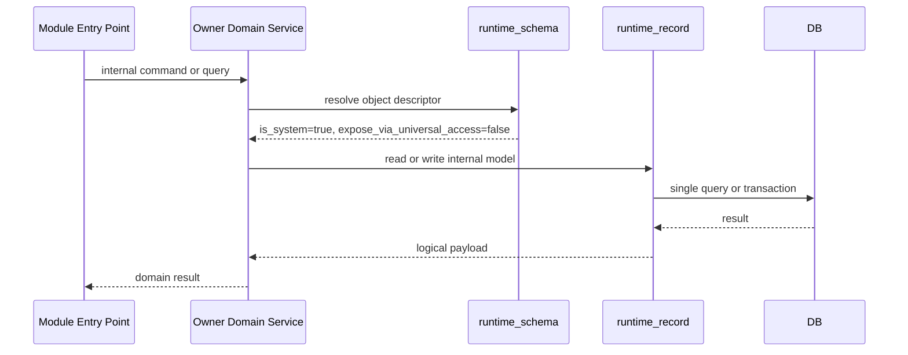
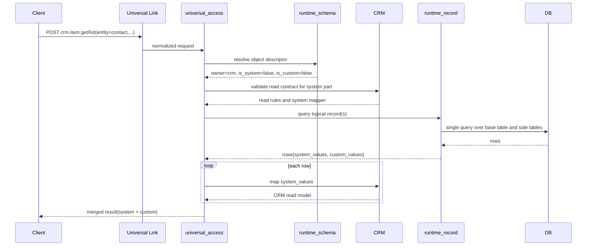
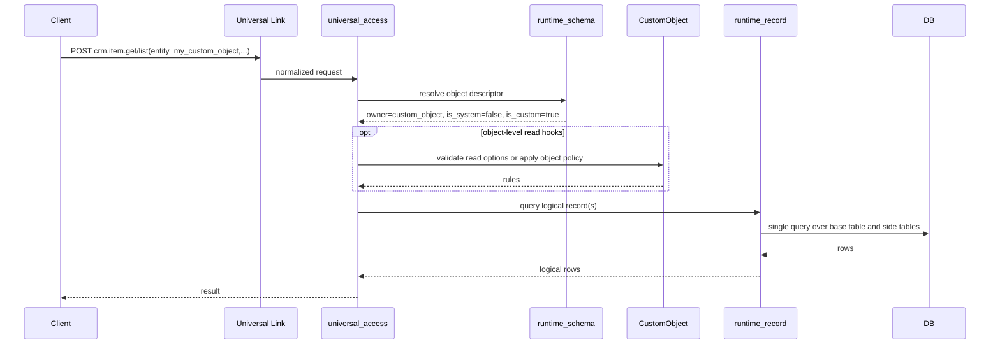
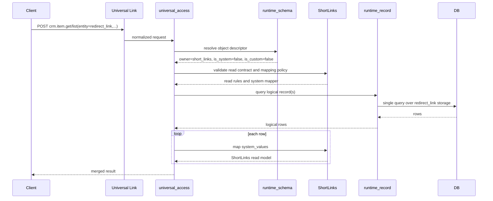
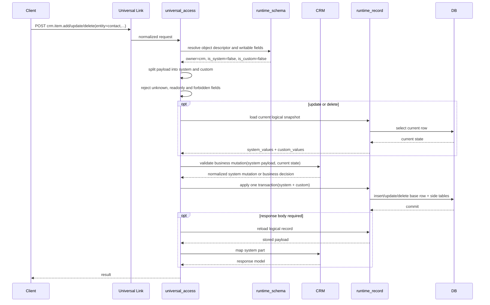
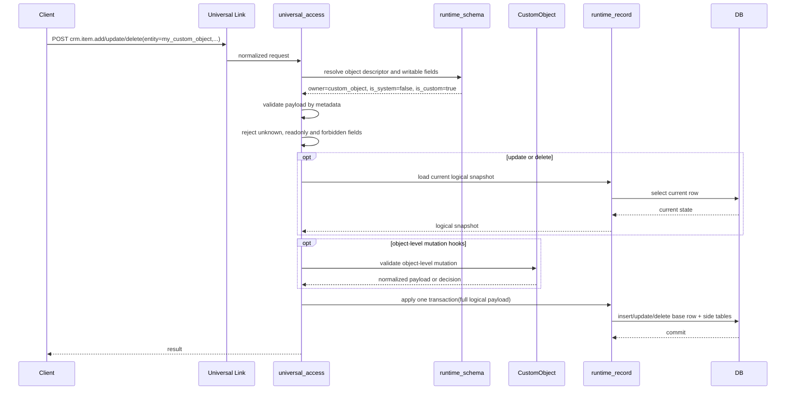
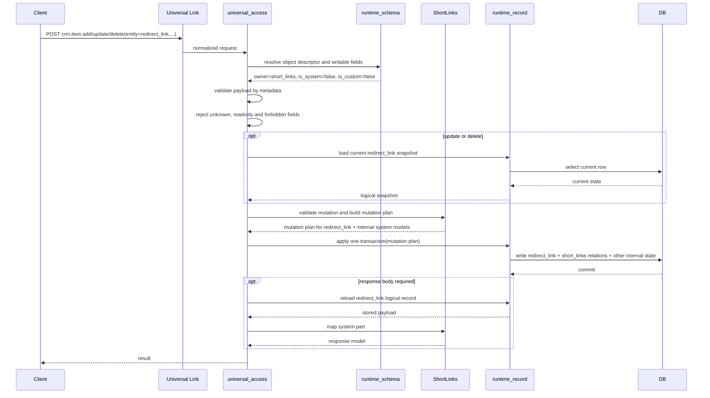
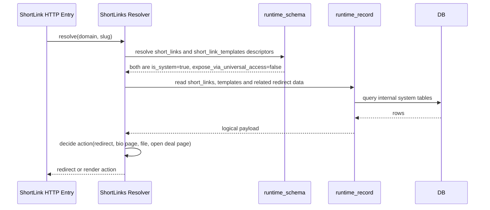

# Universal Access: CRM, CustomObject и ShortLinks Flows

## 1. Контекст и цель

Нужен единый способ обрабатывать запросы вида:

- `crm.item.get`
- `crm.item.list`
- `crm.item.add`
- `crm.item.update`
- `crm.item.delete`

При этом система должна одинаково корректно работать:

- с системными пользовательскими моделями CRM: `Contact`, `Company`, `Deal`, `Lead`;
- с внутренними системными моделями, которые не должны появляться как самостоятельные сущности в UI;
- с пользовательскими `CustomObject`;
- с отдельными доменными модулями, у которых есть и пользовательские, и внутренние системные модели, например `ShortLinks`;
- с logical field types, которые могут храниться и в inline columns, и в side tables.

Цель документа:

1. Зафиксировать правильные границы ответственности.
2. Описать flow для `get/list` и отдельно для `add/update/delete`.
3. Развести сценарии для `CRM`, `CustomObject` и `ShortLinks`.
4. Зафиксировать новую семантику флагов `is_system` и `is_custom`.
5. Исключить превращение `universal_access` в новый `god-module`.

Важно:

- в примерах ниже `crm.item.*` используется как текущее транспортное имя universal item API;
- сами правила flow не зависят от конкретного namespace transport-слоя.

## 2. Базовые принципы

### 2.1 `runtime_schema` - только control-plane

`runtime_schema` отвечает за:

- object metadata;
- field metadata;
- ownership объекта;
- field capabilities;
- layout compilation;
- DDL и миграции.

`runtime_schema` не отвечает за runtime CRUD записей.

### 2.2 `runtime_record` - единый data-plane

`runtime_record` отвечает за:

- чтение logical record;
- запись logical record;
- фильтрацию;
- сортировку;
- пагинацию;
- транзакционную запись значений;
- работу с inline columns и side tables.

Это единая точка для `read/query/write/delete` record values.

### 2.3 Owner-module валидирует домен, но не подменяет `runtime_record`

Owner-module отвечает за:

- предметные инварианты;
- state transitions;
- object-level политику чтения и записи;
- response mapping системной части;
- генерацию mutation plan для связанных внутренних моделей, если это требуется доменом.

Owner-module не должен:

- выполнять `list/filter/sort/page` вместо `runtime_record`;
- писать custom fields в обход `runtime_record`;
- дублировать storage-логику `runtime_record`.

### 2.4 `universal_access` обслуживает только пользовательские модели

`universal_access` должен:

- нормализовать запрос;
- резолвить объект через `runtime_schema`;
- проверять доступность полей и операций;
- вызывать owner-module для read/write policy;
- вызывать `runtime_record` для чтения и записи;
- собирать результат.

`universal_access` не должен:

- обслуживать внутренние системные модели;
- хранить бизнес-логику CRM или других доменов;
- сам реализовывать data access вместо `runtime_record`;
- сам разруливать многомодельные доменные сценарии без owner-module.

## 3. Семантика `is_system` и `is_custom`

### 3.1 Главное правило

В этом target design флаги `is_system` и `is_custom` не являются взаимоисключающей парой.

Они означают разные вещи:

- `is_system=true` означает внутреннюю системную модель или поле.
- `is_custom=true` означает пользовательски созданную модель или поле.

Это независимые смысловые оси.

### 3.2 Смысл `is_system=true`

Если у объекта `is_system=true`, это означает:

- объект внутренний;
- он не обслуживается через `universal_access`;
- на нем нельзя строить пользовательские UI-витрины вроде таблиц, канбанов и подобных представлений;
- в него нельзя добавлять custom fields;
- доступ к нему идет только через owner-domain и `runtime_record`.

Примеры:

- `crm_contact_point`
- `short_links`
- `short_link_templates`

### 3.3 Смысл `is_custom=true`

Если у объекта `is_custom=true`, это означает:

- объект создан пользователем на runtime-уровне;
- его owner-module - `custom_object`;
- он может обслуживаться через `universal_access`;
- его структура описывается metadata и lifecycle идет через runtime schema APIs.

Пример:

- пользовательский объект, созданный через `CustomObject`.

### 3.4 Комбинации флагов

| `is_system` | `is_custom` | Смысл | Пример | Доступ через `universal_access` |
| --- | --- | --- | --- | --- |
| `true` | `false` | Внутренняя системная модель | `crm_contact_point`, `short_links`, `short_link_templates` | Нет |
| `false` | `false` | Системная пользовательская модель | `contact`, `company`, `deal`, `lead`, `redirect_link` | Да |
| `false` | `true` | Пользовательская runtime-модель | любой `CustomObject` | Да |
| `true` | `true` | Недопустимая комбинация | нет | Нет |

### 3.5 Что это означает для полей

Та же логика применяется к полям:

- `is_system=true`, `is_custom=false` - внутреннее системное поле;
- `is_system=false`, `is_custom=false` - системное пользовательское поле;
- `is_system=false`, `is_custom=true` - пользовательское поле;
- `is_system=true`, `is_custom=true` - недопустимо.

Примеры:

- поле `name` у `Contact` - системное пользовательское поле: `is_system=false`, `is_custom=false`;
- custom field у `Contact` - пользовательское поле: `is_system=false`, `is_custom=true`;
- внутренний служебный field у `short_links` - `is_system=true`, `is_custom=false`.

### 3.6 Следствие для текущей реализации

Если в текущем `runtime_schema` доменная модель трактует `is_system/is_custom` как XOR-инвариант, это нужно считать ограничением текущей реализации, а не целевого дизайна.

Для описанного здесь дизайна инвариант должен быть таким:

- `not (is_system and is_custom)`

а не:

- `exactly one of is_system/is_custom is true`

## 4. Примеры моделей по модулям

| Модуль | Модель | `is_system` | `is_custom` | Через `universal_access` | Custom fields | UI-витрины |
| --- | --- | --- | --- | --- | --- | --- |
| `crm` | `contact` | `false` | `false` | Да | Да | Да |
| `crm` | `company` | `false` | `false` | Да | Да | Да |
| `crm` | `deal` | `false` | `false` | Да | Да | Да |
| `crm` | `lead` | `false` | `false` | Да | Да | Да |
| `crm` | `contact_point` | `true` | `false` | Нет | Нет | Нет |
| `short_links` | `short_links` | `true` | `false` | Нет | Нет | Нет |
| `short_links` | `short_link_templates` | `true` | `false` | Нет | Нет | Нет |
| `short_links` | `redirect_link` | `false` | `false` | Да | Да | Да |
| `custom_object` | runtime object | `false` | `true` | Да | Да | Да |

### 4.1 CRM

Для `CRM` важно зафиксировать:

- все модели CRM принадлежат системе, поэтому `is_custom=false`;
- пользовательские CRM-модели, такие как `Contact`, `Company`, `Deal`, `Lead`, имеют `is_system=false`, потому что они отображаются в UI и могут иметь custom fields;
- `ContactPoint` имеет `is_system=true`, потому что он не должен существовать как самостоятельная пользовательская сущность и доступен только через `Contact` и `Company`.

### 4.2 ShortLinks

Для `ShortLinks`:

- `short_links` - внутренняя системная модель;
- `short_link_templates` - внутренняя системная модель;
- `redirect_link` - пользовательская системная модель с собственной доменной логикой и своими UI-витринами.

Рекомендуемый состав моделей:

- `short_links`
  - `id`
  - ссылка на `domain`
  - `slug`
  - ссылка на `template`
- `short_link_templates`
  - глобальные настройки ссылки
  - `action_type` как ENUM, например:
    - `redirect`
    - `bio_page`
    - `download_file`
    - `open_deal_page`
- `redirect_link`
  - условия перенаправления
  - ссылка назначения
  - HTTP status code
  - другая предметная логика перенаправления

Ключевой смысл:

- модуль может содержать одновременно и внутренние системные модели, и пользовательские системные модели;
- `runtime_schema` знает обо всех них;
- `universal_access` обслуживает только пользовательские модели;
- внутренние модели обслуживаются только owner-domain и `runtime_record`.

## 5. Рекомендуемая metadata-модель

Для каждого объекта в metadata рекомендуется явно хранить:

- `object_name`
- `owner_module = crm | custom_object | short_links | ...`
- `is_system`
- `is_custom`
- `is_active`
- `allow_custom_fields`
- `allow_ui_views`
- `expose_via_universal_access`
- `capabilities`

Для каждого поля:

- `field_name`
- `logical_type`
- `is_system`
- `is_custom`
- `is_readable`
- `is_writable`
- `is_filterable`
- `is_sortable`
- `storage_layout`

### 5.1 Производные правила

Рекомендуется фиксировать следующие derived rules:

- если `is_system=true`, то `allow_custom_fields=false`;
- если `is_system=true`, то `allow_ui_views=false`;
- если `is_system=true`, то `expose_via_universal_access=false`;
- если `is_custom=true`, то `owner_module=custom_object`;
- если `is_system=false` и `is_custom=false`, объект является системной пользовательской моделью owner-модуля;
- если `is_system=false` и `is_custom=true`, объект является пользовательской runtime-моделью.

### 5.2 Почему `owner_module` все равно нужен

Даже после фиксации `is_system` и `is_custom` ownership нельзя выводить только из этих двух флагов.

Нужен явный `owner_module`, потому что пользовательская системная модель может принадлежать:

- `crm`
- `short_links`
- другому доменному модулю

Пример:

- `contact` и `redirect_link` имеют одинаковую комбинацию `is_system=false`, `is_custom=false`, но принадлежат разным доменам.

## 6. Матрица ответственности

| Зона | CRM user-facing model | CRM internal model | ShortLinks user-facing model | ShortLinks internal model | CustomObject |
| --- | --- | --- | --- | --- | --- |
| Пример | `contact` | `contact_point` | `redirect_link` | `short_links` | runtime object |
| Owner-module | `crm` | `crm` | `short_links` | `short_links` | `custom_object` |
| `is_system` | `false` | `true` | `false` | `true` | `false` |
| `is_custom` | `false` | `false` | `false` | `false` | `true` |
| Доступ через `universal_access` | Да | Нет | Да | Нет | Да |
| Кто читает/пишет record values | `runtime_record` | `runtime_record` | `runtime_record` | `runtime_record` | `runtime_record` |
| Кто валидирует домен | `crm` | `crm` | `short_links` | `short_links` | `custom_object` или schema-driven |
| Можно добавлять custom fields | Да | Нет | Да | Нет | Да |
| Можно строить UI-витрины | Да | Нет | Да | Нет | Да |

## 7. Flow для внутренних системных моделей (`is_system=true`)

### 7.1 Назначение

Этот flow относится к моделям, которые описаны в `runtime_schema`, но не должны обслуживаться через `universal_access`.

Примеры:

- `crm_contact_point`
- `short_links`
- `short_link_templates`

### 7.2 Sequence diagram



### 7.3 Пояснение

1. Внутренняя системная модель все равно описана в `runtime_schema`.
2. Ее структура и storage layout так же управляются через metadata и `runtime_record`.
3. Но доступ к ней идет только через owner-domain.
4. `universal_access` сюда не допускается.
5. UI не строит на таких моделях table/kanban/list pages как на самостоятельных объектах.

## 8. Сквозной flow: GET / LIST для CRM user-facing моделей

### 8.1 Назначение

Этот flow используется для чтения пользовательских CRM-моделей:

- `Contact`
- `Company`
- `Deal`
- `Lead`

У всех этих объектов:

- `is_system=false`
- `is_custom=false`

### 8.2 Sequence diagram



### 8.3 Пояснение

1. `universal_access` работает только потому, что объект user-facing.
2. `CRM` участвует в read policy и mapping.
3. `runtime_record` выполняет один logical query.
4. Custom fields у `Contact` и других CRM user-facing моделей не уходят в `CustomObject` как в storage owner.

## 9. Сквозной flow: GET / LIST для CustomObject

### 9.1 Назначение

Этот flow используется для пользовательских объектов, созданных через runtime metadata.

У таких объектов:

- `is_system=false`
- `is_custom=true`
- `owner_module=custom_object`

### 9.2 Sequence diagram



### 9.3 Пояснение

1. Основной источник истины о структуре объекта - `runtime_schema`.
2. Основной исполнитель чтения - `runtime_record`.
3. `CustomObject` на чтении:
   - либо не участвует вовсе;
   - либо участвует только как policy/hook слой.
4. Если у custom object нет специальной бизнес-логики, чтение может быть почти полностью schema-driven.

## 10. Сквозной flow: GET / LIST для `ShortLinks.redirect_link`

### 10.1 Назначение

Этот flow используется для пользовательской модели `redirect_link`.

У нее:

- `owner_module=short_links`
- `is_system=false`
- `is_custom=false`

При этом модуль `short_links` внутри себя также использует внутренние системные модели:

- `short_links`
- `short_link_templates`

### 10.2 Sequence diagram



### 10.3 Пояснение

1. `redirect_link` обслуживается через `universal_access`, потому что это пользовательская системная модель.
2. `short_links` и `short_link_templates` через `universal_access` не обслуживаются, потому что это внутренние системные модели.
3. Один и тот же owner-module может содержать обе категории моделей одновременно.

## 11. Сквозной flow: ADD / UPDATE / DELETE для CRM user-facing моделей

### 11.1 Назначение

Этот flow используется для изменения CRM-сущностей с возможными custom fields.

### 11.2 Sequence diagram



### 11.3 Пояснение

1. `universal_access` не пишет данные сам.
2. `runtime_schema` определяет допустимые поля и их writable/readable contract.
3. `CRM` валидирует доменные инварианты.
4. `runtime_record` пишет системные поля и custom fields в одной транзакции.
5. `ContactPoint` и другие внутренние CRM-модели в этот публичный flow не попадают напрямую.

## 12. Сквозной flow: ADD / UPDATE / DELETE для CustomObject

### 12.1 Назначение

Этот flow используется для изменения записей пользовательских объектов.

### 12.2 Sequence diagram



### 12.3 Пояснение

1. В большинстве случаев write-path для `CustomObject` может быть metadata-driven.
2. `CustomObject` модуль нужен:
   - для lifecycle custom object definitions;
   - для object-level hooks;
   - для дополнительных правил, если они появятся.
3. Физическая запись значений по-прежнему должна идти через `runtime_record`.

## 13. Сквозной flow: ADD / UPDATE / DELETE для `ShortLinks.redirect_link`

### 13.1 Назначение

Этот flow показывает важный гибридный сценарий:

- публичный объект `redirect_link` идет через `universal_access`;
- внутренние модели `short_links` и `short_link_templates` остаются за пределами `universal_access`;
- owner-module `short_links` может потребовать мутаций сразу нескольких моделей в одной транзакции.

### 13.2 Sequence diagram



### 13.3 Пояснение

1. `redirect_link` остается user-facing объектом.
2. `short_links` и `short_link_templates` остаются внутренними системными моделями.
3. Мутации внутренних моделей делаются не через `universal_access`, а через owner-domain `short_links`.
4. Физическая запись всех затронутых моделей должна происходить одной транзакцией через `runtime_record`.

## 14. Flow разрешения короткой ссылки вне `universal_access`

### 14.1 Назначение

Это отдельный runtime flow для основного short link поведения, когда пользователь открывает короткую ссылку по домену и `slug`.

Этот flow не является `crm.item.*` API и не идет через `universal_access`.

### 14.2 Sequence diagram



### 14.3 Пояснение

1. `short_links` и `short_link_templates` участвуют в основном продуктовой логике модуля.
2. Но это не делает их user-facing runtime-объектами.
3. Они остаются внутренними системными моделями и доступны только через domain services `short_links`.

## 15. Универсальная схема split ответственности

### 15.1 Если объект user-facing и принадлежит CRM

- `universal_access`
  - нормализует запрос;
  - резолвит descriptor;
  - делит payload на `system/custom`;
  - вызывает `CRM` для доменной валидации;
  - вызывает `runtime_record` для чтения и записи.
- `runtime_schema`
  - знает metadata и layout.
- `CRM`
  - владеет инвариантами и системной моделью.
- `runtime_record`
  - хранит всю logical запись.

### 15.2 Если объект user-facing и принадлежит ShortLinks

- `universal_access`
  - нормализует запрос;
  - резолвит descriptor;
  - валидирует операцию по metadata;
  - вызывает `short_links` для mutation policy;
  - вызывает `runtime_record`.
- `runtime_schema`
  - знает metadata и layout.
- `short_links`
  - владеет доменной логикой `redirect_link`;
  - при необходимости строит mutation plan для внутренних системных моделей.
- `runtime_record`
  - хранит все logical записи и выполняет общий UoW.

### 15.3 Если объект user-facing и принадлежит CustomObject

- `universal_access`
  - нормализует запрос;
  - резолвит descriptor;
  - валидирует операцию по metadata;
  - вызывает `runtime_record`.
- `runtime_schema`
  - знает metadata и layout.
- `CustomObject`
  - владеет lifecycle custom object type;
  - опционально содержит object-level hooks.
- `runtime_record`
  - хранит всю logical запись.

### 15.4 Если объект внутренний системный

- `universal_access`
  - не участвует.
- owner-domain
  - полностью владеет прикладным сценарием.
- `runtime_schema`
  - знает metadata и layout.
- `runtime_record`
  - хранит и читает данные.

## 16. Контракты, которые нужны для реализации

### 16.1 `runtime_schema`

Должен уметь отдавать descriptor объекта, например:

```python
@dataclass(frozen=True, slots=True)
class RuntimeObjectDescriptor:
    object_name: str
    owner_module: str
    is_system: bool
    is_custom: bool
    allow_custom_fields: bool
    allow_ui_views: bool
    expose_via_universal_access: bool
    readable_fields: tuple[FieldDescriptor, ...]
    writable_fields: tuple[FieldDescriptor, ...]
    filterable_fields: tuple[FieldDescriptor, ...]
    sortable_fields: tuple[FieldDescriptor, ...]
```

### 16.2 `runtime_record`

Должен уметь:

```python
class RuntimeRecordGateway(Protocol):
    async def get(self, query: GetRecordQuery) -> LogicalRecord | None: ...
    async def list(self, query: ListRecordsQuery) -> Page[LogicalRecord]: ...
    async def insert(self, cmd: InsertLogicalRecordCommand) -> LogicalRecord: ...
    async def update(self, cmd: UpdateLogicalRecordCommand) -> LogicalRecord: ...
    async def delete(self, cmd: DeleteLogicalRecordCommand) -> None: ...
    async def execute_plan(self, cmd: ExecuteMutationPlanCommand) -> MutationResult: ...
```

`execute_plan(...)` нужен для сценариев вроде `redirect_link`, где один публичный объект тянет за собой изменения внутренних системных моделей.

### 16.3 owner-modules

Owner-module должен уметь:

```python
class OwnerModulePort(Protocol):
    async def validate_read(self, ctx: ReadContext) -> ReadPolicy: ...
    async def validate_mutation(
        self,
        ctx: MutationContext,
    ) -> MutationDecision: ...
    async def build_mutation_plan(
        self,
        ctx: MutationContext,
    ) -> MutationPlan: ...
    async def map_system_payload(
        self,
        payload: dict[str, object],
    ) -> dict[str, object]: ...
```

Важно:

- owner-module не должен сам читать и писать custom fields в обход `runtime_record`;
- owner-module не должен выполнять pagination/filter/sort вместо `runtime_record`;
- owner-module может строить mutation plan для внутренних системных моделей, но физическое применение плана должно идти через `runtime_record`.

## 17. Что нельзя делать

### 17.1 Нельзя делать `list` через merge двух источников

Плохая схема:

1. Отдельно читаем user-facing сущность из owner-module.
2. Отдельно читаем custom data.
3. Мержим по `id`.

Почему это плохо:

- нет корректной сортировки;
- нет корректной пагинации;
- фильтры становятся недетерминированными;
- слишком дорого по запросам.

### 17.2 Нельзя писать системную и custom части в разные транзакции

Плохая схема:

1. Owner-module пишет system fields.
2. Кто-то отдельно пишет custom fields.
3. Один из шагов падает.

Результат:

- полузаписанная запись;
- сложный rollback;
- потеря консистентности.

### 17.3 Нельзя обслуживать `is_system=true` модели через `universal_access`

Иначе размываются границы:

- внутренние модели начинают жить как обычные UI-объекты;
- появляются лишние пользовательские витрины;
- ломается encapsulation owner-domain.

### 17.4 Нельзя определять маршрутизацию только по `is_custom`

Причины:

- ownership - это свойство объекта, а не только поля;
- `contact` и `redirect_link` обе имеют `is_custom=false`, но принадлежат разным доменам;
- `is_system` и `is_custom` отвечают за разные оси классификации;
- появятся virtual/computed/relation/collection fields;
- часть logical fields вообще не укладывается в простую модель `field -> column`.

## 18. Итоговая формула

### 18.1 Для user-facing системной модели

Flow:

1. `universal_access`
2. `runtime_schema`
3. owner-module для read/write policy
4. `runtime_record` одним query или одной транзакцией
5. owner-module для mapping system part
6. merged response

Примеры:

- `contact`
- `deal`
- `redirect_link`

### 18.2 Для пользовательской runtime-модели

Flow:

1. `universal_access`
2. `runtime_schema`
3. `custom_object` hooks при необходимости
4. `runtime_record`
5. response

Пример:

- любой tenant custom object.

### 18.3 Для внутренней системной модели

Flow:

1. owner-domain entry point
2. `runtime_schema`
3. `runtime_record`
4. domain result

Примеры:

- `contact_point`
- `short_links`
- `short_link_templates`

## 19. Главный архитектурный вывод

Ключевое правило дизайна:

- `is_system` отвечает за внутренность модели и ее недоступность через `universal_access`;
- `is_custom` отвечает за пользовательское происхождение модели;
- `owner_module` отвечает за доменную принадлежность;
- `runtime_schema` знает все модели;
- `runtime_record` хранит все модели;
- `universal_access` обслуживает только user-facing модели;
- внутренние системные модели обслуживаются только owner-domain.

Следствия:

- `Contact`, `Company`, `Deal`, `Lead` в CRM: `is_system=false`, `is_custom=false`;
- `ContactPoint` в CRM: `is_system=true`, `is_custom=false`;
- `short_links` и `short_link_templates`: `is_system=true`, `is_custom=false`;
- `redirect_link`: `is_system=false`, `is_custom=false`;
- любой `CustomObject`: `is_system=false`, `is_custom=true`.

Именно такая трактовка флагов делает поведение модулей предсказуемым и не смешивает:

- системность;
- пользовательское происхождение;
- UI exposure;
- доменное ownership.
