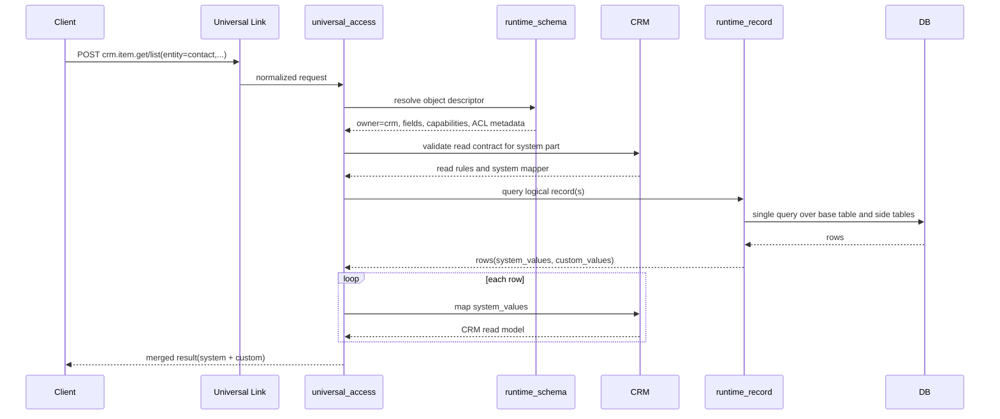
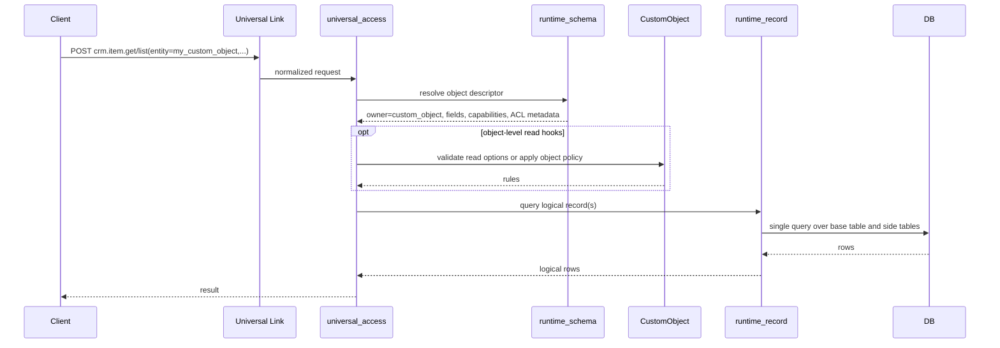
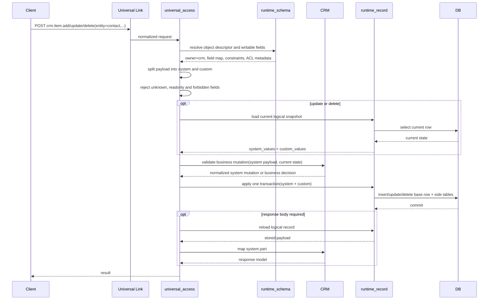
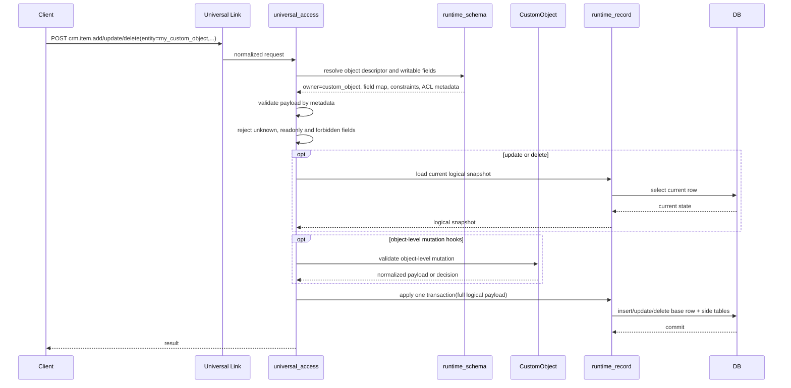

# Universal Access: CRM и CustomObject Flows

## 1. Контекст и цель

Нужен единый способ обрабатывать запросы вида:

- `crm.item.get`
- `crm.item.list`
- `crm.item.add`
- `crm.item.update`
- `crm.item.delete`

При этом система должна одинаково корректно работать:

- с системными CRM-объектами: `Contact`, `Company`, `Deal`, `Lead`;
- с пользовательскими `CustomObject`;
- с custom fields у системных CRM-объектов;
- с logical field types, которые могут храниться не только в inline columns, но и в side tables.

Цель документа:

1. Зафиксировать правильные границы ответственности.
2. Описать flow для `get/list` и отдельно для `add/update/delete`.
3. Развести сценарии для `CRM` и `CustomObject`.
4. Исключить превращение `universal_access` в новый `god-module`.

## 2. Базовые принципы

### 2.1 `runtime_schema` - только control-plane

`runtime_schema` отвечает за:

- object metadata;
- field metadata;
- ownership объекта;
- field capabilities;
- layout compilation;
- DDL и миграции.

`runtime_schema` не отвечает за runtime CRUD записей.

### 2.2 `runtime_record` - единый data-plane

`runtime_record` отвечает за:

- чтение logical record;
- запись logical record;
- фильтрацию;
- сортировку;
- пагинацию;
- транзакционную запись значений;
- работу с inline columns и side tables.

Это единая точка для `read/query/write/delete` record values.

### 2.3 Owner-module валидирует домен, но не хранит custom fields отдельно

Для системных CRM-объектов:

- `CRM` владеет предметными инвариантами;
- `runtime_record` хранит и system fields, и custom fields;
- `CustomObject` не владеет custom fields CRM-объекта.

Для пользовательских объектов:

- `CustomObject` владеет lifecycle самого custom object type;
- `runtime_record` хранит значения записей;
- object-level hooks в `CustomObject` опциональны и нужны только при наличии отдельной бизнес-логики.

### 2.4 `universal_access` - тонкий orchestration layer

`universal_access` должен:

- нормализовать запрос;
- резолвить объект через `runtime_schema`;
- проверять доступность полей и операций;
- вызывать owner-module для бизнес-валидации;
- вызывать `runtime_record` для чтения и записи;
- собирать результат.

`universal_access` не должен:

- хранить бизнес-логику CRM;
- сам интерпретировать доменные инварианты;
- сам владеть сохранением полей по разным транзакциям;
- сам реализовывать data access вместо `runtime_record`.

## 3. Рекомендуемая metadata-модель

Для каждого объекта в metadata рекомендуется явно хранить:

- `object_name`
- `object_kind = system | custom`
- `owner_module = crm | custom_object`
- `is_active`
- `capabilities`

Для каждого поля:

- `field_name`
- `logical_type`
- `is_system`
- `is_custom`
- `is_readable`
- `is_writable`
- `is_filterable`
- `is_sortable`
- `storage_layout`

Важно:

- `is_custom` само по себе недостаточно для маршрутизации.
- Ownership должен определяться на уровне объекта через `owner_module`.
- Правила доступа и query-capabilities должны определяться metadata, а не hardcode в `universal_access`.

## 4. Матрица ответственности

| Зона | CRM object | CustomObject |
| --- | --- | --- |
| Кто владеет объектом | `CRM` | `CustomObject` |
| Кто владеет metadata | `runtime_schema` | `runtime_schema` |
| Кто читает record values | `runtime_record` | `runtime_record` |
| Кто пишет record values | `runtime_record` | `runtime_record` |
| Кто валидирует system payload | `CRM` | `CustomObject` или schema-driven validation |
| Кто валидирует custom fields | `runtime_schema` + `runtime_record` | `runtime_schema` + `runtime_record` |
| Кто делает filter/sort/page | `runtime_record` | `runtime_record` |
| Кто маппит domain response | `CRM` | `CustomObject` или generic mapper |

## 5. Сквозной flow: GET / LIST для CRM

### 5.1 Назначение

Этот flow используется для чтения системных объектов CRM:

- `Contact`
- `Company`
- `Deal`
- `Lead`

Custom fields этих объектов не должны читаться через `CustomObject`.

### 5.2 Sequence diagram



### 5.3 Пояснение

1. `universal_access` получает запрос и нормализует его.
2. `runtime_schema` возвращает descriptor объекта:
   - owner-module;
   - список полей;
   - query-capabilities;
   - ACL metadata.
3. `CRM` участвует только в:
   - валидации допустимости чтения системной части;
   - маппинге `system_values` в CRM read model.
4. `runtime_record` выполняет одно logical query:
   - для `get` это выборка одной записи;
   - для `list` это фильтр, сортировка, пагинация и projection.
5. Ответ собирается в `universal_access`:
   - системная часть приходит от `CRM`;
   - custom fields приклеиваются как extension data.

### 5.4 Критическое правило

`list` нельзя делать как отдельные чтения из `CRM` и `CustomObject` с последующим merge.

Иначе ломаются:

- фильтрация;
- сортировка;
- пагинация;
- консистентность ответа;
- производительность.

## 6. Сквозной flow: GET / LIST для CustomObject

### 6.1 Назначение

Этот flow используется для пользовательских объектов, созданных через runtime metadata.

### 6.2 Sequence diagram



### 6.3 Пояснение

1. Основной источник истины о структуре объекта - `runtime_schema`.
2. Основной исполнитель чтения - `runtime_record`.
3. `CustomObject` на чтении:
   - либо не участвует вовсе;
   - либо участвует только как policy/hook слой.
4. Если у custom object нет специальной бизнес-логики, чтение может быть почти полностью schema-driven.

## 7. Сквозной flow: ADD / UPDATE / DELETE для CRM

### 7.1 Назначение

Этот flow используется для изменения CRM-сущностей с возможными custom fields.

Примеры:

- создать `Contact`;
- изменить `Deal`;
- удалить `Lead`.

### 7.2 Sequence diagram



### 7.3 Пояснение

1. `universal_access` не пишет данные сам.
2. `runtime_schema` определяет:
   - какие поля допустимы;
   - какие writable;
   - какие readonly;
   - какие filterable/sortable/searchable;
   - какие logical types и storage contracts применяются.
3. `CRM` валидирует:
   - предметные инварианты;
   - state transitions;
   - обязательные системные поля;
   - правила удаления.
4. `runtime_record` выполняет запись:
   - системных полей;
   - custom fields;
   - side-table значений;
   - в рамках одной транзакции.

### 7.4 Критическое правило

Для CRM-объекта custom fields не должны отдельно уходить в `CustomObject`.

Иначе появляются:

- две транзакции вместо одной;
- частично сохраненные записи;
- сложные rollback-сценарии;
- размытие ownership.

## 8. Сквозной flow: ADD / UPDATE / DELETE для CustomObject

### 8.1 Назначение

Этот flow используется для изменения записей пользовательских объектов.

### 8.2 Sequence diagram



### 8.3 Пояснение

1. В большинстве случаев write-path для `CustomObject` может быть metadata-driven.
2. `CustomObject` модуль нужен:
   - для lifecycle custom object definitions;
   - для object-level hooks;
   - для дополнительных правил, если они появятся.
3. Физическая запись значений по-прежнему должна идти через `runtime_record`.

## 9. Универсальная схема split ответственности

### 9.1 Если объект принадлежит CRM

- `universal_access`
  - нормализует запрос;
  - резолвит descriptor;
  - делит payload на `system/custom`;
  - вызывает `CRM` для доменной валидации;
  - вызывает `runtime_record` для чтения и записи.
- `runtime_schema`
  - знает metadata и layout.
- `CRM`
  - владеет инвариантами и системной моделью.
- `runtime_record`
  - хранит всю logical запись.

### 9.2 Если объект принадлежит CustomObject

- `universal_access`
  - нормализует запрос;
  - резолвит descriptor;
  - валидирует операцию по metadata;
  - вызывает `runtime_record`.
- `runtime_schema`
  - знает metadata и layout.
- `CustomObject`
  - владеет lifecycle custom object type;
  - опционально содержит object-level hooks.
- `runtime_record`
  - хранит всю logical запись.

## 10. Контракты, которые нужны для реализации

### 10.1 `runtime_schema`

Должен уметь отдавать descriptor объекта, например:

```python
@dataclass(frozen=True, slots=True)
class RuntimeObjectDescriptor:
    object_name: str
    object_kind: str
    owner_module: str
    readable_fields: tuple[FieldDescriptor, ...]
    writable_fields: tuple[FieldDescriptor, ...]
    filterable_fields: tuple[FieldDescriptor, ...]
    sortable_fields: tuple[FieldDescriptor, ...]
```

### 10.2 `runtime_record`

Должен уметь:

```python
class RuntimeRecordGateway(Protocol):
    async def get(self, query: GetRecordQuery) -> LogicalRecord | None: ...
    async def list(self, query: ListRecordsQuery) -> Page[LogicalRecord]: ...
    async def insert(self, cmd: InsertLogicalRecordCommand) -> LogicalRecord: ...
    async def update(self, cmd: UpdateLogicalRecordCommand) -> LogicalRecord: ...
    async def delete(self, cmd: DeleteLogicalRecordCommand) -> None: ...
```

### 10.3 owner-modules

Owner-module должен уметь:

```python
class OwnerModulePort(Protocol):
    async def validate_read(self, ctx: ReadContext) -> ReadPolicy: ...
    async def validate_mutation(
        self,
        ctx: MutationContext,
    ) -> MutationDecision: ...
    async def map_system_payload(
        self,
        payload: dict[str, object],
    ) -> dict[str, object]: ...
```

Важно:

- owner-module не должен сам читать и писать custom fields в обход `runtime_record`;
- owner-module не должен выполнять pagination/filter/sort вместо `runtime_record`.

## 11. Что нельзя делать

### 11.1 Нельзя делать `list` через merge двух источников

Плохая схема:

1. Отдельно читаем CRM.
2. Отдельно читаем CustomObject.
3. Мержим по `id`.

Почему это плохо:

- нет корректной сортировки;
- нет корректной пагинации;
- фильтры становятся недетерминированными;
- слишком дорого по запросам.

### 11.2 Нельзя писать системную и custom части в разные транзакции

Плохая схема:

1. `CRM` пишет system fields.
2. `CustomObject` пишет custom fields.
3. Один из шагов падает.

Результат:

- полузаписанная запись;
- сложный rollback;
- потеря консистентности.

### 11.3 Нельзя определять маршрутизацию только по `is_custom`

Причины:

- ownership - это свойство объекта, а не только поля;
- появятся virtual/computed/relation/collection fields;
- часть logical fields вообще не укладывается в простую модель `field -> column`.

## 12. Итоговая формула

### 12.1 GET / LIST

Общий flow:

1. `universal_access`
2. `runtime_schema`
3. owner-module для read rules
4. `runtime_record` одним query
5. owner-module для mapping system part
6. merged response

### 12.2 ADD / UPDATE / DELETE

Общий flow:

1. `universal_access`
2. `runtime_schema`
3. owner-module для business validation
4. `runtime_record` одной транзакцией
5. response mapping

## 13. Главный архитектурный вывод

Ключевое правило дизайна:

Для CRM-объекта custom fields должны жить в связке:

- `runtime_schema`
- `runtime_record`

но не в `CustomObject` как owner-модуле runtime values.

Иначе `CustomObject` превращается в универсальный модуль хранения чужих данных, а `universal_access` - в orchestration layer со скрытой бизнес-логикой.
