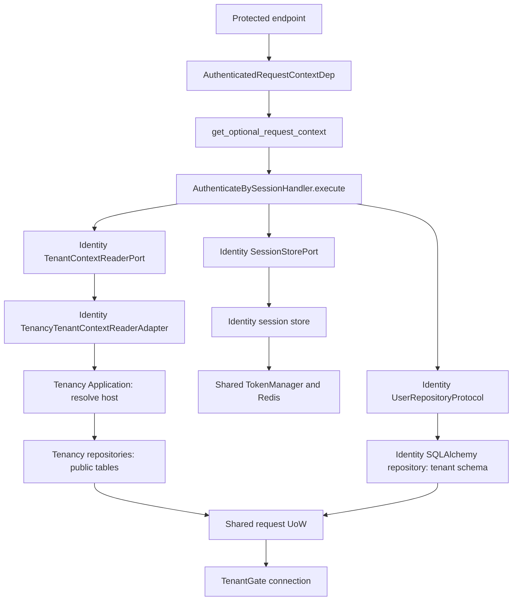

# Identity Module

## Purpose

`identity` provides tenant-aware console authentication, current-user profile
read/update flows, and tenant admin provisioning during onboarding.

## Public Functionality

- request email OTP
- confirm OTP and establish session
- load current user by session
- update current user profile
- logout current session
- provision tenant admin user during onboarding
- fixed admin/member roles, seven-day invitations, OTP acceptance and access revocation
- explicit cloud login/link/unlink using Authlib OIDC
- CSRF browser binding and session epoch revocation

## Scenarios And Structure

Every scenario has an immutable command/query, a handler with `execute(...)`, and
its result DTO. Ports belong to the responsibility that consumes them.

| Responsibility | Queries | Commands |
| --- | --- | --- |
| Auth | authenticate_by_session | request_email_otp, confirm_email_otp, logout_current_session |
| User | get_current_user | update_current_user_profile, create_tenant_admin |
| Access | list_users | change_user_access |
| Invitation | list_invitations | create_invitation, revoke_invitation, request_invitation_otp, accept_invitation |
| Cloud | get_cloud_status | start_cloud_auth, complete_cloud_auth, unlink_cloud_identity |

```text
identity/
├── domain/{user,auth,access}/
├── application/
│   ├── auth/{command,query,port,service}/
│   ├── user/{command,query}/
│   ├── access/{command,query,port}/
│   ├── invitation/{command,query,dto,service}/
│   ├── cloud/{command,query,dto,port,service}/
│   └── email/
├── infrastructure/
│   ├── user/persistence/
│   ├── access/persistence/
│   ├── persistence/models/  # one model per file
│   └── {auth,cloud,email,observability}/
└── presentation/
    └── {auth,user,access,invitation,cloud,email}/
```

A scenario is located at `application/<responsibility>/<command|query>/<scenario>/`
with `command.py` or `query.py`, `handler.py`, and `dto.py`. Auth, access, cloud and
email are responsibilities, not additional aggregate roots. Domain entities and
business rules retain their existing boundaries.

Presentation owns `depends.py`, adapter `providers.py`, and HTTP controllers/schemas.
Shared application services perform session validation/issuance, invitation validation
and cloud connection checks. They do not dispatch other handlers. Bootstrap functions
live in `infrastructure/cloud/bootstrap.py` and use the caller's UoW.

## Request Context And Authorization

Identity owns immutable `Principal` and `RequestContext` in `domain/auth/`.
Consumers use direct file imports; package `__init__.py` files remain empty.

```python
from src.modules.identity.domain.auth.principal import Principal
from src.modules.identity.domain.auth.request_context import RequestContext
from src.modules.identity.presentation.auth.depends import AuthenticatedRequestContextDep
from src.modules.identity.presentation.auth.depends import OptionalRequestContextDep
from src.modules.identity.presentation.access.depends import AuthorizationServiceDep
```



The handler receives only host and session token, and returns `SessionPrincipal | None`.
Presentation explicitly maps it to `Principal` and adds request ID, IP and User-Agent.
The required dependency returns `401` with `Unauthorized.` for an anonymous context.
FastAPI caches the context and UoW for the request.

Tests replace `get_authenticate_by_session_handler` through `app.dependency_overrides`,
using an object with async `execute(query)`, or override
`require_authenticated_request_context` directly. Authorization still supports
`app.state.authorization_service` and dependency overrides.

Host normalization is a pure function in `shared/application/network/host.py`.
HTTP extraction stays in Presentation. The Tenancy adapter maps its known domain
failures to `IdentityTenantNotFoundError` / `IdentityTenantUnavailableError`, retaining
messages and exception causes. Unexpected storage failures propagate. Identity's
Application and controllers do not depend on Tenancy domain exceptions.

## Infrastructure / Persistence

- `UserModel` and `UserEmailModel` inherit `TenantBase`; Alembic owns `users` and `user_emails` in each tenant schema
- `users` has no SQL `tenant_id` column; `user_emails.user_id` references `users.id` in the same schema without cascading deletion
- `SqlAlchemyUserRepository` receives the active UoW session and `TenantSchemaNaming`; every operation requires an explicit tenant identifier
- Core statements use the models' `__table__` definitions and a per-statement `schema_translate_map`, preserving connection state and avoiding ORM identity collisions across tenants
- repository results are explicitly mapped to domain entities; `User.tenant_id` comes from the operation context
- add/profile writes reject a mismatch between the supplied tenant and `User.tenant_id` before executing SQL
- missing tenant schemas/tables produce infrastructure errors; there is no fallback to shared users
- global migrations do not create identity tables; onboarding migrates each tenant schema before creating its administrator
- token/session implementations use shared `TokenManager`
- tenant context is resolved through a tenancy-owned use case adapter
- OTP and invitations use the Identity-owned `EmailServicePort` and `SystemEmailService`
- email delivery uses shared provider wiring with SMTP MVP transport and a placeholder `resend` provider

## Email And Observability

`application/email/` owns the typed email service contract, `SystemEmailKind`,
`SendOtpCodeVariables` and `SendInvitationVariables`.
`infrastructure/email/` owns `SystemEmailService` and the OTP/invitation renderer.
`presentation/email/depends.py` builds the service and exposes `EmailServiceDep` and
`get_email_service`; FastAPI dependency overrides target this definition directly.

Delivery uses shared `application/email/EmailTransportPort` and `RenderedEmailMessage`
contracts with shared SMTP/Resend adapters. Message content, settings and error behavior
are unchanged. The OIDC counter lives in `infrastructure/observability/metrics.py` and
retains the published `dnk_runtime_oidc_errors_total` name and labels.

## Presentation / Entry Points

Console auth routes live under `/api/console/auth`:

- `POST /request-otp`
- `POST /confirm-otp`
- `GET /me`
- `PATCH /me`
- `POST /logout`

Auth/profile controllers keep explicit HTTP exception mapping. Access, invitation and
cloud controllers share Identity-owned HTTP error handling and explicitly serialize DTOs.
Current-user profile stores `interface_theme` as a non-null string.
The default theme is `system`, and `PATCH /me` requires an explicit non-null theme value.

## Auth Settings

- OTP code length
- OTP challenge TTL
- session TTL
- session cookie name
- email OTP response still returns `code` only in `DEVELOPMENT`
- in development mode, OTP code may be returned in response for easier local testing

## Dependencies On Other Modules

- uses `tenancy` host resolution rules and tenant availability checks
- owns request context and authentication/authorization dependencies; uses `shared` UoW and token abstractions
- is consumed by `tenancy` through `CreateTenantAdminHandler` provisioning adapter

## Cloud access and invitations

Revision `0003_identity_cloud_access` adds role, session epoch, cloud bindings, invitations and unique live normalized email. This release targets fresh databases; no legacy import or automatic reset is performed.

Owner bootstrap creates an admin and exact `(issuer, sub)` binding. Creating an invitation persists it before attempting to send its seven-day link by email; delivery failure is logged while the response still exposes the same link for manual sharing. Invitations create a local user only after OTP verification of the fixed email, followed by explicit cloud linking in a local session. Matching cloud email never links accounts. A conflicting identity is not overwritten. Local access, the Core projection version and outbox commit in one UoW.

Every session consumer checks current user status and epoch. Revocation or unlink invalidates prior sessions permanently; restoring access does not revive them. Admin operations protect the last active administrator. Cloud tokens are discarded after identity validation; subsequent requests use local sessions. Secure, HttpOnly, host-only SameSite=Lax cookies are the default; insecure HTTP requires an explicit local-development setting. See [HTTP API](../interfaces/http-api.md) for added routes and CSRF requirements.

## Tests Covering This Module

- `test/test_identity_tenant_postgres.py`
    - identical IDs/emails in separate tenant schemas and isolated profile/email writes
    - local foreign keys, migration transitions and onboarding rollback after administrator insertion
    - HTTP login, profile updates, cross-tenant session rejection and logout with real repository/DI
- `test/test_identity_context_relocation.py`: direct imports, isolated entrypoints and request/authorization dependency overrides
- `test/test_identity_structure.py`: dependency direction, port error translation and authentication rejection paths
- `test/test_identity_use_cases.py`
    - auth handlers and tenant admin provisioning command
- `test/test_identity_access_postgres.py`: invitations, roles, revocation, linking and rollback
- `test/test_identity_cloud.py`: OIDC claims, issuer isolation and JWKS rotation
- `test/test_identity_csrf.py` and `test/test_identity_redis.py`: browser binding and atomic state
- `test/test_architecture_boundaries.py`
    - forbids legacy identity import paths
  - forbids removed `error_mapper` and `infrastructure.mapper` imports

## Related

- [HTTP API](../interfaces/http-api.md)
- [Configuration](../interfaces/configuration.md)
- [Domain models](../data/domain-models.md)
- [Test map](../quality/test-map.md)

## Source Of Truth

- `src/modules/identity/presentation/auth/http/`
- `src/modules/identity/presentation/user/http/`
- `src/modules/identity/domain/user/entity.py`
- `src/modules/identity/domain/auth/error.py`
- `src/modules/identity/application/auth/`
- `src/modules/identity/application/user/command/create_tenant_admin/handler.py`
- `src/config/feature/identity/auth_config.py`
