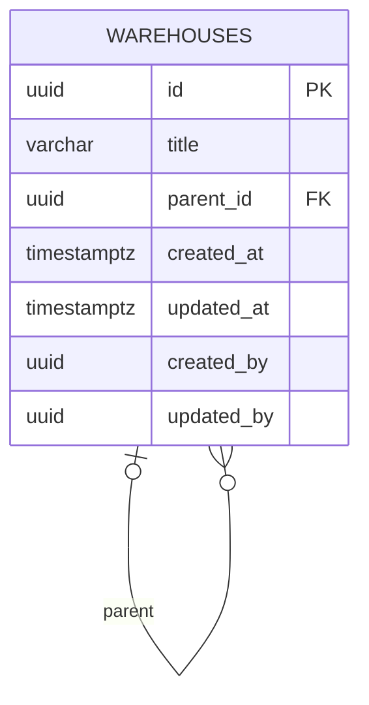

# Inventory

Inventory is the bounded context for future physical stock management. The current implementation provides the Warehouse model, repository contract, and first Alembic tenant migration. Stock balances, products, reservations, movements, application operations, HTTP endpoints, and UI are not implemented.

## Domain and storage

`Warehouse` is a dataclass with `WarehouseIdVO` and the shared `EntityTitleVO`. Its `create` factory accepts an explicit identifier, actor and timestamp, trims the title, rejects empty or overlong titles, and initializes audit fields. Domain errors live beside the aggregate.

`WarehouseRepositoryProtocol` defines `add` and `get_by_id`, both with explicit `tenant_id: EntityIdVO`. There is no repository implementation yet.

`WarehouseModel` inherits `TenantBase` and `TenantSystemMixin`. Its logical schema is `tenant`, translated to the physical schema by the caller. It belongs only to `TenantBase.metadata`; startup global `create_all` does not create it.

| Field | PostgreSQL type | Meaning |
|---|---|---|
| id | uuid, primary key | Shared UUIDv7 generation for model inserts |
| title | varchar(255), required | Non-unique warehouse title |
| parent_id | uuid, nullable | Parent warehouse in the same tenant schema |
| created_at / updated_at | timestamptz, required | Shared audit timestamps |
| created_by / updated_by | uuid, required | Shared actor identifiers; no cross-module FK |

## Hierarchy guarantees

- Multiple roots are allowed (`parent_id IS NULL`).
- `fk_warehouses_parent_id` references the same schema and uses `ON DELETE RESTRICT`.
- `ix_warehouses_parent_id` supports parent lookup and referential checks.
- `ck_warehouses_parent_not_self` rejects a self-parent.
- Longer cycles are not prevented in this version; cycle checks belong to future hierarchy-changing operations.
- There is no `tenant_id` column: physical schemas isolate tenants.
- New tenants get an empty warehouse table; no default warehouse is inserted.

## Architecture and migrations

Domain code imports shared primitives only. Persistence lives in infrastructure. Application and presentation are placeholders for later use cases. SQL schema evolution belongs to [tenant Alembic migrations](../data/tenant-migrations.md), not ORM `create_all`.

The initial revision defines its own SQL types and constraints without importing the current Warehouse model. Timestamp defaults come from PostgreSQL; `updated_at` on-update behavior and UUIDv7 generation follow the shared SQLAlchemy mixins, not database triggers/default UUID functions.

## Validation

`test_inventory_warehouse.py` covers domain validation and metadata mapping. `test_tenant_migrations_postgres.py` covers PostgreSQL constraints, isolated schemas, onboarding rollback, autogenerate, and concurrent migrations.

## Related

- [Tenancy](tenancy.md)
- [Shared](shared.md)
- [Domain models](../data/domain-models.md)
- [Migration CLI](../interfaces/management-cli.md)
