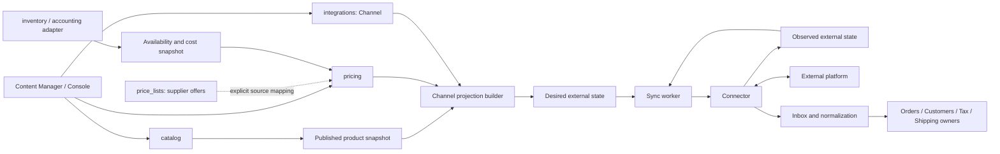
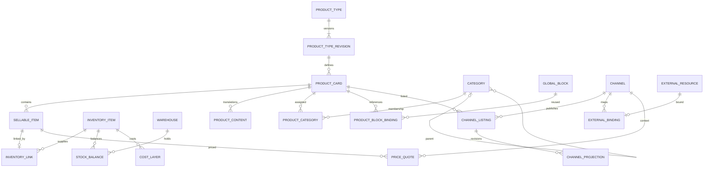
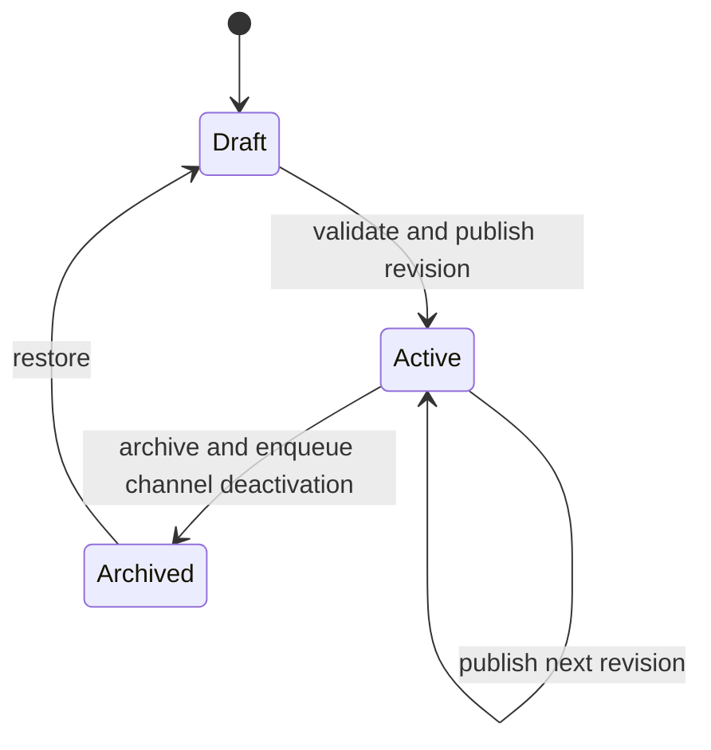
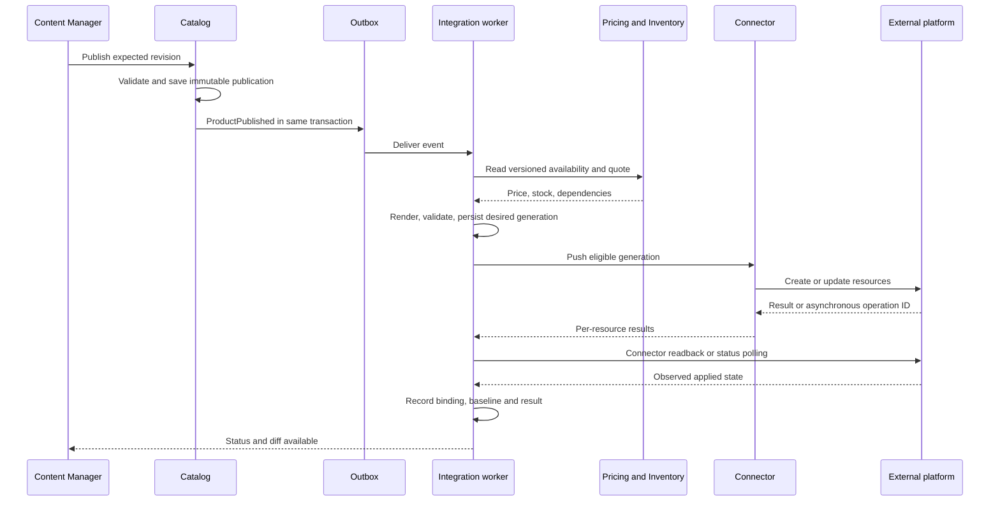

# Каталог, контент, ценообразование и каналы продаж

Статус: проект технической спецификации. Дата: 2026-09-22.

Документ задаёт целевую модель и основу декомпозиции реализации. Описанные API и таблицы не являются
текущей реализацией. Предлагаемые продуктовые решения помечены явно; значения лимитов требуют проверки нагрузкой.

Документ уточняет [общий план Commerce Core](commerce-domain-and-integrations.md). В вопросах типов карточек,
связи с учётным товаром, цен и Channel приоритет имеет эта спецификация. План складского ledger, заказов и
исполнения заказов из общего документа сохраняется в части, не противоречащей описанным здесь контрактам.

## 1. Границы и основные решения

| Понятие            | Ответственность                                                                             |
|--------------------|---------------------------------------------------------------------------------------------|
| `ProductCard`      | Контентная карточка: тип, локализованные поля, атрибуты, категории, медиа, ссылки на блоки. |
| `card_kind`        | Структура карточки: только `simple` или `variable`.                                         |
| `ProductType`      | Пользовательская схема контента и атрибутов: `default`, `protein`, `vitamin` и другие.      |
| `SellableItem`     | Продаваемая позиция карточки: одна у simple; отдельная на каждый вариант у variable.        |
| `InventoryItem`    | Независимая учётная номенклатура; остатки и себестоимость принадлежат учётному контуру.     |
| `pricing`          | Базовые цены, правила наценок, валюты, расчёт и объяснение цены для контекста продажи.      |
| `Channel`          | Конкретная внешняя точка продажи или приёма данных с собственной конфигурацией.             |
| `Connector`        | Код интеграции с платформой. Один коннектор обслуживает много подключений и каналов.        |
| `ChannelListing`   | Назначение карточки каналу, её overrides, готовность и состояние публикации.                |
| `ExternalResource` | Наблюдаемое внешнее состояние ресурса, используемое для просмотра и сравнения.              |

Основные инварианты:

1. Карточка каталога не является складским товаром. У неё нет собственного остатка и закупочной себестоимости.
2. Вариант получает отдельный `SellableItem`; родитель variable не продаётся, не оценивается и не резервируется.
3. `is_virtual` и `is_downloadable` — независимые флаги продаваемой позиции, не значения `card_kind`.
4. Внутренний контент, рассчитанная цена и внешнее состояние хранятся раздельно.
5. Тип товара определяет данные редактора; шаблон Channel определяет представление этих данных снаружи.
6. Публикация контента создаёт неизменяемую ревизию. Экспорт в Channel — отдельная асинхронная операция.
7. Поля с произвольной структурой валидируются по версии схемы. Универсальная невалидируемая key-value таблица
   не используется как основная модель каталога или интеграций.

## 2. Модули и зависимости



| Модуль         | Владеет                                                                               | Публичные контракты                                                          |
|----------------|---------------------------------------------------------------------------------------|------------------------------------------------------------------------------|
| `catalog`      | Карточки, схемы типов, варианты, контент, категории, атрибуты, медиа, блоки, ревизии. | `CatalogReadPort`, `CatalogCommandPort`, `PublishedProductPort`.             |
| `inventory`    | Учётная номенклатура, склады, партии/единицы, остатки, резервы, затраты.              | `InventoryItemPort`, `AvailabilityPort`, `CostBasisPort`, `ReservationPort`. |
| `pricing`      | Прайсы, ценовые политики, правила, курсы, quotes и расчётные проекции.                | `PriceQuotePort`, `PricePolicyPort`, `CurrencyPort`.                         |
| `integrations` | Channels, credentials references, mapping, listings, external state, sync, conflicts. | `ChannelProjectionPort`, `IntegrationIngestPort`, `ConnectorProtocol`.       |
| `orders`       | Заказы и коммерческие snapshots строк; ссылки на резерв и исполнение.                 | `OrderImportPort`, `OrderExportPort`.                                        |
| `customers`    | Канонические клиенты и их внешние связи через integrations.                           | `CustomerImportPort`, `CustomerReadPort`.                                    |
| `tax`          | Классы/настройки ставок и контракт расчёта; внешние id находятся в integrations.      | `TaxConfigPort`, `TaxQuotePort`.                                             |
| `shipping`     | Зоны, способы и конфигурация тарифов доставки.                                        | `ShippingConfigPort`, `ShippingQuotePort`.                                   |
| `shared`       | UoW, outbox/inbox, jobs, время, UUID, tenant context.                                 | Технические порты без товарных правил.                                       |

`customers`, `tax`, `shipping` — целевые владельцы данных, а не требование сразу реализовать CRM, налоговый
движок и логистику полностью. В MVP достаточно моделей конфигурации и минимальных import/read contracts.
Если владелец ещё не реализован, ресурс можно сохранить как external state, но нельзя обозначать его как
успешно импортированный в доменную модель.

Коннектор не получает ORM, UoW или репозитории бизнес-модулей. Межмодульные ссылки — UUID и DTO через application
ports. Домен модуля не импортирует чужие ORM-модели. Событие и изменение бизнес-данных фиксируются одним UoW.

## 3. Карточка, варианты и учётная номенклатура

### 3.1. Основные сущности

| Сущность           | Основные поля                                                                                                              |
|--------------------|----------------------------------------------------------------------------------------------------------------------------|
| `ProductCard`      | `id`, уникальный `code`, `card_kind`, `product_type_revision_id`, `default_locale`, `status`, `revision`, defaults флагов. |
| `SellableItem`     | `id`, `product_card_id`, `kind=base/variant`, `sku`, `status`, overrides флагов, `revision`.                               |
| `InventoryLink`    | `sellable_item_id`, `inventory_item_id`, `quantity_factor=1`, дата и автор сопоставления.                                  |
| `VariantAxis`      | `product_card_id`, `attribute_definition_id`, порядок, допустимые option IDs.                                              |
| `VariantSelection` | `sellable_item_id`, `attribute_definition_id`, `option_id`.                                                                |
| `InventoryItem`    | `id`, учётный код/SKU, единица измерения, `stock_mode=tracked/untracked`, режим партий/серий.                              |
| `StockBalance`     | `inventory_item_id`, `warehouse_id`, `on_hand`, `reserved`, `blocked`, `version`, `as_of`.                                 |
| `CostLayer`        | Учётный товар, поступление/партия, количество и остаток слоя, себестоимость единицы, валюта, база налога.                  |
| `StockUnit`        | Опциональная серийная единица с собственной себестоимостью и ссылкой на слой поступления.                                  |

`Variant` — роль `SellableItem(kind=variant)`. Отдельная таблица с дублирующим SKU и флагами не нужна.
`ProductCard.code`, `SellableItem.sku` и `InventoryItem`-код — разные идентификаторы; совпадение строк не создаёт связь.



Диаграмма показывает смысловые связи. Межмодульные FK не обязательны: их целостность проверяется портами и
периодической сверкой. `ExternalBinding` также связывает варианты, заказы и другие типы ресурсов, не только карточки.

### 3.2. Правила simple и variable

- У simple ровно один `SellableItem(kind=base)`, создаваемый вместе с карточкой. Отдельной вкладки вариантов нет.
- У variable только `SellableItem(kind=variant)`; для публикации требуется хотя бы один активный вариант.
- Каждый вариант задаёт ровно одно значение каждой оси. Оси в MVP — атрибуты `select` со стабильными option IDs.
- Комбинация options уникальна внутри карточки. Идентификатор комбинации строится по отсортированным парам
  `(attribute_id, option_id)`, а не по переводимым подписям.
- Генерация комбинаций выполняется явно с preview количества; не требуется создавать всё декартово произведение.
- Вариант наследует контент и галерею карточки; overrides полей, атрибутов и основного изображения допустимы.
- Изменение осей при существующих вариантах требует migration preview: несовместимые варианты не исправляются молча.
- Смена simple/variable и учётной связи после публикации — отдельная команда с планом переноса bindings и SKU.
  При активных резервах или незавершённых sync-операциях такая смена блокируется.
- Архивирование сохраняет ids, историю заказов и bindings. Публикуемые SKU повторно не используются.

### 3.3. Связь с учётом

Для опубликованной продаваемой позиции обязательна одна учётная связь; в draft она может отсутствовать.
У виртуального товара учётная номенклатура может иметь `stock_mode=untracked`. Несколько карточек/позиций могут
ссылаться на один `InventoryItem`, если это разные контентные представления одной и той же единицы продажи.
Остаток и резерв при этом общие. Комплекты, упаковочные коэффициенты и BOM отложены; в MVP `quantity_factor=1`.

Себестоимость каждой физической единицы восстанавливается через `CostLayer` и распределение поступлений/списаний;
для серийного учёта используется `StockUnit`. Одна строка на каждую несерийную штуку не обязательна: партия может
содержать много единиц с одинаковой стоимостью. Метод оценки при списании фиксируется в учётном контуре и не
подменяется методом оценки для расчёта продажной цены.

Существующие `price_lists.Offer` — предложения поставщиков, не собственный склад и не фактическая себестоимость.
Их использование как ценовой базы требует явной связи offer → InventoryItem, выбранного источника и проверки
свежести. Автоматическое сопоставление только по названию запрещено.

### 3.4. Virtual и downloadable

| `is_virtual` | `is_downloadable` | Поведение                                |
|--------------|-------------------|------------------------------------------|
| false        | false             | Физическая доставка, файлов нет.         |
| false        | true              | Физическая доставка и выдача файлов.     |
| true         | false             | Доставка не требуется; например, услуга. |
| true         | true              | Доставка не требуется; выдаются файлы.   |

Карточка задаёт defaults, позиция — nullable overrides. В published snapshot сохраняются итоговые boolean.
`is_virtual` не означает автоматически бесконечный остаток: режим количественного учёта определяет `InventoryItem`.

`DownloadAsset`: `id`, `sellable_item_id`, `storage_ref` либо защищённая внешняя ссылка, локализованное имя,
`version`, `download_limit`, `expires_after`. У downloadable позиции должен быть хотя бы один активный файл.
Галерея и файлы поставки — разные отношения. Публичный Product DTO не содержит приватных download URLs.
Выдача доступа следует событию оплаты/исполнения либо делегируется каналу, если его возможности это допускают.
Обязательный downloadable товар нельзя опубликовать в канал без поддерживаемого способа доставки файлов.

## 4. Типы товаров, контент и локали

### 4.1. Версионируемая схема типа

`ProductType(id, code, is_system)` имеет ревизии `ProductTypeRevision(id, version, status, schema)`.
Карточка ссылается на конкретную опубликованную ревизию. Изменение типа создаёт новую ревизию и preview
миграции карточек; удаления заполненных полей или изменения типа значения без явного преобразования не допускаются.

Схема описывает:

- `ContentFieldDefinition`: стабильный `code`, локализованная подпись, тип `text/rich_text`, порядок,
  обязательность и локализуемость;
- привязки `ProductTypeAttribute`: definition, required, default, допустимость использования как оси;
- `BlockSlot`: стабильный код, ссылка на глобальный блок по умолчанию, required, возможность замены блока;
- UI-порядок секций без привязки к конкретному Channel.

| Тип       | Контентные поля                                | Атрибуты схемы                                     | Глобальные блоки |
|-----------|------------------------------------------------|----------------------------------------------------|------------------|
| `default` | `title`, `description`                         | Пустой набор                                       | Нет              |
| `protein` | `title`, `description`, `usage`                | `flavor: select`                                   | Нет              |
| `vitamin` | `title`, `description`, `composition`, `usage` | `dosage: measurement`, `package_quantity: integer` | `warning`        |

`Default` — системный минимальный тип без дополнительных полей и обязательных атрибутов. Название обязательно
для публикации; описание может быть пустым, если Channel не требует его. Предлагаемое правило: явное добавление
атрибутов к отдельной карточке Default допускается; сам тип при этом не изменяется.

### 4.2. Хранение значений и локализация

- `ProductContent(product_card_id, locale, values_jsonb, revision)` — локализованные поля по стабильным кодам.
- `ProductInvariantContent(product_card_id, values_jsonb)` — поля, объявленные нелокализуемыми.
- `VariantContentOverride(sellable_item_id, locale, field_code, operation, value)` — изменения относительно карточки.
- `CategoryTranslation`, переводы названий типов/атрибутов/options, блоков и alt text имеют собственные записи.
- Локаль — нормализованный языковой тег, например `uk-UA`, `ru-UA`, `en-US`. Локаль не определяет валюту.

JSONB используется для versioned content schema, но не для связей, SKU, статусов, количеств и денежных полей.
Коды полей нельзя переименовать вместе с UI-подписью: изменение кода — миграция и проверка зависимых шаблонов.

Политика разрешения локали задаётся в Channel: точная локаль → явно разрешённая цепочка fallback → default locale
при разрешении. Циклы fallback запрещены. Отсутствующее значение и явно пустое значение различаются: пустая строка
не вызывает fallback. Для `required` и `strict_locale` отсутствие/пустота вызывает ошибку публикации.
В preview сохраняется `resolved_locale` каждого поля и блока; смешение языков показывается предупреждением либо
блокируется настройкой. Даты, суммы и единицы форматируются после разрешения локали.

### 4.3. Глобальные блоки

`GlobalBlock(id, code)` → `GlobalBlockRevision(id, version)` → `GlobalBlockTranslation(revision_id, locale, body)`.
`ProductBlockBinding(product_card_id, slot_code, block_id, revision_policy, pinned_revision_id)` хранит ссылку,
а не копию текста. Привязка из типа становится явной привязкой карточки при создании/миграции типа.

Предлагаемое поведение:

1. `follow_latest_published` — draft использует последнюю опубликованную ревизию блока; `pinned` фиксирует ревизию.
2. Product publication всегда фиксирует конкретные ревизии блоков и resolved content.
3. Публикация новой ревизии блока помечает зависимые карточки `needs_republish`, но не меняет уже отправленный текст.
4. Доступна массовая перепубликация с preview перечня карточек и diff. Непривязанные карточки не затрагиваются.
5. Удаление используемого блока запрещено; архивирование сохраняет исторические ревизии.
6. В MVP блоки не включают другие блоки: нет рекурсивного рендера и циклов ссылок.

## 5. Атрибуты, категории, теги и медиа

### 5.1. Атрибуты

`AttributeDefinition(id, code, scope, owner_product_card_id, value_type, localized, unit_family, constraints)`.
`scope=global` означает общую definition внутри tenant; `scope=local` — definition только одной карточки и её
вариантов. Глобальность definition не означает одинаковое значение у всех товаров.

Типы значений: `text`, `integer`, `decimal`, `boolean`, `date`, `select`, `multiselect`, `measurement`.
`measurement` хранит число и каноническую единицу, например `500 mg`; подпись и форматирование локализуются отдельно.
Select options имеют стабильные ID/code и отдельные переводы. Числовая дозировка остаётся числом; если она является
осью вариантов, создаётся select-ось со связанными значениями измерений, а не сравнение строк «500 мг» и «500 mg».

`ProductAttributeValue` / `SellableAttributeValue` ссылаются на definition и locale, если требуется.
Предлагаемое хранение — типизированные колонки значений и отдельные связи options. CHECK требует ровно один
соответствующий тип; для multiselect допускается набор options. Значение `false` или `0` не считается отсутствующим.
Дубли определения в типе и локально с одним публичным кодом запрещены; namespaces `global.*` / `local.*`
в template context исключают коллизии. Ссылка на локальный атрибут другой карточки запрещена.
Изменение value type или unit family использованной definition требует новой версии и миграции значений;
options архивируются без повторного использования ID. Исторические publications сохраняют исходную схему и подписи.

### 5.2. Категории и теги

- `Category(id, parent_id, code, sort_order)` образует дерево с несколькими корнями.
- `CategoryClosure(ancestor_id, descendant_id, depth)` — индекс для потомков и правил цен по ветке.
- Перемещение обновляет parent и closure одной транзакцией; tenant-scoped lock сериализует изменения дерева.
  Проверяются самоссылка и циклы любой длины, включая конкурентные перемещения.
- `ProductCategory(product_card_id, category_id, is_primary)` — many-to-many; partial unique index допускает
  не больше одной основной категории. Если категории назначены, одна обязательна как primary.
- Карточка без категории разрешена, пока Channel не требует категорию. Основная категория является членом набора.
- Внешнее дерево отличается от внутреннего: `ChannelCategoryMapping` сопоставляет категории отдельно для канала.
  Оно не изменяет внутреннюю основную категорию.
- `Tag` и `ProductTag` — внутренние метки для поиска, массовых действий и правил цен. По умолчанию не экспортируются;
  публикация конкретных меток требует явного mapping. Tags не заменяют справочник категорий.

### 5.3. Медиа

`MediaAsset(id, kind=image/video, storage_ref, mime_type, checksum, size, processing_status)`.
`ProductMedia(product_card_id, media_asset_id, role=primary/gallery, position)` и `MediaTranslation` задают
привязку, порядок, alt/caption. `SellableMediaOverride` задаёт изображения варианта.
Замена файла создаёт новый asset/version; старый storage object не перезаписывается, иначе published snapshot
невозможно воспроизвести. Переводы alt/caption фиксируются в publication вместе с media references.

Для публикации карточки требуется ровно одно основное изображение со статусом `ready`; видео не может быть primary.
Галерея содержит фото и видео в заданном порядке. Ассет может использоваться несколькими карточками; удаление
доступно только после удаления активных ссылок и с учётом retention snapshots.
Внешние video URLs разрешаются только поддерживаемым провайдерам; импорт файлов проверяет MIME, размер и адрес.
Если Channel не поддерживает видео, политика задаёт `omit_with_warning` либо ошибку, а не неявную замену картинкой.

## 6. Контентный lifecycle и snapshots

`status=draft/active/archived` задаёт доступность карточки. `working_revision` и `published_revision_id` разделены:
редактирование active карточки не меняет текущий опубликованный контент.



`ProductPublication` фиксирует тип и его версию, локализованный контент, блоки и версии, варианты, атрибуты,
медиа, категории и теги. Остатки и цены в этот snapshot не входят: они меняются независимо.
После archive новые публикации в канал запрещены, создаются задания снятия листингов. Частичный отказ внешнего
снятия виден как sync error; локальный archive не означает подтверждённое удаление на всех платформах.

Общая валидация: схема типа, default locale, required поля/блоки/атрибуты, изображения, варианты и учётные связи.
Channel validation дополнительно проверяет его схему, локаль, категории, возможности, цену и delivery policy.
Обязательны preview карточки и preview точного внешнего payload до постановки задания.

## 7. Ценообразование (`pricing`)

### 7.1. Данные и контракт

| Сущность                       | Содержание                                                                                         |
|--------------------------------|----------------------------------------------------------------------------------------------------|
| `PriceBook` / `PriceBookEntry` | Базовые продажные цены: позиция, сумма, валюта, период действия, tax basis. Не прайс поставщика.   |
| `PricePolicy`                  | Версия политики канала: источник базы, склады, правила, fallback, налоговый контекст и округление. |
| `PriceRule`                    | Условия, уникальный внутри политики priority, действие, период действия, enabled.                  |
| `PriceOverride`                | Явная цена для `(sellable_item, channel)`, валюта канала, период, причина изменения.               |
| `ExchangeRateSet`              | Версия курсов, источник, дата и допустимый возраст.                                                |
| `PriceQuote`                   | Результат расчёта: net/gross, валюта, склад, доступность, trace, версии входов, `valid_until`.     |
| `ChannelPriceProjection`       | Последний действительный quote для публикации конкретной позиции в канале.                         |

Запрос `CalculatePrice`:

```text
sellable_item_id, channel_id, quantity, as_of,
customer_segment?, destination_tax_context?, requested_warehouse_id?
```

Контекст берётся из опубликованной карточки, настроек Channel и версионированных inventory/tax/FX snapshots.
Публичный клиент не может подменить себестоимость, теги или правила. Для публикации используется `quantity=1`
и настроенный tax context канала. При оформлении заказа может потребоваться отдельный расчёт с адресом покупателя.

### 7.2. Условия и разрешение пересечений

Правило может проверять channel, product type, карточку/позицию, категории, теги, склад, статус наличия,
диапазон доступного количества и период. Сегменты покупателей и quantity tiers предусмотрены контрактом,
но редактор MVP ограничен перечисленными товарными условиями.

Условия — типизированное дерево `all/any/not` с операторами `eq/in/contains/range`, без Python/Jinja/SQL.
Категория задаётся с `match=exact/subtree` и `source=primary/any_assigned`. Метки поддерживают `any/all`.
Разрешение: из совпавших активных правил выбирается одно с наибольшим `priority`. Наценки совпавших правил
не складываются. При отсутствии совпадений действует обязательное default action политики.
Одинаковый priority внутри одной версии политики запрещён при сохранении; preview показывает все совпадения и
победителя. Никакой скрытой эвристики «более специфичное правило» нет.

Пример конфигурации правила:

```json
{
  "code": "vitamins_prom_available",
  "priority": 100,
  "condition": {
    "all": [
      {
        "field": "channel_code",
        "op": "eq",
        "value": "prom_main"
      },
      {
        "field": "category_code",
        "op": "in",
        "value": [
          "vitamins"
        ],
        "match": "subtree",
        "source": "any_assigned"
      },
      {
        "field": "tag_code",
        "op": "contains",
        "value": "promo_group"
      },
      {
        "field": "availability",
        "op": "eq",
        "value": "in_stock"
      }
    ]
  },
  "action": {
    "kind": "markup",
    "percent": "25",
    "fixed_add": {
      "amount": "100",
      "currency": "UAH"
    }
  }
}
```

### 7.3. Источник базы и выбор склада

`base_source` выбирается явно: `price_book`, `inventory_cost` либо `supplier_offer`. Для cost/offer обязательны
метод оценки, критерий свежести и политика отсутствующих данных. Источник не переключается автоматически.
Для MVP `inventory_cost` = средневзвешенная стоимость оставшихся единиц выбранного склада, приведённая к общей
валюте и единой tax basis. Например, 5 единиц по 100 и 3 по 120 дают `(500+360)/8 = 107.50`.
Quote хранит cost snapshot; резерв/списание впоследствии фиксирует фактическую учётную стоимость независимо.

Предлагаемая warehouse policy MVP — `single_source`:

1. Channel содержит упорядоченный список разрешённых складов с уникальными приоритетами.
2. Выбирается первый склад с `available >= quantity`, где `available = max(0, on_hand - reserved - blocked)`.
3. Цена и экспортируемое количество берутся только из выбранного склада. Нельзя взять цену дешёвого склада,
   а остаток суммировать по всем складам.
4. Если ни один склад не подходит, состояние `out_of_stock`. Политика задаёт `out_of_stock_warehouse_id` для
   ценовых условий; при отсутствии актуальной базы cost-based quote недействителен. Публикуется нулевое наличие,
   а предыдущая внешняя цена может оставаться только с явным признаком stale; новая продажа не разрешается.
5. Для `untracked` нет фиктивного складского остатка: `available_quantity=null`, доступность задаётся отдельно.
   Требуется price book/override/другой явный источник цены, если учётной себестоимости нет.

Агрегация нескольких складов, частичная комплектация и «максимальная себестоимость пула» — расширения после MVP.
Одна внешняя listing price не превращается в несколько цен по складам: отдельные цены допустимы только при
поддержке внешних offers/locations либо при разделении на отдельные Channels.

### 7.4. Порядок расчёта

1. Проверить активность позиции и политики; получить согласованные версии контента, availability и cost.
2. Выбрать склад и доступность. Найти действующий `PriceOverride`; он заменяет базу и rule calculation,
   но проходит tax conversion, currency validation, rounding и ограничения допустимой цены.
3. При отсутствии override получить базу. Отсутствующая база — ошибка, не нулевая цена.
4. Привести базу к net по известному входному налоговому контексту и в `Channel.currency` по `ExchangeRateSet`.
   Неизвестный налоговый состав или просроченный обязательный курс блокируют расчёт.
5. Выбрать одно правило. Поддерживаемые действия: `markup`, `target_margin`, `fixed_add`, `set_price`, `identity`.
6. Применить tax quote для контекста продажи, выбрать export basis `net/gross` и выполнить округление.
7. Проверить minimum price/margin, отрицательные значения и явное разрешение бесплатной продажи.
   Нарушение блокирует публикацию; молчаливого повышения/обнуления нет.
8. Сохранить результат и trace: источник базы, склад, rule ID/version, FX, tax configuration, входные версии.

Формулы до налога и округления:

```text
markup:        net = converted_base * (1 + percent / 100) + fixed_add
target_margin: net = converted_cost / (1 - margin / 100),  0 <= margin < 100
fixed_add:     net = converted_base + fixed_add
set_price:     net = configured_net_price
```

`target_margin` разрешён только при наличии cost basis; наценка 25% не означает маржу 25%.
Денежные значения — Decimal и PostgreSQL numeric, в JSON — строки; float запрещён. Валюта хранится с каждой суммой.
Добавочная сумма должна иметь валюту Channel. Периоды — UTC `[valid_from, valid_to)`, пересечения overrides
одной позиции/канала запрещены. Для cost layers в разных валютах стоимость сначала приводится по указанной политике.

Пример расчёта, не налоговая рекомендация: база net `100 USD`, зафиксированный курс `40 UAH/USD`, наценка `25%`,
добавка `100 UAH`, настроенная ставка `20%`: база `4000`, net `5100`, gross `6120 UAH`.
MVP: округление `ROUND_HALF_UP` к минимальной единице валюты либо заданному шагу, например `1 UAH`.
При gross-округлении net/tax восстанавливаются по правилам TaxQuotePort так, чтобы итоговые суммы сходились.

Кэш quote включает context key `(sellable_item, channel, quantity, customer_segment, tax_context, warehouse_request)`
и версии контента/категорий/тегов, цены, правил, курсов, налогов, наличия и себестоимости.
Инвалидация происходит событиями и по `valid_until`, включая начало/окончание временных правил. `PriceQuote` не
является резервом. Строка заказа хранит свою фактическую цену/валюту/налог и больше не пересчитывается автоматически.

## 8. Channel и схема внешнего товара

### 8.1. Channel, подключение и listing

`IntegrationConnection` хранит provider account, endpoint, `secret_ref`, статус, версию коннектора и credentials scope.
`Channel` хранит `id`, `code`, `connection_id`, `kind`, market/store scope, locale policy, `currency`,
`price_policy_id`, warehouse policy, sync profiles и desired publication mode.
Одно подключение может обслуживать несколько Channels при разных market/store scopes. Два Channel не должны
конкурирующе управлять одним внешним ресурсом аккаунта; дубли scope блокируются либо имеют одного write owner.

Channel kinds: `marketplace`, `hosted_store`, `cms_store`, `lead_form`, `classifieds`, `custom`.
Для `custom` используется зарегистрированный Connector или версионированный собственный endpoint/feed contract.
Произвольный URL не означает произвольный исполняемый плагин.

`ChannelListing(product_card_id, channel_id)` уникальна в канале и содержит enabled, mapping revision,
target locales, category mapping, overrides и publication state. Варианты экспортируются через эту listing,
но имеют собственные bindings и results. У variable нет отдельной цены родителя: диапазон строится по вариантам,
если схема платформы требует display price.

### 8.2. Схема и mapping

`ChannelResourceSchema` версионируется по connector/API version, resource и при необходимости внешней категории.
Она задаёт поля, типы, required, read/write access, лимиты, допустимый HTML, валюты, локали, media и variants.
Категорийные обязательные характеристики маркетплейса хранятся как внешняя схема и сопоставляются с атрибутами.

`ChannelMappingProfile` ссылается на schema revision и содержит mappings:

- `source` — значение canonical поля;
- `constant` — типизированная константа;
- `template` — строковый Jinja-шаблон;
- `lookup` — таблица соответствий категорий, атрибутов/options, tax/shipping codes;
- `omit` — поле не отправляется.

Только строковые поля рендерятся Jinja. Денежные, boolean, массивы, ids и количества строятся типизированным
mapper-ом; конструирование целого JSON/XML строковым шаблоном запрещено. Сериализацию выполняет коннектор.
Цена и доступность поступают из соответствующих портов и не переопределяются контентным mapping.

### 8.3. Приоритеты overrides

Сначала разрешается canonical контент: тип → значения карточки → overrides варианта → locale policy.
Затем для каждого внешнего поля применяется первый подходящий источник:

1. Override `(channel, sellable_item, target_field, locale)` для поля варианта.
2. Override `(channel, product_card, target_field, locale)` для разрешённого уровня ресурса.
3. Template/mapping `(channel, product_type_revision, target_field, locale)`.
4. Общий template/mapping `(channel, target_field, locale)`.
5. Явный default mapping схемы коннектора; при отсутствии — validation error для required поля, иначе omit.

Override хранит `operation=set/clear/inherit`. `set` с пустой строкой — намеренно пустое значение;
`clear` отправляет предусмотренную платформой очистку; `inherit` удаляет override и продолжает resolution.
`null` не используется сразу в трёх разных значениях. В MVP overrides локализованных внешних полей требуют
точную target locale; fallback разрешается в canonical context, а не случайным выбором override другого языка.
Результат preview показывает источник каждого поля: override, шаблон или default mapping.

### 8.4. Пример «Витамин → WooCommerce»

В WooCommerce имеются отдельные `description`, `short_description`, `virtual`, `downloadable`; обычная цена
записывается через `regular_price`. Это
подтверждено [Products API WooCommerce](https://developer.woocommerce.com/docs/apis/rest-api/v3/products).
Используется WordPress с WooCommerce; обычный WordPress без commerce-плагина не объявляется совместимым.

Canonical content типа `vitamin`:

```json
{
  "locale": "uk-UA",
  "content": {
    "title": "Вітамінний комплекс",
    "description": "<p>Опис товару.</p>",
    "composition": "<p>Склад товару.</p>",
    "usage": "<p>Інформація про застосування.</p>"
  },
  "blocks": {
    "warning": "<p>Текст глобального попередження.</p>"
  },
  "attributes": {
    "global": {
      "dosage": {
        "value": "500",
        "unit": "mg"
      },
      "package_quantity": 60
    },
    "local": {}
  }
}
```

Override `short_description` для конкретной карточки, Channel и `uk-UA`:

```text
Вітамінний комплекс, 60 капсул.
```

Template внешнего `description`:

```jinja
{{ content.description | richtext }}

<h2>Склад</h2>
{{ content.composition | richtext }}


<h2>Застосування</h2>
{{ content.usage | richtext }}

{{ blocks.warning | richtext }}
```

`richtext` — собственный фильтр приложения: sanitization по allowlist и возврат разрешённого HTML, а не встроенный
безусловный `safe`. Заголовки здесь относятся к шаблону `uk-UA`; для другой локали выбирается другой шаблон.
В передаваемом context все объявленные необязательные поля присутствуют как `null`/пустое значение; неизвестное
поле является ошибкой. Required warning нельзя потерять через fallback или условное исключение без validation error.

Результат для simple товара, сокращённый до контентной части:

```json
{
  "type": "simple",
  "name": "Вітамінний комплекс",
  "short_description": "Вітамінний комплекс, 60 капсул.",
  "description": "<p>Опис товару.</p><h2>Склад</h2><p>Склад товару.</p><h2>Застосування</h2><p>Інформація про застосування.</p><p>Текст глобального попередження.</p>",
  "virtual": false,
  "downloadable": false
}
```

`regular_price`, stock, images, categories и attributes добавляются типизированными mappings после проверки
внешних ID и currency/tax settings подключения. Текущий API contract выбранного магазина проверяется при подключении.

### 8.5. Разрешённый язык шаблонов

MVP: подстановка `{{ ... }}`, доступ к ключам DTO, `if/elif/else`, `for` по ограниченному списку, сравнения,
`and/or/not`, фильтры `default`, `join`, `trim`, `lower`, `upper`, `escape`, `richtext`.
Нет `include`, `import`, `extends`, macros, рекурсии, произвольных вызовов, `attr`, `safe`, доступа к Python objects,
секретам, сети, файловой системе, времени и случайным значениям. Арифметика цены в шаблоне запрещена.

Рендерер использует allowlist AST, `StrictUndefined`, `ImmutableSandboxedEnvironment`, пустые пользовательские
globals и autoescape; выдаётся только подготовленный DTO. После рендера HTML повторно очищается под схему канала.
Сам sandbox не ограничивает потребление ресурсов полностью: нужны отдельные пределы времени, памяти и объёма
вывода; это прямо отмечено в [документации Jinja Sandbox](https://jinja.palletsprojects.com/en/stable/sandbox/).
Начальные проектные лимиты: шаблон 32 KiB, context 1 MiB, вывод 256 KiB, один цикл до 100 элементов,
изолированный render job до 200 ms CPU. Вложенные циклы в MVP запрещены. Значения уточняются нагрузочным тестом.

Compile выполняется при сохранении; dry run — при preview. Кэш компиляции зависит от template revision и
renderer version. Render failure блокирует только затронутую listing и сохраняет field path и причину.

## 9. Внешнее состояние: нормализованная модель + JSONB

### 9.1. Выбранная модель хранения

| Объект                                    | Ключевые данные                                                                                                                                             |
|-------------------------------------------|-------------------------------------------------------------------------------------------------------------------------------------------------------------|
| `ExternalResource`                        | `connection_id`, `external_scope`, `resource_type`, строковый `external_id`, external parent, revision/etag, статус, fetched_at, normalized schema version. |
| `ExternalProductState`                    | resource ID, title, SKU, kind, status, URL, currency, amount, availability, normalized attributes/content JSONB.                                            |
| `ExternalOrderState` и другие projections | Типизированные query-поля конкретного ресурса; полный canonical payload валидируется по resource schema.                                                    |
| `ExternalPayloadSnapshot`                 | Неизменяемый raw payload/ссылка на blob, checksum, received_at, content type, retention и признак маскирования.                                             |
| `ExternalBinding`                         | `channel_id`, resource type, internal ID, target slot, external resource ID, binding state.                                                                 |
| `ChannelProjection`                       | Desired payload, content/template/schema/price revisions, dependency vector, canonical hash.                                                                |
| `SyncBaseline`                            | Последнее подтверждённое общее состояние управляемых полей, отдельно для каждой binding.                                                                    |

Нормализуются поля для поиска, фильтрации, денежных операций и сопоставления. Provider-specific свойства остаются
в `extensions_jsonb` с версией схемы. Raw payload сохраняет диагностический оригинал, но не является источником
бизнес-команд без нормализации. Секреты маскируются; персональные данные заказов/клиентов имеют отдельный доступ
и retention. Нельзя хранить API tokens в raw snapshots.

Такой гибрид позволяет показать внешний каталог независимо от наличия внутренней карточки. Изменение внешней
схемы не требует переносить все provider-specific ключи в общую EAV/key-value модель.
Существующий resource можно связать с внутренним объектом вручную; совпадение SKU служит кандидатом для review,
а не достаточным основанием для автоматического merge.

### 9.2. Ключи и сравнение

- Уникальность внешнего ресурса: `(connection_id, external_scope, resource_type, external_id)`.
- Уникальность binding: `(channel_id, resource_type, internal_id, target_slot)`; один внешний ресурс имеет
  не более одного внутреннего write owner. `target_slot` различает локаль/подлистинг, только когда этого требует API.
- `external_id` хранится строкой: внешние ID не обязаны быть UUID или числами.
- Непривязанный внешний ресурс имеет состояние `unmapped` и доступен для просмотра.
- Перед diff коннектор канонизирует managed fields: decimals, порядок unordered arrays, допустимую HTML-нормализацию.
  Порядок галереи сохраняется, потому что он значим.
- Read-only поля, серверные timestamps и неподдерживаемые поля исключаются из outbound hash.
- Сравниваются три значения: `base` = последнее подтверждённое общее, `desired` = ожидаемое локальное,
  `observed` = прочитанное внешнее. Последний fetch сам по себе не становится новым base.

| Условие по управляемому полю                          | Действие                                                                      |
|-------------------------------------------------------|-------------------------------------------------------------------------------|
| `desired=base`, `observed=base`                       | Ничего не делать.                                                             |
| `desired!=base`, `observed=base`                      | Экспортировать локальное изменение.                                           |
| `desired=base`, `observed!=base`                      | Применить authority: импорт, восстановление core-значения или conflict.       |
| `desired!=base`, `observed!=base`, `desired=observed` | Зафиксировать общий baseline без повторной записи.                            |
| Оба изменились и различаются                          | `SyncConflict` либо явно настроенная односторонняя authority; сохранить diff. |

Для нового binding без baseline требуется bootstrap policy: `adopt_remote`, `publish_local` или ручное сопоставление.
Нельзя считать отсутствующий baseline пустым товаром и очистить внешние данные.

## 10. Синхронизация Channel

### 10.1. Контракт возможностей

Manifest коннектора задаёт для каждого ресурса и операции `supported/unsupported/conditional`, направления,
схему, polling/webhook, batch limits, rate limit, условия доступа и версию API. Операции: `read/list/create/update/
deactivate/delete`, где применимо. Доступная capability = manifest ∩ возможности аккаунта ∩ enabled profile.

Все перечисленные пользователем ресурсы входят в общий протокол; это не означает их наличие в API каждой платформы.

| Ресурс              | Canonical contract / владелец                                  | Предлагаемое направление и authority по умолчанию                                                       |
|---------------------|----------------------------------------------------------------|---------------------------------------------------------------------------------------------------------|
| Product             | `CanonicalProduct` / catalog                                   | Core → Channel; внешний импорт — в draft после mapping.                                                 |
| Variants            | `CanonicalVariant` / catalog                                   | Core → Channel; зависимость от родителя и options.                                                      |
| Price, Availability | `CanonicalPrice`, `CanonicalAvailability` / pricing, inventory | Core → Channel; внешний snapshot только для сравнения.                                                  |
| Taxes               | `CanonicalTaxClass`, `CanonicalTaxRate` / tax                  | Channel → конфигурационный snapshot; применение в tax — явной командой. Export при capability.          |
| Orders              | `CanonicalOrder`, строки и статусы / orders                    | Внешнее создание → Core; локальный статус → Channel только для разрешённых переходов.                   |
| Currency            | `CanonicalCurrencyConfig` / pricing                            | Чтение кодов/точности/валюты магазина; запись настройки только при capability. FX — отдельный источник. |
| Shipping rates      | `CanonicalShippingRateConfig` / shipping                       | Import/export конфигурации тарифов; динамический расчёт доставки — отдельный quote.                     |
| Shipping zones      | `CanonicalShippingZone` / shipping                             | Import/export зон и связей с методами при capability.                                                   |
| Customer            | `CanonicalCustomer` / customers                                | Внешний клиент → Core; обратные изменения только по явной field authority.                              |
| Lead                | `CanonicalLead` / ingestion → назначенный процесс              | Входящий лид из формы; не Product и не оплаченный Order.                                                |

Categories, attribute dictionaries/options, media и tax/shipping references — зависимые ресурсы публикации.
Смена валюты магазина не является побочным эффектом отправки цены. Политика канала должна соответствовать
поддерживаемой валюте: несовпадение блокирует publish. Мультивалютные расширения CMS объявляются отдельно.

Sync profile определяет authority на уровне полей/групп и направление. Двусторонняя запись без правил conflict
resolution запрещена. Собственный echo после экспорта сопоставляется по binding/version/hash и не создаёт цикл.
Импорт описания, собранного из нескольких полей и блоков, не пытается восстановить эти поля обратным Jinja:
оно сохраняется как external state либо Channel override с review. Mapping обязан обозначать обратимость.

### 10.2. Исходящий процесс



1. События контента, цен, блоков и остатков ставят idempotent export intents для затронутых listings.
2. Worker собирает projection из published контента, mapping и актуального quote. Dependency vector проверяется
   перед dispatch; устаревшая версия помечается superseded и пересобирается.
3. Экспортируются справочники/категории/options/media, затем родитель, затем варианты, затем зависимые price/stock.
   Уже существующие зависимости используются по binding. Некорректный вариант не считается успешно отправленным.
4. На binding допускается одна активная запись. Jobs coalesce до последнего поколения; fencing token предотвращает
   фиксацию результата просроченным worker. При неопределённой судьбе внешнего запроса сначала reconciliation,
   затем новая запись, поскольку локальный lock не может отменить уже отправленный HTTP request.
5. HTTP 202 или принятие feed означает `accepted`, а не `synced`. Финал определяется status polling/readback.
6. При частичном успехе сохраняется результат каждого ресурса. Успешный parent не создаётся повторно при retry варианта.

Price и availability принадлежат одной projection generation. Если внешний API не обновляет их атомарно,
при смене склада/цены нельзя увеличивать продаваемый остаток до подтверждения соответствующей цены.
При необходимости сначала обнуляется доступность, затем применяется цена, затем новое наличие. Незавершённый
переход остаётся partial и требует продолжения; он не объявляется полностью синхронизированным.

Статусы listing: `draft`, `ready`, `queued`, `syncing`, `synced`, `partial`, `error`, `conflict`, `disabled`.
Desired lifecycle (`enabled/disabled`) и последний sync result хранятся отдельно: disabled listing также может иметь
ошибку внешнего снятия. Каждый status сопровождается generation, timestamps и actionable error.

### 10.3. Входящий процесс и надёжность

- Webhook: проверка подписи/источника → durable inbox → быстрый ответ → async fetch/normalize → domain command.
  Polling проходит тот же inbox boundary. Курсор продвигается только после durable обработки страницы.
- Dedup key: connection + resource + external event ID; без него — resource ID + remote revision. Если нет revision,
  persist raw deliveries и применяй state comparison; один payload hash нельзя навсегда считать event ID,
  иначе последовательность состояний A → B → A потеряет последнее изменение.
- Export operation key: binding/listing + resource + desired generation/hash + operation. Delivery — at-least-once.
- После timeout при create сначала найти объект по integration correlation key/readback, затем решать retry.
  Если платформа не позволяет однозначно проверить создание, статус `unknown_outcome` и reconciliation/manual review;
  повторный create вслепую запрещён. Exactly-once между разными системами не обещается.
- Retry: backoff с jitter, `Retry-After`, per-account rate limit и retry budget. Auth/mapping/validation errors
  не повторяются бесконечно; очередь ошибок доступна оператору.
- Out-of-order события проверяются по remote revision. Без монотонной версии webhook вызывает fetch актуального
  состояния; event timestamp сам по себе не гарантирует порядок.
- Внешнее удаление создаёт tombstone и conflict/действие профиля, но не удаляет локальную карточку автоматически.
  Отсутствие товара на одной странице или при ошибочном fetch не считается удалением.
- Periodic reconciliation обнаруживает пропущенные изменения, неизвестные bindings и устаревшие состояния.
  Изменение версии схемы или mapping инвалидирует старые projections.

### 10.4. Заказы, клиенты и остатки

Заказ дедуплицируется по `(connection, external_scope, external_order_id)`, строки — по внешнему line ID.
Строка содержит snapshot названия, SKU, options, количества, валюты, цены, скидки и налогов именно внешнего заказа.
При импорте она не переоценивается по текущему прайсу. Гостевой покупатель может существовать как snapshot без
обязательного Customer; объединение клиентов только по совпавшему email автоматически не выполняется.

Строка связывается с SellableItem через Product/Variant binding. Неизвестная строка попадает в `unmatched`,
заказ сохраняется, но резерв и fulfilment блокируются до сопоставления. Резерв создаётся идемпотентно через
InventoryPort; подтверждённый резерв имеет уникальный business key строки заказа.

Публикация одного остатка в несколько каналов допускает гонку внешних покупок. Атомарный локальный резерв защищает
локальный баланс, но не отменяет уже принятый маркетплейсом заказ. Политика задаёт safety stock/квоты каналов,
частоту обновления и обработку недостатка; недостаток создаёт исключение, а не отрицательное списание без правила.
Оплаты, refunds и реальные отгрузки не выполняются как побочный эффект загрузки Product/Order snapshot.

## 11. Реестр платформ и граница MVP

| Группа            | Connector codes / платформы                                                           | Очередность                                                   |
|-------------------|---------------------------------------------------------------------------------------|---------------------------------------------------------------|
| Маркетплейсы      | `prom_ua` — Prom.ua; `rozetka` — Rozetka.com.ua                                       | MVP                                                           |
| Маркетплейсы      | `etsy`, `amazon`, `ebay`, `allo`, `kasta`, `epicentr`                                 | После MVP                                                     |
| Облачные магазины | `shopify`, `horoshop` — Хорошоп, `tilda`, `wix`, `weblium`, `shop_express`, `webflow` | После MVP                                                     |
| CMS               | `wordpress_woocommerce` — WordPress + WooCommerce                                     | MVP                                                           |
| CMS               | `opencart`, `magento`, `prestashop`, `okay_cms`, `cs_cart`                            | После MVP                                                     |
| Формы             | `facebook_leads`, `tiktok_leads`                                                      | После MVP; Lead capabilities                                  |
| Другое            | `olx`                                                                                 | После MVP; capabilities объявляются по доступному API         |
| Другой источник   | `custom_api`, `custom_feed`, `custom_endpoint`                                        | Контракт расширения в MVP; реализация под конкретный источник |

Это реестр целевой поддержки, а не утверждение о готовых коннекторах или одинаковых возможностях платформ.
Для каждого нового коннектора обязательны manifest, mapping schema, fixtures, contract tests и readback strategy.
Плагины поставляются проверенными пакетами вместе с релизом; пользователь не загружает произвольный Python-код.

MVP включает все функции каталога из разделов 3–6, базовый pricing раздела 7, channel mapping/overrides/Jinja,
гибридное external state и общий sync contract всех ресурсов из раздела 10.
Первый end-to-end сценарий — WooCommerce; затем Prom.ua и Rozetka. Это порядок реализации, не исключение
маркетплейсов из MVP. Для каждого из трёх нужны product/variant representation, price/availability и order import
в пределах подтверждённых возможностей; способ create/update может быть REST, feed либо их комбинация.

Prom документирует отдельные операции чтения/редактирования товаров и импорта URL/файла. Поэтому `create`
нельзя автоматически считать обычным Product POST: коннектор должен учитывать асинхронный импорт.
Источник: [Prom Public API](https://public-api.docs.prom.ua/).
Для Rozetka способ управления карточками и прав доступа проверяется отдельно по аккаунту и актуальной документации:
[обзор управления товарами](https://sellerhelp.rozetka.com.ua/p841-items-setup-methods-overview.html).
Доступность всех операций Prom/Rozetka и ограничения variants в этой спецификации ещё не верифицированы на аккаунтах.

До начала каждого коннектора создаётся capability matrix с доказательством по документации и тестовому аккаунту.
Неподдерживаемые групповые варианты требуют явно выбранного flattening в отдельные listings с обратным mapping
для заказов либо блокировки экспорта. Потеря различий вариантов молча запрещена.
Taxes/Currency/Shipping/Customer получают реализацию доступных операций и видимый `unsupported` для остальных;
замена отсутствующего API фиктивным успешным результатом запрещена.

## 12. Content Manager и проектные API

### 12.1. Операции интерфейса

| Экран            | Операции                                                                                                           |
|------------------|--------------------------------------------------------------------------------------------------------------------|
| Каталог          | Поиск по title/code/SKU; фильтры типа, категории, тегов, локали, полноты, Channel и sync state; массовые действия. |
| Карточка         | Основные данные, контент по локалям, атрибуты, варианты, медиа, downloads, категории/теги, учётная связь.          |
| Типы товаров     | Редактор схемы, порядок полей, required, атрибуты и block slots; preview и миграция версии.                        |
| Глобальные блоки | Переводы, версии, список использований, diff и массовая перепубликация.                                            |
| Прайс            | Price books, политики, условия, overrides; «почему такая цена» с trace и выбранным складом.                        |
| Каналы           | Подключение, capabilities, mapping/schema, шаблоны, локали/валюта, price/warehouse policies.                       |
| Listing          | Canonical preview → точный payload → external state; field-level diff и происхождение значения.                    |
| Sync             | Runs, результаты ресурсов, errors/conflicts, retry, reconciliation, несопоставленные товары и строки заказов.      |

Editor открывает поля из ProductTypeRevision, а не жёстко зашитую форму «название/описание».
Сохранение draft не публикует изменения. Цена и учётный остаток доступны в карточке для просмотра через порты;
изменения остатков выполняются учётной операцией, не редактированием JSON карточки.
При массовой операции показываются количество объектов, ошибки и progress; результаты отдельных объектов сохраняются.

### 12.2. Предлагаемая HTTP-поверхность

Все пути ниже относительны `/api/console`; tenant определяется authentication context, не URL или payload.

| Группа          | Endpoint/операция                                                                                           |
|-----------------|-------------------------------------------------------------------------------------------------------------|
| Типы            | `/catalog/product-types`, `/{id}/revisions`, `/{id}/migration-preview`, `/{id}/migrations`.                 |
| Карточки        | `/catalog/products`, `/{id}/content/{locale}`, `/{id}/sellables`, `/{id}/inventory-links`.                  |
| Структура       | `/catalog/attributes`, `/catalog/categories`, `/catalog/categories/{id}/move`, `/catalog/tags`.             |
| Блоки/медиа     | `/catalog/blocks`, `/{id}/revisions`, `/{id}/usages`; `/catalog/media`, upload/finalize.                    |
| Публикация      | `POST /catalog/products/{id}/validate`, `/preview`, `/publish`, `/archive`.                                 |
| Pricing         | `/pricing/price-books`, `/policies`, `/overrides`, `POST /pricing/quotes/preview`.                          |
| Channels        | `/integrations/connections`, `/channels`, `/channels/{id}/capabilities`, `/schemas`, `/mappings`.           |
| Listings        | `/integrations/channels/{id}/listings`, `/listings/{id}/overrides`, `/preview`, `/publish`.                 |
| Внешний каталог | `/integrations/channels/{id}/external-resources`, `/bindings`, `/conflicts`.                                |
| Sync            | `/integrations/sync-runs`, `POST /channels/{id}/sync`, `/sync-items/{id}/retry`, `/conflicts/{id}/resolve`. |

Для CRUD используются стандартные GET/POST/PATCH; удаления ссылок — DELETE, архивирование сущностей — команда.
Это группы контрактов, а не окончательный OpenAPI. Команды редактирования принимают expected revision/`If-Match`;
конфликт возвращает `409`. Validation report содержит resource ID, field path, error code, locale/channel и severity.
Длинные publish/migration/sync команды возвращают `202` + operation ID; синхронный preview не выполняет внешнюю запись.
Повтор команды с одним `Idempotency-Key` и тем же payload возвращает тот же результат; с другим payload — `409`.

Начальные permissions: `catalog.read/write/publish`, `pricing.read/manage`, `inventory.link`,
`integrations.configure/sync/resolve_conflict`, `customer_data.read`. Просмотр карточки не даёт доступ к credentials.
Ценовые overrides, изменения правил, пересопоставление учётных товаров и разрешение конфликтов аудитируются.

## 13. Persistence, транзакции и события

### 13.1. Группы tenant-таблиц

| Группа       | Таблицы                                                                                                                                                                                                 |
|--------------|---------------------------------------------------------------------------------------------------------------------------------------------------------------------------------------------------------|
| Catalog core | `product_types`, `product_type_revisions`, `product_cards`, `sellable_items`, `inventory_links`, `variant_axes`, `variant_selections`.                                                                  |
| Content      | `product_contents`, `product_invariant_contents`, `variant_content_overrides`, `product_publications`.                                                                                                  |
| Attributes   | `attribute_definitions`, `attribute_translations`, `attribute_options`, `option_translations`, type bindings, typed values и option relations.                                                          |
| Organization | `categories`, `category_closure`, `category_translations`, `product_categories`, `tags`, `product_tags`.                                                                                                |
| Media/blocks | `media_assets`, `product_media`, `media_translations`, `sellable_media_overrides`, `download_assets`, `global_blocks`, revisions/translations, `product_block_bindings`.                                |
| Pricing      | `price_books`, `price_book_entries`, `price_policies`, `price_policy_revisions`, `price_rules`, `price_overrides`, `exchange_rate_sets`, `exchange_rates`, `price_quotes`, `channel_price_projections`. |
| Integrations | `integration_connections`, `channels`, `channel_listings`, `channel_schemas`, `channel_mapping_profiles`, `channel_field_overrides`, `channel_category_mappings`, `channel_projections`.                |
| Sync/state   | `external_resources`, typed state projections, `external_payload_snapshots`, `external_bindings`, `sync_baselines`, `sync_profiles`, `sync_runs`, `sync_items`, `sync_conflicts`, `sync_cursors`.       |

Название и разбиение support-таблиц уточняются при миграциях; owners и инварианты выше сохраняются.
Привязки к InventoryItem находятся в catalog, факты складского учёта — в inventory. Структура ledger и резервов
подробно определяется отдельным складским планом; каталог не дублирует её таблицами «остаток товара».

Все статические tenant-модели наследуют `TenantBase`, создаются tenant Alembic migrations; `tenant_id` в них
не дублируется. Общие очереди/события сохраняют tenant scope по текущему shared contract.
Аудит: created/updated timestamps и actor, revision; все даты UTC. Автор интеграции сохраняется с provenance
connection/external event. Межмодульные ссылки проверяются с тем же tenant context.

Обязательные ограничения и индексы:

- Unique code типов, карточек, блоков и нормализованных тегов; уникальные SKU продаваемых позиций внутри tenant.
- Не более одной base-позиции карточки; kind/cardinality проверяются aggregate transaction и при публикации.
- Unique combinations вариантов, option belongs-to-definition и принадлежность локального атрибута карточке.
- Unique content `(product_card_id, locale)`, block translation `(revision_id, locale)`.
- Unique primary category/media на карточку; primary media только image/ready через application validation.
- Unique links, bindings, external keys и rule priority; отсутствие пересечений active price intervals.
- Индексы по parent/closure категорий, tag membership, type/status, channel/status/updated_at, SKU/external ID.
- Поиск title по локали через отдельную rebuildable text-search projection; numeric attribute ranges — по typed columns.
- Индексы dependency references block/type/template → listing/card нужны для адресной инвалидации без полного scan.
- Денежные типы `numeric(24,8)` с проверкой конечности/диапазона; округление к currency precision происходит на выходе.
  Вход, не помещающийся в допустимую точность, отклоняется до записи, а не округляется драйвером незаметно.

Перестановка primary, варианта или категории проходит одной транзакцией. Массовая миграция — resumable job с
короткими транзакциями по карточкам; сетевые обращения и render jobs не держат DB-транзакцию.
Повторная сборка search/price/external projections не изменяет неизменяемые доменные факты.

### 13.2. События и инвалидация

| Событие                                                                                             | Реакция                                                                   |
|-----------------------------------------------------------------------------------------------------|---------------------------------------------------------------------------|
| `ProductPublished`, `SellableArchived`                                                              | Обновить dependent listings; создать export/deactivation intents.         |
| `ProductTypeRevisionPublished`                                                                      | Предложить migration; не переписать карточки автоматически.               |
| `GlobalBlockPublished`                                                                              | Найти follow-latest usages; отметить needs_republish.                     |
| `CategoryTreeChanged`                                                                               | Пересчитать subtree predicates и затронутые ценовые projections.          |
| `InventoryAvailabilityChanged`, `InventoryCostChanged`                                              | Инвалидировать quotes и очередь price/stock exports.                      |
| `PricePolicyPublished`, `PriceOverrideChanged`, `ExchangeRatesPublished`, `TaxConfigurationChanged` | Пересчитать affected quotes.                                              |
| `ChannelMappingPublished`, `ChannelSchemaChanged`                                                   | Пересобрать projections и повторно валидировать схему.                    |
| `ExternalResourceObserved`                                                                          | Обновить observed state, сравнить baseline, инициировать import/conflict. |

Изменения тегов и category membership в draft влияют на цены после `ProductPublished`; это одно правило
консистентности с published snapshot. Перемещение самого дерева категорий — отдельное глобальное событие.
Контентная dirty-метка, readiness и sync state — разные состояния, не один перегруженный `status`.

## 14. Этапы реализации и зависимости

Текущее основание репозитория проверено по исходникам: в `inventory` имеется модель Warehouse;
`price_lists` содержит supplier offers и маршруты Console; `shared` содержит outbox/inbox и scheduled jobs.
Полноценные catalog, pricing, Channels и складские остатки этим не реализованы.
См. [inventory](../modules/inventory.md), [UoW](../architecture/persistence-and-uow.md),
[ограничения проекта](../quality/constraints-and-conventions.md).

| Этап                | Работы                                                                                                                            | Зависимости                                          | Проверяемый результат                                                                                         |
|---------------------|-----------------------------------------------------------------------------------------------------------------------------------|------------------------------------------------------|---------------------------------------------------------------------------------------------------------------|
| M0. Контракты       | Зафиксировать IDs, ownership, DTO, ошибки, naming; capability discovery трёх MVP-платформ; contract fixtures.                     | Нет                                                  | Capability matrix и схема модулей; явно отмеченные unavailable операции.                                      |
| M1. Каталог         | ProductType revisions, simple/variable, SellableItem, typed attrs, дерево, теги, локали, блоки, media/downloads; миграции и CRUD. | M0                                                   | Через API создаются Default, Протеин и Витамин; варианты и локальные атрибуты не смешиваются.                 |
| M2. Учётная граница | InventoryItem, links, availability/cost/reservation ports; минимальный учётный срез либо адаптер реальной системы учёта.          | M0–M1                                                | Остаток и стоимость имеют реальный источник; shared item даёт единый резерв. Production-заглушки недопустимы. |
| M3. Content Manager | Редактор из schema, переводы, медиа, варианты, блоки; published revisions, validation, usage/republish UI.                        | M1–M2                                                | Контент проходит полный путь draft → preview → publish, старые revisions воспроизводимы.                      |
| M4. Pricing         | Price books, rules, overrides, FX, tax context, single-source warehouse, preview trace и invalidation.                            | M2–M3                                                | Воспроизводимая разная цена позиции по каналам/условиям без дублирования карточки.                            |
| M5. Channel kernel  | Connections, listing/schema/mapping, Jinja, external state, bindings, baseline, jobs/retry/conflicts, operator UI.                | M3–M4                                                | Contract connector проходит повторную доставку, частичный отказ и reconciliation.                             |
| M6. WooCommerce     | Product/variants и зависимости, price/stock, order/customer import; доступные config resources; readback.                         | M5 и минимальные orders/customers/tax/shipping ports | Витамин публикуется с override short description и составным description; заказ связывается с позицией.       |
| M7. Prom/Rozetka    | Отдельные схемы, категории/характеристики, feed/REST, варианты, import status; order import и доступные остальные resources.      | M5, результаты M0                                    | Три MVP-коннектора проходят реальные end-to-end acceptance; нет фиктивных synced.                             |
| M8. Приёмка MVP     | Tenant isolation, RBAC, migration upgrade, sandbox, concurrency, load, metrics/runbooks и operator recovery.                      | M1–M7                                                | Все обязательные сценарии раздела 15 пройдены либо явно оформлено ограничение внешней платформы.              |

M2 не требует завершить весь будущий складской продукт, но требует настоящий контракт фактов и резервов.
Если источником является Runtime, отдельно реализуются минимальные поступления, cost layers, balance и reservation
согласно складскому плану. Если источником является внешняя учётная система, её адаптер обеспечивает те же гарантии.
Выбор системы учёта — обязательное продуктовое решение перед production-реализацией M2.

Для всех ресурсов из раздела 10 в M5 создаются contracts и storage, в M6/M7 — доступные adapter operations и
публичный список ограничений. MVP завершён только после M8; отдельный работающий WooCommerce не закрывает MVP.
Следующие релизы добавляют платформы из раздела 11, комплекты, мультискладское ценообразование, сложные promotions
и сегменты покупателей без изменения идентичности карточки и учётного товара.

## 15. Критерии приёмки и тестовые сценарии

| №  | Сценарий                                                                                       | Ожидаемый результат                                                                                   |
|----|------------------------------------------------------------------------------------------------|-------------------------------------------------------------------------------------------------------|
| 1  | Создать Default и пользовательские типы Протеин/Витамин.                                       | Default имеет только title/description; схемы остальных определяют свои поля/атрибуты/блоки.          |
| 2  | Simple и variable с одинаковым ProductType.                                                    | Одна либо несколько продаваемых позиций; у variable нет продаваемого родителя.                        |
| 3  | Дублирование комбинации вариантов, чужой local attribute, неверная единица.                    | Validation error без частичной записи.                                                                |
| 4  | Все четыре сочетания virtual/downloadable, включая вариант.                                    | Флаги независимы; доставка и выдача файлов соответствуют комбинации.                                  |
| 5  | Две карточки с одним InventoryItem.                                                            | Общий учётный остаток; резервирование не удваивает доступность.                                       |
| 6  | Разные закупочные стоимости по партиям/единицам.                                               | История стоимости сохранена; price trace содержит использованный cost snapshot.                       |
| 7  | Несколько категорий, смена primary, конкурентное перемещение дерева.                           | Одна primary среди назначенных; циклов нет.                                                           |
| 8  | Переводы и locale fallback, пустое значение, отсутствующий warning.                            | Различаются empty/missing; показана resolved locale; обязательный блок не теряется.                   |
| 9  | Изменить глобальное предупреждение и type schema.                                              | Usage list корректен; публикации не переписаны; доступны republish/migration preview.                 |
| 10 | Галерея фото/видео и основное фото варианта.                                                   | Сохраняется порядок и наследование; unsupported video имеет явный outcome.                            |
| 11 | Woo mapping из раздела 8.4.                                                                    | Short description равен override; description содержит четыре секции в нужном порядке.                |
| 12 | Удалить override / очистить внешнее поле.                                                      | `inherit` восстанавливает mapping; `clear` очищает поле при поддержке API.                            |
| 13 | Два совпавших price rules, разные каналы/категории/теги/склады.                                | Побеждает максимальный priority; trace объясняет выбор; одинаковый priority не сохраняется.           |
| 14 | Cost `100 USD`, FX `40`, markup `25%`, add `100 UAH`, tax `20%`.                               | Net `5100`, gross `6120 UAH`; суммы Decimal без float.                                                |
| 15 | Нет стоимости, просрочен FX, закончился склад или период override.                             | Нет случайной нулевой цены; quote invalidated; listing readiness и availability обновлены.            |
| 16 | Два склада с разной стоимостью.                                                                | Цена и экспорт количества относятся к одному выбранному складу.                                       |
| 17 | Повтор события, падение после внешнего create, частичный успех вариантов.                      | Нет слепого повторного create; bindings и per-item results позволяют продолжить.                      |
| 18 | Изменения core/remote одновременно, webhook echo, A → B → A.                                   | Conflict/authority применены корректно; нет циклов или потери возврата к A.                           |
| 19 | Feed принят, но обработка не завершилась или отклонена.                                        | `accepted` не равен `synced`; ошибка доступна оператору.                                              |
| 20 | Order повторно импортирован, неизвестный variant и гостевой customer.                          | Один заказ; unmatched line сохранена без ошибочного резерва; нет случайного merge клиентов.           |
| 21 | Taxes, Orders, Currency, Shipping rates/zones, Customer по каждому MVP-коннектору.             | Доступные операции проверены fixture и sandbox; unsupported виден и блокирует настройку профиля.      |
| 22 | Чужой tenant, stale edit revision, подмена учётной цены, шаблон с unsafe call/большим выводом. | Изоляция, concurrency и template limits соблюдаются; секреты не раскрываются.                         |
| 23 | Archive и частичный отказ деактивации, восстановление карточки.                                | История и связи сохранены; remote failure виден; восстановление создаёт управляемую новую публикацию. |
| 24 | Массовая правка блока, правил и изменение схемы коннектора.                                    | Адресная инвалидация, ограниченные очереди, resume после сбоя и отсутствие пропущенных listings.      |

Для required block slots renderer сохраняет provenance реально включённых блоков. Проверяется включение
непустого sanitized блока в обязательное целевое поле; одной ссылки на переменную в тексте шаблона недостаточно.

Тестовые уровни: domain unit; PostgreSQL constraints/UoW/tenant migrations; application integration;
connector fixtures/contract tests; реальные sandbox acceptance; browser flows Content Manager.
Нагрузка задаётся отдельным профилем по числу карточек, вариантов, локалей, channels и fan-out массовых изменений.
До согласования объёмов фиксированные SLA или обещания «миллион товаров» не принимаются.

Метрики: sync lag, error/conflict/unknown-outcome count, age external state, invalid/stale quotes, render time,
длина и возраст очереди, API throttling, время массовой перепубликации. Runbook покрывает retry, rebind,
credential rotation, schema update, восстановление cursor и повторную сборку projections.

## 16. Предлагаемые defaults и решения до production

| Вопрос                      | Предложение спецификации                                                                             |
|-----------------------------|------------------------------------------------------------------------------------------------------|
| Хранение Channel state      | Нормализованные query-поля + versioned JSONB + raw snapshots.                                        |
| Владение контентом          | Core; внешние исправления проходят authority/conflict policy.                                        |
| Карточка и учёт             | Отдельные сущности; один InventoryItem на SellableItem, общий item для нескольких карточек допустим. |
| Цена при пересечении правил | Один победитель по уникальному priority; без скрытого суммирования.                                  |
| Склад для цены/наличия      | Один выбранный склад на quote/listing; pool pricing после MVP.                                       |
| Глобальные блоки            | Follow-latest в draft; published revision фиксируется; массовое обновление через republish.          |
| Валюта                      | Одна output currency на Channel; локаль независима; FX сохраняется с версией.                        |
| Первая интеграция           | WooCommerce как эталон, затем Prom и Rozetka в составе того же MVP.                                  |

До M2/M4/M6 необходимо определить: источник учётных фактов и cost policy; рабочие локали и fallback;
валюты, источник/свежесть курсов и налоговые контексты; доступные аккаунты/API permissions; квоты остатков между
каналами; модель выдачи файлов; объёмы данных и требуемую задержку синхронизации. Эти параметры конфигурируемы,
но их конкретные значения нельзя достоверно вывести из текущих требований.
