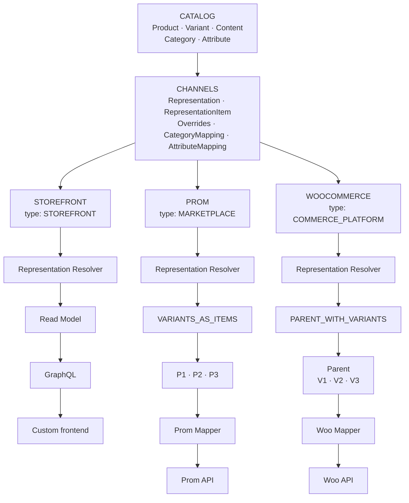

# План модуля Catalog и представлений товаров в Channels

Дата обновления: 2026-10-04. Статус: рабочий документ для дополнения.

Документ структурирует целевую модель каталога и способ её использования каналами.
Описание относится к планируемой архитектуре. Предложения по деталям реализации
и вопросы, требующие решения, выделены отдельно.

Связанный документ: [план интеграций и каналов](channels-integrations.md).
Он задаёт подключение источников и первичный импорт; этот план уточняет товарную
модель, представления и целевой процесс публикации. Описание экспорта здесь
не означает автоматического включения всех его операций в первую версию интеграций.

## 1. Назначение и границы

Catalog хранит канонические данные товарной карточки, варианты, переводы,
контент, категории, атрибуты и их значения. Один внутренний товар может иметь
разную структуру и контент при представлении в разных каналах.

Channels хранит представления этого товара, позиции представления, переопределения
и сопоставления с внешними справочниками. Коннекторы преобразуют подготовленное
представление в формат конкретной платформы и взаимодействуют с её API.

| Слой | Ответственность |
| --- | --- |
| Catalog | Product, Variant, ProductContent, переводы, Category, Attribute и значения |
| Channels | ProductRepresentation, RepresentationItem, Overrides, CategoryMapping, AttributeMapping, AttributeValueMapping, resolver и стратегии публикации |
| Коннектор платформы | Platform Mapper, API Adapter, особенности протокола и внешних ресурсов |
| Storefront | Чтение разрешённого представления через Read Model → GraphQL → custom frontend |

Термин «CRM Product» из исходных примеров означает внутренний `Catalog.Product`.
Он не вводит второй товарный каталог внутри модуля работы с клиентами.

В `Product` и `Variant` не помещаются `external_product_id`, идентификаторы внешних
категорий и ветвления по Prom/WooCommerce. Внешние связи принадлежат Channels.
Catalog не хранит отдельную копию товара для каждого канала.

## 2. Целевая структура



Тип канала описывает его назначение. Конкретная стратегия выбирается по провайдеру
и типу товара: общий `MARKETPLACE` не определяет одинаковую структуру для всех
маркетплейсов. Схема показывает вариативный товар; простой товар имеет одну позицию.

## 3. Каноническая модель Catalog

| Объект | Назначение и основные данные |
| --- | --- |
| Product | Стабильный внутренний ID, тип товара `SIMPLE` / `VARIABLE`, связи с контентом, вариантами, категориями и общими атрибутами |
| Variant | Стабильный внутренний ID, product_id, SKU, значения атрибутов варианта, изображение и габариты при наличии |
| ProductContent | Контент карточки: name, description, composition, usage; дополнительные поля по согласованной схеме |
| Перевод контента | Значения контентных полей для определённой locale |
| Category | Внутренняя категория, её название/переводы и связь с родительской категорией |
| Attribute | Внутренний атрибут: стабильный code, название/переводы, тип значения и назначение |
| AttributeOption | Стабильный ID варианта значения перечислимого атрибута, code и переводы |
| Значение атрибута | Значение общего атрибута товара либо атрибута конкретного варианта |

Для вариативного товара общий текст принадлежит `ProductContent`, а отличия
позиций — `Variant`. Число капсул не требует создания трёх независимых карточек
каталога. Категория Catalog также существует независимо от дерева Prom или Woo.

**Предлагаемые инварианты:** вариант принадлежит одному товару; комбинация значений
вариативных атрибутов не дублируется внутри товара; типы значений проверяются
схемой атрибутов; дерево категорий не допускает циклов. Область уникальности SKU
и модель продаваемой позиции простого товара уточняются отдельно.

Цена и остаток участвуют в эффективном представлении, но их присутствие в payload
не делает Product владельцем складского учёта или расчёта цен. Источники этих
данных и связь SKU с учётной единицей должны быть определены отдельными контрактами.

### Контент и переводы

Для NOW Omega 3 базовый набор полей: `name`, `description`, `composition`, `usage`.
В примере наследования также используются `warning` и `brand`.
Окончательное размещение brand и перечень дополнительных полей требуют уточнения.

Catalog хранит переводы исходного контента. Representation и item могут иметь
переопределения для выбранной locale. Resolver получает locale явно; правило
fallback при отсутствии перевода нужно зафиксировать до реализации.
Нельзя автоматически брать текст из другого языка без согласованной политики.

## 4. Сквозной пример: NOW Omega 3

```text
Product: PRODUCT-123
ProductContent:
    name: NOW Omega 3
    description: общий текст
    composition: состав
    usage: применение

Variant V100: SKU OMEGA-100, capsules = 100
Variant V200: SKU OMEGA-200, capsules = 200
Variant V500: SKU OMEGA-500, capsules = 500

                  PRODUCT-123
                  NOW Omega 3
                       │
            ┌──────────┼──────────┐
            │          │          │
           V100       V200       V500
```

Внутри Catalog это один товар с тремя вариантами. Ни топология внешних публикаций,
ни количество внешних карточек не меняют эту структуру.

## 5. ProductRepresentation и RepresentationItem

`Representation` и `ProductRepresentation` в этом документе — одно понятие.
ProductRepresentation связывает внутренний товар с конкретным каналом и задаёт
стратегию представления. RepresentationItem описывает отдельную позицию этой структуры.

| Объект | Основные поля |
| --- | --- |
| ProductRepresentation | id, product_id, channel_id, strategy/topology |
| RepresentationItem | id, representation_id, internal_product_id, internal_variant_id, role, external_id при наличии |
| Representation Override | representation_id, поле, locale при необходимости, значение переопределения |
| RepresentationItem Override | representation_item_id, поле, locale при необходимости, значение переопределения |

Предлагаемые роли: `SINGLE`, `PARENT`, `VARIANT`. Конкретный набор позиций
определяет стратегия. `internal_variant_id` у Woo parent равен `NULL`;
у вариаций и Prom-позиций явно указывает на соответствующий Variant.
Product ID позиции должен совпадать с товаром её representation.

Внешний ID хранится у позиции или в её external binding; один Product может
соответствовать нескольким внешним ресурсам. Окончательное физическое хранение
этих связей уточняется при проектировании схемы данных.
Для дочернего ресурса binding также должен сохранять внешний parent ID.
Внешняя идентичность учитывает подключение, тип ресурса и scope, а не только число ID.

Для Storefront external ID не требуется: representation используется для чтения.

### WooCommerce representation

```text
REP-001:
    product_id: PRODUCT-123
    channel_id: WOO-UA
    strategy: PARENT_WITH_VARIANTS
```

| Item | Роль | internal_product_id | internal_variant_id | external_id | Внешний parent |
| --- | --- | --- | --- | --- | --- |
| ITEM-1 | PARENT | PRODUCT-123 | NULL | 555 | — |
| ITEM-2 | VARIANT | PRODUCT-123 | V100 | 556 | 555 |
| ITEM-3 | VARIANT | PRODUCT-123 | V200 | 557 | 555 |
| ITEM-4 | VARIANT | PRODUCT-123 | V500 | 558 | 555 |

### Prom representation

```text
REP-002:
    product_id: PRODUCT-123
    channel_id: PROM-MAIN
    strategy: VARIANTS_AS_ITEMS
```

| Позиция | internal_variant_id | Внешний товар |
| --- | --- | --- |
| Prom Item V100 | V100 | 86571 |
| Prom Item V200 | V200 | 86572 |
| Prom Item V500 | V500 | 86573 |

Все внешние номера приведены как иллюстрация модели, а не как реальные ресурсы.

## 6. PublicationTopology и стратегии

```python
class PublicationTopology(Enum):
    SINGLE_ITEM = "single_item"
    PARENT_WITH_VARIANTS = "parent_with_variants"
    VARIANTS_AS_ITEMS = "variants_as_items"
```

| Товар | Prom | WooCommerce |
| --- | --- | --- |
| SIMPLE | SINGLE_ITEM | SINGLE_ITEM |
| VARIABLE | VARIANTS_AS_ITEMS | PARENT_WITH_VARIANTS |

`WooCommercePublicationStrategy` строит parent и вариации.
`PromPublicationStrategy` делает каждый вариант самостоятельной публикуемой позицией
(`FLATTEN_VARIANTS` — описание преобразования, а не дополнительная topology).
Для Rozetka, Amazon, Shopify и следующих интеграций топология задаётся отдельно.

PublicationTopology описывает форму результата. PublicationStrategy также задаёт
роли позиций, допустимые поля и зависимости операций. Новая платформа использует
одну из топологий либо расширяет набор при обоснованной необходимости;
одного значения enum недостаточно для готовой интеграции.

Общий сценарий выбирает стратегию через registry и вызывает её контракт.
Условия вида `if platform == "prom"` не помещаются в Product или общий use case.
Специфика платформы сосредоточена в её стратегии и адаптере.

Предлагаемый результат — `PublicationPlan(parent, items, dependencies)`.
Для Woo parent должен существовать до отправки дочерних вариаций;
для Prom план содержит три товарные позиции без публикуемого parent.

## 7. Контент WooCommerce

Целевая бизнес-стратегия использует общий контент у Woo parent:

```text
Woo Product #555
    name
    description        ← Catalog или override представления/parent
    images
    attributes         ← в том числе доступные значения вариативных атрибутов

    Variation #556: SKU OMEGA-100
    Variation #557: SKU OMEGA-200
    Variation #558: SKU OMEGA-500
```

Variation получает SKU, цену, остаток, изображение, габариты и атрибуты варианта.
Общий текст карточки не копируется в description каждой variation.
Схема commerce-полей и источники цены/остатка уточняются отдельно.

Woo REST API адресует variation как дочерний ресурс:
`/products/{product_id}/variations/{variation_id}`; поле `description` у variation
существует. Отказ от его использования — выбранное правило нашей модели.
[Официальная документация WooCommerce](https://woocommerce.github.io/woocommerce-rest-api-docs/#product-variation-properties).

Пример: если Catalog description равен «Omega-3 жирные кислоты…», а у WOO-UA
задан override «Омега-3 NOW Foods…», Woo parent получает текст override.
Variation не получает этот текст независимо от возможности API.
Контентные overrides для роли Woo VARIANT должны быть недоступны для редактирования
и отклоняться при попытке сохранения через API. Overrides разрешённых полей
изображения и commerce-данных рассматриваются отдельно.

## 8. Контент Prom

Для проекта принимается `VARIANTS_AS_ITEMS`: каждый вариант становится отдельной
полноценной publishable unit с собственным эффективным названием и описанием.

```text
Prom #86571: NOW Omega 3 100 капсул → description V100
Prom #86572: NOW Omega 3 200 капсул → description V200
Prom #86573: NOW Omega 3 500 капсул → description V500
```

Это выбранная стратегия нашего представления. Prom поддерживает разновидности
товаров; их наличие не требует строить Catalog по структуре WooCommerce.
[Справка Prom о разновидностях](https://support.prom.ua/hc/uk/articles/360005208678-%D0%94%D0%BE%D0%B4%D0%B0%D0%B2%D0%B0%D0%BD%D0%BD%D1%8F-%D1%80%D1%96%D0%B7%D0%BD%D0%BE%D0%B2%D0%B8%D0%B4%D1%96%D0%B2-%D0%B4%D0%BE-%D1%82%D0%BE%D0%B2%D0%B0%D1%80%D1%83).

Название и описание каждой позиции могут задаваться item override. Автоматическое
построение названия из общего name и атрибутов варианта требует отдельного правила;
mapper не должен самостоятельно дописывать число капсул.
Группировка позиций и конкретные операции их создания через Prom API проверяются
при проектировании коннектора; приведённая схема не утверждает контракт его API.

## 9. Overrides и каскад наследования

Поддерживаются два уровня переопределений: representation и representation item.

```text
Canonical Product Content
          ↓
Channel Representation Override
          ↓
Representation Item Override
          ↓
Effective value
```

Приоритет поля: item override → representation override → Catalog.
Resolver применяет его по каждому полю и locale, с учётом допустимых полей роли.
Для Woo этот механизм разрешает контент parent, для Prom — каждой товарной позиции.

| Поле | Catalog | Prom representation | Prom V100 item | Эффективное V100 | Источник |
| --- | --- | --- | --- | --- | --- |
| name | Omega 3 | Наследовать | Omega 3 100 капсул | Omega 3 100 капсул | Item |
| description | Base description | Prom SEO description | V100 description | V100 description | Item |
| warning | Warning | Наследовать | Наследовать | Warning | Catalog |
| brand | NOW Foods | Наследовать | Наследовать | NOW Foods | Catalog |

Без item override description берётся из representation, а при отсутствии
обоих overrides — из Catalog. Переопределение одного канала не меняет другой
канал и не переписывает канонический контент.

**Предлагаемая семантика:** различать «Наследовать», «Задать значение» и «Очистить».
Выбор источника определяется наличием операции override, а не истинностью значения.
Выражение `item_override or representation_override or catalog_value` иллюстрирует
приоритет, но не подходит как реализация: пустая строка, `0` или `false` могут
быть намеренно заданным значением. Очистка обязательного поля должна приводить
к ошибке валидации, а не к скрытому возврату родительского значения.

Предлагается сохранять provenance: какой уровень дал итоговое значение.
Это позволит объяснять пользователю результат preview.

## 10. Representation Resolver и границы mapper

Целевой поток подготовки внешней публикации:

```text
Catalog + Representation/Item Overrides + Mappings + commerce data
                              ↓
                    Representation Resolver
                              ↓
          EffectiveRepresentation / EffectiveRepresentationItem
                              ↓
                     Publication Strategy
                              ↓
                        PublicationPlan
                              ↓
                       Platform Mapper
                              ↓
                          API Adapter
```

Registry выбирает стратегию заранее. Её topology и правила допустимых полей
известны resolver; после разрешения данных стратегия формирует план операций.
Это позволяет сохранить порядок Resolver → Strategy → Mapper без круговой зависимости.

Resolver выбирает значения контента, применяет overrides, определяет эффективные
категории и атрибуты с учётом mappings и проверяет полноту представления.
Предлагается передавать туда цены и остатки как явно полученные DTO.
Он не вызывает внешние API.

`EffectiveRepresentationItem` содержит уже подготовленные `name`, `description`,
category, attributes, images, SKU и разрешённые commerce-поля.
Набор полей зависит от роли; для Woo variation текстовые поля исключаются.

Контракты mappers из исходной модели:

```text
PromProductMapper.map(EffectiveRepresentationItem) → PromProductPayload
WooProductMapper.map_parent(EffectiveRepresentation) → WooProductPayload
WooProductMapper.map_variant(EffectiveRepresentationItem) → WooVariationPayload
```

Mapper преобразует структуру, имена полей и типы в формат платформы.
Он не выбирает description, не применяет fallback и не решает топологию товара.
Если операция создания возвращает внешний ID parent, адаптер подставляет его
в последующие операции по зависимостям плана.

## 11. CategoryMapping

Категории Catalog канонические:

```text
Supplements
    └── Omega 3
```

Сопоставления принадлежат конкретному connection:

| Внутренняя категория | Connection | Внешняя категория |
| --- | --- | --- |
| Omega 3 | PROM-MAIN | Prom 12345 |
| Omega 3 | WOO-UA | Woo 82 |
| Omega 3 | WOO-PL | Woo 119 |

Основные поля: `catalog_category_id`, `connection_id`, `external_category_id`.
Два магазина одной платформы могут использовать разные деревья и внешние ID,
поэтому одного `provider` в ключе сопоставления недостаточно.

Representation связан с channel, mapping — с connection, обслуживающим этот channel.
Нельзя использовать mapping другого подключения только потому, что provider совпадает.
Как обрабатываются несколько категорий товара и выбор основной, нужно уточнить.

## 12. AttributeMapping и AttributeValueMapping

В Catalog атрибут имеет собственную идентичность:

```text
dosage_form
    capsule
    softgel
    tablet
```

В представлении Prom ему может соответствовать «Форма выпуска», а в Woo — `pa_form`.
Это примеры сопоставления, а не обязательные внешние ID или имена для любого магазина.

| Mapping | Основные поля |
| --- | --- |
| AttributeMapping | catalog_attribute_id, connection_id, external_attribute_id |
| AttributeValueMapping | attribute_mapping_id, internal_option_id, external_option_id или external_value |

AttributeValueMapping связан с конкретным AttributeMapping, чтобы значение из
одного подключения или атрибута не попало в другое. Перевод названия option
и сопоставление внешнего option ID — разные операции.

Для Prom в модели учитывается контекст внешней категории: набор основных
характеристик задаётся её схемой, дополнительные пользовательские характеристики
обрабатываются отдельно. Конкретная схема и способ получения справочника проверяются
при реализации адаптера. Пользовательские характеристики отличаются от основных:
по справке Prom, они выводятся в карточке, но не участвуют в фильтрах каталога.
[Правила оформления товаров Prom](https://support.prom.ua/hc/uk/articles/360017589018-%D0%9F%D1%80%D0%B0%D0%B2%D0%B8%D0%BB%D0%B0-%D0%BE%D1%84%D0%BE%D1%80%D0%BC%D0%BB%D0%B5%D0%BD%D0%BD%D1%8F-%D1%82%D0%BE%D0%B2%D0%B0%D1%80%D1%96%D0%B2-%D1%82%D0%B0-%D0%BF%D0%BE%D1%81%D0%BB%D1%83%D0%B3).

**Предложение:** для mappings категорийных характеристик добавить scope внешней
категории. Resolver сначала определяет категорию, затем использует mappings её схемы.
Тип значения, единица измерения и допустимые options проверяются до отправки.
Отсутствующее обязательное сопоставление должно давать ошибку готовности;
mapper не должен произвольно угадывать категорию или характеристику.

## 13. Storefront

Storefront — канал типа `STOREFRONT`, использующий тот же канонический Catalog
и механизм представлений/overrides:

```text
Catalog → Storefront Representation → Resolver → Read Model → GraphQL → Custom frontend
```

Для собственной витрины не требуется внешний Product ID или вызов Prom/Woo API.
Read Model содержит эффективное состояние конкретного канала и locale;
GraphQL предоставляет его custom frontend.
Read Model служит для чтения и не становится отдельным источником товарного контента.
Форма выдачи простых/вариативных товаров, доступность черновиков, обновление проекции
и scope mappings витрины уточняются отдельно.

## 14. Связь с первичным импортом каналов

Ранее зафиксированное требование сохраняется: при добавлении Prom/WooCommerce
нужно загрузить все существующие товарные публикации выбранного источника.
Загрузка сначала фиксирует наблюдаемое внешнее состояние и идентичность ресурсов.

Правила обратного преобразования требуют отдельного решения. Woo parent и его
вариации могут быть кандидатами на один внутренний Product. Несколько Prom-позиций
нельзя автоматически объединять в вариативный товар только по похожему названию
или SKU. Стратегия экспорта не является достаточным правилом обратного импорта.

До утверждения import policy не предполагаются автоматическое переписывание Catalog,
автоматическое создание overrides из всех внешних полей или объединение карточек.
Импортированные публикации должны быть доступны даже до их сопоставления с Catalog.

## 15. Предлагаемые правила согласованности

- Все сущности, mappings и внешние связи изолированы по tenant.
- Связь item с Variant проверяется относительно Product представления.
- Стабильные внутренние ID не меняются из-за смены внешнего ID или topology.
- Повтор внешней операции не создаёт новую публикацию, если её результат уже связан с item.
- Частичный успех Woo parent/variations или нескольких Prom-позиций сохраняется по item.
- Изменение Catalog обновляет наследуемые значения; явные overrides сохраняются.
- Смена topology, удаление варианта и удаление representation требуют плана обработки
  существующих внешних ресурсов; внешние публикации не удаляются неявно.
- Версии контента, overrides и mappings учитываются при построении плана;
  запоздавший ответ старого запуска не подтверждает синхронизацию новой версии.

Это предлагаемые технические инварианты. Порядок обновления и модель ревизий
нужно закрепить при проектировании контрактов и хранения.

## 16. Этапы реализации

| Этап | Результат |
| --- | --- |
| 1. Контракты Catalog | Product, Variant, Content и locale, Category, Attribute/Option; правила простого товара и SKU |
| 2. Канонический каталог | Создание/редактирование товарных данных без зависимости от provider |
| 3. Представления Channels | Representation, item, два уровня overrides, внешние связи и mappings по connection |
| 4. Resolver | Эффективные значения, provenance, locale и валидация доступных полей |
| 5. Стратегии Prom/Woo | SINGLE_ITEM, VARIANTS_AS_ITEMS, PARENT_WITH_VARIANTS и проверяемые PublicationPlan |
| 6. Адаптеры | Mappers и API adapters с проверенными контрактами, сохранением результатов по item |
| 7. Storefront | Read Model, GraphQL и подключение custom frontend после согласования объёма витрины |

В первой версии интеграций рабочими остаются Prom.ua и WooCommerce с товарами.
Этот документ задаёт целевую структуру Catalog/Channels; точный объём экспорта,
редакторов и Storefront первой версии фиксируется отдельно.

## 17. Критерии приёмки целевой модели

1. NOW Omega 3 хранится как один Product с V100/V200/V500 и их SKU.
2. Для Woo создаётся одна representation с parent и тремя variation items;
   для Prom — одна representation с тремя самостоятельными товарными items.
3. Простой товар использует SINGLE_ITEM для обоих провайдеров.
4. Один товар одновременно представлен в Prom и Woo без копирования Catalog.
5. Общий контент Woo относится к parent; variation payload не содержит description.
6. Prom V100/V200/V500 могут иметь разные эффективные name и description.
7. Item override приоритетнее representation override, затем используется Catalog.
8. Намеренно пустое значение отличается от наследования; очистка обязательного поля
   не проходит проверку готовности.
9. Изменение одного override не меняет Catalog или другие каналы.
10. Категория Omega 3 сопоставляется с Woo 82 для WOO-UA и Woo 119 для WOO-PL.
11. Атрибуты и options используют mappings своего connection и категорийного scope.
12. Product не содержит внешних Product ID; связи ресурсов сохраняются на стороне Channels.
13. Mapper получает разрешённые эффективные значения и не вычисляет каскад контента.
14. Registry выбирает стратегию без ветвлений по провайдеру в Product или общем use case.
15. Storefront читает эффективное представление через Read Model и GraphQL.
16. Повтор и частичный сбой публикации сохраняют идентичность items и фактические результаты.

Это критерии целевой архитектуры; критерии приёмки первого импорта описаны
в [плане интеграций](channels-integrations.md#12-критерии-приёмки-первой-версии).

## 18. Вопросы для следующего дополнения

- Как моделируется SIMPLE: отдельная продаваемая позиция или единственный Variant?
- Кто владеет SKU и какова область его уникальности?
- Какие поля контента обязательны, какие типизированы и как размещаются brand/warning?
- Какие locale нужны и как работает fallback для Catalog и двух уровней overrides?
- Какие поля, кроме текстовых, можно переопределять на уровне representation/item?
- Как строится название Prom-позиции при отсутствии item override?
- Какие источники обеспечивают цену и остаток, и входит ли их отправка в первую версию?
- Как выбирается основная категория и обрабатываются несколько категорий?
- Как хранятся mappings категорийных атрибутов, свободные значения и единицы измерения?
- Как преобразуем первично импортированные публикации в Catalog и представления?
- Что происходит при архивировании варианта, удалении representation или смене topology?
- Нужны ли несколько representations одного товара внутри одного канала?
- Какие операции и редакторы входят в первую версию Catalog и Channels?
- Когда реализуем Storefront, каков его read schema и нужен ли ему отдельный connection scope?

Подтверждённые решения переносятся из вопросов в соответствующие разделы.
Изменения первой версии отражаются также в связанном плане интеграций.

## 19. История уточнений

| Дата | Изменение |
| --- | --- |
| 2026-10-04 | Структурирована целевая архитектура Catalog → Channels: канонический товар, варианты и переводы, representations/items, два уровня overrides, стратегии Prom/Woo, mappings по connection и Storefront через GraphQL |
