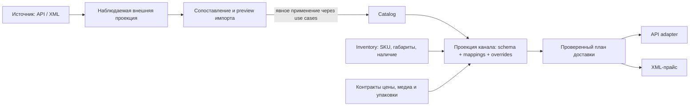

# План разработки Catalog с нуля и подключения каналов продаж

Дата обновления: 2026-10-08. Статус: целевой план; границы, помеченные как
предложения или открытые решения, требуют согласования перед реализацией.

Catalog строится как самостоятельная товарная модель. У WooCommerce заимствуется
подход к простым и вариативным товарам, вариациям и дополнительным свойствам.
Внутренние классы, хранение и контракты следуют DDD + Clean Architecture этого проекта.
На эту модель затем накладываются проекции и синхронизация разных источников.

Связанные документы:

- [Исследование 21 платформы Channels: JSON, товарные схемы и справочники](channel-platforms/README.md).
- [Архитектурные правила](../architecture/AGENTS.md).
- [Модуль Inventory](../modules/inventory.md).
- [Модуль Channels](../modules/channels.md).
- [План интеграций и каналов](channels-integrations.md).

Catalog создаётся с нуля в `src/modules/catalog/` по этому плану. Сначала
согласуются объекты, инварианты и публичные контракты, затем уточняются границы
Inventory, Channels, проекций и синхронизации. Загрузка, управление и сопоставление
внешних атрибутов входят в этап Channels. Очерёдность разработки задана ниже.

Детализация реализации: [SQL](#18-детализация-sql-модели-и-производительности-хранилища),
[Domain](#19-детализация-domain-слоя),
[Application и UseCase](#20-детализация-application-и-всех-usecase),
[HTTP](#21-детализация-http-методов-и-сборки-зависимостей).

## 1. Подтверждённые требования

1. Два базовых вида: `simple`, `variable`.
2. `virtual` и `downloadable` («Загрузка файла») — дополнительные свойства,
   которые не расширяют перечисление видов товара.
3. `ProductType` — отдельный пользовательский тип **контента**. Он определяет
   набор блоков; системный Default / «Чистый» покрывает обычную карточку,
   пользовательские типы покрывают специальные задачи.
4. Контент локализуется: схема блока применяется к значениям для явных локалей.
   ProductType не является продаваемой вариацией размера, цвета и т. п.
5. SKU и складской учёт принадлежат Inventory. Виртуальная продаваемая позиция
   не требует доставки и не имеет связи с Inventory.SKU. Для физической позиции
   доступна связь с SKU; наличие карточки само по себе не создаёт SKU.
6. Габариты физического товара задаются через SKU.
7. Нужны варианты упаковки по количеству или другой единице измерения.
   Владелец этого контекста пока не определён.
8. После определения границы Catalog проектируются Channels, внешние проекции,
   сопоставления и синхронизация. Для канала выбирается способ доставки карточек:
   API либо XML-прайс, согласно возможностям источника.

## 2. Термины и виды товара

| Понятие | Значение |
| --- | --- |
| `ProductKind` | Фиксированная бизнес-структура: SIMPLE, VARIABLE |
| `ProductType` | Настраиваемая схема контента: Default, одежда, оборудование и другие пользовательские типы |
| `Variant` | Продаваемая позиция внутри SIMPLE или VARIABLE, например красная футболка размера M |
| `AttributeDefinition` | Определение характеристики; может участвовать в выборе вариации |
| `ExternalPublication` | Наблюдаемая карточка внешнего источника, ещё не обязательно связанная с Catalog |
| `PublicationSchema` | Будущий контракт структуры публикации конкретного источника и роли ресурса |

Создание нового ProductType не расширяет ProductKind. Смена ProductType
не меняет автоматически вид товара, вариации, физическую природу или SKU.
`variation` из внешнего payload — дочерняя позиция, а не отдельный вид Product.

| Вид | Смысл | Предлагаемая внутренняя структура | SKU и доставка |
| --- | --- | --- | --- |
| SIMPLE | Одна продаваемая позиция без выбора комбинации | Product и ровно один Variant | Через Variant, если он физический |
| VARIABLE | Выбор между вариациями по характеристикам | Product, оси выбора и минимум два Variant | Независимо для каждого физического Variant |

Виды товара и независимые признаки опираются на
[настройки товаров WooCommerce](https://woocommerce.com/document/managing-products/product-editor-settings/).
Вложенность классов и правила SKU в этом плане — решения нашей модели.

Для SIMPLE задаётся ровно один Variant, для VARIABLE — минимум два,
включая черновики. Изменение VARIABLE до одной позиции выполняется явным переходом
в SIMPLE в одной операции. Для незавершённой импортированной карточки существует
внешняя проекция: ради неё не создаётся некорректный канонический Product.

## 3. Объектная модель: из каких классов собирается Product

Предлагается композиция одного агрегата Product с типизированной структурой.
Имена ниже описывают целевые доменные роли; это не готовый программный код.

```text
Product                                      Aggregate Root
├── id: ProductIdVO
├── kind: ProductKind
├── product_type_id: ProductTypeIdVO          ссылка на другой Aggregate Root
├── revision, audit
├── content: ProductContent                  локализованные значения PRODUCT
│   └── translations[LocaleVO]
│       └── values[ContentBlockIdVO]: ContentValueVO
├── classifications: ProductClassifications
│   ├── category_ids + primary_category_id
│   └── tag_ids
├── attributes: ProductAttributeValues       общие характеристики
├── media: ProductMediaReference[]           ссылки на активы, порядок, подписи
├── relations: RelatedProductLink[]          ID для upsell/cross-sell, если включены
└── structure: ровно один из двух объектов
    ├── SimpleProductStructure
    │   └── variant: Variant
    └── VariableProductStructure
        ├── axes: VariationAxis[]
        ├── default_selection: VariationSelectionVO | None
        └── variants: Variant[]

Variant                                      Entity внутри Product
├── id: VariantIdVO
├── selected_attributes: VariationSelectionVO
├── virtual: bool
├── downloadable: bool
├── sku_id: SkuIdVO | None                    ссылка на Inventory
├── content: VariantContent
│   └── translations[LocaleVO]
│       └── values[ContentBlockIdVO]: ContentValueVO
├── media: VariantMediaReference[]
└── download: DownloadSpecification | None
    ├── files: DownloadAssetReference[]       стабильный asset ID, имя, порядок
    └── policy: DownloadPolicyVO             лимит и срок, если включены
```

`kind` и выбранная `structure` всегда согласованы. Их нельзя независимо менять
обычным обновлением полей. Product выполняет создание, восстановление и переходы
вида через доменные методы, проверяющие всю структуру и сохранённый контент.
Объекты структуры — внутренние компоненты Product, не самостоятельные
агрегаты. Variant, его контент и связи не получают отдельных write repositories.

`ProductMediaReference`, `RelatedProductLink` и политика скачивания — предложения
к следующей детализации; они не означают наличие готового Media, Pricing или
Digital Delivery модуля. Загружать бинарные файлы внутрь агрегата нельзя.

### Самостоятельные корни и ссылки

| Aggregate Root | Владеет | Что хранит Product |
| --- | --- | --- |
| Product | Структура выбранного вида, Variant, значения контента, назначенные связи | Собственное состояние |
| ProductType | Версия схемы и упорядоченные связи с блоками | `product_type_id` |
| ContentBlockDefinition | Код, тип значения, системность, переводы подписи | Значения по ID блока, проверенные по снимку схемы |
| Category | Переводы и место в дереве категорий | Явно назначенные ID и основной ID |
| AttributeDefinition — предлагаемый корень | Тип значения, единица при необходимости, локализованные подписи и AttributeOption | Значения и ссылки на определения/options |
| Tag — предлагаемый корень | Стабильная идентичность и локализованные подписи метки | Назначенные ID |

AttributeOption принадлежит AttributeDefinition. Категории, метки и определения
не вкладываются в Product целиком. Brand и произвольные внутренние таксономии
требуют решения о самостоятельном корне или ограниченной модели Taxonomy;
универсальный конструктор любых сущностей в этот срез не закладывается.

Product получает неизменяемый снимок ProductType и необходимых определений через
Application-контракты. Инварианты контента проверяет доменная политика Product.
Общая служба, объединяющая жизненные циклы Product и ProductType, не нужна.

## 4. ProductType, блоки и локали

Схема контента образуется из определений и связей:

```text
ContentBlockDefinition                       Aggregate Root
  id, code, value_type, is_system, translations

ProductType                                  Aggregate Root
  id, code, is_system, schema_version, translations
  blocks: ProductTypeContentBlock[]
    block_id, scope: PRODUCT | VARIANT, required, position

Значение = (владелец Product/Variant, locale, block_id) → value
```

У определения блока нет scope. Одно определение можно включить в PRODUCT и
VARIANT с разными обязательностью и порядком. ProductType применим к обоим
ProductKind. Смена вида не должна молча уничтожать VARIANT-контент.

Системный тип отображается как **Default / «Чистый»**; предлагаемый стабильный
код — `default`. При отсутствии выбора назначается этот тип. Его базовая схема:

| Блок | Тип | PRODUCT | VARIANT |
| --- | --- | --- | --- |
| `title` | `text` | Обязателен при записи перевода | Необязателен |
| `description` | `rich_text` | Необязателен | Необязателен |
| `short_description` | `rich_text` | Необязателен | Необязателен |

Пользователь создаёт свои определения и ProductType, например `clothing` или
`equipment`, с нужными инструкциями, составом и описаниями. ProductType задаёт
контент; схема вариативных атрибутов проектируется отдельно. Пользовательский тип
может не иметь `title`: обязательность внешнего названия проверяет соответствующая
схема публикации и её mapping, а не универсальное правило всех ProductType.

Обязательные правила:

- Переводы создаются по явному BCP 47 коду из `reference_data`. При записи код
  должен быть активен; ранее сохранённый перевод читается и после его деактивации.
- Catalog не хранит разрешённые языки tenant или язык по умолчанию. Чтение требует
  locale; отсутствие перевода возвращает `null`, без автоматического fallback.
- PRODUCT и VARIANT локализуются независимо. Один перевод не копируется во все
  локали, и отсутствие значения Variant не означает наследование Product.
- Товар и вариация могут существовать без переводов. Обязательные поля проверяются
  при записи конкретного перевода и отдельно при подготовке публикации.
- `rich_text` очищается адаптером за Application-портом; домен проверяет результат,
  допустимые блоки, типы значений и обязательность.
- Код определения стабилен. Используемый блок нельзя удалить или несовместимо
  изменить. Системный тип и определения защищены от удаления; изменение их схемы
  выполняется версионированной миграцией, пользователь создаёт отдельный тип.
- Изменение ProductType требует `expected_schema_version`; изменение структуры
  увеличивает версию. Смена типа проверяет контент Product и всех его Variant.
  Конкурентные запись контента и изменение схемы не оставляют несовместимые данные.

## 5. Virtual и Downloadable

Признаки задаются на уровне продаваемой позиции: единственного Variant SIMPLE
или каждого Variant VARIABLE. В интерфейсе SIMPLE они выглядят как свойства
товара. Для VARIABLE допускается смешанный набор физических и виртуальных
вариаций; это предложение нашей модели, подлежащее проверке целевыми каналами.

| virtual | downloadable | Поведение | Inventory.SKU |
| --- | --- | --- | --- |
| false | false | Физическая позиция | Связь доступна |
| false | true | Физическая позиция плюс файл | Связь доступна; файл не отменяет доставку |
| true | false | Услуга или другая виртуальная позиция | Связь запрещена |
| true | true | Цифровая позиция с файлом | Связь запрещена |

`downloadable` не включает `virtual` автоматически. «Загрузка файла» означает
прикрепление выдаваемого покупателю цифрового материала, а не изображение карточки
и не XML-прайс канала. Свойства вариаций как отдельных продаваемых позиций
согласуются с [моделью вариаций WooCommerce](https://woocommerce.com/document/variable-product/).

Product защищает инвариант `virtual = true ⇒ sku_id = None`. Переход связанной
физической позиции в виртуальную требует явного снятия связи в том же сценарии;
сам Inventory.SKU и его остатки не удаляются. Обратный переход разрешает выбрать
SKU, но не создаёт её автоматически. Отсутствие SKU у физического черновика
не означает, что он виртуальный или что его остаток равен нулю.

Предлагается хранить в Catalog состав цифрового предложения: ссылки на файлы,
имена и шаблон ограничений. Право конкретного покупателя на скачивание, проверка
оплаты, срок доступа и счётчики скачиваний принадлежат будущему контексту исполнения
заказа / цифровой доставки. Файловое хранилище владеет бинарными данными и доступом.

В канонической политике отсутствие лимита и срока задаётся явно, например `None`;
значения источника вроде `-1` преобразует адаптер. При `downloadable=true` готовое
предложение должно иметь хотя бы один разрешённый файл. Возможность сохранить
незавершённый черновик и версия файла, закрепляемая за покупкой, согласуются до
реализации выдачи. Отключение свойства не отзывает уже выданные права автоматически.

## 6. Атрибуты, категории, метки и другие данные карточки

Контентные блоки, характеристики и классификация имеют разное назначение:

| Данные | Предлагаемая модель и поведение |
| --- | --- |
| Общая характеристика | ProductAttributeValues: ссылка на определение и типизированное значение |
| Ось вариации | VariationAxis: attribute ID, допустимые option ID, порядок |
| Выбор вариации | VariationSelectionVO: конкретное значение каждой объявленной оси |
| Подпись атрибута/option | Переводы определения; идентичность не зависит от текста перевода |
| Категория | Отдельный Category с деревом; Product хранит назначенные ID |
| Метка | Отдельный Tag; Product хранит ссылки |
| Бренд и другие таксономии | Требование к последующей детализации, не произвольные поля Product |
| Фото и галерея | Ссылки на активы, порядок, главное изображение, локализованные подписи |
| Upsell/cross-sell | Типизированные ссылки на Product ID |

Начальные типы характеристик предлагаются как `text`, `number`, `boolean`,
`enum`, `multi_enum`. Число с единицей хранит значение и код единицы раздельно.
Первый срез осей вариации использует enum с устойчивыми ID значений: сочетание
должно быть полным, допустимым и уникальным внутри Product. Wildcard «любое
значение», автоматическое декартово произведение и числовые оси не включаются
без отдельного правила. Генерация комбинаций показывает количество заранее.

Свойства «показывать характеристику» и «использовать для вариаций» независимы.
Скрытая характеристика не является секретом или механизмом авторизации.
Общий attribute и локальная характеристика источника не объединяются по одному
названию. Первый вариант канонического редактора использует определения Catalog;
импорт локальных атрибутов требует явного выбора существующего определения или
создания нового. Оригинал остаётся во внешней проекции.

У Product могут быть несколько явно назначенных категорий. При непустом наборе
ровно одна основная; предки не добавляются автоматически. Дерево не допускает
циклов. Удаление используемых справочников требует проверки
ссылок, а не каскадного удаления чужих агрегатов.

Цена, скидка, валюта, налоговый режим, доступность, условия покупки и публикационный
статус не копируются из Woo в Product без определения владельца. Предлагается:

- Prices/Pricing владеет ценой и скидками; название и граница этого контекста пока
  открыты. Существующий модуль `price_lists` не объявляется владельцем автоматически.
- Inventory владеет складским наличием; политика предзаказа и доступности канала
  уточняется на границе Inventory и продаж.
- Catalog может хранить собственный жизненный цикл карточки; `publish`, `private`,
  видимость и продвижение конкретного магазина разрешаются в Channels.
- Налоги, отзывы, рейтинги и `total_sales` требуют своих контекстов/проекций;
  их наличие во внешнем payload не расширяет автоматически агрегат Product.
- `meta_data`, HTML цены и поля темы/плагина сохраняются в native snapshot;
  в каноническую модель попадают только через явно определённое назначение.

## 7. Inventory, габариты и упаковка

Inventory владеет самостоятельным SKU, кодом и будущим складским учётом.
Catalog хранит только `sku_id` физической позиции. Ссылка проверяется в рамках
tenant через Application-порт; прямые импорты SQL-моделей Inventory запрещены.
Код внешнего источника и внутренний UUID SKU — разные идентичности.

Габариты единицы товара, масса и единицы измерения должны предоставляться
контрактом Inventory по SKU. Длина/ширина/высота и масса не становятся независимыми
полями Product или Variant. Для физической позиции без SKU эти данные неизвестны;
канал может потребовать связь и заполненные размеры перед доставкой публикации.
Нельзя подставлять нули как измеренные значения.

Одна SKU может использоваться несколькими карточками; это не создаёт новых остатков.
Предлагается запретить повторное использование одной SKU среди физических
Variant одного Product; отсутствие SKU у нескольких виртуальных вариантов не
нарушает уникальность. Остатки и резервы не вычисляются суммированием публикаций.
Необходимые складские контракты уточняются в плане Inventory до их использования.

### Требование к вариантам упаковки

Нужно описывать доступные упаковки и правило выбора для количества заказа:

| Пример | Что требуется хранить |
| --- | --- |
| 1 шт. | Коробка A, размеры и масса тары |
| 4 шт. | Коробка B, вместимость и размеры |
| 10 шт. и больше | Палета, допустимая вместимость, число грузовых мест |
| Вес, длина, объём или другие единицы | Исходная единица, шаг, коэффициенты и правила упаковки |

Числа — примеры пользователя, а не полная таблица диапазонов. Для 2–3, 5–9,
11 и количества выше вместимости палеты нужно определить разбиение, частичную
упаковку, округление и выбор между допустимыми вариантами. «10 и больше» не
означает бесконечную вместимость одной палеты.

Предлагаемые объекты для обсуждения владельца:

```text
PackagingProfile                             кандидат в самостоятельный агрегат
  applicable_sku_ids / область применимости
  version
  options: PackagingOption[]
    unit_code, capacity, dimensions, tare_weight
  rules: PackagingRule[]
    quantity/range, unit_code, option_id, priority, partial_allowed

PackingPlan                                  результат расчёта, не состояние Product
  requested_quantity, unit_code, profile_version
  packages: (option_id, quantity_inside, gross_weight, dimensions)[]
```

Габариты самой единицы принадлежат SKU. Габариты коробки/палеты и правило укладки —
другие данные. Коробка для перевозки четырёх штук также отличается от продаваемой
упаковки «4 шт.»: последняя может быть отдельной учётной единицей с коэффициентом
списания, который определяет Inventory.

**Открытое решение:** статические упаковки SKU можно разместить в Inventory;
правила комплектации заказа, смешанных SKU и перевозчика — в будущем Fulfillment /
Shipping. Возможен отдельный Packaging-контекст при самостоятельном жизненном цикле.
До выбора владельца Product не получает вложенные коробки, палеты, тарифы или
алгоритм укладки. Общий справочник единиц также требует назначения владельца;
Tenancy не должен владеть этими бизнес-правилами.

## 8. Проверочные примеры из приложенного Woo payload

Источник примеров — переданный пользователем файл `Pasted text.txt` от 2026-10-07.
Ниже выбраны семь записей `raw_payload`, включая две дочерние variation.
ID ниже — внешние ID этого набора. Они не становятся UUID канонических Product/Variant/SKU.
Сам payload не является полной спецификацией WooCommerce.

| Внешняя запись | Целевая интерпретация после явного импорта в Catalog |
| --- | --- |
| 271, термобутылка, simple | SIMPLE, один физический Variant; SKU выбирается/создаётся отдельным сценарием Inventory |
| 272, консультация, simple + virtual | SIMPLE, один виртуальный Variant; внешний `CRM-VIR-001` не создаёт складскую SKU |
| 273, TXT-чеклист, simple + virtual + downloadable | SIMPLE, цифровой Variant, ссылки на файл и политика 3 скачивания / 30 дней как исходные настройки |
| 280, печатный чеклист + TXT, simple + downloadable | SIMPLE, физический Variant с файлом; доставка сохраняется |
| 275, футболка, variable | Один VARIABLE Product с осями цвета/размера |
| 276 и 277, variation с parent_id 275 | Два Variant L/M внутри этого Product, отдельные физические SKU при сопоставлении |

В наборе у виртуальных 272/273 остались weight/dimensions и внешние SKU-коды.
Они сохраняются как наблюдённые данные источника, но не нарушают канонический
запрет складской связи виртуальной позиции.

У 271 `stock_quantity=24`, а plugin metadata содержит другое число (`40`).
Адаптер не выбирает его произвольно и импорт карточки не записывает ни одно из
значений как внутренний складской остаток. Нужны отдельные правила владельца
данных и источник складских событий.

`attributes` включает глобальные ID, локальные записи с `id=0`, скрытые поля и
оси вариаций. `categories`, `tags`, `brands` — разные внешние справочники.
`woodmart_price_unit_of_measure` — поле плагина, а не универсальная единица Catalog.
Перевод описания из этого ответа нельзя угадать по тексту: locale задаётся явно
в настройке импорта. Проверочные fixtures перед реализацией переносятся в репозиторий
в минимальном обезличенном виде, без зависимости от пути вложения или живого сайта.

## 9. Сценарии Catalog и контракты реализации

Ниже — стартовый перечень сценариев новой модели, не утверждение о готовых классах.
У всех входов есть доверенный tenant/actor context; у изменений существующих
агрегатов — ожидаемая ревизия, у контента — также версия схемы. Эти общие поля
опущены в таблице. Каждый handler имеет явный `execute(...)` и отдельный контракт.

| Корень / сценарий | Вход | Возвращаемый тип `execute` | Порты помимо write repository |
| --- | --- | --- | --- |
| product/create_simple_product | CreateSimpleProductCommand: type ID, одна позиция | CreateSimpleProductResultDTO | Схема типа, SKU при наличии |
| product/create_variable_product | CreateVariableProductCommand: type ID, оси, позиции | CreateVariableProductResultDTO | Схема типа, атрибуты, SKU |
| product/change_product_kind | ChangeProductKindCommand: целевой kind и полная структура | ChangeProductKindResultDTO | Контракты зависимостей новой структуры |
| product/change_product_type | ChangeProductTypeCommand: новый type ID | ChangeProductTypeResultDTO | Снимок схемы, версии |
| product/replace_variants | ReplaceVariantsCommand: оси, default selection, позиции с ID | ReplaceVariantsResultDTO | Атрибуты, SKU |
| product/set_variant_properties | SetVariantPropertiesCommand: variant ID, virtual/downloadable, явная операция SKU | SetVariantPropertiesResultDTO | SKU, файлы при наличии |
| product/set_variant_sku | SetVariantSkuCommand: variant ID, sku ID или снятие связи | SetVariantSkuResultDTO | Проверка SKU |
| product/set_download_specification | SetDownloadSpecificationCommand: variant ID, файлы, политика | SetDownloadSpecificationResultDTO | Файловый контракт |
| product/put_product_content | PutProductContentCommand: locale, blocks, schema version | PutProductContentResultDTO | Схема, локали, очистка rich text |
| product/put_variant_content | PutVariantContentCommand: variant ID, locale, blocks, schema version | PutVariantContentResultDTO | Схема, локали, очистка rich text |
| product/delete_product_content | DeleteProductContentCommand: locale | None | — |
| product/delete_variant_content | DeleteVariantContentCommand: variant ID, locale | None | — |
| product/set_product_attributes | SetProductAttributesCommand: типизированные значения | SetProductAttributesResultDTO | Определения атрибутов |
| product/set_product_categories | SetProductCategoriesCommand: category IDs, primary ID | SetProductCategoriesResultDTO | Чтение категорий |
| product/set_product_tags | SetProductTagsCommand: tag IDs | SetProductTagsResultDTO | Чтение меток |
| product/delete_product | DeleteProductCommand: product ID | None | Проверка использования, включая будущие связи Channels |
| product/get_product | GetProductQuery: ID, locale | GetProductDetailsDTO | Query repository |
| product/list_products | ListProductsQuery: фильтры, locale, pagination | ListProductsPageDTO | Query repository |
| product/get_variant | GetVariantQuery: product ID, variant ID, locale | GetVariantDetailsDTO | Query repository |
| product/get_product_publication_snapshot | GetProductPublicationSnapshotQuery: ID, locale | GetProductPublicationSnapshotDTO | Query repository; будущий публичный контракт Channels |
| product_type/create_product_type | CreateProductTypeCommand: code, подписи, связи блоков | CreateProductTypeResultDTO | Блоки, локали |
| product_type/put_product_type_translation | PutProductTypeTranslationCommand: ID, locale, подпись | PutProductTypeTranslationResultDTO | Локали |
| product_type/replace_product_type_schema | ReplaceProductTypeSchemaCommand: связи, schema version | ReplaceProductTypeSchemaResultDTO | Проверка использования/контента |
| product_type/delete_product_type | DeleteProductTypeCommand: ID | None | Проверка использования |
| product_type/get_product_type | GetProductTypeQuery: ID, locale | GetProductTypeDetailsDTO | Query repository |
| product_type/list_product_types | ListProductTypesQuery: locale, pagination | ListProductTypesPageDTO | Query repository |
| content_block/create_content_block | CreateContentBlockCommand: code, value type, подписи | CreateContentBlockResultDTO | Локали |
| content_block/update_content_block | UpdateContentBlockCommand: ID, допустимые изменения | UpdateContentBlockResultDTO | Локали, проверка использования |
| content_block/delete_content_block | DeleteContentBlockCommand: ID | None | Проверка использования |
| content_block/get_content_block | GetContentBlockQuery: ID, locale | GetContentBlockDetailsDTO | Query repository |
| content_block/list_content_blocks | ListContentBlocksQuery: locale, pagination | ListContentBlocksPageDTO | Query repository |
| category/create_category | CreateCategoryCommand: parent ID, перевод | CreateCategoryResultDTO | Родитель, локали |
| category/move_category | MoveCategoryCommand: ID, parent ID | MoveCategoryResultDTO | Проверка дерева |
| category/put_category_content | PutCategoryContentCommand: ID, locale, название | PutCategoryContentResultDTO | Локали |
| category/delete_category | DeleteCategoryCommand: ID | None | Проверка дочерних категорий и использования |
| category/get_category | GetCategoryQuery: ID, locale | GetCategoryDetailsDTO | Query repository |
| category/list_categories | ListCategoriesQuery: parent/filter, locale | ListCategoriesResultDTO | Query repository |

Полная детализация этой матрицы, включая предлагаемые AttributeDefinition, Tag,
options, медиа и связанные рекомендации, приведена в разделе 20.
Операции над медиа здесь управляют ссылками на активы; подключение файлового
контракта остаётся условием реализации. Универсальные `UpdateProduct(dict)`
и `CatalogDTO` не используются.

DTO каждой команды содержит нужный этому сценарию результат, например ID и новую
ревизию; общий набор полей не объединяет разные контракты. Для `-> None` нет
пустого DTO. GetProductPublicationSnapshotDTO — read-контракт для потребителя,
не Domain Entity, не ORM и не payload Woo; в нём нет секретных URL скачивания.

## 10. Слои, обязательные файлы и применимые архитектурные требования

До реализации каждого сценария составляется конкретный перечень файлов и HTTP
контрактов по этой схеме. Пустые каталоги «на будущее» не создаются.

```text
src/modules/catalog/
├── domain/<root>/
│   ├── aggregate.py
│   ├── entity/                         только внутренние сущности этого корня
│   ├── value_object/
│   ├── policy/                         при наличии чистых правил
│   ├── error.py
│   └── repository.py
├── application/<root>/
│   ├── command/<scenario>/command.py, handler.py, dto.py*
│   ├── query/<scenario>/query.py, handler.py, dto.py
│   └── port/<specific_contract>.py
├── infrastructure/
│   ├── <root>/persistence/mapper.py, repository.py
│   ├── <root>/persistence/query_mapper.py, query_repository.py
│   ├── <root>/<adapter>.py
│   └── persistence/models/<one_model>.py
└── presentation/<root>/
    ├── router.py
    ├── depends.py
    └── http/
        ├── controller/<http_scenario>.py
        ├── request/<http_scenario>.py**
        └── response/<http_scenario>.py***

* только если сценарий возвращает результат
** только если есть тело запроса
*** только если есть тело ответа; для 204 файл не нужен
```

Перечень применимых требований из архитектурного документа:

1. Организация `модуль → слой → Aggregate Root → назначение`; Product владеет
   Variant, самостоятельные агрегаты связаны ID.
2. Domain не импортирует внешние слои и не делает I/O. Application зависит от
   Domain и портов; Infrastructure реализует порты. Межмодульный доступ идёт
   через Application-контракты, без чужих SQL-моделей и внутренних агрегатов.
3. Aggregate/Entity имеют явные `create/restore`; изменения идут через доменные
   методы. `__post_init__` допустим только в VO. Mapper не исправляет инварианты.
4. Методы, включая `__init__ -> None` и `Handler.execute`, полностью аннотированы.
   Классы и методы имеют содержательные русские docstrings.
5. Command/Query, handler и результат принадлежат одному use case. Обработчики
   не вызывают друг друга; общая координация при необходимости выносится в
   небольшой Application service с ясной ответственностью.
6. Write repository загружает/сохраняет агрегат; Query repository возвращает
   отдельные проекции. Для списков агрегаты не восстанавливаются.
7. Depends открывает общий tenant UoW и собирает все репозитории на одной сессии.
   SQLAlchemy session не передаётся в Application. Репозитории не делают
   commit/rollback, не выбирают tenant-схему; ошибка commit не даёт успешный ответ.
8. Интеграционные сообщения записываются в Outbox вместе с изменением, до commit;
   доставка и повторы выполняются после commit.
9. Каждый HTTP-метод имеет собственные controller/request/response по необходимости.
   Router регистрирует маршруты, Depends собирает зависимости, controller переводит
   DTO и ошибки. Контекст пользователя приходит из Identity, изменения защищены CSRF.
10. SQL-модели определяются по одной в файле и регистрируются прямыми импортами;
    пакетные `__init__.py` пустые, реэкспортов нет.
11. Tenant isolation и передача контекста сохраняются на HTTP, jobs и CLI границах.
    Логи не содержат payload, токенов и персональных данных; Domain не логирует,
    факт commit логируется только после его успеха.

Перед принятием каждого среза проверяется весь diff по этому списку и наличие
файлов каждого реализованного use case. Функциональные тесты дополняются
архитектурными проверками; успех тестов не заменяет проверку правил.

## 11. Будущая граница Channels, проекций и синхронизации

Это требования к следующему этапу, после согласования Catalog. Окончательный
набор Aggregate Roots Channels и распределение с отдельным Sync-контекстом
определяются при пересмотре [плана интеграций](channels-integrations.md).

| Ответственность | Целевой владелец |
| --- | --- |
| Канонический товар, виды, контент, атрибуты и внутренние категории/метки | Catalog |
| SKU, размеры единицы, складские данные | Inventory |
| Схемы источника, внешние карточки, taxonomies, bindings и mappings | Channels — предложение к детализации |
| Разрешённое представление товара для канала и его overrides | Channels — предложение к детализации |
| Запуски синхронизации, конфликты, план доставки и статусы операций | Channels либо отдельный Sync; решение после Catalog |
| Протоколы платформ, API и сериализация XML | Infrastructure adapters за портами выбранного владельца |
| Очереди, jobs, Outbox и повторная доставка | Общая инфраструктура; бизнес-состояние остаётся у модуля-владельца |
| Локаль, формат и обязательные поля публикации | Настройки/схема конкретного канала |



### Три разных состояния публикации

1. **Observed:** что последний раз прочитано из источника. Сохраняются native
   payload, типизированная read-проекция, идентичность, версия схемы и время чтения.
2. **Desired:** что должно получиться из Catalog, схемы, mappings, overrides и
   данных других контекстов. Эта проекция вычисляется и может версионироваться.
3. **Delivery state:** какая версия подготовлена, отправлена, принята или проверена
   на стороне источника; ошибки и частичный успех по отдельным операциям.

Внешняя проекция может существовать без Catalog.Product. Повторный импорт не
переписывает канонический контент и локальные overrides автоматически. Режимы
«только наблюдать», «импортировать в Catalog», «выгружать» и «двусторонняя
синхронизация» требуют явной политики владельца каждого поля и разрешения конфликтов.
Источники, не поддерживающие чтение после записи, не получают вымышленный статус
подтверждённой синхронизации.

Внешний ключ включает tenant, канал/подключение, его область ревизии, тип ресурса
и external ID; для дочернего ресурса — parent ID. Снимки и bindings должны
учитывать `channel_id + connection_revision`, смену подключения и явное
переподключение связей. Совпадение SKU/названия
показывает кандидата на сопоставление, но не доказывает идентичность товаров.

### Схемы и связи публикаций

Предлагаются `PublicationSchema`, `ProductRepresentation`, `RepresentationItem`
и отдельный binding внешнего ресурса. Схема описывает роли, поля, типы, локали,
обязательность, доступные таксономии и операции; она версионируется. Пользовательская
схема проекции может использовать только возможности адаптера: добавить локальное
поле не значит расширить API внешней платформы.

| Kind | Возможная форма проекции |
| --- | --- |
| SIMPLE | Один item, связанный с единственным Variant |
| VARIABLE | Parent + children либо отдельные items по Variant |

Топология, например `SINGLE_ITEM`, `PARENT_WITH_VARIANTS`, `VARIANTS_AS_ITEMS`,
не становится ProductKind. Woo simple использует один
внешний product, а не дочернюю variation для нашего единственного Variant.
Другие платформы получают проверенную стратегию по своим возможностям.

Поле description у Woo variation существует в
[REST-контракте WooCommerce](https://woocommerce.github.io/woocommerce-rest-api-docs/).
Какой VARIANT-блок направляется в это поле, решает явный mapping канала.
Нельзя автоматически копировать общий description во все дочерние карточки.

## 12. Мастер настройки канала продаж

Целевой пользовательский сценарий:

1. **Подключение и способ обмена.** Выбрать платформу, подключение и возможности:
   чтение API/XML, доставка API/XML, поддерживаемые виды и справочники. Входной
   источник и выходной способ задаются независимо; XML не предполагает обратную запись.
2. **Загрузка карточек.** Получить внешние публикации и дочерние ресурсы с прогрессом,
   пагинацией и повтором после сбоя. Показать полноту, предупреждения и последнюю загрузку.
3. **Загрузка структуры источника.** Получить доступные атрибуты, terms/options,
   категории, метки, бренды и другие taxonomies. Показать отдельные справочники
   источника; не создавать автоматически их копии в Catalog.
4. **Схемы публикаций.** Выбрать/сформировать схемы для поддерживаемых видов и ролей,
   локалей и особенностей источника. Сохранить их версии вместе с внешней проекцией.
5. **Сопоставление карточек.** Связать внешние записи с Product/Variant
   либо подготовить создание новых Product через сценарии Catalog.
   Предварительный просмотр показывает, что будет создано и какие связи неоднозначны.
6. **Сопоставление полей.** Настроить общие правила и правила для пользовательских
   ProductType. Например, `equipment.instructions` направить в разрешённое поле
   описания; задать источник названия, locale и преобразование значений.
7. **Сопоставление справочников.** Связать категории, атрибуты, значения, метки и
   taxonomies; отдельно определить локальные атрибуты источника и глобальные terms.
8. **Управление внешними справочниками.** Просматривать, обновлять, создавать,
   переименовывать или удалять элементы только для операций, поддержанных коннектором
   и правами подключения. Read-only источник показывает ограничение явно.
9. **Preview и готовность.** Показать конечную карточку, источник каждого поля,
   ошибки обязательных значений, SKU/габаритов, файлов, атрибутов и неподдерживаемых видов.
10. **Включение обмена.** Выбрать направление, владельцев полей, расписание и политику
    конфликтов; подготовить API-доставку либо XML-прайс. Показывать прогресс,
    частичный успех и причины, требующие исправления.

Мастер сохраняет прогресс. Открытие страницы читает локальные проекции; внешние
операции выполняются явными сценариями и заданиями. Пустой источник допустим:
после загрузки пользователь может настроить исходящую публикацию своих товаров.

### Правила сопоставления и overrides

- Mapping адресует источник/поле, направление, locale, scope PRODUCT/VARIANT,
  ProductKind, ProductType при необходимости, роль публикации и версию схемы.
- Специальное правило ProductType перекрывает общее только в явно заданной области.
  Неоднозначные правила дают ошибку настройки. Преобразования используют разрешённый
  набор операций, а не выполнение произвольного кода из payload.
- Внутренний ID атрибута/option и внешний ID сопоставляются отдельно. Область ключа
  включает подключение, taxonomy/attribute и внешнюю категорию, когда она задаёт схему.
  Одинаковый ID в другом магазине не является тем же объектом.
- Item override имеет приоритет над representation override и значением Catalog
  для допустимого поля. PRODUCT/VARIANT и разные локали не смешиваются автоматически.
- «Наследовать», «задать» и «очистить» — разные операции. Пустая строка, `0` и `false`
  не означают отсутствие значения. Очистка обязательного поля даёт ошибку готовности.
- Preview показывает происхождение значения. Сохранение override не изменяет Catalog.
- Импорт полей в Catalog требует отдельного mapping и разрешения конфликтов;
  экспортное правило не считается автоматически обратимым.

## 13. Доставка карточки: API и XML Price

Доставка карточки в канал отличается от физической доставки заказа.
Оба выходных способа получают одну проверенную проекцию из внутренних контрактов,
но имеют собственные схемы и возможности.

```text
Catalog snapshot + Inventory/price/media snapshots
    + PublicationSchema + field/taxonomy mappings + overrides
        → Resolver → EffectivePublication
        → PublicationPlan с версиями и зависимостями
        → API adapter ИЛИ XML feed builder
```

Resolver выбирает значения и проверяет готовность без внешних HTTP-вызовов.
Platform mapper преобразует уже разрешённые поля; он не выбирает произвольно
locale, цену, SKU или структуру товара. Специфика платформы находится в стратегии
и адаптере, а не в Product и не в общем handler с ветвлениями по Woo/Prom.

| API | XML-прайс |
| --- | --- |
| Операции создания/обновления согласно capabilities | Версионированный файл/URL по диалекту принимающего канала |
| External ID, зависимости parent/children и отдельный результат операции | Устойчивые ID позиций, структура категорий, кодировка, escaping и валидация |
| Повторы с идемпотентностью или сверкой результата | Атомарная замена готовой версии, без выдачи наполовину записанного файла |
| Ошибки, ограничения запросов, частичный успех | Время генерации, доступность URL и отдельный статус получения/обработки, если он известен |

XML не является универсальной схемой для всех площадок. Диалект, обязательные
поля, доступ к URL, период обновления и ограничения проверяются для каждого
принимающего канала. Генерация файла не означает, что площадка его прочитала
или применила. Входной XML-импорт и выходной XML-прайс — разные возможности.

Изменение Catalog, mapping или схемы помечает соответствующую проекцию устаревшей.
План фиксирует ревизии входов; поздний ответ старой отправки не подтверждает новую
версию. Сеть выполняется вне длительной SQL-транзакции; запись состояния задания
и продолжения атомарна. Смена вида, удаление Variant или представления
требует плана обработки bindings; внешние ресурсы не удаляются неявно.

Собственная витрина в будущем может читать ту же разрешённую проекцию без
внешнего ID. GraphQL или другой протокол чтения выбирается отдельным этапом;
read model не становится вторым владельцем товарного контента.

## 14. Этапы разработки с нуля

| Этап | Результат | Условие завершения |
| --- | --- | --- |
| 0. Граница Catalog | Согласованы kinds, вложенность классов, инварианты, владельцы и матрица сценариев | Закрыты решения, блокирующие базовую модель; предметные правила согласованы с архитектурой |
| 1. Domain Catalog | Product со структурами SIMPLE/VARIABLE, Variant, ProductType, блоки, локализация и выбранные справочники | Доменные тесты создания, восстановления и переходов, архитектурный review |
| 2. Application и persistence | Сценарии, конкретные DTO, порты, adapters, tenant-хранение, миграции и начальные системные определения | Интеграционные тесты, изоляция tenant, ограничения БД и проверка транзакций |
| 3. API и Console | Два вида, свойства, редакторы схем/переводов/вариаций | Проверенные HTTP-контракты и пользовательские сценарии на тестовой базе |
| 4. Смежные контексты | Уточнённые планы Inventory, упаковки, файлов, цены и исполнения | У каждого используемого поля и операции один владелец и публичный контракт |
| 5. Channels и mappings | Согласованные границы, наблюдаемые/желаемые проекции, мастер и справочники | Импорт и сопоставление всех согласованных типов, preview и конфликты |
| 6. Доставка и синхронизация | API/XML по capabilities, расписание, повторы и контроль ревизий | Проверенные сценарии полной/частичной доставки и повторного импорта |

Проектирование этапа 4 начинается после этапа 0; необходимые для Catalog порты
и блокирующие возможности соседних модулей реализуются до приёмки использующего
их среза. Например, редактор габаритов требует контракта SKU, а загрузка цифрового
файла — файлового сервиса. Полная архитектура Channels не является условием
проверки доменной модели Catalog.

Реализация размещается сразу в `src/modules/catalog/`, а интерфейс — в
`frontends/apps/console/src/modules/catalog/`. Каждый срез включает собственные
контракты, тесты и документацию. API, модель хранения и системные определения
проектируются из согласованных сценариев. Tenant-миграции вводятся по правилам
Tenancy; базовая модель проверяется на чистой тестовой базе.

## 15. Критерии приёмки целевой модели

- Доступны два ProductKind: SIMPLE и VARIABLE; custom ProductType и внешняя variation
  не добавляют значения в этот enum.
- SIMPLE имеет один Variant, VARIABLE — минимум два; комбинации осей уникальны.
  Смена вида не оставляет недопустимую структуру и не теряет контент молча.
- Все четыре сочетания virtual/downloadable проверены; виртуальная позиция не
  имеет SKU, а физическая с файлом сохраняет необходимость доставки.
- Системный Default и пользовательские ProductType формируют блоки PRODUCT/VARIANT.
  Локали независимы, отсутствующий перевод не подменяется другим языком.
- Версии схемы, конкурирующие изменения и смена ProductType защищают весь
  сохранённый контент. HTML очищается до сохранения.
- Габариты единицы приходят из SKU, неизвестные данные не заменяются нулём.
  Упаковка имеет выбранного владельца и проверенные правила количества/единиц
  до объявления соответствующего функционала готовым.
- Импорт примеров 271–273, 275–277 и 280 покрывает SIMPLE/VARIABLE, variation,
  физический файл, цифровой товар, виртуальный внешний SKU и противоречивые складские поля.
- Внешняя проекция сохраняется независимо от Catalog; повтор импорта не создаёт
  дубликатов, не угадывает locale и не перезаписывает внутренние данные без политики.
- Мастер позволяет настроить mapping по ProductType и отдельные соответствия
  категорий, атрибутов/options, меток и таксономий; недоступные внешние операции явны.
- API и XML используют проверенную проекцию. Генерация, отправка, принятие и
  подтверждённое состояние различаются; устаревшая отправка не подтверждает новое.
- Проверены tenant isolation, ограничения ссылок, rollback и конфликт ревизий;
  выполнен архитектурный checklist и проверки обязательных файлов сценариев.

## 16. Открытые решения перед соответствующим этапом

| Решение | Когда закрыть |
| --- | --- |
| Жизненный цикл карточки и готовность физической позиции без SKU к продаже в разных каналах | До сценариев публикации/продаж |
| Допустимость смешанных физических/виртуальных вариаций и повторной SKU внутри одного Product | Этап 0 |
| AttributeDefinition, Tag, Brand и собственные taxonomies: окончательные корни, типы и набор сценариев | До реализации справочников Catalog |
| Владелец PackagingProfile, единиц, коэффициентов и PackingPlan; работа с несколькими SKU | До реализации упаковки |
| Файловый сервис и цифровые права: версии файлов, ограничения, отзыв и доступ после покупки | До готовой цифровой доставки |
| Владелец цены/скидки/налоговой политики и способы чтения для канала | До расчёта продаваемого представления |
| Граница Channels/Sync, история bindings при смене подключения, конфликты и удаления | При пересмотре плана интеграций |
| PublicationSchema, типовые mappings, locale, capabilities и XML-диалект каждой платформы | До подключения её исходящей доставки |

## 17. Источники

Проверено 2026-10-07 по официальным материалам:

- [Настройки редактора WooCommerce](https://woocommerce.com/document/managing-products/product-editor-settings/): SIMPLE/VARIABLE, Virtual и Downloadable.
- [Вариативные товары WooCommerce](https://woocommerce.com/document/variable-product/): вариации и их настройки.
- [WooCommerce REST API v3](https://woocommerce.github.io/woocommerce-rest-api-docs/): products, variations и поля внешнего контракта.

Эти источники подтверждают подход Woo, но не определяют границы нашей системы.
Решения о ProductType × locale, Inventory.SKU, упаковке, проекциях и DDD-структуре
следуют требованиям проекта и помеченным предложениям этого документа.

## 18. Детализация SQL-модели и производительности хранилища

Разделы 18–21 — проект реализации, дополняющий требования выше. Псевдокод
показывает контракты и порядок операций, а не готовый backend. Импорты и часть
однотипных полей опущены. Все пути внутри этих разделов, если не указан другой
корень, отсчитываются от `src/modules/catalog/`. Пути с `src/`, `migrations/`
и `test/` отсчитываются от корня репозитория.

Рабочая модель включает шесть Aggregate Roots: Product, ProductType,
ContentBlockDefinition, Category, AttributeDefinition и Tag. Последние два
детализированы как предложение для этапа 0. Variant, AttributeOption и связи
контентной схемы остаются внутренними сущностями своих агрегатов.
Для SKU, цены, упаковки, доставки и данных платформ новых таблиц Catalog нет.

Применим весь checklist раздела 10: независимые слои, create/restore,
конкретные DTO, отдельные HTTP-контракты, аннотации и русские docstrings,
один внешний UoW и атомарный Outbox. Дополнительно при реализации проверяются
конкурентные изменения схем и согласованность чтения нескольких таблиц.

### 18.1. Размещение, типы и границы записи

- База проектируется для PostgreSQL 16, используемого локальным окружением проекта.
  Все таблицы наследуют `TenantBase`; alias схемы — `tenant`. Tenancy привязывает
  физическую схему к соединению до UoW. Повторный `tenant_id` в каждой таблице
  не нужен; HTTP/CLI/job всё равно обязаны передать и проверить tenant context.
- Идентификаторы — PostgreSQL `uuid` через проектный `StringUUID`; время —
  `timestamptz` в UTC, ревизии — `bigint`, количества позиций — `integer`,
  численные характеристики — `numeric`, без float для точных значений.
  `locale` — `varchar(255)`, проверенный через Reference Data; это не enum БД.
- Корни имеют `id`, `revision >= 1`, `created_at`, `updated_at`, `created_by`,
  `updated_by`. Дочерние строки не получают отдельную ревизию: их изменение
  увеличивает ревизию владельца. Audit ID — ссылки, не каскад к пользователю.
- Структура, ссылки, признаки и фильтруемые атрибуты реляционные. JSONB используется
  для значения одного контентного блока, а не для всего Product. Один перевод
  и один изменённый блок можно записать без переписывания остальных локалей.
- Внутри агрегата FK имеют `ON DELETE CASCADE`; между корнями Catalog —
  `RESTRICT` либо отложенный `NO ACTION`, если нужно атомарно перестроить связи.
  Внешние `sku_id` и `asset_id` проверяются публичными контрактами владельца.
  Межмодульные SQL JOIN и импорт чужих ORM-моделей не требуются.

FK сам по себе не создаёт индекс на ссылающихся колонках; индекс добавляется,
если существующий PK/UNIQUE не покрывает нужный левый префикс. SQL CHECK проверяет
одну строку: количество Variant, дерево категорий и совместимость контента
проверяются Domain, а не CHECK с подзапросом.
Основание: [PostgreSQL — ограничения](https://www.postgresql.org/docs/16/ddl-constraints.html).

### 18.2. Файлы SQLAlchemy-моделей

Каждая строка таблицы ниже — отдельный файл в `infrastructure/persistence/models/`.
Имена колонок без `?` обязательны; `?` означает SQL NULL. `audit` обозначает
общие поля корня из 18.1. `PK(...)`, `UQ(...)`, `FK(...)` — псевдозапись DDL.
Во всех упоминаниях таблиц используется префикс `catalog_`.

Общий словарь SQL-типов: `id`/`*_id` — uuid, `position` — integer,
`revision`/`*_schema_version`/`schema_version` — bigint, `virtual`, `downloadable`,
`is_system`, `required`, `visible`, `is_primary`, `default_selection_present` —
boolean. `code`/`unit_code` — varchar(128), `kind`/`scope`/`value_type`/
`relation_kind` — varchar(32), `title`/`display_name` — varchar(255),
`asset_version` — varchar(256), `caption`/`alt`/`text_value` — text,
`number_value` — numeric, `boolean_value` — boolean, `value` — jsonb,
`download_limit`/`expiry_days` — integer. Пустой code и нечисловые/бесконечные
numeric values запрещаются VO и соответствующими CHECK. Размеры контентных
значений и HTTP body ограничиваются отдельным согласованным техническим бюджетом.

| Файл → класс | Таблица и основные поля | Ключи и ограничения |
| --- | --- | --- |
| `product.py` → `ProductModel` | `products`: id, kind, product_type_id, validated_schema_version, default_selection_present, audit | PK(id); kind simple/variable; FK type RESTRICT; версия положительна |
| `variant.py` → `VariantModel` | `variants`: id, product_id, position, virtual, downloadable, sku_id?, combination_key uuid[] | PK(id); UQ(product_id,id); UQ(product_id,position); UQ(product_id,combination_key); FK product CASCADE; virtual исключает sku_id |
| `product_translation.py` → `ProductTranslationModel` | `product_translations`: product_id, locale | PK(product_id,locale); FK product CASCADE; строка отличает пустой перевод от отсутствующего |
| `product_content_value.py` → `ProductContentValueModel` | `product_content_values`: product_id, locale, block_id, value jsonb | PK(product_id,locale,block_id); FK translation CASCADE; FK block RESTRICT |
| `variant_translation.py` → `VariantTranslationModel` | `variant_translations`: product_id, variant_id, locale | PK(product_id,variant_id,locale); составной FK variant CASCADE |
| `variant_content_value.py` → `VariantContentValueModel` | `variant_content_values`: product_id, variant_id, locale, block_id, value jsonb | PK(product_id,variant_id,locale,block_id); FK translation CASCADE; FK block RESTRICT |
| `product_type.py` → `ProductTypeModel` | `product_types`: id, code, is_system, schema_version, audit | PK(id); UQ(code); schema_version >= 1 |
| `product_type_translation.py` → `ProductTypeTranslationModel` | `product_type_translations`: product_type_id, locale, title | PK(product_type_id,locale); FK type CASCADE |
| `product_type_content_block.py` → `ProductTypeContentBlockModel` | `product_type_content_blocks`: product_type_id, block_id, scope, required, position | PK(product_type_id,scope,block_id); UQ(type,scope,position); FK type CASCADE; FK block RESTRICT; scope product/variant |
| `content_block_definition.py` → `ContentBlockDefinitionModel` | `content_block_definitions`: id, code, value_type, is_system, audit | PK(id); UQ(code); допустимый value_type |
| `content_block_translation.py` → `ContentBlockTranslationModel` | `content_block_translations`: block_id, locale, title | PK(block_id,locale); FK block CASCADE |
| `category.py` → `CategoryModel` | `categories`: id, parent_id?, position, audit | PK(id); FK parent RESTRICT; parent_id != id |
| `category_translation.py` → `CategoryTranslationModel` | `category_translations`: category_id, locale, title | PK(category_id,locale); FK category CASCADE |
| `product_category.py` → `ProductCategoryModel` | `product_categories`: product_id, category_id, is_primary | PK(product_id,category_id); FK product CASCADE; FK category RESTRICT; максимум одна primary |
| `tag.py` → `TagModel` | `tags`: id, code, audit | PK(id); UQ(code) |
| `tag_translation.py` → `TagTranslationModel` | `tag_translations`: tag_id, locale, title | PK(tag_id,locale); FK tag CASCADE |
| `product_tag.py` → `ProductTagModel` | `product_tags`: product_id, tag_id | PK(product_id,tag_id); FK product CASCADE; FK tag RESTRICT |
| `attribute_definition.py` → `AttributeDefinitionModel` | `attribute_definitions`: id, code, value_type, unit_code?, audit | PK(id); UQ(code); тип text/number/boolean/enum/multi_enum |
| `attribute_translation.py` → `AttributeTranslationModel` | `attribute_translations`: attribute_id, locale, title | PK(attribute_id,locale); FK definition CASCADE |
| `attribute_option.py` → `AttributeOptionModel` | `attribute_options`: id, attribute_id, code, position | PK(id); UQ(attribute_id,id); UQ(attribute_id,code); UQ(attribute_id,position); FK definition CASCADE |
| `attribute_option_translation.py` → `AttributeOptionTranslationModel` | `attribute_option_translations`: attribute_id, option_id, locale, title | PK(attribute_id,option_id,locale); составной FK option CASCADE |
| `product_attribute_value.py` → `ProductAttributeValueModel` | `product_attribute_values`: product_id, attribute_id, value_type, text_value?, number_value?, boolean_value?, unit_code?, visible | PK(product_id,attribute_id); FK product CASCADE; FK definition RESTRICT; CHECK колонок по value_type |
| `product_attribute_option.py` → `ProductAttributeOptionModel` | `product_attribute_options`: product_id, attribute_id, option_id | PK(product_id,attribute_id,option_id); FK product attribute CASCADE; составной FK option RESTRICT |
| `variation_axis.py` → `VariationAxisModel` | `variation_axes`: product_id, attribute_id, position | PK(product_id,attribute_id); UQ(product_id,position); FK product CASCADE; FK definition RESTRICT |
| `variation_axis_option.py` → `VariationAxisOptionModel` | `variation_axis_options`: product_id, attribute_id, option_id | PK(product_id,attribute_id,option_id); FK axis CASCADE; составной FK option RESTRICT |
| `variant_selection.py` → `VariantSelectionModel` | `variant_selections`: product_id, variant_id, attribute_id, option_id | PK(product_id,variant_id,attribute_id); составной FK variant CASCADE; составной FK axis option NO ACTION deferred |
| `product_default_selection.py` → `ProductDefaultSelectionModel` | `product_default_selections`: product_id, attribute_id, option_id | PK(product_id,attribute_id); FK product CASCADE; составной FK axis option NO ACTION deferred |
| `variant_download_policy.py` → `VariantDownloadPolicyModel` | `variant_download_policies`: product_id, variant_id, download_limit?, expiry_days? | PK(product_id,variant_id); составной FK variant CASCADE; заданные лимит и срок > 0 |
| `variant_download_asset.py` → `VariantDownloadAssetModel` | `variant_download_assets`: product_id, variant_id, asset_id, asset_version?, display_name, position | PK(product_id,variant_id,asset_id); FK policy CASCADE; UQ(product_id,variant_id,position) |
| `product_media.py` → `ProductMediaModel` | `product_media`: product_id, asset_id, position, is_primary | PK(product_id,asset_id); FK product CASCADE; UQ(product_id,position); максимум одна primary |
| `product_media_translation.py` → `ProductMediaTranslationModel` | `product_media_translations`: product_id, asset_id, locale, caption, alt | PK(product_id,asset_id,locale); FK media CASCADE |
| `variant_media.py` → `VariantMediaModel` | `variant_media`: product_id, variant_id, asset_id, position, is_primary | PK(product_id,variant_id,asset_id); составной FK variant CASCADE; UQ(product_id,variant_id,position); максимум одна primary на Variant |
| `variant_media_translation.py` → `VariantMediaTranslationModel` | `variant_media_translations`: product_id, variant_id, asset_id, locale, caption, alt | PK(product_id,variant_id,asset_id,locale); FK media CASCADE |
| `product_relation.py` → `ProductRelationModel` | `product_relations`: product_id, target_product_id, relation_kind, position | PK(product_id,relation_kind,target_product_id); FK owner CASCADE; FK target RESTRICT; owner != target; kind upsell/cross_sell |

Все position неотрицательны. Для content value SQL NULL запрещён; JSONB хранит
типизированное значение `{type, value}`. Decimal сериализуется строкой внутри
number value, чтобы round-trip не зависел от JSON float. Domain восстанавливает
Decimal и проверяет соответствие типу блока. Пустой перевод задаётся строкой
translation без value-строк. `default_selection_present=false` означает None;
при true строки default_selection образуют полную существующую комбинацию.

Уникальность позиции при перестановке задаётся как `DEFERRABLE INITIALLY DEFERRED`.
Для nullable SKU предлагается UQ(product_id,sku_id) с обычной семантикой NULL:
несколько непривязанных Variant допустимы. Это ограничение вводится вместе с
утверждением правила неповторяемости SKU из раздела 7.

`combination_key` — техническое представление **полной** комбинации, а не hash:
пары `(attribute_id, option_id)` сортируются по attribute_id и складываются
в плоский `uuid[]`. SIMPLE хранит пустой массив. Предлагаемый технический предел —
16 осей, чтобы ключ оставался небольшим; его проверяет domain policy, а HTTP
отражает тот же лимит. Полнота комбинации, соответствие нормализованным строкам
и уникальность проверяются Product; mapper только сериализует готовое значение.
UQ ключа отложенный, чтобы обмен комбинациями двух Variant был атомарным.

Для скалярных атрибутов CHECK требует ровно соответствующую колонку; для enum/
multi_enum все три скалярные колонки NULL, значения находятся в таблице options.
Число выбранных options, соответствие definition и единице проверяет Product
по снимку AttributeDefinition. У options нет собственного write repository.

### 18.3. Ключевые ограничения и индексы в SQL

Псевдо-DDL ниже дополняет поля из таблицы; существование таблиц подразумевается.
Имена schema в миграции подставляет механизм Tenancy, не HTTP-параметр.

```sql
ALTER TABLE tenant.catalog_variants
  ADD CONSTRAINT ck_catalog_variant_virtual_sku
  CHECK (NOT virtual OR sku_id IS NULL);

ALTER TABLE tenant.catalog_variants
  ADD CONSTRAINT uq_catalog_variant_combination
  UNIQUE (product_id, combination_key) DEFERRABLE INITIALLY DEFERRED;

ALTER TABLE tenant.catalog_variant_selections
  ADD CONSTRAINT fk_catalog_selection_variant
  FOREIGN KEY (product_id, variant_id)
  REFERENCES tenant.catalog_variants (product_id, id) ON DELETE CASCADE;

CREATE UNIQUE INDEX uq_catalog_primary_category
  ON tenant.catalog_product_categories (product_id) WHERE is_primary;

CREATE INDEX ix_catalog_products_created
  ON tenant.catalog_products (created_at DESC, id DESC);
CREATE INDEX ix_catalog_products_type_created
  ON tenant.catalog_products (product_type_id, created_at DESC, id DESC);
CREATE INDEX ix_catalog_products_kind_created
  ON tenant.catalog_products (kind, created_at DESC, id DESC);
CREATE INDEX ix_catalog_variant_sku
  ON tenant.catalog_variants (sku_id, product_id) WHERE sku_id IS NOT NULL;
CREATE INDEX ix_catalog_category_products
  ON tenant.catalog_product_categories (category_id, product_id);
CREATE INDEX ix_catalog_tag_products
  ON tenant.catalog_product_tags (tag_id, product_id);
CREATE INDEX ix_catalog_category_children
  ON tenant.catalog_categories (parent_id, position, id);
CREATE INDEX ix_catalog_attribute_number
  ON tenant.catalog_product_attribute_values
  (attribute_id, number_value, product_id) WHERE value_type = 'number';
CREATE INDEX ix_catalog_attribute_option_products
  ON tenant.catalog_product_attribute_options (attribute_id, option_id, product_id);
```

Дополнительные обязательные обратные индексы: block_id в обеих таблицах значений
и в schema bindings; `(attribute_id,option_id,product_id)` у axis options;
`(product_id,attribute_id,option_id)` у selections и default selections;
`(target_product_id,product_id)` у relations; attribute_id у axes и значений.
Для удаления вариации достаточно префикса `(product_id,variant_id)` в дочерних PK.
Для удаления файла или проверки использования нужны `(asset_id,product_id)`
на таблицах медиа и скачиваний, если файловый контракт поддерживает такой запрос.
Частичные UNIQUE primary для Product/Variant media аналогичны primary категории.

Не добавлять B-tree на длинный rich text или GIN на весь Catalog «на будущее».
Для повторяющегося фильтра сначала фиксируется SQL и распределение данных,
потом выбирается индекс. Порядок колонок составного индекса соответствует
равенствам и последующей сортировке/диапазону.
Основание: [составные индексы](https://www.postgresql.org/docs/16/indexes-multicolumn.html)
и [индексация JSONB](https://www.postgresql.org/docs/16/datatype-json.html#JSON-INDEXING).

### 18.4. SQLAlchemy и сохранение агрегата

```python
# infrastructure/persistence/models/variant.py
class VariantModel(TenantBase):
    """Хранит позицию Product; самостоятельного жизненного цикла не имеет."""

    __tablename__ = "catalog_variants"
    id: Mapped[UUID] = mapped_column(StringUUID, primary_key=True)
    product_id: Mapped[UUID] = mapped_column(StringUUID, nullable=False)
    position: Mapped[int] = mapped_column(Integer, nullable=False)
    virtual: Mapped[bool] = mapped_column(Boolean, nullable=False)
    downloadable: Mapped[bool] = mapped_column(Boolean, nullable=False)
    sku_id: Mapped[UUID | None] = mapped_column(StringUUID, nullable=True)
    combination_key: Mapped[list[UUID]] = mapped_column(ARRAY(StringUUID), nullable=False)
    # __table_args__: именованные FK/CHECK/UNIQUE из 18.2–18.3.


# infrastructure/product/persistence/repository.py
class SqlAlchemyProductRepository:
    """Сохраняет Product и его части в сессии внешнего tenant UoW."""

    def __init__(self, session: AsyncSession) -> None:
        """Принимает общую сессию с уже выбранной схемой."""
        self._session = session

    async def get_for_change(self, product_id: ProductIdVO) -> Product:
        """Блокирует корень, пакетно читает его части и вызывает restore."""
        root = await self._load_root_for_update(product_id)
        rows = await self._load_owned_rows(product_id)
        return ProductMapper.to_domain(root, rows)

    async def save(self, product: Product, *, expected_revision: int) -> None:
        """Проверяет ревизию и записывает разницу состояния без commit."""
        changed = await self._update_root_cas(product, expected_revision)
        if not changed:
            raise ProductRevisionConflictError()
        # Сравнение с загруженным persistence-снимком — механика адаптера.
        await self._apply_owned_rows_diff(ProductMapper.to_rows(product))
```

В SQL корень обновляется с `WHERE id=:id AND revision=:expected_revision`;
Domain заранее увеличивает revision ровно на один за успешную команду.
При нулевом результате возникает конфликт; дочерние строки не записываются.
Изменённые строки обновляются пакетно, новые вставляются, удалённые удаляются
по составному ключу. Стабильные ID Variant, assets и options сохраняются.
Полное удаление и вставка всех локалей при смене одной SKU запрещены.

Отложенные ограничения проверяются до успешного ответа, при commit внешнего UoW.
При замене primary-связи сначала снимается предыдущая отметка, затем ставится
новая. Partial UNIQUE не является deferred. Ошибка любой стадии откатывает
корень, дочерние строки, read-проекцию при её наличии и Outbox вместе.

### 18.5. Конкурентность схем и ссылок

Для первого среза предлагается явный порт
`application/port/reference_guard.py → CatalogReferenceGuardProtocol`.
Infrastructure-адаптер `infrastructure/persistence/reference_guard.py`
реализует tenant-scoped transaction advisory lock с устойчивым namespace/key.
Python `hash()` и session-level lock не используются.

1. Обычная запись Product берёт shared guard **до** чтения схем/справочников,
   затем блокирует корень Product, читает его части и проверяет expected_revision.
   Разные товары изменяются параллельно; блокируется только один корень.
2. Изменение структуры схемы, типов определений, удаление справочника/options,
   создание/перемещение/удаление категории берёт exclusive guard до чтения
   использования. Затем блокируются нужные корни в порядке `(тип корня, UUID)`.
   Проверка «не используется» и запись выполняются в одной транзакции.
3. Все изменения справочников, включая подписи, берут exclusive guard
   и блокировку своего корня; так составные snapshots читают согласованные
   определения и переводы. Изменение контента Product использует shared guard.
   Любой новый сценарий обязан соблюдать этот порядок; shared lock нельзя
   повышать до exclusive посреди операции.
4. Для используемого ProductType первый срез разрешает порядок блоков и
   добавление необязательных блоков. Удаление блока, изменение обязательности
   и изменение scope отклоняются как требующие отдельной миграции контента.
   Смена value_type используемого определения также отклоняется. Это консервативное
   предложение позволяет не сканировать весь каталог внутри пользовательского запроса.
5. `validated_schema_version` Product фиксирует последнюю проверку. Изменение
   контента требует актуальную `expected_schema_version` ProductType, проверяет
   весь затронутый контент и обновляет отметку. Совместимая новая схема не требует
   массового обновления строк товаров. Снимок публикации возвращает обе версии.

Guard — механизм согласованности, не место бизнес-правил. Решение о допустимости
изменений принимает domain policy по immutable usage snapshot. Редкие изменения
справочников временно задерживают записи каталога; время ожидания измеряется.
Если нагрузка это потребует, guard дробится по definition/type с тем же доказанным
протоколом и тестами гонок. Внутри блокировок не выполняются сетевые запросы.
Нужные внешние сведения предварительно получаются через порты и повторно
подтверждаются локальным контрактом владельца, когда требуется строгая ссылка.
Для SKU/Media до внедрения удаления у владельца должен быть согласован протокол
reference lease/проверки использования; одной проверки существования недостаточно.

Query карточки, читающий несколько таблиц, берёт shared guard и `FOR SHARE`
корня перед чтением частей, чтобы не смешать две ревизии. Список читается одним
SQL statement. Для больших экспортов нужен отдельный снимок/процесс Channels,
а не долгоживущая блокировка Product. Обычный READ COMMITTED не гарантирует
одинаковый снимок между несколькими SELECT.
Основание: [изоляция транзакций](https://www.postgresql.org/docs/16/transaction-iso.html)
и [блокировки](https://www.postgresql.org/docs/16/explicit-locking.html).

### 18.6. Быстрое чтение и проверка производительности

`infrastructure/product/persistence/query_repository.py` возвращает DTO напрямую.
Список выбирает страницу корней, затем в этом же statement подключает только
нужные краткие поля заданной locale. Категории/метки/атрибуты фильтруются через
EXISTS; JOIN всех дочерних таблиц сразу не размножает строки списка.
Полный HTML, файлы и все вариации в строку списка не включаются.

```sql
-- Следующая страница; для первой условие cursor опускается отдельной веткой SQL.
SELECT p.id, p.kind, p.product_type_id, p.revision, p.created_at
FROM tenant.catalog_products AS p
WHERE (p.created_at, p.id) < (:cursor_created_at, :cursor_id)
  AND p.product_type_id = :type_id
  AND EXISTS (
    SELECT 1 FROM tenant.catalog_product_categories AS pc
    WHERE pc.product_id = p.id AND pc.category_id = :category_id
  )
ORDER BY p.created_at DESC, p.id DESC
LIMIT :page_size_plus_one;
```

Page size — 1–100, по умолчанию 50. Cursor содержит версию формата, обе колонки
сортировки и fingerprint фильтров/locale. Он проверяется при декодировании;
его данные не заменяют авторизацию. `created_at` неизменяем, id снимает неоднозначность.
Ответ — items, next_cursor, has_more; COUNT всего набора не выполняется при каждом
листании. Это не снимок каталога между запросами: новые/удалённые записи могут
изменить видимую выборку. Keyset устраняет работу по пропущенному OFFSET, но
стоимость фильтров и JOIN всё равно измеряется.
Основание: [LIMIT/OFFSET](https://www.postgresql.org/docs/16/queries-limit.html).

Первый срез поддерживает фильтры по ID, kind, ProductType, category/tag, sku_id,
virtual/downloadable и типизированным атрибутам. Полнотекстовый поиск проектируется
отдельно после выбора языковых правил; произвольный ILIKE по всем JSONB не является
базовым контрактом списка. Для краткого title читается только системный блок `title`
в запрошенной locale; если его нет в схеме/переводе, возвращается null.
Условия sku_id/virtual/downloadable применяются к одному Variant в одном EXISTS,
а не к разным позициям одного товара. Фильтры разных атрибутов соединяются AND;
разрешены eq для text/boolean, eq/gte/lte для number, any_of/all_of для options.
Infrastructure строит SQL только из этого фиксированного набора операций.

План проверки перед приёмкой SQL:

- `test/test_catalog_persistence_postgres.py`: round-trip, FK/CHECK/UNIQUE,
  замена порядка/комбинаций, rollback и изоляция двух tenant.
- `test/test_catalog_concurrency_postgres.py`: две записи одной revision,
  schema edit одновременно с записью контента, удаление option при назначении,
  два перемещения категорий, согласованное чтение карточки.
- `test/performance/catalog/seed.py`, `queries.sql`, `benchmark.py`: воспроизводимый
  профиль 100 тыс. Product, в среднем 5 Variant, 3 locale и 10 атрибутов;
  отдельно перекос по одной категории и товар с большим числом вариаций.
- На зафиксированном окружении измерить p50/p95, число SQL, строки/буферы,
  ожидания блокировок, WAL при смене одного блока, рост индексов. Целевые бюджеты
  согласуются по результатам базового замера; скорость не объявляется доказанной
  по одному наличию индекса. Число запросов карточки ограничено числом коллекций,
  а не числом Variant; число запросов списка постоянно.
- Снять `EXPLAIN (ANALYZE, BUFFERS)` после ANALYZE на реалистичных данных,
  проверить первую и глубокую страницу, селективные и широкие фильтры.
  Seq Scan сам по себе не ошибка: для широкого результата он может быть дешевле.
  [PostgreSQL — EXPLAIN](https://www.postgresql.org/docs/16/using-explain.html).

Миграция создаётся в `migrations/tenant/versions/<next>_catalog_core.py` от актуального
head. Дополнительные справочники/медиа можно вводить отдельными последовательными
ревизиями. В `src/modules/tenant_persistence.py` добавляются прямые импорты моделей
и имена таблиц. Seeds создают Default и системные блоки с устойчивыми кодами;
повторный запуск не меняет пользовательские данные. Миграция проверяется на
чистой tenant-схеме и при последовательном прохождении всей цепочки.

## 19. Детализация Domain-слоя

### 19.1. Файлы, классы и владельцы правил

Каждый из шести корней получает собственные `aggregate.py`, `repository.py`,
`error.py`, `event.py` и `value_object/identifier.py` в `domain/<root>/`.
В таблице перечислены дополнительные файлы; каждый класс импортируется из
файла определения, `__init__.py` остаются пустыми.

| Файл | Классы / назначение |
| --- | --- |
| `domain/product/aggregate.py` | `Product`: создание, восстановление и атомарные изменения полной товарной структуры |
| `domain/product/state.py` | `ProductState`: внутренний неизменяемый снимок всего состояния; не публичный DTO |
| `domain/product/kind.py` | `ProductKind`: SIMPLE/VARIABLE |
| `domain/product/entity/variant.py` | `Variant`: create/restore, свойства позиции; вызовы изменения доступны через Product |
| `domain/product/structure/simple.py` | `SimpleProductStructure`: ровно один Variant |
| `domain/product/structure/variable.py` | `VariableProductStructure`: axes, default selection, Variant |
| `domain/product/entity/variation_axis.py` | `VariationAxis`: ID определения, допустимые option IDs и порядок |
| `domain/product/value_object/variation_selection.py` | `VariationSelectionVO`: неизменяемые пары attribute/option; нормализация порядка |
| `domain/product/value_object/variant_identifier.py` | `VariantIdVO`: идентификатор позиции внутри Product |
| `domain/product/value_object/content_value.py` | `ContentValueVO`: text/rich_text/number/boolean, типизированное значение |
| `domain/product/value_object/content_translation.py` | `ContentTranslationVO`: locale и значения по block ID; пустой перевод допустим по схеме |
| `domain/product/value_object/media_reference.py` | `ProductMediaReference`, `VariantMediaReference`: asset ID, порядок, primary, переводы caption/alt |
| `domain/product/value_object/download_specification.py` | `DownloadSpecification`, `DownloadAssetReference`, `DownloadPolicyVO`: ссылки, названия, лимит и срок |
| `domain/product/value_object/related_product_link.py` | `RelatedProductLink`: target ID, upsell/cross_sell, порядок |
| `domain/product/value_object/attribute_value.py` | `ProductAttributeValueVO`: значение, definition ID, unit code, visible |
| `domain/product/value_object/classifications.py` | `ProductClassifications`: category IDs, primary ID, tag IDs |
| `domain/product/snapshot/product_type.py` | `ProductTypeSnapshot`, `ContentBlockRuleSnapshot`: текущая версия схемы и правила по scope |
| `domain/product/snapshot/attribute.py` | `AttributeDefinitionSnapshot`, `AttributeOptionSnapshot`: тип, единица и допустимые options |
| `domain/product/snapshot/references.py` | `SkuReferenceSnapshot`, `AssetReferenceSnapshot`, `ProductReferenceSnapshot`: минимальные факты чужих объектов |
| `domain/product/policy/content.py` | `ProductContentPolicy`: схема, scope, типы, обязательность перевода |
| `domain/product/policy/variation.py` | `ProductVariationPolicy`: оси, полнота/уникальность комбинаций, допустимый default |
| `domain/product_type/aggregate.py` | `ProductType`: code, системность, schema_version, revision, связи блоков, переводы |
| `domain/product_type/entity/content_block_binding.py` | `ProductTypeContentBlock`: create/restore; block ID, scope, required, position |
| `domain/product_type/policy/schema_change.py` | `ProductTypeSchemaChangePolicy`: совместимость новой схемы и защита системного типа |
| `domain/product_type/snapshot/usage.py` | `ProductTypeUsageSnapshot`: есть ли использующие товары; без ORM и query DTO |
| `domain/product_type/snapshot/schema.py` | `ProductTypeSchemaSnapshot`: неизменяемые bindings для сравнения старой и новой схемы |
| `domain/content_block/aggregate.py` | `ContentBlockDefinition`: стабильный code, value_type, is_system, переводы |
| `domain/content_block/value_object/value_type.py` | `ContentBlockValueType`: text/rich_text/number/boolean первого среза |
| `domain/content_block/snapshot/usage.py` | `ContentBlockUsageSnapshot`: связи со схемами и сохранёнными значениями |
| `domain/category/aggregate.py` | `Category`: parent ID, position, переводы |
| `domain/category/policy/tree.py` | `CategoryTreePolicy`: запрет циклов по снимку цепочки предков |
| `domain/category/snapshot/tree.py` | `CategoryTreeSnapshot`, `CategoryUsageSnapshot`: предки, дочерние узлы, ссылки товаров |
| `domain/attribute_definition/aggregate.py` | `AttributeDefinition`: тип, unit code, options и переводы |
| `domain/attribute_definition/entity/option.py` | `AttributeOption`: create/restore, стабильный code, переводы, position |
| `domain/attribute_definition/value_object/option_identifier.py` | `AttributeOptionIdVO`: идентификатор значения определения |
| `domain/attribute_definition/value_object/value_type.py` | `AttributeValueType`: text/number/boolean/enum/multi_enum |
| `domain/attribute_definition/snapshot/usage.py` | `AttributeUsageSnapshot`: использование определения/options в значениях, осях и выборах |
| `domain/tag/aggregate.py` | `Tag`: стабильный code и локализованные подписи |
| `domain/tag/snapshot/usage.py` | `TagUsageSnapshot`: наличие назначений товаров |
| `domain/value_object/locale.py` | `LocaleVO`: уже канонизированный BCP 47 код; активацию проверяет Application-порт |
| `domain/value_object/code.py` | `CatalogCodeVO`: стабильный непустой машинный код с ограниченной длиной |
| `domain/value_object/audit.py` | `AuditVO`: actor IDs и время; значения поставляет Application через Clock/UUID ports |

У каждого root свой ID VO: `ProductIdVO`, `ProductTypeIdVO`, `ContentBlockIdVO`,
`CategoryIdVO`, `AttributeDefinitionIdVO`, `TagIdVO`; у Variant и Option также
собственные типы. ID VO проверяет своё значение и допустимый тип идентификатора,
но не ходит в БД. Domain не импортирует внутренний агрегат Inventory: SKU-ссылка
использует согласованный идентификатор/контракт, а сведения — специализированный
snapshot. Снимки неизменяемые, без `__post_init__`; преобразование из Application
DTO выполняется явно адаптером контракта.

Внутренние коллекции выдаются как tuple/frozenset или immutable snapshot.
Application не получает mutable list/dict, через который можно обойти методы
Product. Все фабрики восстановления проверяют целостность, не создавая событий
создания и не меняя сохранённые timestamps/revision.

### 19.2. Контракты агрегатов

Методы ниже находятся в `aggregate.py` соответствующего root. Они возвращают
`None`, кроме фабрик `create/restore -> Self` и `pull_events -> tuple[DomainEvent, ...]`.
Результат Application формируется после сохранения из проверенного состояния.
Параметры ID имеют соответствующий VO; каждое изменение получает actor и now.
В таблице перечислены изменяющие методы; read-only properties, snapshots и
проверки версии показаны отдельно. `create_simple/create_variable` — явные
специализированные фабрики создания Product с теми же требованиями, что `create`.

| Корень | Публичные методы и предметное поведение |
| --- | --- |
| Product | `create_simple`, `create_variable`, `restore`; `change_kind` принимает всю целевую структуру и явное подтверждение удаляемых Variant; `change_type` проверяет весь сохранённый контент по новой схеме |
| Product | `replace_variants` меняет оси, default и набор с сохранением переданных ID; проверяет внешнее использование удаляемых ID; SIMPLE остаётся с одним Variant, VARIABLE — минимум с двумя |
| Product | `set_variant_properties`, `set_variant_sku`, `set_download_specification`, `clear_download_specification`; снятие файла не меняет downloadable неявно, отключение downloadable требует явного решения о прежних ссылках |
| Product | `put_product_content`, `put_variant_content`, `delete_product_content`, `delete_variant_content`; операция локализованного PUT заменяет весь перевод, а не патчит произвольный JSON |
| Product | `set_attributes`, `set_categories`, `set_tags`; проверяет типы/ссылки и наличие ровно одной основной категории при непустом наборе |
| Product | `set_product_media`, `set_variant_media`, `put_product_media_translation`, `put_variant_media_translation`, `delete_product_media_translation`, `delete_variant_media_translation`; порядок, primary и подписи меняются явно |
| Product | `set_related_products`, `delete`; запрещает self-link/повтор одной пары kind/target, проверяет входящие ссылки и использование другими контекстами |
| ProductType | `create`, `restore`, `put_translation`, `delete_translation`, `replace_schema`, `delete`; изменение schema bindings увеличивает schema_version и revision, изменение подписи — только revision |
| ContentBlockDefinition | `create`, `restore`, `update_definition`, `put_translation`, `delete_translation`, `delete`; code стабилен, системное определение защищено, используемый тип значения несовместимо не меняется |
| Category | `create`, `restore`, `move`, `put_content`, `delete_content`, `delete`; дерево проверяется по снимку предков, непустой или используемый узел не удаляется |
| AttributeDefinition | `create`, `restore`, `update_definition`, `put_translation`, `delete_translation`, `add_option`, `put_option_translation`, `delete_option_translation`, `reorder_options`, `remove_option`, `delete`; смена типа/единицы используемого определения отклоняется |
| Tag | `create`, `restore`, `put_translation`, `delete_translation`, `delete`; code стабилен, одинаковые подписи в разных locale не означают одинаковую метку |

Метод `delete(usage, actor_id, now)` проверяет использование, увеличивает ревизию
и накапливает событие удаления; затем Application вызывает `repository.remove`
с прежней expected_revision. Физическое удаление и сообщение фиксируются вместе.
Для удаления/перестройки наборов вход содержит `removed_variant_ids` либо
`removed_block_ids`, когда возможна потеря контента: молчаливое вычисление и
удаление лишних данных запрещено. Несовместимое содержимое требует отдельного
явного решения пользователя, а не фильтрации неизвестных полей mapper-ом.

Предлагаемое поведение черновика: downloadable может быть true с пустым набором
файлов; модель честно хранит это состояние, а snapshot содержит признак отсутствия
материалов. Готовность к выдаче проверяет будущий контекст исполнения. Выключение
свойства с сохранённой спецификацией требует `clear_download=true` в команде.
`clear_download_specification` удаляет ссылки/политику, оставляя признак downloadable.
Это уточнение раздела 5 должно войти в приёмку этапа 0.

### 19.3. Псевдокод поведения Product и Variant

```python
# domain/product/entity/variant.py
@dataclass(frozen=True, slots=True)
class Variant:
    """Неизменяемая продаваемая позиция; её замену координирует Product."""

    id: VariantIdVO
    selection: VariationSelectionVO
    virtual: bool
    downloadable: bool
    sku_id: SkuIdVO | None
    download: DownloadSpecification | None
    # Контент, медиа и порядок опущены только в этом примере.

    @classmethod
    def create(cls, data: VariantCreation) -> Self:
        """Создаёт позицию и проверяет согласованность её собственных полей."""
        candidate = cls(**data.to_domain_fields())
        candidate.ensure_valid()
        return candidate

    @classmethod
    def restore(cls, state: VariantState) -> Self:
        """Восстанавливает сохранённые ID и значения без новых событий."""
        candidate = cls(**state.to_domain_fields())
        candidate.ensure_valid()
        return candidate

    def ensure_valid(self) -> None:
        """Запрещает SKU виртуальной позиции и спецификацию выключенной загрузки."""
        if self.virtual and self.sku_id is not None:
            raise VirtualVariantSkuForbiddenError()
        if not self.downloadable and self.download is not None:
            raise DownloadSpecificationConflictError()

    def with_properties(self, change: VariantPropertyChange) -> Self:
        """Возвращает проверенного кандидата; исходная позиция не меняется."""
        candidate = replace(
            self,
            virtual=change.virtual,
            downloadable=change.downloadable,
            sku_id=None if change.unlink_sku else self.sku_id,
            download=None if change.clear_download else self.download,
        )
        candidate.ensure_valid()
        return candidate


# domain/product/aggregate.py
@dataclass(slots=True)
class Product:
    """Владеет полной структурой и публикует только согласованные изменения."""

    _state: ProductState
    _events: list[DomainEvent] = field(default_factory=list)

    @classmethod
    def create_simple(cls, spec: SimpleProductCreation,
                      schema: ProductTypeSnapshot) -> Self:
        """Создаёт SIMPLE с одной позицией и первой ревизией."""
        state = ProductState.initial_simple(spec)
        cls._ensure_valid(state, schema)
        return cls(state, [ProductCreated(state.id, state.revision, occurred_at=state.audit.created_at)])

    @classmethod
    def create_variable(cls, spec: VariableProductCreation,
                        schema: ProductTypeSnapshot) -> Self:
        """Создаёт VARIABLE с полными уникальными комбинациями."""
        state = ProductState.initial_variable(spec)
        cls._ensure_valid(state, schema)
        return cls(state, [ProductCreated(state.id, state.revision, occurred_at=state.audit.created_at)])

    @classmethod
    def restore(cls, state: ProductState, schema: ProductTypeSnapshot) -> Self:
        """Проверяет сохранённую структуру, не меняя её историю."""
        cls._ensure_valid(state, schema)
        return cls(state, [])

    @staticmethod
    def _ensure_valid(state: ProductState, schema: ProductTypeSnapshot) -> None:
        """Проверяет инварианты корня, включая контент и все Variant."""
        ProductVariationPolicy.ensure_valid(state.kind, state.structure)
        ProductContentPolicy.ensure_valid(state, schema)
        for variant in state.variants:
            variant.ensure_valid()
        Product._ensure_classifications(state.classifications)
        # Уникальность SKU/ID, ссылки, медиа и рекомендации проверяются здесь же.

    @staticmethod
    def _ensure_classifications(value: ProductClassifications) -> None:
        """Проверяет правило Product об основной категории назначенного набора."""
        if not value.category_ids and value.primary_category_id is not None:
            raise InvalidPrimaryCategoryError()
        if value.category_ids and value.primary_category_id not in value.category_ids:
            raise InvalidPrimaryCategoryError()

    def set_variant_properties(self, variant_id: VariantIdVO,
                               change: VariantPropertyChange,
                               schema: ProductTypeSnapshot,
                               actor_id: EntityIdVO, now: datetime) -> None:
        """Сначала проверяет полное новое состояние, затем применяет его целиком."""
        current = self._state.require_variant(variant_id)
        replacement = current.with_properties(change)
        candidate = self._state.replacing_variant(
            replacement, actor_id, now, validated_schema_version=schema.version
        )
        self._ensure_valid(candidate, schema)
        self._state = candidate  # revision = прежняя + 1; остальные ID сохранены.
        self._events.append(ProductChanged(candidate.id, candidate.revision, occurred_at=now))

    def pull_events(self) -> tuple[DomainEvent, ...]:
        """Возвращает накопленные факты для записи Application в Outbox."""
        events = tuple(self._events)
        self._events.clear()
        return events
```

`VariantCreation`, `VariantState`, `SimpleProductCreation`, `VariableProductCreation`
размещаются в `domain/product/creation.py` и `domain/product/state.py`;
`VariantPropertyChange` — в `domain/product/value_object/variant_property_change.py`.
Это конкретные domain inputs, не HTTP Request и не универсальный словарь обновления.
`to_domain_fields` в псевдокоде разворачивает известные поля; он не нормализует
бизнес-состояние вместо фабрики. ProductState предоставляет чистые операции
создания кандидата; только Product принимает решение применить его.

### 19.4. Политика смены схемы и write repository

```python
# domain/product_type/policy/schema_change.py
class ProductTypeSchemaChangePolicy:
    """Проверяет совместимость новой схемы с существующим использованием."""

    @staticmethod
    def ensure_allowed(current: ProductTypeSchemaSnapshot,
                       proposed: ProductTypeSchemaSnapshot,
                       usage: ProductTypeUsageSnapshot) -> None:
        """Запрещает разрушительное изменение используемой схемы."""
        if current.is_system and current != proposed:
            raise SystemProductTypeProtectedError()
        if usage.has_products and not ProductTypeSchemaChangePolicy._compatible(current, proposed):
            raise ProductTypeContentMigrationRequiredError()

    @staticmethod
    def _compatible(current: ProductTypeSchemaSnapshot,
                    proposed: ProductTypeSchemaSnapshot) -> bool:
        """Разрешает порядок и новые необязательные блоки, сохраняя старые правила."""
        old = {(binding.scope, binding.block_id): binding for binding in current.blocks}
        new = {(binding.scope, binding.block_id): binding for binding in proposed.blocks}
        for key, binding in old.items():
            if key not in new or new[key].required != binding.required:
                return False
        return all(not binding.required for key, binding in new.items() if key not in old)


# domain/product/repository.py
class ProductRepositoryProtocol(Protocol):
    """Определяет запись и восстановление Product в доверенном tenant context."""

    async def get_for_change(self, product_id: ProductIdVO) -> Product:
        """Возвращает согласованный агрегат или ProductNotFoundError."""
        ...

    async def add(self, product: Product) -> None:
        """Добавляет новый агрегат без commit."""
        ...

    async def save(self, product: Product, *, expected_revision: int) -> None:
        """Сохраняет целое состояние с проверкой предыдущей ревизии."""
        ...

    async def remove(self, product: Product, *, expected_revision: int) -> None:
        """Удаляет проверенный агрегат с защитой от конкурентного изменения."""
        ...
```

Аналогичные **отдельные** протоколы определяются для остальных пяти корней.
Репозиторий уже привязан внешней сборкой к одному tenant; повторный выбор схемы
по данным команды запрещён. Для восстановления Product mapper получает строки
схемы и превращает их в domain snapshot без I/O; загрузку делает repository.
`get_for_change` всегда читается после guard. Чистый `restore` не проверяет
активность locale или текущую доступность внешнего файла: ранее сохранённое
состояние должно оставаться читаемым.

Ошибки в `domain/<root>/error.py` различают invalid structure/content/reference,
not found, protected system definition, in use и revision conflict. Например,
`ProductRevisionConflictError`, `InvalidVariationSelectionError`,
`ContentSchemaMismatchError`, `CategoryCycleError`, `AttributeOptionInUseError`.
Публичный Domain API не отдаёт IntegrityError, HTTPException или ValueError.

`event.py` каждого корня содержит факты создания/изменения/удаления с root ID
и revision, а также occurred_at из Clock. События не содержат полного HTML,
binary или секретных URL. Event ID для одного факта детерминированно выводится
в Application mapping из tenant/root ID, revision и вида события; повтор сохраняет ID.
Application mapping в `application/<root>/event_mapping.py` добавляет tenant,
actor и версию integration contract, а затем пишет Outbox в общем UoW.


## 20. Детализация Application и всех UseCase

### 20.1. Правило файлов и контрактов

Матрицы ниже — полный каталог сценариев описанного среза Catalog. Сценарии Channels,
упаковки, цены и бинарной загрузки относятся к их владельцам и в эту матрицу не входят.
Статус предлагаемых границ сохраняется; подробный контракт не означает, что порт
другого модуля уже реализован.

Для **каждой строки** с именем `root/scenario` создаются следующие конкретные файлы:

```text
application/<root>/command/<scenario>/command.py  → <PascalScenario>Command
application/<root>/command/<scenario>/handler.py  → <PascalScenario>Handler
application/<root>/command/<scenario>/dto.py      → <PascalScenario>ResultDTO

application/<root>/query/<scenario>/query.py      → <PascalScenario>Query
application/<root>/query/<scenario>/handler.py    → <PascalScenario>Handler
application/<root>/query/<scenario>/dto.py        → указанный в строке DTO
```

`get_*` и `list_*` — Query, остальные — Command. Для `None` файла результата нет.
Например, `product/put_product_content` означает три файла в
`application/product/command/put_product_content/`, классы
`PutProductContentCommand`, `PutProductContentHandler`, `PutProductContentResultDTO`.
Это правило однозначно раскрывает путь и имена классов каждой строки, без
универсального handler или генерации сценариев во время выполнения.

Все `execute` аннотированы конкретным типом результата из матрицы. Command/Query
и DTO — `@dataclass(frozen=True, slots=True)`, без `__post_init__`. Вложения ввода
живут в `input.py` **своего сценария**, вложенные результаты — в его `dto.py`.
Общие обозначения `AxisInput`, `LabelInput` и т. п. ниже описывают форму данных;
имя реального вложенного класса включает сценарий, например
`CreateVariableProductAxisInput`. Совпадение полей не объединяет контракты.

Общие поля Command: доверенные tenant_id/actor_id; для изменения существующего
корня `expected_revision: int`. У Product-команд, использующих контентную схему,
есть `expected_schema_version: int` (у создания — версия выбранного/default типа).
ProductType.replace_schema проверяет обе версии. Для удаления перевода или
ссылки достаточно expected_revision: новая запись контента не создаётся.
Query содержит tenant_id и actor/access context; handler не доверяет tenant из JSON.
Во всех таблицах UUID обозначает внешний примитив; Command использует свой ID VO.
`id` в результате изменения Variant/Option — ID владельца, рядом указан дочерний ID.

Сокращения псевдокода:

- `S/X` — shared/exclusive reference guard из 18.5.
- `L` — repository.get_for_change(root_id), затем проверка expected_revision;
  для Product также актуальная схема и проверка ожидаемой версии, где требуется.
- `W` — repository.save(root, expected_revision), затем `E`.
- `E` — pull_events → Application event_mapping → Outbox.add в текущем UoW.
- `R` — согласованное чтение нескольких таблиц по 18.5; доменный агрегат для UI
  не восстанавливается. Один SQL statement не требует R.
- Любая ошибка прерывает сценарий, внешний UoW откатывает все его записи.

Формы вложенного ввода (переименовываются под конкретный сценарий):

| Форма | Поля и смысл |
| --- | --- |
| LabelInput | locale: str, title: str; уникальная locale в наборе |
| ContentEntryInput | block_id: UUID, value: TaggedContentValueInput; tagged union text/rich_text/number/boolean, без Any |
| SchemaBindingInput | block_id: UUID, scope: product/variant, required: bool, position: int |
| AxisInput | attribute_id: UUID, option_ids: UUID[], position: int |
| SelectionInput | пары attribute_id/option_id, каждая ось ровно один раз |
| SimpleVariantInput | virtual, downloadable, sku_id?, download?; без выбора осей; ID выдаёт UUID port |
| VariableVariantInput | selection, virtual, downloadable, sku_id?, download?; ID выдаёт UUID port |
| VariantReplacementInput | id? (null только для новой позиции), selection, virtual, downloadable, sku_id?, download?; существующие переводы/медиа сохраняются по ID |
| SimpleStructureInput | один VariantReplacementInput; осей нет |
| VariableStructureInput | axes, default_selection?, variants: VariantReplacementInput[] |
| DownloadAssetInput | asset_id: UUID, asset_version: str?, display_name: str, position: int |
| MediaReferenceInput | asset_id: UUID, position: int, is_primary: bool; переводы существующих assets сохраняются |
| RelatedProductInput | target_product_id: UUID, relation_kind: upsell/cross_sell, position: int |
| AttributeValueInput | attribute_id, visible, tagged value: text/Decimal/bool/option_id/option_ids; unit_code? |
| ProductListFilters | ids?, kind?, product_type_id?, category_id?, tag_id?, sku_id?, virtual?, downloadable?, attribute predicates с типизированными операторами |

`values` в PUT content заменяет значения одной locale: отсутствующий block удаляется,
обязательные значения проверяются целиком; JSON null не подменяет удаление перевода.
DELETE перевода удаляет его маркер и значения. Locale при удалении может быть уже
неактивной; новая запись требует активной locale. Стабильный code не редактируется.
Системность не принимается из пользовательского запроса.

### 20.2. Сценарии `product`

| Сценарий / каталог файлов | Вход сверх общих полей | Возвращаемый тип и поля | Псевдокод execute | Дополнительные порты |
| --- | --- | --- | --- | --- |
| `product/create_simple_product` | product_type_id: UUID?; variant: SimpleVariantInput | `CreateSimpleProductResultDTO`: id, revision, variant_id, schema_version | S → schema/default + refs → Product.create_simple → add → E | Schema, SKU, Assets |
| `product/create_variable_product` | product_type_id: UUID?; axes: AxisInput[]; default_selection: SelectionInput?; variants: VariableVariantInput[] | `CreateVariableProductResultDTO`: id, revision, variant_ids, schema_version | S → schema/default + refs → Product.create_variable → add → E | Schema, Attributes, SKU, Assets |
| `product/change_product_kind` | product_id; kind; structure: SimpleStructureInput или VariableStructureInput; removed_variant_ids: UUID[] | `ChangeProductKindResultDTO`: id, revision, kind, variant_ids | S → L → usage удаляемых ID → change_kind → W | Schema, Attributes, SKU, Assets, Usage |
| `product/change_product_type` | product_id; product_type_id; expected_schema_version целевой схемы; removed_block_ids: UUID[] | `ChangeProductTypeResultDTO`: id, revision, product_type_id, schema_version | S → L → новая schema → change_type всех переводов → W | Schema |
| `product/replace_variants` | product_id; axes: AxisInput[]; default_selection: SelectionInput?; variants: VariantReplacementInput[]; removed_variant_ids: UUID[] | `ReplaceVariantsResultDTO`: id, revision, variant_ids | S → L → refs + usage → replace_variants → W | Schema, Attributes, SKU, Assets, Usage |
| `product/set_variant_properties` | product_id; variant_id; virtual: bool; downloadable: bool; unlink_sku: bool; clear_download: bool | `SetVariantPropertiesResultDTO`: id, revision, variant_id, virtual, downloadable, sku_id | S → L → set_variant_properties → W | Schema |
| `product/set_variant_sku` | product_id; variant_id; sku_id: UUID? | `SetVariantSkuResultDTO`: id, revision, variant_id, sku_id | S → L → SKU snapshot → set_variant_sku → W | Schema, SKU |
| `product/set_download_specification` | product_id; variant_id; files: DownloadAssetInput[]; download_limit: int?; expiry_days: int? | `SetDownloadSpecificationResultDTO`: id, revision, variant_id, files, download_limit, expiry_days | S → L → asset refs → set_download_specification → W | Schema, Assets |
| `product/clear_download_specification` | product_id; variant_id | `None` | S → L → clear_download_specification → W | Schema |
| `product/put_product_content` | product_id; locale; values: ContentEntryInput[]; expected_schema_version | `PutProductContentResultDTO`: id, revision, locale, schema_version | S → L → active locale + sanitize → put_product_content → W | Schema, Locales, RichText |
| `product/delete_product_content` | product_id; locale | `None` | S → L → delete_product_content → W | Schema |
| `product/put_variant_content` | product_id; variant_id; locale; values: ContentEntryInput[]; expected_schema_version | `PutVariantContentResultDTO`: id, revision, variant_id, locale, schema_version | S → L → active locale + sanitize → put_variant_content → W | Schema, Locales, RichText |
| `product/delete_variant_content` | product_id; variant_id; locale | `None` | S → L → delete_variant_content → W | Schema |
| `product/set_product_attributes` | product_id; values: AttributeValueInput[] | `SetProductAttributesResultDTO`: id, revision, attribute_ids | S → L → definitions → set_attributes → W | Schema, Attributes |
| `product/set_product_categories` | product_id; category_ids: UUID[]; primary_category_id: UUID? | `SetProductCategoriesResultDTO`: id, revision, category_ids, primary_category_id | S → L → refs → set_categories → W | Schema, Classifications |
| `product/set_product_tags` | product_id; tag_ids: UUID[] | `SetProductTagsResultDTO`: id, revision, tag_ids | S → L → refs → set_tags → W | Schema, Classifications |
| `product/set_product_media` | product_id; items: MediaReferenceInput[] | `SetProductMediaResultDTO`: id, revision, asset_ids | S → L → assets → set_product_media → W | Schema, Assets |
| `product/put_product_media_translation` | product_id; asset_id; locale; caption: str; alt: str | `PutProductMediaTranslationResultDTO`: id, revision, asset_id, locale | S → L → active locale → put_product_media_translation → W | Schema, Locales |
| `product/delete_product_media_translation` | product_id; asset_id; locale | `None` | S → L → delete_product_media_translation → W | Schema |
| `product/set_variant_media` | product_id; variant_id; items: MediaReferenceInput[] | `SetVariantMediaResultDTO`: id, revision, variant_id, asset_ids | S → L → assets → set_variant_media → W | Schema, Assets |
| `product/put_variant_media_translation` | product_id; variant_id; asset_id; locale; caption: str; alt: str | `PutVariantMediaTranslationResultDTO`: id, revision, variant_id, asset_id, locale | S → L → active locale → put_variant_media_translation → W | Schema, Locales |
| `product/delete_variant_media_translation` | product_id; variant_id; asset_id; locale | `None` | S → L → delete_variant_media_translation → W | Schema |
| `product/set_related_products` | product_id; items: RelatedProductInput[] | `SetRelatedProductsResultDTO`: id, revision, target_product_ids | S → L → target refs → set_related_products → W | Schema, ProductReferences |
| `product/delete_product` | product_id | `None` | S → L → usage → delete(usage) → remove(CAS) → E | Schema, Usage |
| `product/get_product` | product_id; locale | `GetProductDetailsDTO` | R → details с одним переводом, осями и variant_count | Query repository |
| `product/list_products` | locale; filters: ProductListFilters; cursor?; limit | `ListProductsPageDTO` | один SQL → краткие строки → keyset page | Query repository |
| `product/get_variant` | product_id; variant_id; locale | `GetVariantDetailsDTO` | R → проверка принадлежности Product → variant details | Query repository |
| `product/list_variants` | product_id; locale; cursor?; limit | `ListVariantsPageDTO` | R → keyset по position,id → страница позиций | Query repository |
| `product/get_product_publication_snapshot` | product_id; locale | `GetProductPublicationSnapshotDTO` | R → канонический snapshot + версии; без API/XML mapping | Query repository |

### 20.3. Сценарии `product_type`

| Сценарий / каталог файлов | Вход сверх общих полей | Возвращаемый тип и поля | Псевдокод execute | Дополнительные порты |
| --- | --- | --- | --- | --- |
| `product_type/create_product_type` | code; translations: LabelInput[]; blocks: SchemaBindingInput[] | `CreateProductTypeResultDTO`: id, revision, schema_version | X → blocks + locales → ProductType.create → add → E | Blocks, Locales |
| `product_type/put_product_type_translation` | product_type_id; locale; title | `PutProductTypeTranslationResultDTO`: id, revision, locale | X → L → active locale → put_translation → W | Locales |
| `product_type/delete_product_type_translation` | product_type_id; locale | `None` | X → L → delete_translation → W | — |
| `product_type/replace_product_type_schema` | product_type_id; expected_schema_version; blocks: SchemaBindingInput[] | `ReplaceProductTypeSchemaResultDTO`: id, revision, schema_version | X → L → usage + blocks → replace_schema(policy) → W | Blocks, TypeUsage |
| `product_type/delete_product_type` | product_type_id | `None` | X → L → usage → delete(usage) → remove(CAS) → E | TypeUsage |
| `product_type/get_product_type` | product_type_id; locale | `GetProductTypeDetailsDTO` | R → schema bindings + подписи locale | Query repository |
| `product_type/list_product_types` | locale; cursor?; limit | `ListProductTypesPageDTO` | SQL → keyset page по id | Query repository |

### 20.4. Сценарии `content_block`

| Сценарий / каталог файлов | Вход сверх общих полей | Возвращаемый тип и поля | Псевдокод execute | Дополнительные порты |
| --- | --- | --- | --- | --- |
| `content_block/create_content_block` | code; value_type; translations: LabelInput[] | `CreateContentBlockResultDTO`: id, revision, code, value_type | X → locales → ContentBlockDefinition.create → add → E | Locales |
| `content_block/update_content_block` | block_id; value_type | `UpdateContentBlockResultDTO`: id, revision, value_type | X → L → usage → update_definition → W | BlockUsage |
| `content_block/put_content_block_translation` | block_id; locale; title | `PutContentBlockTranslationResultDTO`: id, revision, locale | X → L → active locale → put_translation → W | Locales |
| `content_block/delete_content_block_translation` | block_id; locale | `None` | X → L → delete_translation → W | — |
| `content_block/delete_content_block` | block_id | `None` | X → L → usage → delete(usage) → remove(CAS) → E | BlockUsage |
| `content_block/get_content_block` | block_id; locale | `GetContentBlockDetailsDTO` | SQL → definition + перевод locale | Query repository |
| `content_block/list_content_blocks` | locale; value_type?; cursor?; limit | `ListContentBlocksPageDTO` | SQL → keyset page по id | Query repository |

### 20.5. Сценарии `category`

| Сценарий / каталог файлов | Вход сверх общих полей | Возвращаемый тип и поля | Псевдокод execute | Дополнительные порты |
| --- | --- | --- | --- | --- |
| `category/create_category` | parent_id: UUID?; position: int; translations: LabelInput[] | `CreateCategoryResultDTO`: id, revision, parent_id, position | X → tree + locales → Category.create → add → E | Tree, Locales |
| `category/move_category` | category_id; parent_id: UUID?; position: int | `MoveCategoryResultDTO`: id, revision, parent_id, position | X → L → ancestor snapshot → move(policy) → W | Tree |
| `category/put_category_content` | category_id; locale; title | `PutCategoryContentResultDTO`: id, revision, locale | X → L → active locale → put_content → W | Locales |
| `category/delete_category_content` | category_id; locale | `None` | X → L → delete_content → W | — |
| `category/delete_category` | category_id | `None` | X → L → usage/children → delete(usage) → remove(CAS) → E | Tree, CategoryUsage |
| `category/get_category` | category_id; locale | `GetCategoryDetailsDTO` | R → узел, перевод, parent, ancestor IDs | Query repository |
| `category/list_categories` | parent_id: UUID?; locale; cursor?; limit | `ListCategoriesResultDTO` | SQL → только дети заданного parent, keyset position,id | Query repository |

### 20.6. Сценарии `attribute_definition`

| Сценарий / каталог файлов | Вход сверх общих полей | Возвращаемый тип и поля | Псевдокод execute | Дополнительные порты |
| --- | --- | --- | --- | --- |
| `attribute_definition/create_attribute_definition` | code; value_type; unit_code: str?; translations: LabelInput[] | `CreateAttributeDefinitionResultDTO`: id, revision, code, value_type, unit_code | X → locales/units → AttributeDefinition.create → add → E | Locales, Units при unit_code |
| `attribute_definition/update_attribute_definition` | attribute_id; value_type; unit_code: str? | `UpdateAttributeDefinitionResultDTO`: id, revision, value_type, unit_code | X → L → usage/units → update_definition → W | AttributeUsage, Units при unit_code |
| `attribute_definition/put_attribute_translation` | attribute_id; locale; title | `PutAttributeTranslationResultDTO`: id, revision, locale | X → L → active locale → put_translation → W | Locales |
| `attribute_definition/delete_attribute_translation` | attribute_id; locale | `None` | X → L → delete_translation → W | — |
| `attribute_definition/add_attribute_option` | attribute_id; code; position; translations: LabelInput[] | `AddAttributeOptionResultDTO`: id, revision, option_id | X → L → active locales → add_option → W | Locales |
| `attribute_definition/put_attribute_option_translation` | attribute_id; option_id; locale; title | `PutAttributeOptionTranslationResultDTO`: id, revision, option_id, locale | X → L → active locale → put_option_translation → W | Locales |
| `attribute_definition/delete_attribute_option_translation` | attribute_id; option_id; locale | `None` | X → L → delete_option_translation → W | — |
| `attribute_definition/reorder_attribute_options` | attribute_id; ordered_option_ids: UUID[] | `ReorderAttributeOptionsResultDTO`: id, revision, option_ids | X → L → reorder_options полного набора → W | — |
| `attribute_definition/remove_attribute_option` | attribute_id; option_id | `None` | X → L → usage → remove_option → W | AttributeUsage |
| `attribute_definition/delete_attribute_definition` | attribute_id | `None` | X → L → usage → delete(usage) → remove(CAS) → E | AttributeUsage |
| `attribute_definition/get_attribute_definition` | attribute_id; locale | `GetAttributeDefinitionDetailsDTO` | SQL → definition, перевод и options_count; options отдельной страницей | Query repository |
| `attribute_definition/list_attribute_definitions` | locale; value_type?; cursor?; limit | `ListAttributeDefinitionsPageDTO` | SQL → keyset page по id | Query repository |
| `attribute_definition/list_attribute_options` | attribute_id; locale; cursor?; limit | `ListAttributeOptionsPageDTO` | R → keyset position,id по одному определению | Query repository |

### 20.7. Сценарии `tag`

| Сценарий / каталог файлов | Вход сверх общих полей | Возвращаемый тип и поля | Псевдокод execute | Дополнительные порты |
| --- | --- | --- | --- | --- |
| `tag/create_tag` | code; translations: LabelInput[] | `CreateTagResultDTO`: id, revision, code | X → active locales → Tag.create → add → E | Locales |
| `tag/put_tag_translation` | tag_id; locale; title | `PutTagTranslationResultDTO`: id, revision, locale | X → L → active locale → put_translation → W | Locales |
| `tag/delete_tag_translation` | tag_id; locale | `None` | X → L → delete_translation → W | — |
| `tag/delete_tag` | tag_id | `None` | X → L → usage → delete(usage) → remove(CAS) → E | TagUsage |
| `tag/get_tag` | tag_id; locale | `GetTagDetailsDTO` | SQL → code, revision и перевод locale | Query repository |
| `tag/list_tags` | locale; cursor?; limit | `ListTagsPageDTO` | SQL → keyset page по id | Query repository |

### 20.8. Состав Query DTO и результаты команд

Каждый указанный DTO определяется только в `query/<scenario>/dto.py` своей строки.
Вложения получают имена с тем же префиксом (`GetProductContentDTO`,
`ListProductsItemDTO` и т. п.). Общая форма Page не заменяет отдельный DTO сценария.
Во всех страницах есть `items`, `next_cursor: str | None`, `has_more: bool`.

| DTO | Конкретный состав |
| --- | --- |
| GetProductDetailsDTO | id, kind, product_type_id, revision, validated_schema_version, current_schema_version, audit; content выбранной locale или null; axes/default_selection, variant_count; attributes, category_ids/primary, tag_ids, product media с подписями locale, relations; без полного набора Variant |
| ListProductsPageDTO | items: ListProductsItemDTO[] с id, kind, product_type_id, revision, title: str/null, variant_count, primary_asset_id: UUID/null, created_at; cursor/has_more |
| GetVariantDetailsDTO | product_id, product_revision, id, selection, position, virtual, downloadable, sku_id, content выбранной locale/null, media, download specification с asset IDs; без складского количества и размеров |
| ListVariantsPageDTO | product_id, product_revision, items с id, position, selection, virtual, downloadable, sku_id, title/null, primary_asset_id/null; cursor/has_more |
| GetProductPublicationSnapshotDTO | полная структура Product и Variant для одной locale, обе версии схемы, revision, dependency_revisions, schema rules, content, canonical attribute/option IDs и нужные подписи, category/tag IDs, media/download asset refs, captured_at; без price, stock и секретных URL |
| GetProductTypeDetailsDTO | id, code, is_system, revision, schema_version, translation/null, blocks с block_id, scope, required, position, value_type и подписью locale |
| ListProductTypesPageDTO | items с id, code, is_system, revision, schema_version, title/null; cursor/has_more |
| GetContentBlockDetailsDTO | id, code, value_type, is_system, revision, translation/null |
| ListContentBlocksPageDTO | items с id, code, value_type, is_system, revision, title/null; cursor/has_more |
| GetCategoryDetailsDTO | id, parent_id, position, revision, translation/null, ancestor_ids, children_count |
| ListCategoriesResultDTO | parent_id, items с id, parent_id, position, revision, title/null, has_children; cursor/has_more |
| GetAttributeDefinitionDetailsDTO | id, code, value_type, unit_code/null, revision, translation/null, options_count |
| ListAttributeDefinitionsPageDTO | items с id, code, value_type, unit_code/null, revision, title/null; cursor/has_more |
| ListAttributeOptionsPageDTO | attribute_id, attribute_revision, items с id, code, position, title/null; cursor/has_more |
| GetTagDetailsDTO | id, code, revision, translation/null |
| ListTagsPageDTO | items с id, code, revision, title/null; cursor/has_more |

Для команд формы результатов уже заданы в 20.2–20.7. Поля `id`, `*_id` — UUID,
`*_ids` — tuple[UUID, ...], revision/schema_version — int, locale/code — str,
virtual/downloadable — bool; sku_id/primary_category_id допускают None.
Файлы в результате имеют отдельный DTO этого сценария с asset_id/version/name/position.
Перевод не выдаётся повторно, если результат содержит только его locale и revision.
Даты сериализуются как ISO 8601 UTC на HTTP-границе. Decimal передаётся без потери
точности, с согласованным строковым представлением в HTTP numeric value.

`dependency_revisions` содержит ID/revision прочитанных ProductType, блоков,
категорий, атрибутов и меток. Изменение подписи справочника не увеличивает revision
каждого Product; его собственное событие инвалидирует зависимые проекции Channels.
Потребитель проверяет версии зависимостей вместе с revision Product.

Список Variant использует cursor `(position,id,product_revision)`: при изменении
ревизии между страницами возвращается конфликт и клиент перечитывает список.
Так же защищаются страницы options через attribute_revision. Для детей категории,
где несколько независимых корней, `(position,id)` даёт обычное живое чтение:
при перемещениях между запросами допускается изменение состава. Точный экспорт
дерева требует самостоятельного snapshot-сценария, когда он понадобится.

### 20.9. Порты, адаптеры и файлы сборки

| Порт и его файл | Методы / результат | Реализация |
| --- | --- | --- |
| `application/port/reference_guard.py` → CatalogReferenceGuardProtocol | `shared() -> None`, `exclusive() -> None`, async, tenant уже привязан | `infrastructure/persistence/reference_guard.py` → PostgresCatalogReferenceGuard |
| `application/product/port/schema_reader.py` → ProductSchemaReaderProtocol | `read(type_id) -> ProductTypeSnapshot`, `read_default() -> ProductTypeSnapshot` | `infrastructure/product/product_type_reader.py` → SqlProductTypeSnapshotReader; собственные таблицы Catalog |
| `application/product/port/attribute_reader.py` → ProductAttributeReaderProtocol | `read_many(ids) -> tuple[AttributeDefinitionSnapshot, ...]` | `infrastructure/product/attribute_reader.py` → SqlProductAttributeReader |
| `application/product/port/classification_reader.py` → ProductClassificationReaderProtocol | `read_categories(ids) -> tuple[CategoryReferenceSnapshot, ...]`, `read_tags(ids) -> tuple[TagReferenceSnapshot, ...]` | `infrastructure/product/classification_reader.py` → SqlProductClassificationReader |
| `application/product/port/product_reference_reader.py` → ProductReferenceReaderProtocol | `read_many(ids) -> tuple[ProductReferenceSnapshot, ...]` | `infrastructure/product/product_reference_reader.py` → SqlProductReferenceReader |
| `application/product/port/sku_reader.py` → CatalogSkuReaderProtocol | `read_many(ids) -> tuple[SkuReferenceSnapshot, ...]` | `infrastructure/product/inventory_sku_reader.py` → InventorySkuReaderAdapter; публичный Application Inventory |
| `application/product/port/asset_reader.py` → CatalogAssetReaderProtocol | `read_many(refs) -> tuple[AssetReferenceSnapshot, ...]` | `infrastructure/product/media_asset_reader.py` → MediaAssetReaderAdapter; подключается после выбора файлового владельца |
| `application/port/locale_reader.py` → CatalogLocaleReaderProtocol | `require_active(codes) -> tuple[LocaleVO, ...]`; read код не требует active | `infrastructure/reference_data/locale_reader.py` → ReferenceDataLocaleReaderAdapter |
| `application/product/port/rich_text_sanitizer.py` → RichTextSanitizerProtocol | `sanitize(value: str) -> str`; локальная очистка, без сети | `infrastructure/product/rich_text_sanitizer.py` → CatalogRichTextSanitizer |
| `application/attribute_definition/port/unit_reader.py` → CatalogUnitReaderProtocol | `require_supported(code) -> UnitSnapshot` | `infrastructure/attribute_definition/unit_reader.py` → UnitReaderAdapter; владелец справочника ещё выбирается |
| `application/product/port/usage_reader.py` → ProductUsageReaderProtocol | `read_product(id) -> ProductUsageSnapshot`, `read_variants(ids) -> VariantUsageSnapshot` | `infrastructure/product/usage_reader.py` → CatalogProductUsageReader; собственные links + публичные контракты потребителей |
| `application/product_type/port/block_reader.py` → ProductTypeBlockReaderProtocol | `read_many(ids) -> tuple[ContentBlockRuleSnapshot, ...]` | `infrastructure/product_type/block_reader.py` → SqlProductTypeBlockReader |
| `application/product_type/port/usage_reader.py` → ProductTypeUsageReaderProtocol | `read(id) -> ProductTypeUsageSnapshot` | `infrastructure/product_type/usage_reader.py` → SqlProductTypeUsageReader |
| `application/content_block/port/usage_reader.py` → ContentBlockUsageReaderProtocol | `read(id) -> ContentBlockUsageSnapshot` | `infrastructure/content_block/usage_reader.py` → SqlContentBlockUsageReader |
| `application/category/port/tree_reader.py` → CategoryTreeReaderProtocol | `read_parent_chain(parent_id) -> CategoryTreeSnapshot` | `infrastructure/category/tree_reader.py` → SqlCategoryTreeReader, recursive CTE |
| `application/category/port/usage_reader.py` → CategoryUsageReaderProtocol | `read(id) -> CategoryUsageSnapshot` | `infrastructure/category/usage_reader.py` → SqlCategoryUsageReader |
| `application/attribute_definition/port/usage_reader.py` → AttributeUsageReaderProtocol | `read(id) -> AttributeUsageSnapshot`, включая usage каждого удаляемого option | `infrastructure/attribute_definition/usage_reader.py` → SqlAttributeUsageReader |
| `application/tag/port/usage_reader.py` → TagUsageReaderProtocol | `read(id) -> TagUsageSnapshot` | `infrastructure/tag/usage_reader.py` → SqlTagUsageReader |
| `application/<root>/port/query_repository.py` → `<Root>QueryRepositoryProtocol` | отдельный метод для каждой Query своего root с конкретным Query DTO | `infrastructure/<root>/persistence/query_repository.py` → `SqlAlchemy<Root>QueryRepository` |

В псевдокоде root `content_block` имеет класс-префикс `ContentBlock`,
`attribute_definition` — `AttributeDefinition`. Domain write repository именуется
`ContentBlockDefinitionRepositoryProtocol`, остальные — по имени своего агрегата.
Для каждого root также обязательны `infrastructure/<root>/persistence/mapper.py`
и `query_mapper.py`: `<Root>Mapper` восстанавливает domain через restore,
`<Root>QueryMapper` собирает DTO конкретных сценариев без I/O.
`repository.py` реализует Domain protocol, а не query methods.

Дополнительные domain snapshots из таблицы портов размещаются в
`domain/product/snapshot/usage.py`, `domain/product/snapshot/classifications.py`
и `domain/attribute_definition/snapshot/unit.py`. Снимок содержит только факты
для решения, например существующие ID, флаг использования и версию источника.
Превращать внешний Query DTO в Domain Entity запрещено.

Clock, UUID generator, Outbox и UoW переиспользуются из shared. Контракт Outbox:
`src/modules/shared/application/events/outbox_repository_protocol.py`;
адаптер Outbox получает ту же сессию, что repository. Каталог не создаёт
свой pool соединений, publisher или второй UoW внутри handler.
`application/<root>/event_mapping.py` выполняет чистое преобразование событий.

Зависимости, которых пока нет, не заменяются заглушками «всё существует».
Операции без unit_code работают без будущего Units; операции с unit_code ждут
согласованного контракта. Пустые наборы медиа/файлов допускают работу базового
Catalog без Media; непустые ссылки требуют реального проверяющего адаптера.
До готовности потребителей ProductUsageReader учитывает реальные доступные
ссылки; подключение нового потребителя включает согласованный протокол удаления.

### 20.10. Псевдокод Command, Handler и Query

```python
# application/product/command/set_variant_properties/command.py
@dataclass(frozen=True, slots=True)
class SetVariantPropertiesCommand:
    """Передаёт явное изменение признаков одной позиции и ожидаемые версии."""

    tenant_id: EntityIdVO
    actor_id: EntityIdVO
    product_id: ProductIdVO
    variant_id: VariantIdVO
    expected_revision: int
    expected_schema_version: int
    virtual: bool
    downloadable: bool
    unlink_sku: bool
    clear_download: bool


# application/product/command/set_variant_properties/dto.py
@dataclass(frozen=True, slots=True)
class SetVariantPropertiesResultDTO:
    """Возвращает новую ревизию Product и фактические свойства его позиции."""

    id: UUID
    revision: int
    variant_id: UUID
    virtual: bool
    downloadable: bool
    sku_id: UUID | None


# application/product/command/set_variant_properties/handler.py
class SetVariantPropertiesHandler:
    """Координирует изменение Product и Outbox в уже открытом UoW."""

    def __init__(self, repository: ProductRepositoryProtocol,
                 schemas: ProductSchemaReaderProtocol,
                 guard: CatalogReferenceGuardProtocol,
                 outbox: OutboxRepositoryProtocol, clock: ClockPort) -> None:
        """Принимает только внутренние контракты, без SQLAlchemy session."""
        self._repository = repository
        self._schemas = schemas
        self._guard = guard
        self._outbox = outbox
        self._clock = clock

    async def execute(self, command: SetVariantPropertiesCommand
                      ) -> SetVariantPropertiesResultDTO:
        """Проверяет версии, делегирует правило Domain, сохраняет результат."""
        await self._guard.shared()
        product = await self._repository.get_for_change(command.product_id)
        product.ensure_revision(command.expected_revision)
        schema = await self._schemas.read(product.product_type_id)
        schema.ensure_version(command.expected_schema_version)
        product.set_variant_properties(
            variant_id=command.variant_id,
            change=VariantPropertyChange(
                virtual=command.virtual,
                downloadable=command.downloadable,
                unlink_sku=command.unlink_sku,
                clear_download=command.clear_download,
            ),
            schema=schema,
            actor_id=command.actor_id,
            now=self._clock.now(),
        )
        await self._repository.save(product, expected_revision=command.expected_revision)
        for event in product.pull_events():
            await self._outbox.add(to_integration_event(event, command.tenant_id))
        variant = product.variant_snapshot(command.variant_id)
        return SetVariantPropertiesResultDTO(
            id=product.id.uuid,
            revision=product.revision,
            variant_id=variant.id.uuid,
            virtual=variant.virtual,
            downloadable=variant.downloadable,
            sku_id=variant.sku_id.uuid if variant.sku_id is not None else None,
        )


# application/product/query/list_products/handler.py
class ListProductsHandler:
    """Читает ограниченную SQL-проекцию без восстановления Product."""

    def __init__(self, repository: ProductQueryRepositoryProtocol) -> None:
        """Принимает порт результатов именно сценариев чтения Product."""
        self._repository = repository

    async def execute(self, query: ListProductsQuery) -> ListProductsPageDTO:
        """Возвращает страницу с валидированными фильтрами и cursor."""
        return await self._repository.list_products(query)
```

Методы `ensure_revision`, read-only properties и `variant_snapshot` принадлежат
Product; `ensure_version` — immutable schema snapshot. Они не меняют состояние
в обход предметного метода. Повторяющаяся механика guard/load не становится
универсальным CRUD-handler: порядок и зависимости каждого сценария видны явно.

Для PUT content handler читает схему, канонизирует locale через порт, очищает
только rich_text, переводит вход в VO и вызывает метод Product. Инварианты
схемы и обязательности остаются в ProductContentPolicy. Sanitizer не удаляет
неизвестные block IDs молча. Для change_kind/replace_variants Application сначала
получает usage snapshot удаляемых IDs; Product решает, разрешена ли операция.

Авторизация HTTP выполняется до вызова handler, а jobs/CLI — во внешнем trusted
entry point. Tenant ID в command должен совпадать с context собранных портов;
это проверяется сборкой до первого SQL. Нельзя вызвать тот же handler с tenant B
на репозиториях tenant A. Межмодульный публичный entry point также проверяет
контекст, даже если не использует HTTP.


## 21. Детализация HTTP-методов и сборки зависимостей

### 21.1. Общий контракт API

Полный префикс Console API: `/api/console/catalog`. Router модуля в
`presentation/router.py` подключает шесть `presentation/<root>/router.py`.
`src/modules/router.py` регистрирует модуль под существующим Console API.
Конкретный endpoint, request и response находятся в трёх разных файлах:

```text
presentation/<root>/http/controller/<scenario>.py → async def <scenario>(...) -> <Scenario>Response
presentation/<root>/http/request/<scenario>.py    → <Scenario>Request
presentation/<root>/http/response/<scenario>.py   → <Scenario>Response
presentation/<root>/depends.py                  → get_<scenario>_handler, <Scenario>HandlerDep
```

У GET и DELETE нет request body и фиктивного request-файла. GET получает параметры
в Query/Path; DELETE получает expected_revision в обязательном query-параметре.
Для `204` response-файл отсутствует; controller возвращает пустой `Response`.
Все операции POST/PUT имеют отдельную request schema с входом из 20, исключая
ID/locale из path и доверенный context. expected_revision/schema_version передаются
в body по правилам 20.1. Неизвестные поля запрещены (`extra="forbid"`).

Каждый HTTP response — отдельный класс в своём файле, даже при одинаковых полях.
Он явно создаётся из DTO именно этого UseCase. DELETE translation/download/media
возвращает 204; актуальная ревизия получается повторным GET перед следующим
изменением. Все остальные изменения возвращают новую revision в своём результате.
POST создания и добавления option возвращает 201; GET/PUT — 200.

GET со значениями контента/подписей требует явную locale, включая списки.
GET возвращает сохранённый перевод и после деактивации locale. Если перевода нет,
поле translation/content равно null, без fallback. Пустой существующий перевод
возвращается как объект с пустыми values. Query-параметры передаются типизированно;
сложные фильтры списка — документированная JSON-строка `filters`, разбираемая
Pydantic-схемой только в Presentation с ограничением размера и числа условий.
Никакой SQL, имена колонок и произвольные операторы из filters не исполняются.

Все endpoints требуют tenant context из Identity и проверки прав на ресурс/действие.
Изменения защищены общим CSRF-механизмом Console. Пользователь не передаёт actor_id,
tenant_id или is_system в body. Для будущего machine API транспорт/аутентификация
проектируются отдельно; текущие бизнес-сценарии переиспользуются через Application.

### 21.2. Полная таблица маршрутов

В колонке файлов `root/scenario` означает controller, request/response при наличии
по правилу 21.1. Классы Request/Response строятся из PascalCase сценария. Например,
`product/set_variant_sku` → `SetVariantSkuRequest`, `SetVariantSkuResponse`,
`SetVariantSkuHandlerDep`; поля результата соответствуют `SetVariantSkuResultDTO`.
Так для каждой строки зафиксированы конкретные файлы и классы, а не общий endpoint.

| Метод | Путь после `/api/console/catalog` | Файлы и UseCase | Успешный ответ |
| --- | --- | --- | --- |
| POST | `/products/simple` | `product/create_simple_product` | 201, `CreateSimpleProductResponse` |
| POST | `/products/variable` | `product/create_variable_product` | 201, `CreateVariableProductResponse` |
| PUT | `/products/{product_id}/kind` | `product/change_product_kind` | 200, `ChangeProductKindResponse` |
| PUT | `/products/{product_id}/product-type` | `product/change_product_type` | 200, `ChangeProductTypeResponse` |
| PUT | `/products/{product_id}/variants` | `product/replace_variants` | 200, `ReplaceVariantsResponse` |
| PUT | `/products/{product_id}/variants/{variant_id}/properties` | `product/set_variant_properties` | 200, `SetVariantPropertiesResponse` |
| PUT | `/products/{product_id}/variants/{variant_id}/sku` | `product/set_variant_sku` | 200, `SetVariantSkuResponse` |
| PUT | `/products/{product_id}/variants/{variant_id}/download` | `product/set_download_specification` | 200, `SetDownloadSpecificationResponse` |
| DELETE | `/products/{product_id}/variants/{variant_id}/download` | `product/clear_download_specification` | 204, без тела |
| PUT | `/products/{product_id}/content/{locale}` | `product/put_product_content` | 200, `PutProductContentResponse` |
| DELETE | `/products/{product_id}/content/{locale}` | `product/delete_product_content` | 204, без тела |
| PUT | `/products/{product_id}/variants/{variant_id}/content/{locale}` | `product/put_variant_content` | 200, `PutVariantContentResponse` |
| DELETE | `/products/{product_id}/variants/{variant_id}/content/{locale}` | `product/delete_variant_content` | 204, без тела |
| PUT | `/products/{product_id}/attributes` | `product/set_product_attributes` | 200, `SetProductAttributesResponse` |
| PUT | `/products/{product_id}/categories` | `product/set_product_categories` | 200, `SetProductCategoriesResponse` |
| PUT | `/products/{product_id}/tags` | `product/set_product_tags` | 200, `SetProductTagsResponse` |
| PUT | `/products/{product_id}/media` | `product/set_product_media` | 200, `SetProductMediaResponse` |
| PUT | `/products/{product_id}/media/{asset_id}/translations/{locale}` | `product/put_product_media_translation` | 200, `PutProductMediaTranslationResponse` |
| DELETE | `/products/{product_id}/media/{asset_id}/translations/{locale}` | `product/delete_product_media_translation` | 204, без тела |
| PUT | `/products/{product_id}/variants/{variant_id}/media` | `product/set_variant_media` | 200, `SetVariantMediaResponse` |
| PUT | `/products/{product_id}/variants/{variant_id}/media/{asset_id}/translations/{locale}` | `product/put_variant_media_translation` | 200, `PutVariantMediaTranslationResponse` |
| DELETE | `/products/{product_id}/variants/{variant_id}/media/{asset_id}/translations/{locale}` | `product/delete_variant_media_translation` | 204, без тела |
| PUT | `/products/{product_id}/related-products` | `product/set_related_products` | 200, `SetRelatedProductsResponse` |
| DELETE | `/products/{product_id}` | `product/delete_product` | 204, без тела |
| GET | `/products/{product_id}` | `product/get_product` | 200, `GetProductResponse` |
| GET | `/products` | `product/list_products` | 200, `ListProductsResponse` |
| GET | `/products/{product_id}/variants/{variant_id}` | `product/get_variant` | 200, `GetVariantResponse` |
| GET | `/products/{product_id}/variants` | `product/list_variants` | 200, `ListVariantsResponse` |
| POST | `/product-types` | `product_type/create_product_type` | 201, `CreateProductTypeResponse` |
| PUT | `/product-types/{product_type_id}/translations/{locale}` | `product_type/put_product_type_translation` | 200, `PutProductTypeTranslationResponse` |
| DELETE | `/product-types/{product_type_id}/translations/{locale}` | `product_type/delete_product_type_translation` | 204, без тела |
| PUT | `/product-types/{product_type_id}/schema` | `product_type/replace_product_type_schema` | 200, `ReplaceProductTypeSchemaResponse` |
| DELETE | `/product-types/{product_type_id}` | `product_type/delete_product_type` | 204, без тела |
| GET | `/product-types/{product_type_id}` | `product_type/get_product_type` | 200, `GetProductTypeResponse` |
| GET | `/product-types` | `product_type/list_product_types` | 200, `ListProductTypesResponse` |
| POST | `/content-blocks` | `content_block/create_content_block` | 201, `CreateContentBlockResponse` |
| PUT | `/content-blocks/{block_id}/definition` | `content_block/update_content_block` | 200, `UpdateContentBlockResponse` |
| PUT | `/content-blocks/{block_id}/translations/{locale}` | `content_block/put_content_block_translation` | 200, `PutContentBlockTranslationResponse` |
| DELETE | `/content-blocks/{block_id}/translations/{locale}` | `content_block/delete_content_block_translation` | 204, без тела |
| DELETE | `/content-blocks/{block_id}` | `content_block/delete_content_block` | 204, без тела |
| GET | `/content-blocks/{block_id}` | `content_block/get_content_block` | 200, `GetContentBlockResponse` |
| GET | `/content-blocks` | `content_block/list_content_blocks` | 200, `ListContentBlocksResponse` |
| POST | `/categories` | `category/create_category` | 201, `CreateCategoryResponse` |
| PUT | `/categories/{category_id}/placement` | `category/move_category` | 200, `MoveCategoryResponse` |
| PUT | `/categories/{category_id}/content/{locale}` | `category/put_category_content` | 200, `PutCategoryContentResponse` |
| DELETE | `/categories/{category_id}/content/{locale}` | `category/delete_category_content` | 204, без тела |
| DELETE | `/categories/{category_id}` | `category/delete_category` | 204, без тела |
| GET | `/categories/{category_id}` | `category/get_category` | 200, `GetCategoryResponse` |
| GET | `/categories` | `category/list_categories` | 200, `ListCategoriesResponse` |
| POST | `/attributes` | `attribute_definition/create_attribute_definition` | 201, `CreateAttributeDefinitionResponse` |
| PUT | `/attributes/{attribute_id}/definition` | `attribute_definition/update_attribute_definition` | 200, `UpdateAttributeDefinitionResponse` |
| PUT | `/attributes/{attribute_id}/translations/{locale}` | `attribute_definition/put_attribute_translation` | 200, `PutAttributeTranslationResponse` |
| DELETE | `/attributes/{attribute_id}/translations/{locale}` | `attribute_definition/delete_attribute_translation` | 204, без тела |
| POST | `/attributes/{attribute_id}/options` | `attribute_definition/add_attribute_option` | 201, `AddAttributeOptionResponse` |
| PUT | `/attributes/{attribute_id}/options/{option_id}/translations/{locale}` | `attribute_definition/put_attribute_option_translation` | 200, `PutAttributeOptionTranslationResponse` |
| DELETE | `/attributes/{attribute_id}/options/{option_id}/translations/{locale}` | `attribute_definition/delete_attribute_option_translation` | 204, без тела |
| PUT | `/attributes/{attribute_id}/options/order` | `attribute_definition/reorder_attribute_options` | 200, `ReorderAttributeOptionsResponse` |
| DELETE | `/attributes/{attribute_id}/options/{option_id}` | `attribute_definition/remove_attribute_option` | 204, без тела |
| DELETE | `/attributes/{attribute_id}` | `attribute_definition/delete_attribute_definition` | 204, без тела |
| GET | `/attributes/{attribute_id}` | `attribute_definition/get_attribute_definition` | 200, `GetAttributeDefinitionResponse` |
| GET | `/attributes` | `attribute_definition/list_attribute_definitions` | 200, `ListAttributeDefinitionsResponse` |
| GET | `/attributes/{attribute_id}/options` | `attribute_definition/list_attribute_options` | 200, `ListAttributeOptionsResponse` |
| POST | `/tags` | `tag/create_tag` | 201, `CreateTagResponse` |
| PUT | `/tags/{tag_id}/translations/{locale}` | `tag/put_tag_translation` | 200, `PutTagTranslationResponse` |
| DELETE | `/tags/{tag_id}/translations/{locale}` | `tag/delete_tag_translation` | 204, без тела |
| DELETE | `/tags/{tag_id}` | `tag/delete_tag` | 204, без тела |
| GET | `/tags/{tag_id}` | `tag/get_tag` | 200, `GetTagResponse` |
| GET | `/tags` | `tag/list_tags` | 200, `ListTagsResponse` |

`get_product_publication_snapshot` — внутренний Application-контракт для Channels,
не отдельный Console HTTP endpoint. Адаптер Channels вызывает публичный контракт
Catalog с доверенным tenant/access context; внутри Catalog handlers друг друга
не вызывают. Доступ к SQL Catalog из Channels не нужен.

Статические пути (`simple`, `variable`, `order`) регистрируются раньше динамических
путей соответствующего уровня. Path UUID проверяются транспортом. PUT заменяет
указанный ресурс целиком, не весь Product. Отсутствующее поле не означает null;
для явного снятия SKU клиент передаёт `sku_id: null`. Отдельный generic PATCH
Product в этом срезе не нужен.

### 21.3. Псевдокод одного полного HTTP-сценария

```python
# presentation/product/http/request/set_variant_properties.py
class SetVariantPropertiesRequest(BaseModel):
    """Описывает полную замену признаков позиции и явные снятия связей."""

    model_config = ConfigDict(extra="forbid")
    expected_revision: int = Field(ge=1)
    expected_schema_version: int = Field(ge=1)
    virtual: StrictBool
    downloadable: StrictBool
    unlink_sku: StrictBool
    clear_download: StrictBool


# presentation/product/http/response/set_variant_properties.py
class SetVariantPropertiesResponse(BaseModel):
    """Передаёт сохранённое состояние признаков и новую ревизию товара."""

    id: UUID
    revision: int
    variant_id: UUID
    virtual: bool
    downloadable: bool
    sku_id: UUID | None

    @classmethod
    def from_dto(cls, dto: SetVariantPropertiesResultDTO) -> Self:
        """Явно преобразует результат своего Application-сценария."""
        return cls(id=dto.id, revision=dto.revision, variant_id=dto.variant_id,
                   virtual=dto.virtual, downloadable=dto.downloadable,
                   sku_id=dto.sku_id)


# presentation/product/http/controller/set_variant_properties.py
async def set_variant_properties(
    product_id: UUID,
    variant_id: UUID,
    payload: SetVariantPropertiesRequest,
    context: AuthenticatedRequestContextDep,
    authorization: AuthorizationServiceDep,
    handler: SetVariantPropertiesHandlerDep,
) -> SetVariantPropertiesResponse:
    """Проверяет доступ, создаёт Command и переводит ожидаемые ошибки в HTTP."""
    principal = context.principal
    if principal is None or not principal.tenant_id:
        raise HTTPException(403, detail={"code": "tenant_context_required"})
    if not await authorization.can(
        user_id=UUID(principal.user_id), tenant_id=UUID(principal.tenant_id),
        action="update", resource_type="catalog.product",
    ):
        raise HTTPException(403, detail={"code": "catalog_write_forbidden"})
    try:
        result = await handler.execute(SetVariantPropertiesCommand(
            tenant_id=EntityIdVO.from_value(principal.tenant_id),
            actor_id=EntityIdVO.from_value(principal.user_id),
            product_id=ProductIdVO.from_value(product_id),
            variant_id=VariantIdVO.from_value(variant_id),
            expected_revision=payload.expected_revision,
            expected_schema_version=payload.expected_schema_version,
            virtual=payload.virtual,
            downloadable=payload.downloadable,
            unlink_sku=payload.unlink_sku,
            clear_download=payload.clear_download,
        ))
    except (ProductNotFoundError, VariantNotFoundError) as exc:
        raise HTTPException(404, detail={"code": "catalog_resource_not_found"}) from exc
    except (ProductRevisionConflictError, SchemaVersionConflictError) as exc:
        raise HTTPException(409, detail={"code": "catalog_revision_conflict"}) from exc
    except (VirtualVariantSkuForbiddenError, DownloadSpecificationConflictError) as exc:
        raise HTTPException(422, detail={"code": "catalog_variant_properties_invalid"}) from exc
    return SetVariantPropertiesResponse.from_dto(result)


# presentation/product/router.py
router.add_api_route(
    "/products/{product_id}/variants/{variant_id}/properties",
    set_variant_properties,
    methods=["PUT"], status_code=200,
    response_model=SetVariantPropertiesResponse,
    dependencies=[Depends(require_authenticated_request_context), Depends(require_csrf)],
)
```

Контекст и authorization зависимости импортируются напрямую из
`src.modules.identity.presentation.auth.depends` и
`src.modules.identity.presentation.access.depends`. Router модуля добавляет
`/catalog`; root router не повторяет этот префикс. Файлы router содержат
регистрацию, а не определение controller или Pydantic-класса.

Для DELETE без ответа функция аннотируется `-> Response` и возвращает
`Response(status_code=204)`; Application execute остаётся `-> None`.
Expected revision для такого DELETE обязателен и передаётся в Command.
GetVariant проверяет пару product_id/variant_id: ID позиции другого товара
не даёт доступ к ней через произвольный URL.

### 21.4. Depends, ошибки и завершение транзакции

```python
# presentation/product/depends.py
from src.modules.shared.presentation.persistence.depends import UoWDep


def get_product_repository(uow: UoWDep) -> ProductRepositoryProtocol:
    """Связывает Product с общей tenant-сессией HTTP-запроса."""
    return SqlAlchemyProductRepository(uow.session)


ProductRepositoryDep = Annotated[
    ProductRepositoryProtocol, Depends(get_product_repository)
]


def get_set_variant_properties_handler(
    repository: ProductRepositoryDep,
    schemas: ProductSchemaReaderDep,
    guard: CatalogReferenceGuardDep,
    outbox: OutboxRepositoryDep,
    clock: ClockDep,
) -> SetVariantPropertiesHandler:
    """Собирает конкретный сценарий на портах одного внешнего UoW."""
    return SetVariantPropertiesHandler(repository, schemas, guard, outbox, clock)


SetVariantPropertiesHandlerDep = Annotated[
    SetVariantPropertiesHandler, Depends(get_set_variant_properties_handler)
]
```

`presentation/depends/reference_guard.py`, `locale_reader.py`, `outbox.py`
собирают общие для корней порты. Остальные providers объявляются в
`presentation/<root>/depends.py` рядом с соответствующими handlers.
Каждый DB-адаптер, включая schema/usage/query readers, получает `uow.session`
из одной кешируемой `UoWDep`. Infrastructure импорты допустимы в этой сборке,
но не в Command/Handler. `scope="function"` внешнего UoW завершает commit до ответа.

| Ситуация | HTTP / поведение |
| --- | --- |
| Нет аутентификации | 401 по контракту Identity |
| Нет tenant context или права | 403 |
| Корень/дочерняя позиция не найдены в текущем tenant | 404 |
| Не совпала revision/schema_version, устарел cursor Variant/options | 409 с code и актуальной версией, если её можно безопасно раскрыть |
| Уже занят code/combination, объект используется, схема требует миграции контента, защищён системный объект | 409 с конкретным code |
| Неверная форма, неизвестный block/option, обязательное поле отсутствует, неверный scope, locale неактивна для записи, нарушены признаки Variant | 422, путь поля и стабильный code |
| Обязательный подключённый порт временно недоступен | 503; изменение не подтверждается |
| Неожиданный сбой или ошибка commit | 500/503 по общей политике; rollback и отсутствие успешного тела |

Контроллер переводит ожидаемые Domain/Application errors, не печатает сырые SQL,
payload или exception text. Infrastructure переводит известные именованные
FK/UNIQUE-конфликты в стабильные ошибки контракта. Отложенные ограничения при
необходимости принудительно проверяются после полного сохранения в repository
до возврата handler; непредвиденный сбой commit обрабатывается внешней HTTP-границей.
Исключения не подавляются внутри UoW. Логи содержат request/tenant/root ID и
длительность, без контента и ключей; `committed` логируется после commit.

### 21.5. Проверка полноты реализации по файлам

Для каждого среза проверяются пути, названия классов, конкретные входы/результаты
и порядок вызовов в 20, затем соответствующий HTTP-ряд в 21. В этот план входят
69 UseCase: 53 Command и 16 Query; 68 HTTP-методов и один внутренний snapshot query.
Реализация выполняется срезами, а не созданием пустых файлов для всей матрицы.

| Проверка | Планируемые файлы и доказательство |
| --- | --- |
| Domain | `test/test_catalog_product.py`, `test/test_catalog_product_type.py`, `test/test_catalog_content_block.py`, `test/test_catalog_category.py`, `test/test_catalog_attribute_definition.py`, `test/test_catalog_tag.py`: create/restore, переходы, отсутствие частичного изменения при отказе |
| Application | `test/test_catalog_<root>_application.py`: конкретный DTO каждого сценария, отсутствие записи при конфликте, использование портов, Outbox в общей транзакции; тесты не повторяют внутренние строки handler |
| HTTP | `test/test_catalog_<root>_http.py`: фактические методы OpenAPI, обязательные версии/locale, body-less 204, разные схемы ответов, permission/CSRF и ошибки |
| Persistence | Тесты SQL и гонок из 18.6; отдельное восстановление полной domain-модели, отсутствие N+1, read DTO без ORM наружу |
| Архитектура | `test/test_catalog_architecture.py`: направления импортов, пустые package init, отсутствие __post_init__ вне VO; ручной review инвариантов и границ дополнительно к автоматическим проверкам |
| Сборка | Регистрация моделей, миграций, router и providers; тест на ошибку commit без успешного HTTP-ответа; jobs/CLI используют отдельный внешний UoW |

Статические проверки выполняются принятой в репозитории конфигурацией. Псевдокод
не заменяет проверку реальных аннотаций, docstrings, составных FK и HTTP-схем.
Производительность подтверждается только benchmark на реализованном хранилище;
эта детализация задаёт проект и критерии измерения.
