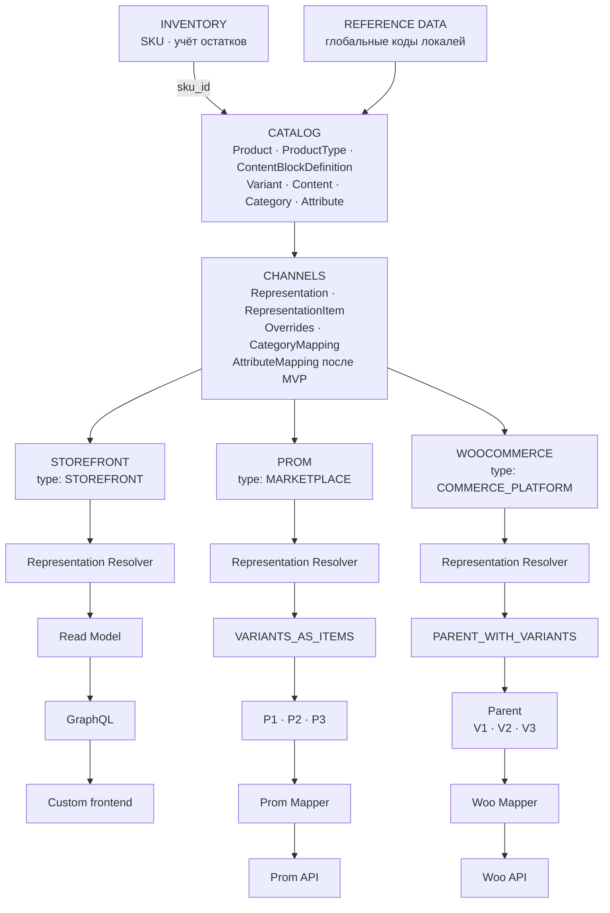

# План модуля Catalog и представлений товаров в Channels

Дата обновления: 2026-10-06. Статус: рабочий документ для дополнения.

Документ структурирует целевую модель каталога и способ её использования каналами.
Описание относится к планируемой архитектуре. Предложения по деталям реализации
и вопросы, требующие решения, выделены отдельно.

**Граница MVP:** атрибуты Catalog могут описывать товар и служить внутренними
осями его вариантов, но Channels не передаёт атрибуты и их значения во внешние
системы. В MVP нет `AttributeMapping`, `AttributeValueMapping`, проекции атрибутов
в payload Prom/Woo, проверки готовности по внешним атрибутам и редактора их
сопоставлений. Эти возможности ниже описывают целевую архитектуру после MVP.
Первый сценарий Channels — импорт публикаций; решение об обратной отправке
товаров принимается отдельно. При импорте внешние атрибуты могут сохраняться
как часть наблюдаемого исходного ответа, но не превращаются автоматически в
атрибуты Catalog.

Связанный документ: [план интеграций и каналов](channels-integrations.md).
Он задаёт подключение источников и первичный импорт; этот план уточняет товарную
модель, представления и целевой процесс публикации. Описание экспорта здесь
не означает автоматического включения всех его операций в первую версию интеграций.

## 1. Назначение и границы

Catalog хранит канонические данные товарной карточки, варианты, переводы,
контент, категории, атрибуты и их значения. Один внутренний товар может иметь
разную структуру и контент при представлении в разных каналах.

Channels хранит представления этого товара, позиции представления, переопределения
и сопоставления с внешними справочниками. Коннекторы преобразуют подготовленное
представление в формат конкретной платформы и взаимодействуют с её API.

| Слой                | Ответственность                                                                                                                                 |
|---------------------|-------------------------------------------------------------------------------------------------------------------------------------------------|
| Catalog             | Product, ProductType, ContentBlockDefinition, Variant, ProductContent, VariantContent, переводы, Category, Attribute и значения                 |
| Inventory           | Самостоятельная сущность SKU и учёт остатков по SKU; Catalog использует её через ссылку и публичный контракт                                    |
| Reference Data      | Глобальные коды локалей; не выбирает локали для tenant                                                                                          |
| Channels            | ProductRepresentation, RepresentationItem, Overrides, CategoryMapping и стратегии публикации; сопоставления атрибутов — после MVP              |
| Коннектор платформы | Platform Mapper, API Adapter, особенности протокола и внешних ресурсов                                                                          |
| Storefront          | Чтение разрешённого представления через Read Model → GraphQL → custom frontend                                                                  |

Термин «CRM Product» из исходных примеров означает внутренний `Catalog.Product`.
Он не вводит второй товарный каталог внутри модуля работы с клиентами.

В `Product` и `Variant` не помещаются `external_product_id`, идентификаторы внешних
категорий и ветвления по Prom/WooCommerce. Внешние связи принадлежат Channels.
Catalog не хранит отдельную копию товара для каждого канала.

## 2. Целевая структура



Тип канала описывает его назначение. Конкретная стратегия выбирается по провайдеру
и типу товара: общий `MARKETPLACE` не определяет одинаковую структуру для всех
маркетплейсов. Схема показывает вариативный товар; простой товар имеет одну позицию.

## 3. Каноническая модель Catalog

| Объект                 | Назначение и основные данные                                                                                                                                                      |
|------------------------|-----------------------------------------------------------------------------------------------------------------------------------------------------------------------------------|
| Product                | Стабильный внутренний ID, `kind: ProductKind` (`simple` / `variable`), ссылка `product_type_id` на схему контента, связи с контентом, вариантами, категориями и общими атрибутами |
| Variant                | Стабильный внутренний ID, product_id, ссылка sku_id на Inventory.SKU, собственный локализованный VariantContent, значения атрибутов варианта, изображение и габариты при наличии  |
| ContentBlockDefinition | Определение блока: стабильные ID и code, scope PRODUCT/VARIANT, тип значения, is_system и переводы названия блока                                                                 |
| ProductType            | Тип товара со схемой контента: код, переводы названия, is_system и упорядоченный набор определений блоков                                                                         |
| ProductContent         | Значения блоков scope PRODUCT выбранного ProductType для конкретного товара и locale                                                                                              |
| VariantContent         | Значения блоков scope VARIANT того же ProductType для конкретного варианта и locale                                                                                               |
| Перевод контента       | Значения контентных полей для определённой locale                                                                                                                                 |
| Category               | Внутренняя категория, её название/переводы и связь с родительской категорией                                                                                                      |
| Attribute              | Внутренний атрибут: стабильный code, название/переводы, тип значения и назначение                                                                                                 |
| AttributeOption        | Стабильный ID варианта значения перечислимого атрибута, code и переводы                                                                                                           |
| Значение атрибута      | Значение общего атрибута товара либо атрибута конкретного варианта                                                                                                                |

Для вариативного товара общий текст принадлежит `ProductContent`, а локализованный
контент конкретной позиции — `VariantContent` внутри `Variant`. Число капсул не требует создания трёх независимых
карточек
каталога. Категория Catalog также существует независимо от дерева Prom или Woo.

**Подтверждённое требование:** у простого товара `SIMPLE` также есть Variant —
ровно один. Product хранит карточку и контент, а его единственный Variant — ссылку
на Inventory.SKU и данные продаваемой позиции. Для обоих типов товаров используется
одна модель Product → Variant → Inventory.SKU.
Kind `SIMPLE` не означает отсутствие вариантов или перенос SKU в Product.

**Предлагаемые инварианты:** вариант принадлежит одному товару; комбинация значений
вариативных атрибутов не дублируется внутри товара; типы значений проверяются
схемой атрибутов; дерево категорий не допускает циклов. Область уникальности кода SKU
уточняется отдельно. Для SIMPLE обязательна ровно одна запись Variant;
создание товара и его единственного варианта должно сохранять это условие.
Второй вариант нельзя добавлять при сохранении kind SIMPLE; удаление единственного
варианта не должно оставлять существующий простой товар без продаваемой позиции.

**Подтверждённое требование для VARIABLE:** больше одного Variant, то есть минимум
два. Создание или изменение VARIABLE не может оставить ноль или один вариант;
сокращение до одного требует явной смены kind на SIMPLE в том же сценарии.

### SKU и граница Inventory

**Подтверждённое требование:** SKU — самостоятельная сущность модуля Inventory.
Именно по SKU ведётся учёт остатков. Catalog.Variant сохраняет `sku_id`, ссылающийся
на эту сущность; отображаемый код SKU получает через контракт Inventory.
Идентификатор SKU и его читаемый код — разные значения.

Остаток относится к Inventory.SKU, а не к Product, Variant или RepresentationItem.
Представление товара в нескольких каналах не создаёт несколько независимых остатков.
При подготовке публикации Channels получает учётные данные по связанному `sku_id`.
Внешний артикул, импортированный из источника, сам по себе не является внутренним
`sku_id` и требует сопоставления с Inventory.

Проверка ссылки на SKU должна учитывать tenant. Связи Catalog с Inventory идут
через публичные контракты. Нужно отдельно определить, может ли несколько вариантов
или карточек ссылаться на один SKU и допустим ли вариант без SKU на стадии черновика.

Цена и остаток участвуют в эффективном представлении, но их присутствие в payload
не делает Product владельцем складского учёта или расчёта цен. Источник остатков —
Inventory с учётом по SKU; контракт доступности для канала и источник расчёта цен
должны быть определены отдельно.

### Kind и тип товара

`Product.kind` определяет структуру продаваемых позиций. В домене используется VO
в форме строкового Enum; API и хранение используют его значения в нижнем регистре:

```python
class ProductKind(str, Enum):
    SIMPLE = "simple"
    VARIABLE = "variable"
```

Далее `SIMPLE` и `VARIABLE` обозначают члены этого Enum. Прежнее поле `type`
переименовано в `kind`; строковое поле `product_type` доменного агрегата также заменено
на `kind: ProductKind`. `ProductType` — отдельная сущность, задающая схему контента (в первом срезе только системный
Default). Один ProductType применим и к SIMPLE,
и к VARIABLE; он описывает состав контента Product и его Variants.
Изменение схемы контента не меняет варианты, SKU или topology публикации.

Статус на 2026-10-06: переименование и ProductKind входят в текущую реализацию;
ProductType, ContentBlockDefinition, DefinitionScope и динамический контент
Product/Variant — следующий срез.
Наличие `ProductKind.VARIABLE` в Enum ещё не означает поддержку вариативного товара.

### Контент и переводы

**Подтверждённое требование:** ProductType описывает схему продукта через
ContentBlockDefinition. Определение задаёт тип контента и область его владельца;
Product и Variant хранят локализованные значения согласно этой схеме.
Добавление блока не требует новой колонки контента.
Канонические коды — `title`, `description`, `short_description`; названия
Title, Description и Short Description являются подписями, а не другими полями.
Существующее поле `name` переносится в блок `title` при реализации этого среза.

#### DefinitionScope

```python
class DefinitionScope(str, Enum):
    PRODUCT = "product"
    VARIANT = "variant"
```

`ContentBlockDefinition.scope` определяет, где сохраняется значение:

| Scope   | Владелец значения                     | Пример                          |
|---------|---------------------------------------|---------------------------------|
| PRODUCT | Product, перевод по locale            | title, description, ingredients |
| VARIANT | Конкретный Variant, перевод по locale | short_description               |

Scope принадлежит определению и одинаков во всех ProductType, использующих его.
Нельзя менять владельца значения через настройку типа товара или payload записи.
`DefinitionScope.VARIANT` не означает `ProductKind.VARIABLE`: у SIMPLE также есть
один Variant. Kind определяет число позиций, scope — владельца контентного блока.

#### ContentBlockDefinition

Catalog владеет отдельным определением блока; оно переиспользуется в типах товара
внутри tenant. Определение не содержит текст конкретного товара или варианта.

| Поле         | Контракт                                                                                              |
|--------------|-------------------------------------------------------------------------------------------------------|
| id           | Стабильный внутренний ID определения                                                                  |
| code         | Уникальный внутри tenant машинный код, например ingredients; после использования не переименовывается |
| scope        | DefinitionScope: product либо variant                                                                 |
| type         | Тип значения блока; для первого среза предлагаются text и rich_text                                   |
| is_system    | Признак системного определения; задаётся сервером                                                     |
| translations | Названия блока по явным кодам локалей, например uk → Склад                                            |

Структура пользовательского определения, которое в дальнейшем можно включить
в схему типа товара на уровне Product:

```yaml
ContentBlockDefinition:
  code: ingredients
  scope: product
  type: rich_text
  is_system: false
  translations:
    uk: "Склад"
    ru: "Состав"
    en: "Ingredients"
```

`translations` здесь — подписи полей редактора. Текст «Риб'ячий жир…» является
значением блока у Product, а не переводом определения. Локаль подписи и локаль
редактируемого контента выбираются независимо; отсутствие перевода подписи
позволяет показать code, но не подставлять контент из другого языка.
`is_system` не задаёт scope: как системные, так и пользовательские блоки
могут относиться к Product либо Variant.

#### ProductType и Default

ProductType — отдельный корень агрегата Catalog: `id`, уникальный `code`,
`is_system`, переводы названия и набор `blocks`. Каждый элемент схемы содержит
`content_block_definition_id`, `position` и `is_required`. Code, scope, тип значения
и подписи берутся из определения; обязательность и порядок принадлежат схеме.
Одно определение не повторяется внутри одного ProductType; порядок отображения
применяется отдельно внутри PRODUCT и VARIANT; position уникальна в пределах
одного ProductType и scope.

**Подтверждённый объём первого среза:** один ProductType с `code = default`,
названием Default и `is_system = true`. Он назначается всем существующим товарам
при миграции и новым товарам по умолчанию. Его нельзя удалить; системную структуру
нельзя менять пользовательским запросом.

В каждом tenant вместе с Default создаются системные определения:

| Code              | Scope   | Type (предлагаемый) | is_system | is_required (предлагаемый) | Position |
|-------------------|---------|---------------------|-----------|----------------------------|----------|
| title             | PRODUCT | text                | true      | true                       | 1        |
| description       | PRODUCT | rich_text           | true      | false                      | 2        |
| short_description | VARIANT | rich_text           | true      | false                      | 1        |

```text
Default ProductType (is_system = true)
├── PRODUCT
│   ├── title
│   └── description
└── VARIANT
    └── short_description

Product
├── product_type = Default
├── kind = VARIABLE
├── title                  [PRODUCT, по locale]
├── description            [PRODUCT, по locale]
└── Variants               [количество > 1]
    ├── Variant V100
    │   └── short_description [VARIANT, по locale]
    └── Variant V200
        └── short_description [VARIANT, по locale]
```

Product хранит `product_type_id`. Variant не выбирает отдельный ProductType:
его схема VARIANT выводится из ProductType родительского Product.
Default также применяется к SIMPLE: Product имеет title/description,
единственный Variant — собственный short_description. Это применение общей
схемы к уже принятой структуре SIMPLE; контент не переносится из Variant в Product.
Правила количества вариантов задаёт ProductKind, а не редактируемый набор блоков.

Создание пользовательских типов (например Витамины), управление составом их схем
и включение ingredients/usage — последующее расширение. Определения для таких
блоков предусмотрены моделью, но не входят в начальную схему Default и не seed-ятся
как обязательные поля. В дальнейшем ProductType содержит ссылки на общие
определения, а не их копии; скрытого наследования между типами нет.

**Предлагаемый контракт значений:** title обязателен при записи перевода Product,
содержит 1–255 символов после trim. Description входит в схему, но необязателен,
как в текущем коде. Short_description также необязателен; необходимость заполнения
не следует из самого наличия блока. Создать Product или Variant без переводов
по-прежнему можно. Сохранение перевода проверяет обязательные блоки только для
его scope и записываемой locale: перевод Variant не требует title.
Формат rich_text (HTML либо структурированный JSON), лимиты и правила очистки
фиксируются до реализации хранения и редактора; один формат применяется
к значениям Catalog и overrides Channels.

#### ProductContent и VariantContent: значения схемы

ProductContent содержит `locale` и значения определений scope PRODUCT.
VariantContent содержит `locale` и значения определений scope VARIANT.
Публичное представление адресует блок по code; примеры значений rich_text
показаны текстом для наглядности:

```yaml
Product:
  id: 123 # иллюстративный ID
  kind: variable
  product_type_code: default
  content:
    locale: uk
    blocks:
      title: "Омега-3 1000 мг"
      description: "Харчова добавка..."
  variants:
    - id: V100
      content:
        locale: uk
        blocks:
          short_description: "Упаковка 100 капсул..."
    - id: V200
      content:
        locale: uk
        blocks:
          short_description: "Упаковка 200 капсул..."
```

Логическая структура: Product → ProductType → определения блоков; отдельно
Product → locale → значения PRODUCT и Variant → locale → значения VARIANT.
Ни значение, ни подпись не дублируют схему. Переводы Product и каждого Variant
независимы: у одного варианта может быть uk, у другого — en или вообще нет контента.
Отсутствие перевода Variant возвращается как `content: null`, даже если Product
имеет перевод той же locale. Description не является fallback для short_description.
Запись ingredients в Default отклоняется: определение не включено в эту схему.

**Предлагаемые инварианты схемы и значений:**

- Неизвестный code, блок вне ProductType, неверный scope и неподходящий тип значения
  отклоняются. Product не принимает short_description, Variant — title/description.
- Значение PRODUCT уникально по `(product_id, locale, content_block_definition_id)`;
  значение VARIANT — по `(variant_id, locale, content_block_definition_id)`.
- При записи Variant проверяется его принадлежность указанному Product и tenant;
  схема берётся только из ProductType этого Product.
- Системные определения нельзя удалить или изменить их code/scope/type/is_system.
- Используемые определения нельзя удалить или менять их scope/type; подписи
  редактируемы. ProductType нельзя удалить, пока он используется Product.
- Добавление необязательного блока не создаёт фиктивных переводов или значений.
  Будущее добавление обязательного блока проверяет переводы соответствующего scope
  у всех владельцев; изменение отклоняется при несоответствии существующих значений.
- Удаление блока из схемы отклоняется, если есть его значения у Product или Variants
  этого типа. Смена ProductType проверяет оба scope и все варианты, сохраняет общие
  значения и отклоняется, если новая схема исключает заполненные блоки или требует
  отсутствующих значений. Автоматического удаления либо переноса между scope нет.
- Изменение схемы и запись контента любого scope сериализуются по ProductType;
  версия схемы проверяется при сохранении, устаревший редактор получает конфликт.

#### Хранение, API и переход от фиксированных полей

Предлагается tenant-хранение определений и их переводов, ProductType и его переводов,
связей схемы с определениями, а также отдельных значений Product и Variant.
Таблица переводов товара сохраняет ключ `(product_id, locale)`; таблица переводов
варианта — `(variant_id, locale)`. Таблица значений каждого владельца ссылается
на его перевод и определение. VariantContent входит в агрегат Product через Variant.
`tenant_id` не дублируется в tenant-таблицах. Репозитории участвуют в общей UoW;
проверки схемы, владельца и сохранение значений выполняются в одной транзакции.

Первый срез предоставляет чтение Default и его определений, назначение типа товару
и запись/чтение локализованных блоков обоих scope. Пользовательский CRUD типов
и определений вводится в последующем расширении. Ответ схемы содержит версию,
упорядоченные определения, scope, подписи и обязательность. Если тип не указан,
новый товар получает Default.

Предлагаемые контракты изменения переводов:

| Операция                                                             | Область и проверка                                                                                                               |
|----------------------------------------------------------------------|----------------------------------------------------------------------------------------------------------------------------------|
| PUT `/products/{product_id}/contents/{locale}`                       | Полная замена PRODUCT-блоков одной locale                                                                                        |
| PUT `/products/{product_id}/variants/{variant_id}/contents/{locale}` | Полная замена VARIANT-блоков одной locale; Variant принадлежит Product                                                           |
| GET Product с явной locale                                           | ProductContent и контент каждого Variant для этой locale; для отсутствующего перевода content: null у соответствующего владельца |

Пути относятся к существующему префиксу `/api/console/catalog` и описывают целевые
контракты. Запись принимает `blocks` и ожидаемую версию схемы; PUT не затрагивает
другие locale и других владельцев. Отсутствующий необязательный блок не имеет
значения, обязательный нельзя пропустить. Console строит отдельные группы PRODUCT
и VARIANT по Default: text input для title, редактор rich_text для description
и short_description каждого варианта.

Порядок миграции следующего среза:

1. Создать таблицы, DefinitionScope, системные определения title/description/
   short_description и Default во всех tenant; включить тот же seed в создание
   новых tenant. Scope хранится значениями product/variant; миграции не импортируют
   актуальные доменные Enum.
2. Назначить Default существующим Product, сохранить их ID, kind, варианты и SKU.
3. Перенести каждую locale Product: name → title, description → значение PRODUCT
   блока description. NULL остаётся отсутствующим значением. Старый текст
   преобразуется в выбранный rich_text без интерпретации его как доверенного HTML.
   VariantContent не заполняется копированием description: раньше этих данных не было.
4. Сверить количество переводов и значения до/после, затем переключить DTO/API,
   репозитории и Console на blocks с раздельными PRODUCT/VARIANT-контрактами.
5. Удалить старые колонки после проверки переноса. Не создавать второго блока name.

Текущая миграция kind выполняется отдельно: `0014_catalog_product_kind` переименовывает
колонку type → kind и значение SIMPLE → simple; downgrade восстанавливает прежний
контракт. Контент эта миграция не меняет. ProductType, DefinitionScope и динамические
значения обоих scope пока описаны только в плане.

Catalog хранит переводы исходного контента Product и Variant. Representation и item
могут иметь переопределения для выбранной locale по правилам роли канала. Resolver
получает locale явно; правило fallback при отсутствии перевода нужно зафиксировать
до реализации. Нельзя автоматически брать текст из другого языка или scope.

### Языки контента Catalog

Catalog не хранит список разрешённых языков и язык по умолчанию. Каждый перевод
помечен явным кодом BCP 47 из глобального `reference_data`; при записи код должен
быть активным. Наличие кода не означает наличия перевода. Коды без региона (`uk`,
`ru`, `sr-Latn`, `sr-Cyrl`) и региональные варианты могут сосуществовать.
Товар можно создать без переводов, а затем записать их отдельно. Чтение требует
явный код: отсутствующий перевод возвращается как `content: null`, без fallback.
Неактивный позднее код не делает ранее записанный перевод нечитаемым.

В будущем frontend выбирает язык карточки через select, первоначально используя
язык интерфейса из профиля пользователя. Это правило frontend, а не настройка
Catalog или Tenancy. Локаль публикации выбирают Channels отдельно.

## 4. Примеры простого и вариативного товара

### Простой товар: NOW Vitamin C 1000

```text
Product: PRODUCT-SIMPLE
    kind: simple
    product_type_code: default

ProductContent:
    title: NOW Vitamin C 1000
    description: общий текст карточки
    translations: по явным кодам локалей из глобального справочника

Inventory.SKU SKU-C1000:
    code: VITAMIN-C-1000
    остатки учитываются по SKU-C1000

Variant V-C1000:
    product_id: PRODUCT-SIMPLE
    sku_id: SKU-C1000
    VariantContent: short_description по явным locale, при наличии
    attributes: характеристики единственной позиции
    image / dimensions: при наличии

        Product SIMPLE
        NOW Vitamin C 1000
                │
                ▼
         Variant V-C1000
                │ sku_id
                ▼
      Inventory.SKU SKU-C1000
```

Общий контент и переводы принадлежат ProductContent; short_description единственного
варианта — VariantContent. SKU и остатки относятся
к Inventory, связь с ними хранится в единственном Variant. Характеристики позиции
можно хранить у Variant даже при отсутствии выбора между несколькими вариантами.
Цена и доступный остаток поступают в представление по тем же контрактам,
которые используются для вариативного товара.

В каждом канале создаётся одна ProductRepresentation с `SINGLE_ITEM`
и ровно один RepresentationItem роли `SINGLE`. Он ссылается одновременно
на PRODUCT-SIMPLE и V-C1000; `internal_variant_id` не равен `NULL`.

| Канал | Representation | Роль item | internal_variant_id | Внешняя структура |
| --- | --- | --- | --- | --- |
| PROM-MAIN | REP-SIMPLE-PROM | SINGLE | V-C1000 | Один товар Prom, например #901 |
| WOO-UA | REP-SIMPLE-WOO | SINGLE | V-C1000 | Один Woo product типа simple, например #902 |
| STOREFRONT | REP-SIMPLE-STOREFRONT | SINGLE | V-C1000 | Одна позиция Read Model без внешнего ID |

Внешние номера — иллюстрация. В Woo внутренний Variant простого товара
не становится дочерней Woo variation: он даёт SKU, изображение и данные позиции
для одной общей товарной публикации. Отдельный внешний parent не создаётся.
В Prom также публикуется один товар.

Resolver объединяет ProductContent, разрешённые overrides и данные единственного
Variant в одну `EffectiveRepresentationItem`. Контент разрешается по обычному
каскаду item → representation → Catalog. Для Woo роли `SINGLE` доступны title
и description: запрет variation description относится только к роли Woo `VARIANT`.

```text
ProductContent + Variant V-C1000 + Inventory data + Overrides
                            ↓
                         Resolver
                            ↓
             EffectiveRepresentationItem (SINGLE)
                            ↓
             PublicationPlan(parent=None, items=[single])
                            ↓
                Prom / Woo mapper → один товар
```

### Вариативный товар: NOW Omega 3

```text
Product: PRODUCT-123
    kind: variable
    product_type_code: default
ProductContent:
    title: NOW Omega 3
    description: общий текст

Inventory.SKU SKU-100: code = OMEGA-100, остатки учитываются по SKU-100
Inventory.SKU SKU-200: code = OMEGA-200, остатки учитываются по SKU-200
Inventory.SKU SKU-500: code = OMEGA-500, остатки учитываются по SKU-500

Variant V100: sku_id = SKU-100, capsules = 100, short_description = упаковка 100 капсул
Variant V200: sku_id = SKU-200, capsules = 200, short_description = упаковка 200 капсул
Variant V500: sku_id = SKU-500, capsules = 500, short_description = упаковка 500 капсул

                  PRODUCT-123
                  NOW Omega 3
                       │
            ┌──────────┼──────────┐
            │          │          │
           V100       V200       V500
```

Внутри Catalog это один товар с тремя вариантами. Title/description локализуются
у Product, short_description — отдельно у V100/V200/V500. Ни топология внешних публикаций,
ни количество внешних карточек не меняют эту структуру.

## 5. ProductRepresentation и RepresentationItem

`Representation` и `ProductRepresentation` в этом документе — одно понятие.
ProductRepresentation связывает внутренний товар с конкретным каналом и задаёт
стратегию представления. RepresentationItem описывает отдельную позицию этой структуры.

| Объект | Основные поля |
| --- | --- |
| ProductRepresentation | id, product_id, channel_id, strategy/topology |
| RepresentationItem | id, representation_id, internal_product_id, internal_variant_id, role, external_id при наличии |
| Representation Override | representation_id, поле, locale при необходимости, значение переопределения |
| RepresentationItem Override | representation_item_id, поле, locale при необходимости, значение переопределения |

Предлагаемые роли: `SINGLE`, `PARENT`, `VARIANT`. Конкретный набор позиций
определяет стратегия. `internal_variant_id` у Woo parent равен `NULL`;
у вариаций и Prom-позиций явно указывает на соответствующий Variant.
У позиции `SINGLE` простого товара он указывает на единственный Variant.
Product ID позиции должен совпадать с товаром её representation.

Внешний ID хранится у позиции или в её external binding; один Product может
соответствовать нескольким внешним ресурсам. Окончательное физическое хранение
этих связей уточняется при проектировании схемы данных.
Для дочернего ресурса binding также должен сохранять внешний parent ID.
Внешняя идентичность учитывает подключение, тип ресурса и scope, а не только число ID.

Для Storefront external ID не требуется: representation используется для чтения.

### WooCommerce representation

```text
REP-001:
    product_id: PRODUCT-123
    channel_id: WOO-UA
    strategy: PARENT_WITH_VARIANTS
```

| Item | Роль | internal_product_id | internal_variant_id | external_id | Внешний parent |
| --- | --- | --- | --- | --- | --- |
| ITEM-1 | PARENT | PRODUCT-123 | NULL | 555 | — |
| ITEM-2 | VARIANT | PRODUCT-123 | V100 | 556 | 555 |
| ITEM-3 | VARIANT | PRODUCT-123 | V200 | 557 | 555 |
| ITEM-4 | VARIANT | PRODUCT-123 | V500 | 558 | 555 |

### Prom representation

```text
REP-002:
    product_id: PRODUCT-123
    channel_id: PROM-MAIN
    strategy: VARIANTS_AS_ITEMS
```

| Позиция | internal_variant_id | Внешний товар |
| --- | --- | --- |
| Prom Item V100 | V100 | 86571 |
| Prom Item V200 | V200 | 86572 |
| Prom Item V500 | V500 | 86573 |

Все внешние номера приведены как иллюстрация модели, а не как реальные ресурсы.

## 6. PublicationTopology и стратегии

```python
class PublicationTopology(Enum):
    SINGLE_ITEM = "single_item"
    PARENT_WITH_VARIANTS = "parent_with_variants"
    VARIANTS_AS_ITEMS = "variants_as_items"
```

| Товар | Prom | WooCommerce |
| --- | --- | --- |
| SIMPLE | SINGLE_ITEM | SINGLE_ITEM |
| VARIABLE | VARIANTS_AS_ITEMS | PARENT_WITH_VARIANTS |

Для SIMPLE обе стратегии строят одну позицию роли SINGLE, связанную с единственным
Variant. Для VARIABLE `WooCommercePublicationStrategy` строит parent и вариации,
а `PromPublicationStrategy` делает каждый вариант самостоятельной публикуемой позицией
(`FLATTEN_VARIANTS` — описание преобразования, а не дополнительная topology).
Для Rozetka, Amazon, Shopify и следующих интеграций топология задаётся отдельно.

PublicationTopology описывает форму результата. PublicationStrategy также задаёт
роли позиций, допустимые поля и зависимости операций. Новая платформа использует
одну из топологий либо расширяет набор при обоснованной необходимости;
одного значения enum недостаточно для готовой интеграции.

Общий сценарий выбирает стратегию через registry и вызывает её контракт.
Условия вида `if platform == "prom"` не помещаются в Product или общий use case.
Специфика платформы сосредоточена в её стратегии и адаптере.

Предлагаемый результат — `PublicationPlan(parent, items, dependencies)`.
Для SIMPLE в обоих каналах parent отсутствует, items содержит одну позицию.
Для VARIABLE в Woo parent должен существовать до отправки дочерних вариаций;
в Prom план примера содержит три товарные позиции без публикуемого parent.
Эти стратегии описывают целевую публикацию после MVP. Внешняя публикация VARIABLE
не входит в MVP: выбранная стратегия Woo строит вариации по внешним атрибутам,
а передача таких атрибутов отложена. Внутренний Catalog.VARIABLE можно
проектировать и реализовывать независимо от этой операции Channels.

## 7. Контент WooCommerce

Для SIMPLE будущая отправка общего контента и данных единственного Variant
может использовать один Woo product типа simple через роль SINGLE без атрибутов.
Для VARIABLE целевая стратегия после MVP использует
общий контент у Woo parent:

```text
Woo Product #555
    name
    description        ← Catalog или override представления/parent
    images
    attributes         ← в том числе доступные значения вариативных атрибутов

    Variation #556: SKU OMEGA-100
    Variation #557: SKU OMEGA-200
    Variation #558: SKU OMEGA-500
```

В целевой стратегии после MVP variation получает SKU, цену, остаток, изображение,
габариты и атрибуты варианта. В MVP такой payload не формируется.
Общий текст карточки не копируется в description каждой variation.
Схема commerce-полей и источники цены/остатка уточняются отдельно.

Woo REST API адресует variation как дочерний ресурс:
`/products/{product_id}/variations/{variation_id}`; поле `description` у variation
существует. Отказ от его использования — выбранное правило нашей модели.
[Официальная документация WooCommerce](https://woocommerce.github.io/woocommerce-rest-api-docs/#product-variation-properties).

Пример: если Catalog description равен «Omega-3 жирные кислоты…», а у WOO-UA
задан override «Омега-3 NOW Foods…», Woo parent получает текст override.
Variation не получает этот текст независимо от возможности API.
Catalog.VariantContent хранит short_description независимо от платформы. В текущем
плане экспорта Woo этот блок также не отправляется в variation; его наличие в Catalog
не включает внешнюю операцию. Правило отображения variant short_description в Woo
требует отдельного решения Channels.
Контентные overrides для роли Woo VARIANT должны быть недоступны для редактирования
и отклоняться при попытке сохранения через API. Overrides разрешённых полей
изображения и commerce-данных рассматриваются отдельно.

## 8. Контент Prom

Для целевой публикации после MVP принимается `VARIANTS_AS_ITEMS`: каждый вариант
становится отдельной publishable unit со своим названием и описанием.

```text
Prom #86571: NOW Omega 3 100 капсул → description V100
Prom #86572: NOW Omega 3 200 капсул → description V200
Prom #86573: NOW Omega 3 500 капсул → description V500
```

Это выбранная стратегия нашего представления. Prom поддерживает разновидности
товаров; их наличие не требует строить Catalog по структуре WooCommerce.
[Справка Prom о разновидностях](https://support.prom.ua/hc/uk/articles/360005208678-%D0%94%D0%BE%D0%B4%D0%B0%D0%B2%D0%B0%D0%BD%D0%BD%D1%8F-%D1%80%D1%96%D0%B7%D0%BD%D0%BE%D0%B2%D0%B8%D0%B4%D1%96%D0%B2-%D0%B4%D0%BE-%D1%82%D0%BE%D0%B2%D0%B0%D1%80%D1%83).

Название и описание каждой позиции могут задаваться item override. Автоматическое
построение названия из общего title и атрибутов варианта требует отдельного правила;
mapper не должен самостоятельно дописывать число капсул. Short_description берётся
из VariantContent конкретной позиции; как включать его во внешнее описание или
другое поле, Channels определяет явным правилом проекции до отправки. Он не
заменяет Product.description автоматически.
Группировка позиций и конкретные операции их создания через Prom API проверяются
при проектировании коннектора; приведённая схема не утверждает контракт его API.

## 9. Overrides и каскад наследования

Поддерживаются два уровня переопределений: representation и representation item.

```text
Canonical Content по scope (Product / конкретный Variant)
          ↓
Channel Representation Override
          ↓
Representation Item Override
          ↓
Effective value
```

Приоритет поля: item override → representation override → Catalog.
Resolver применяет его по каждому полю и locale, с учётом допустимых полей роли.
Для нового перевода код должен быть активен в глобальном справочнике;
Catalog не хранит списка разрешённых языков. Локаль публикации Channels проверяет отдельно.
Источник Catalog выбирается по DefinitionScope: ProductContent для PRODUCT,
VariantContent связанного Variant для VARIANT. Приоритет overrides применяется
внутри одного блока, scope и locale, без наследования значений между Product и Variant.
Для Woo роли PARENT используются PRODUCT-блоки; остальные роли получают только
разрешённые стратегией блоки. Для Prom базовые данные позиции могут включать оба scope.

| Поле                             | Catalog             | Prom representation  | Prom V100 item     | Эффективное V100    | Источник               |
|----------------------------------|---------------------|----------------------|--------------------|---------------------|------------------------|
| title                            | Omega 3             | Наследовать          | Omega 3 100 капсул | Omega 3 100 капсул  | Item                   |
| description                      | Base description    | Prom SEO description | V100 description   | V100 description    | Item                   |
| short_description (VARIANT V100) | Упаковка 100 капсул | Наследовать          | Наследовать        | Упаковка 100 капсул | Catalog.VariantContent |

В примере товар использует Default: title/description — PRODUCT, short_description
— VARIANT. Таблица показывает внутренние эффективные значения, а не готовый payload
Prom. Overrides адресуют определение блока, его scope и locale, проверяются по
схеме ProductType и ограничениям роли канала. Для VARIANT-блока item должен иметь
internal_variant_id; PARENT без связанного Variant не может получить такой блок. Произвольный новый блок через override
не создаётся.

Без item override description берётся из representation, а при отсутствии
обоих overrides — из Catalog. Переопределение одного канала не меняет другой
канал и не переписывает канонический контент.

**Предлагаемая семантика:** различать «Наследовать», «Задать значение» и «Очистить».
Выбор источника определяется наличием операции override, а не истинностью значения.
Выражение `item_override or representation_override or catalog_value` иллюстрирует
приоритет, но не подходит как реализация: пустая строка, `0` или `false` могут
быть намеренно заданным значением. Очистка обязательного поля должна приводить
к ошибке валидации, а не к скрытому возврату родительского значения.

Предлагается сохранять provenance: какой уровень дал итоговое значение.
Это позволит объяснять пользователю результат preview.

## 10. Representation Resolver и границы mapper

Целевой поток подготовки внешней публикации:

```text
Catalog + Representation/Item Overrides + CategoryMapping + commerce data
                              ↓
                    Representation Resolver
                              ↓
          EffectiveRepresentation / EffectiveRepresentationItem
                              ↓
                     Publication Strategy
                              ↓
                        PublicationPlan
                              ↓
                       Platform Mapper
                              ↓
                          API Adapter
```

Registry выбирает стратегию заранее. Её topology и правила допустимых полей
известны resolver; после разрешения данных стратегия формирует план операций.
Это позволяет сохранить порядок Resolver → Strategy → Mapper без круговой зависимости.

Resolver выбирает значения контента, применяет overrides и определяет эффективные
категории с учётом их mappings. Разрешение внешних атрибутов и проверка их
полноты добавляются после MVP.
Предлагается передавать туда цены и остатки как явно полученные DTO;
остатки получает контракт Inventory по связанному `sku_id`.
Он не вызывает внешние API.

`EffectiveRepresentationItem` содержит разрешённые блоки контента по code (PRODUCT: title/description; VARIANT:
short_description связанного варианта),
category,
images, SKU и разрешённые commerce-поля. Channels явно задаёт, как дополнительные
блоки включаются во внешнее описание или отдельные поля; они не склеиваются в Catalog.
Поле `attributes` и его заполнение для внешнего payload относятся к этапу после MVP.
Mapper переводит канонический title в поле названия платформы (например name Woo).
Набор полей зависит от роли; для Woo variation текстовые поля исключаются.

Контракты mappers из исходной модели:

```text
PromProductMapper.map(EffectiveRepresentationItem) → PromProductPayload
WooProductMapper.map_single(EffectiveRepresentationItem) → WooProductPayload
WooProductMapper.map_parent(EffectiveRepresentation) → WooProductPayload
WooProductMapper.map_variant(EffectiveRepresentationItem) → WooVariationPayload
```

Mapper преобразует структуру, имена полей и типы в формат платформы.
Он не выбирает description, не применяет fallback и не решает топологию товара.
Если операция создания возвращает внешний ID parent, адаптер подставляет его
в последующие операции по зависимостям плана.

## 11. CategoryMapping

Категории Catalog канонические:

```text
Supplements
    └── Omega 3
```

Сопоставления принадлежат конкретному connection:

| Внутренняя категория | Connection | Внешняя категория |
| --- | --- | --- |
| Omega 3 | PROM-MAIN | Prom 12345 |
| Omega 3 | WOO-UA | Woo 82 |
| Omega 3 | WOO-PL | Woo 119 |

Основные поля: `catalog_category_id`, `connection_id`, `external_category_id`.
Два магазина одной платформы могут использовать разные деревья и внешние ID,
поэтому одного `provider` в ключе сопоставления недостаточно.

Representation связан с channel, mapping — с connection, обслуживающим этот channel.
Нельзя использовать mapping другого подключения только потому, что provider совпадает.
Для SIMPLE товар явно принадлежит нулю или нескольким внутренним категориям.
При непустом наборе ровно одна основная; родительские категории не добавляются
автоматически. Выбор внешней категории для отдельного channel уточняется в Channels.

## 12. AttributeMapping и AttributeValueMapping

**После MVP.** В первой версии нет этих сущностей, их SQL-таблиц, API и UI;
Channels не читает внутренние значения атрибутов для внешнего payload. Наличие
атрибутов в Catalog само по себе не включает их отправку. Экспорт вариативных
товаров с осями вариантов требует отдельного следующего среза Channels.

В Catalog атрибут имеет собственную идентичность:

```text
dosage_form
    capsule
    softgel
    tablet
```

В представлении Prom ему может соответствовать «Форма выпуска», а в Woo — `pa_form`.
Это примеры сопоставления, а не обязательные внешние ID или имена для любого магазина.

| Mapping | Основные поля |
| --- | --- |
| AttributeMapping | catalog_attribute_id, connection_id, external_attribute_id |
| AttributeValueMapping | attribute_mapping_id, internal_option_id, external_option_id или external_value |

AttributeValueMapping связан с конкретным AttributeMapping, чтобы значение из
одного подключения или атрибута не попало в другое. Перевод названия option
и сопоставление внешнего option ID — разные операции.

Для Prom в модели учитывается контекст внешней категории: набор основных
характеристик задаётся её схемой, дополнительные пользовательские характеристики
обрабатываются отдельно. Конкретная схема и способ получения справочника проверяются
при реализации адаптера. Пользовательские характеристики отличаются от основных:
по справке Prom, они выводятся в карточке, но не участвуют в фильтрах каталога.
[Правила оформления товаров Prom](https://support.prom.ua/hc/uk/articles/360017589018-%D0%9F%D1%80%D0%B0%D0%B2%D0%B8%D0%BB%D0%B0-%D0%BE%D1%84%D0%BE%D1%80%D0%BC%D0%BB%D0%B5%D0%BD%D0%BD%D1%8F-%D1%82%D0%BE%D0%B2%D0%B0%D1%80%D1%96%D0%B2-%D1%82%D0%B0-%D0%BF%D0%BE%D1%81%D0%BB%D1%83%D0%B3).

**Предложение:** для mappings категорийных характеристик добавить scope внешней
категории. Resolver сначала определяет категорию, затем использует mappings её схемы.
Тип значения, единица измерения и допустимые options проверяются до отправки.
Отсутствующее обязательное сопоставление должно давать ошибку готовности;
mapper не должен произвольно угадывать категорию или характеристику.

## 13. Storefront

Storefront — канал типа `STOREFRONT`, использующий тот же канонический Catalog
и механизм представлений/overrides:

```text
Catalog → Storefront Representation → Resolver → Read Model → GraphQL → Custom frontend
```

Для собственной витрины не требуется внешний Product ID или вызов Prom/Woo API.
Read Model содержит эффективное состояние конкретного канала и locale;
GraphQL предоставляет его custom frontend.
Read Model служит для чтения и не становится отдельным источником товарного контента.
Форма выдачи простых/вариативных товаров, доступность черновиков, обновление проекции
и scope mappings витрины уточняются отдельно.

## 14. Связь с первичным импортом каналов

Ранее зафиксированное требование сохраняется: при добавлении Prom/WooCommerce
нужно загрузить все существующие товарные публикации выбранного источника.
Загрузка сначала фиксирует наблюдаемое внешнее состояние и идентичность ресурсов.

Правила обратного преобразования требуют отдельного решения. Woo parent и его
вариации могут быть кандидатами на один внутренний Product. Несколько Prom-позиций
нельзя автоматически объединять в вариативный товар только по похожему названию
или SKU. Стратегия экспорта не является достаточным правилом обратного импорта.

До утверждения import policy не предполагаются автоматическое переписывание Catalog,
автоматическое создание overrides из всех внешних полей или объединение карточек.
Импортированные публикации должны быть доступны даже до их сопоставления с Catalog.

## 15. Предлагаемые правила согласованности

- Все сущности, mappings и внешние связи изолированы по tenant.
- Связь item с Variant проверяется относительно Product представления.
- Стабильные внутренние ID не меняются из-за смены внешнего ID или topology.
- Повтор внешней операции не создаёт новую публикацию, если её результат уже связан с item.
- Частичный успех Woo parent/variations или нескольких Prom-позиций сохраняется по item.
- Изменение Catalog обновляет наследуемые значения; явные overrides сохраняются.
- Смена topology, удаление варианта и удаление representation требуют плана обработки
  существующих внешних ресурсов; внешние публикации не удаляются неявно.
- Версии контента, overrides и сопоставлений категорий учитываются при построении
  плана; сопоставления атрибутов подключаются к этому правилу после MVP;
  запоздавший ответ старого запуска не подтверждает синхронизацию новой версии.

Это предлагаемые технические инварианты. Порядок обновления и модель ревизий
нужно закрепить при проектировании контрактов и хранения.

## 16. Этапы реализации

| Этап                                | Результат                                                                                                                                                                                                                                                                                                        |
|-------------------------------------|------------------------------------------------------------------------------------------------------------------------------------------------------------------------------------------------------------------------------------------------------------------------------------------------------------------|
| 1. Контракты Catalog и зависимостей | Product, обязательный единственный Variant для SIMPLE и варианты VARIABLE со ссылкой sku_id на Inventory, ProductKind, ProductType (Default), ContentBlockDefinition/DefinitionScope, ProductContent/VariantContent, Category, Attribute/Option; глобальный справочник кодов локалей без настроек языков Catalog |
| 2. Канонический каталог             | Default и системные определения; чтение схемы, PRODUCT/VARIANT-переводы по scope со ссылками на Inventory.SKU; миграция name/description. Пользовательские типы и определения — последующее расширение                                                                                                           |
| 3. Представления Channels           | Representation, item, два уровня overrides, внешние связи и mappings категорий по connection; mappings атрибутов — после MVP                                                                                                                                                                                       |
| 4. Resolver                         | Эффективные значения, provenance, locale и валидация доступных полей                                                                                                                                                                                                                                             |
| 5. Стратегии Prom/Woo               | После MVP: SINGLE_ITEM, VARIANTS_AS_ITEMS, PARENT_WITH_VARIANTS и проверяемые PublicationPlan; внешний VARIABLE требует отдельного среза передачи атрибутов                                                                                                                                                      |
| 6. Адаптеры                         | Mappers и API adapters с проверенными контрактами, сохранением результатов по item                                                                                                                                                                                                                               |
| 7. Storefront                       | Read Model, GraphQL и подключение custom frontend после согласования объёма витрины                                                                                                                                                                                                                              |

В первой версии интеграций рабочими остаются Prom.ua и WooCommerce с товарами.
Этот документ задаёт целевую структуру Catalog/Channels; обязательный сценарий
первой версии — первичный импорт. Если обратную отправку товаров включат отдельным
решением, она не передаёт атрибуты; внешний экспорт VARIABLE с атрибутами
остаётся после MVP. Объём остальных редакторов и Storefront фиксируется отдельно.

Первые рабочие срезы позволяют создать или выбрать SKU в Inventory, создать простой
NOW Vitamin C 1000 с единственным Variant, сохранить перевод по явному коду и
прочитать карточку через API. Затем тот же сценарий расширен до NOW Omega 3 с тремя
вариантами. В обоих случаях варианты связаны с Inventory
через `sku_id`; Catalog хранит товарные данные и переводы без настроек языков,
а остатки читаются из Inventory.

### Первый конкретный шаг: Inventory.SKU

Статус от 2026-10-04: первый шаг Inventory.SKU реализован — самостоятельный агрегат,
tenant-таблица и миграция, API создания/чтения/списка. Ранее добавленный публичный
lookup был удалён: нужный порт определит Catalog при появлении потребителя.
Проверены HTTP, реальные PostgreSQL-сценарии и архитектурные границы.
Контракт описан в [документации Inventory](../modules/inventory.md).
Статус от 2026-10-05: глобальные коды локалей доступны в `reference_data`.
Catalog не ограничивает набор локалей; Tenancy также его не хранит.
Реализованы Catalog.SIMPLE и отдельный Aggregate Root Category с деревом,
переводами и явными назначениями Product. Технический CRUD Catalog.VARIABLE
работает с несколькими различными SKU и переводами Variant; оси выбора на
основе Attribute, ProductType и ContentBlockDefinition ещё не реализованы.
Складской учёт остатков также не реализован.

**Задача:** реализовать минимальную самостоятельную `Inventory.SKU` с сохранением,
созданием, чтением и списком в контексте tenant.

| Часть задачи | Результат |
| --- | --- |
| Domain | Агрегат SKU, типизированный SKU ID, читаемый code и правила валидации |
| Application | CreateSku, GetSku, ListSkus; Catalog определит потребительский порт проверки SKU в собственном Application |
| Infrastructure | Tenant-модель и репозиторий SKU, регистрация в tenant metadata, tenant Alembic migration |
| Presentation | Авторизованные API создания, чтения по ID и списка для текущего tenant |
| Проверки | Сохранение/чтение, валидация code, конкурентные дубли, права, изоляция tenant и применение миграции |

Реализованные минимальные данные: стабильный `id`, читаемый `code`, название
учётной позиции `title` и стандартный аудит. Название SKU служит учётному справочнику;
локализованный контент товарной карточки остаётся в Catalog.
Принятый default первого среза: непустой code уникален внутри tenant, одинаковый code
в разных tenant допустим. Code содержит 1–128 символов, пробельные символы по краям
удаляются, регистр сохраняется. Title содержит 1–255 символов после trim.
Единицы учёта фиксируются перед следующим складским срезом Inventory.

Catalog будет получать DTO со SKU ID и code через собственный потребительский порт
и внешний адаптер к чтению Inventory; ORM-модель Inventory не становится его
межмодульным интерфейсом.
Контекст tenant и пользователя берётся из существующей аутентификации.

Первый шаг создаёт идентичность единицы учёта. Движения, остатки по складам,
резервы и расчёт доступности требуют отдельного следующего среза Inventory.
Создание SKU само по себе не означает появление товара на складе и не предоставляет
фиктивный нулевой остаток в качестве реализованного складского контракта.

**Критерий завершения:** пользователь создаёт SKU `VITAMIN-C-1000`, получает его
стабильный ID и читает эту же запись по ID и в списке. Повтор кода в том же tenant
отклоняется, другой tenant не получает доступ к записи. Catalog добавит проверку
`Catalog.Variant.sku_id` через свой порт при реализации SIMPLE.

Последовательность первых задач:

1. Inventory.SKU: самостоятельная запись, сохранение и API — реализовано.
2. Глобальные коды локалей — реализовано в `reference_data`; Catalog проверяет
   активный код при записи перевода, не ведя списка разрешённых языков.
3. Catalog.SIMPLE: Product, ровно один Variant со ссылкой на созданный SKU,
   ProductContent и переводы по явным кодам; создание, чтение и запись перевода
   через API — реализовано.
4. Category: дерево, переводы и назначения SIMPLE Product — реализовано.
5. Default ProductType, ContentBlockDefinition/DefinitionScope: системные определения,
   динамический PRODUCT/VARIANT-контент, миграция name → title и обновление
   API/Console — следующий срез; сначала применяется к существующему SIMPLE.
6. Базовый CRUD Product и Variant, включая VARIABLE с минимум двумя различными
   SKU, список товаров и Console — реализован. Дальше определить структуру
   Attribute и связь вариантов со значениями выбора.
7. Расширение типов атрибутов и представления Channels — последующие шаги
   по основной таблице этапов. Внешние mappings и передача атрибутов относятся
   к этапу после MVP.

Это уточнение порядка реализации зависимостей этапов 1–2, а не изменение целевых
границ Catalog, Inventory и Channels.

## 17. Критерии приёмки целевой модели

1. NOW Omega 3 хранится как один Product с V100/V200/V500, каждый из которых
   ссылается через sku_id на самостоятельную сущность SKU в Inventory.
2. Для Woo создаётся одна representation с parent и тремя variation items;
   для Prom — одна representation с тремя самостоятельными товарными items.
3. Простой товар имеет ровно один Variant со ссылкой на Inventory.SKU и использует
   SINGLE_ITEM для обоих провайдеров. Единственный item роли SINGLE содержит
   internal_variant_id; Woo создаёт один simple product без дочерней variation.
4. Один товар одновременно представлен в Prom и Woo без копирования Catalog.
5. Общий контент Woo относится к parent; variation payload не содержит description.
6. Prom V100/V200/V500 могут иметь разные эффективные title и description.
7. Item override приоритетнее representation override, затем используется Catalog.
8. Намеренно пустое значение отличается от наследования; очистка обязательного поля
   не проходит проверку готовности.
9. Изменение одного override не меняет Catalog или другие каналы.
10. Категория Omega 3 сопоставляется с Woo 82 для WOO-UA и Woo 119 для WOO-PL.
11. После MVP атрибуты и options используют mappings своего connection и
    категорийного scope; в MVP их нет во внешнем payload.
12. Product не содержит внешних Product ID; связи ресурсов сохраняются на стороне Channels.
13. Mapper получает разрешённые эффективные значения и не вычисляет каскад контента.
14. Registry выбирает стратегию без ветвлений по провайдеру в Product или общем use case.
15. Storefront читает эффективное представление через Read Model и GraphQL.
16. Повтор и частичный сбой публикации сохраняют идентичность items и фактические результаты.
17. Остатки учитываются по Inventory.SKU; новые представления в каналах не создают
    отдельные остатки для того же SKU.
18. Catalog не ограничивает набор локалей tenant и не задаёт основной язык.
19. Код перевода проверяется по глобальному справочнику при записи; повтор кода
    внутри одного владельца (Product или конкретного Variant) не допускается.
20. Channels выбирает локаль публикации независимо от Tenancy; для отправки товара
    проверяются наличие контента и согласованная политика fallback.
21. Создание/изменение SIMPLE сохраняет ровно один Variant. Попытка добавить второй
    вариант при kind SIMPLE или удалить единственный вариант, сохранив товар,
    отклоняется без частичных изменений.
22. Контентные overrides роли SINGLE работают в Prom и Woo, включая description;
    ограничения контента Woo VARIANT не применяются к внутреннему варианту SIMPLE.

23. Product.kind типизирован ProductKind; API возвращает kind: simple, прежнее поле
    type отсутствует. Миграция сохраняет существующие ID, переводы и связи с SKU.
24. Единственный начальный ProductType — Default (code: default, is_system: true):
    PRODUCT содержит title/description, VARIANT — short_description; тип не удаляется.
25. Определение ingredients имеет scope PRODUCT, rich_text и подписи Склад/Состав/Ingredients;
    значения разных товаров и локалей сохраняются отдельно от этих подписей.
26. Редактор строит отдельные группы Product и Variants по scope определений Default.
    Пользовательские типы и ingredients/usage добавляются последующим расширением.
27. Новый блок добавляется без новой колонки контента. Блок вне схемы, неверный
    тип значения и пропуск обязательного блока отклоняются без частичной записи.
28. Один ProductType используется товарами разного kind без изменения SKU и вариантов.
29. Смена типа, удаление блока и конкурентное изменение схемы учитывают Product
    и все Variants, не теряют значения; используемые определения и типы защищены.
30. Перенос name → title и description в значения блоков сохраняет все locale и текст;
    товар без перевода по-прежнему читается с content: null.
31. VARIABLE имеет минимум два Variant. Один или ноль вариантов при kind VARIABLE
    отклоняются; SIMPLE сохраняет ровно один Variant.
32. Short_description локализуется отдельно у каждого Variant, включая единственный
    Variant SIMPLE. Варианты не получают автоматическую копию Product.description.
33. Запись VARIANT-блока в Product или PRODUCT-блока в Variant отклоняется;
    Variant другого Product/tenant не может использоваться как владелец значения.
34. Отсутствующий перевод Variant возвращает content: null независимо от Product;
    изменение контента одного варианта не меняет Product и остальные Variants.

Это критерии целевой архитектуры, а не список функций MVP. Критерии приёмки
первого импорта описаны
в [плане интеграций](channels-integrations.md#12-критерии-приёмки-первой-версии).

## 18. Вопросы для следующего дополнения

- Как выполняется смена SIMPLE ↔ VARIABLE и обрабатываются существующие внешние
  публикации при изменении topology?
- Как обрабатывать будущие удаления SKU, используемых несколькими товарами или вариантами?
- Какой формат rich_text, лимиты и правила очистки принимаем перед реализацией?
- Где размещается brand: отдельное поле или атрибут? Warning может стать блоком
  rich_text, если он включён в ProductType.
- Как Channels проецирует variant short_description для Prom/Woo/Storefront?
- Как Channels выбирает fallback при отсутствии перевода для локали публикации?
- Какие поля, кроме текстовых, можно переопределять на уровне representation/item?
- Как строится название Prom-позиции при отсутствии item override?
- Какой контракт Inventory предоставляет доступный остаток SKU каналу, кто обеспечивает
  цену и входит ли отправка цены/остатка в первую версию?
- Как Channels выбирает внешнюю категорию из нескольких назначений Product?
- После MVP: как хранятся mappings категорийных атрибутов, свободные значения
  и единицы измерения?
- Как преобразуем первично импортированные публикации в Catalog и представления?
- Что происходит при архивировании варианта, удалении representation или смене topology?
- Нужны ли несколько representations одного товара внутри одного канала?
- Какие операции и редакторы входят в первую версию Catalog и Channels?
- Когда реализуем Storefront, каков его read schema и нужен ли ему отдельный connection scope?

Подтверждённые решения переносятся из вопросов в соответствующие разделы.
Изменения первой версии отражаются также в связанном плане интеграций.

## 19. История уточнений

| Дата       | Изменение                                                                                                                                                                                                                                                          |
|------------|--------------------------------------------------------------------------------------------------------------------------------------------------------------------------------------------------------------------------------------------------------------------|
| 2026-10-04 | Структурирована целевая архитектура Catalog → Channels: канонический товар, варианты и переводы, representations/items, два уровня overrides, стратегии Prom/Woo, mappings по connection и Storefront через GraphQL                                                |
| 2026-10-04 | Подтверждено: SKU — самостоятельная сущность Inventory, остатки учитываются по SKU; Variant хранит sku_id                                                                                                                                                          |
| 2026-10-04 | Подтверждено: SIMPLE также имеет Variant, ровно один. Добавлены пример простого товара, SINGLE_ITEM для Prom/Woo/Storefront, правила контента и критерии приёмки; первый рабочий срез начинается с SIMPLE                                                          |
| 2026-10-04 | Первой задачей разработки определена Inventory.SKU: domain, tenant persistence/migration и create/get/list API                                                                                                                                                     |
| 2026-10-04 | Реализован первый срез Inventory.SKU по DDD/Clean Architecture: tenant migration 0011, create/get/list API и проверки                                                                                                                                              |
| 2026-10-05 | Публичный SKU lookup удалён при рефакторинге Inventory                                                                                                                                                                                                             |
| 2026-10-05 | Tenancy больше не ограничивает локали; Catalog.SIMPLE реализован без списка разрешённых языков и языка по умолчанию. Глобальные коды предоставляет `reference_data`                                                                                                |
| 2026-10-05 | Реализация Catalog.VARIABLE и Attribute удалена до пересмотра структуры; рабочим срезом остаётся Catalog.SIMPLE                                                                                                                                                    |
| 2026-10-05 | Category реализована как отдельный корень с деревом, переводами и явными назначениями SIMPLE Product; один из назначенных ID обязателен как основной                                                                                                               |
| 2026-10-06 | type переименован в kind; введён ProductKind со значениями simple/variable. ProductType отделён как схема контента; запланированы ContentBlockDefinition, системный Базовый тип, динамические переводы блоков и перенос name → title                               |
| 2026-10-06 | Уточнена схема контента: начальный системный ProductType Default, DefinitionScope PRODUCT/VARIANT, title/description у Product и short_description у каждого Variant; VARIABLE требует больше одного варианта. Уточнены хранение, API, миграция и границы Channels |
| 2026-10-06 | Из MVP исключены внешние сопоставления и передача атрибутов; внутренние атрибуты Catalog и варианты не зависят от внешнего payload. Экспорт VARIABLE с атрибутами перенесён на следующий этап Channels |
| 2026-10-06 | Реализован базовый CRUD Product/Variant: список, удаление, создание VARIABLE, атомарная смена структуры, изменение SKU и перевод варианта; ProductType и оси Attribute остаются следующим срезом Catalog |
