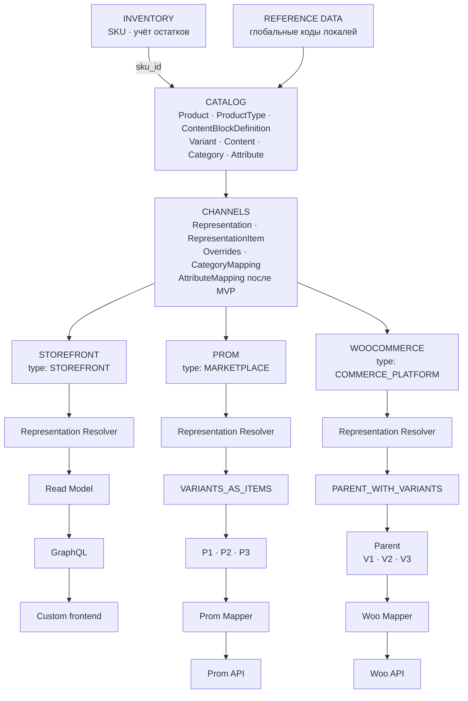

# План модуля Catalog и представлений товаров в Channels

Дата обновления: 2026-10-06. Статус: рабочий документ для дополнения.

Документ структурирует целевую модель каталога и способ её использования каналами.
Описание относится к планируемой архитектуре. Предложения по деталям реализации
и вопросы, требующие решения, выделены отдельно.

**Граница MVP:** атрибуты Catalog могут описывать товар и служить внутренними
осями его вариантов, но Channels не передаёт атрибуты и их значения во внешние
системы. В MVP нет `AttributeMapping`, `AttributeValueMapping`, проекции атрибутов
в payload Prom/Woo, проверки готовности по внешним атрибутам и редактора их
сопоставлений. Эти возможности ниже описывают целевую архитектуру после MVP.
Первый сценарий Channels — импорт публикаций; решение об обратной отправке
товаров принимается отдельно. При импорте внешние атрибуты могут сохраняться
как часть наблюдаемого исходного ответа, но не превращаются автоматически в
атрибуты Catalog.

Связанный документ: [план интеграций и каналов](channels-integrations.md).
Он задаёт подключение источников и первичный импорт; этот план уточняет товарную
модель, представления и целевой процесс публикации. Описание экспорта здесь
не означает автоматического включения всех его операций в первую версию интеграций.

## 1. Назначение и границы

Catalog хранит канонические данные товарной карточки, варианты, переводы,
контент, категории, атрибуты и их значения. Один внутренний товар может иметь
разную структуру и контент при представлении в разных каналах.

Channels хранит представления этого товара, позиции представления, переопределения
и сопоставления с внешними справочниками. Коннекторы преобразуют подготовленное
представление в формат конкретной платформы и взаимодействуют с её API.

| Слой                | Ответственность                                                                                                                                 |
|---------------------|-------------------------------------------------------------------------------------------------------------------------------------------------|
| Catalog             | Product, ProductType, ContentBlockDefinition, Variant, ProductContent, VariantContent, переводы, Category, Attribute и значения                 |
| Inventory           | Самостоятельная сущность SKU и учёт остатков по SKU; Catalog использует её через ссылку и публичный контракт                                    |
| Reference Data      | Глобальные коды локалей; не выбирает локали для tenant                                                                                          |
| Channels            | ProductRepresentation, RepresentationItem, Overrides, CategoryMapping и стратегии публикации; сопоставления атрибутов — после MVP              |
| Коннектор платформы | Platform Mapper, API Adapter, особенности протокола и внешних ресурсов                                                                          |
| Storefront          | Чтение разрешённого представления через Read Model → GraphQL → custom frontend                                                                  |

Термин «CRM Product» из исходных примеров означает внутренний `Catalog.Product`.
Он не вводит второй товарный каталог внутри модуля работы с клиентами.

В `Product` и `Variant` не помещаются `external_product_id`, идентификаторы внешних
категорий и ветвления по Prom/WooCommerce. Внешние связи принадлежат Channels.
Catalog не хранит отдельную копию товара для каждого канала.

## 2. Целевая структура



Тип канала описывает его назначение. Конкретная стратегия выбирается по провайдеру
и типу товара: общий `MARKETPLACE` не определяет одинаковую структуру для всех
маркетплейсов. Схема показывает вариативный товар; простой товар имеет одну позицию.

## 3. Каноническая модель Catalog

| Объект                 | Назначение и основные данные                                                                                                                                                      |
|------------------------|-----------------------------------------------------------------------------------------------------------------------------------------------------------------------------------|
| Product                | Стабильный внутренний ID, `kind: ProductKind` (`simple` / `variable`), ссылка `product_type_id` на схему контента, связи с контентом, вариантами, категориями и общими атрибутами |
| Variant                | Стабильный внутренний ID, product_id, ссылка sku_id на Inventory.SKU, собственный локализованный VariantContent, значения атрибутов варианта, изображение и габариты при наличии  |
| ContentBlockDefinition | Определение блока: стабильные ID и code, тип значения, is_system и переводы названия блока                                                                 |
| ProductType            | Тип товара со схемой контента: код, переводы названия, is_system и упорядоченный набор определений блоков                                                                         |
| ProductContent         | Значения блоков scope PRODUCT выбранного ProductType для конкретного товара и locale                                                                                              |
| VariantContent         | Значения блоков scope VARIANT того же ProductType для конкретного варианта и locale                                                                                               |
| Перевод контента       | Значения контентных полей для определённой locale                                                                                                                                 |
| Category               | Внутренняя категория, её название/переводы и связь с родительской категорией                                                                                                      |
| Attribute              | Внутренний атрибут: стабильный code, название/переводы, тип значения и назначение                                                                                                 |
| AttributeOption        | Стабильный ID варианта значения перечислимого атрибута, code и переводы                                                                                                           |
| Значение атрибута      | Значение общего атрибута товара либо атрибута конкретного варианта                                                                                                                |

Для вариативного товара общий текст принадлежит `ProductContent`, а локализованный
контент конкретной позиции — `VariantContent` внутри `Variant`. Число капсул не требует создания трёх независимых
карточек
каталога. Категория Catalog также существует независимо от дерева Prom или Woo.

**Подтверждённое требование:** у простого товара `SIMPLE` также есть Variant —
ровно один. Product хранит карточку и контент, а его единственный Variant — ссылку
на Inventory.SKU и данные продаваемой позиции. Для обоих типов товаров используется
одна модель Product → Variant → Inventory.SKU.
Kind `SIMPLE` не означает отсутствие вариантов или перенос SKU в Product.

**Предлагаемые инварианты:** вариант принадлежит одному товару; комбинация значений
вариативных атрибутов не дублируется внутри товара; типы значений проверяются
схемой атрибутов; дерево категорий не допускает циклов. Область уникальности кода SKU
уточняется отдельно. Для SIMPLE обязательна ровно одна запись Variant;
создание товара и его единственного варианта должно сохранять это условие.
Второй вариант нельзя добавлять при сохранении kind SIMPLE; удаление единственного
варианта не должно оставлять существующий простой товар без продаваемой позиции.

**Подтверждённое требование для VARIABLE:** больше одного Variant, то есть минимум
два. Создание или изменение VARIABLE не может оставить ноль или один вариант;
сокращение до одного требует явной смены kind на SIMPLE в том же сценарии.

### SKU и граница Inventory

**Подтверждённое требование:** SKU — самостоятельная сущность модуля Inventory.
Именно по SKU ведётся учёт остатков. Catalog.Variant сохраняет `sku_id`, ссылающийся
на эту сущность; отображаемый код SKU получает через контракт Inventory.
Идентификатор SKU и его читаемый код — разные значения.

Остаток относится к Inventory.SKU, а не к Product, Variant или RepresentationItem.
Представление товара в нескольких каналах не создаёт несколько независимых остатков.
При подготовке публикации Channels получает учётные данные по связанному `sku_id`.
Внешний артикул, импортированный из источника, сам по себе не является внутренним
`sku_id` и требует сопоставления с Inventory.

Проверка ссылки на SKU должна учитывать tenant. Связи Catalog с Inventory идут
через публичные контракты. Нужно отдельно определить, может ли несколько вариантов
или карточек ссылаться на один SKU и допустим ли вариант без SKU на стадии черновика.

Цена и остаток участвуют в эффективном представлении, но их присутствие в payload
не делает Product владельцем складского учёта или расчёта цен. Источник остатков —
Inventory с учётом по SKU; контракт доступности для канала и источник расчёта цен
должны быть определены отдельно.

### Kind и тип товара

`Product.kind` определяет число продаваемых позиций: `simple` требует ровно один
Variant, `variable` — минимум два. `ProductType` — отдельный корень Catalog,
задающий контентную схему для Product и всех его вариантов. Один тип применим к
обоим видам товара. Смена типа не меняет SKU и состав вариантов, но проверяет
весь сохранённый контент по новой схеме.

### Контент и переводы

`ContentBlockDefinition` имеет устойчивый ID, уникальный внутри tenant
неизменяемый `code`, тип `text | rich_text`, признак `is_system` и переводы
подписи. **У определения нет scope**. Все значения локализованы; общего значения
без locale нет. Системные определения нельзя удалять. Пользовательское
определение удаляется только если не используется; тип уже используемого
определения менять нельзя.

`ProductType` содержит ссылки `ProductTypeContentBlock(block_id, scope, required,
position)`. Scope (`product` либо `variant`), обязательность и порядок принадлежат
этой связи, а не определению. Один блок может быть включён один раз в PRODUCT и
один раз в VARIANT; уникальность блока и позиции проверяется отдельно в каждой
области. Пользовательский тип не обязан иметь `title`. Изменение схемы
используемого типа допускается при сохранении всех заполненных значений и
обязательных полей. Смена состава атомарна и требует `expected_schema_version`;
устаревший редактор получает `409`. Запись контента и изменение схемы
сериализуются по строке типа.

Новая tenant-схема получает системный ProductType `clean` («Чистый») и три
системных определения:

| code | type | PRODUCT | VARIANT |
| --- | --- | --- | --- |
| `title` | `text` | обязательный | необязательный |
| `description` | `rich_text` | необязательный | необязательный |
| `short_description` | `rich_text` | необязательный | необязательный |

Все определения используются в обеих областях. Системный тип нельзя удалить
или изменить его состав. Без явного `product_type_id` новый товар получает
`clean`. Создание товара или варианта без переводов допустимо; обязательные
блоки проверяются при записи конкретного перевода конкретного владельца.

`ProductContent` и контент каждого Variant содержат locale и значения по
`block_id`. На уровне HTTP блоки адресуются стабильным `code`:

```yaml
product:
  product_type: clean
  locale: uk
  blocks:
    title: "Омега-3 1000 мг"
    description: "<p>Харчова добавка</p>"
variant:
  locale: uk
  blocks:
    title: "Упаковка 100 капсул"
```

Ключ значения включает владельца, locale и block ID. Фиксированных колонок
`name`, `description` и `short_description` в Product/Variant нет. Переводы
Product и разных Variant независимы. Отсутствующий перевод возвращается как
`content: null`; автоматического fallback между языками и областями нет.

PUT `/api/console/catalog/products/{id}/contents/{locale}` и PUT
`/api/console/catalog/products/{id}/variants/{variant_id}/contents/{locale}`
принимают `{schema_version, blocks: {code: value}}` и полностью заменяют один
перевод. DELETE по тем же путям удаляет перевод. GET карточки требует явную
locale и возвращает тип, версию схемы и отдельный контент Product и каждого
Variant. Список использует только PRODUCT `title` запрошенной locale;
если его нет, интерфейс показывает SKU либо ID.

`text` хранится обычной строкой. `rich_text` — HTML-строка, очищаемая перед
сохранением Infrastructure-адаптером на `nh3` по закрытому списку тегов и
безопасных ссылок. После очистки пустое обязательное значение отклоняется.
Подписи блоков могут иметь другие переводы, чем содержимое товара.

CRUD определений и ProductType доступен в Console. Редактор типа показывает
независимые группы PRODUCT и VARIANT. Формы товара строятся по полученной схеме;
первоначальная locale берётся из языка интерфейса пользователя и может быть
изменена. Rich text редактируется через Tiptap для Vue 3.

После `0011_inventory_skus` одна начальная миграция `0012_catalog` создаёт всю
схему Catalog и seed `clean`. Прежние одноразовые ревизии Catalog заменены,
поэтому локальная тестовая БД с ними пересоздаётся. Переноса прежних фиксированных
полей нет: в развёрнутой среде эти миграции не применялись.

Catalog хранит переводы исходного контента. Будущие Channels получают locale
явно и проецируют значения по собственным правилам; передача атрибутов во
внешние системы не входит в MVP.

### Языки контента Catalog

Catalog не хранит список разрешённых языков и язык по умолчанию. Каждый перевод
помечен явным кодом BCP 47 из глобального `reference_data`; при записи код должен
быть активным. Наличие кода не означает наличия перевода. Коды без региона (`uk`,
`ru`, `sr-Latn`, `sr-Cyrl`) и региональные варианты могут сосуществовать.
Товар можно создать без переводов, а затем записать их отдельно. Чтение требует
явный код: отсутствующий перевод возвращается как `content: null`, без fallback.
Неактивный позднее код не делает ранее записанный перевод нечитаемым.

В будущем frontend выбирает язык карточки через select, первоначально используя
язык интерфейса из профиля пользователя. Это правило frontend, а не настройка
Catalog или Tenancy. Локаль публикации выбирают Channels отдельно.

## 4. Примеры простого и вариативного товара

### Простой товар: NOW Vitamin C 1000

```text
Product: PRODUCT-SIMPLE
    kind: simple
    product_type_code: default

ProductContent:
    title: NOW Vitamin C 1000
    description: общий текст карточки
    translations: по явным кодам локалей из глобального справочника

Inventory.SKU SKU-C1000:
    code: VITAMIN-C-1000
    остатки учитываются по SKU-C1000

Variant V-C1000:
    product_id: PRODUCT-SIMPLE
    sku_id: SKU-C1000
    VariantContent: short_description по явным locale, при наличии
    attributes: характеристики единственной позиции
    image / dimensions: при наличии

        Product SIMPLE
        NOW Vitamin C 1000
                │
                ▼
         Variant V-C1000
                │ sku_id
                ▼
      Inventory.SKU SKU-C1000
```

Общий контент и переводы принадлежат ProductContent; short_description единственного
варианта — VariantContent. SKU и остатки относятся
к Inventory, связь с ними хранится в единственном Variant. Характеристики позиции
можно хранить у Variant даже при отсутствии выбора между несколькими вариантами.
Цена и доступный остаток поступают в представление по тем же контрактам,
которые используются для вариативного товара.

В каждом канале создаётся одна ProductRepresentation с `SINGLE_ITEM`
и ровно один RepresentationItem роли `SINGLE`. Он ссылается одновременно
на PRODUCT-SIMPLE и V-C1000; `internal_variant_id` не равен `NULL`.

| Канал | Representation | Роль item | internal_variant_id | Внешняя структура |
| --- | --- | --- | --- | --- |
| PROM-MAIN | REP-SIMPLE-PROM | SINGLE | V-C1000 | Один товар Prom, например #901 |
| WOO-UA | REP-SIMPLE-WOO | SINGLE | V-C1000 | Один Woo product типа simple, например #902 |
| STOREFRONT | REP-SIMPLE-STOREFRONT | SINGLE | V-C1000 | Одна позиция Read Model без внешнего ID |

Внешние номера — иллюстрация. В Woo внутренний Variant простого товара
не становится дочерней Woo variation: он даёт SKU, изображение и данные позиции
для одной общей товарной публикации. Отдельный внешний parent не создаётся.
В Prom также публикуется один товар.

Resolver объединяет ProductContent, разрешённые overrides и данные единственного
Variant в одну `EffectiveRepresentationItem`. Контент разрешается по обычному
каскаду item → representation → Catalog. Для Woo роли `SINGLE` доступны title
и description: запрет variation description относится только к роли Woo `VARIANT`.

```text
ProductContent + Variant V-C1000 + Inventory data + Overrides
                            ↓
                         Resolver
                            ↓
             EffectiveRepresentationItem (SINGLE)
                            ↓
             PublicationPlan(parent=None, items=[single])
                            ↓
                Prom / Woo mapper → один товар
```

### Вариативный товар: NOW Omega 3

```text
Product: PRODUCT-123
    kind: variable
    product_type_code: default
ProductContent:
    title: NOW Omega 3
    description: общий текст

Inventory.SKU SKU-100: code = OMEGA-100, остатки учитываются по SKU-100
Inventory.SKU SKU-200: code = OMEGA-200, остатки учитываются по SKU-200
Inventory.SKU SKU-500: code = OMEGA-500, остатки учитываются по SKU-500

Variant V100: sku_id = SKU-100, capsules = 100, short_description = упаковка 100 капсул
Variant V200: sku_id = SKU-200, capsules = 200, short_description = упаковка 200 капсул
Variant V500: sku_id = SKU-500, capsules = 500, short_description = упаковка 500 капсул

                  PRODUCT-123
                  NOW Omega 3
                       │
            ┌──────────┼──────────┐
            │          │          │
           V100       V200       V500
```

Внутри Catalog это один товар с тремя вариантами. Title/description локализуются
у Product, short_description — отдельно у V100/V200/V500. Ни топология внешних публикаций,
ни количество внешних карточек не меняют эту структуру.

## 5. ProductRepresentation и RepresentationItem

`Representation` и `ProductRepresentation` в этом документе — одно понятие.
ProductRepresentation связывает внутренний товар с конкретным каналом и задаёт
стратегию представления. RepresentationItem описывает отдельную позицию этой структуры.

| Объект | Основные поля |
| --- | --- |
| ProductRepresentation | id, product_id, channel_id, strategy/topology |
| RepresentationItem | id, representation_id, internal_product_id, internal_variant_id, role, external_id при наличии |
| Representation Override | representation_id, поле, locale при необходимости, значение переопределения |
| RepresentationItem Override | representation_item_id, поле, locale при необходимости, значение переопределения |

Предлагаемые роли: `SINGLE`, `PARENT`, `VARIANT`. Конкретный набор позиций
определяет стратегия. `internal_variant_id` у Woo parent равен `NULL`;
у вариаций и Prom-позиций явно указывает на соответствующий Variant.
У позиции `SINGLE` простого товара он указывает на единственный Variant.
Product ID позиции должен совпадать с товаром её representation.

Внешний ID хранится у позиции или в её external binding; один Product может
соответствовать нескольким внешним ресурсам. Окончательное физическое хранение
этих связей уточняется при проектировании схемы данных.
Для дочернего ресурса binding также должен сохранять внешний parent ID.
Внешняя идентичность учитывает подключение, тип ресурса и scope, а не только число ID.

Для Storefront external ID не требуется: representation используется для чтения.

### WooCommerce representation

```text
REP-001:
    product_id: PRODUCT-123
    channel_id: WOO-UA
    strategy: PARENT_WITH_VARIANTS
```

| Item | Роль | internal_product_id | internal_variant_id | external_id | Внешний parent |
| --- | --- | --- | --- | --- | --- |
| ITEM-1 | PARENT | PRODUCT-123 | NULL | 555 | — |
| ITEM-2 | VARIANT | PRODUCT-123 | V100 | 556 | 555 |
| ITEM-3 | VARIANT | PRODUCT-123 | V200 | 557 | 555 |
| ITEM-4 | VARIANT | PRODUCT-123 | V500 | 558 | 555 |

### Prom representation

```text
REP-002:
    product_id: PRODUCT-123
    channel_id: PROM-MAIN
    strategy: VARIANTS_AS_ITEMS
```

| Позиция | internal_variant_id | Внешний товар |
| --- | --- | --- |
| Prom Item V100 | V100 | 86571 |
| Prom Item V200 | V200 | 86572 |
| Prom Item V500 | V500 | 86573 |

Все внешние номера приведены как иллюстрация модели, а не как реальные ресурсы.

## 6. PublicationTopology и стратегии

```python
class PublicationTopology(Enum):
    SINGLE_ITEM = "single_item"
    PARENT_WITH_VARIANTS = "parent_with_variants"
    VARIANTS_AS_ITEMS = "variants_as_items"
```

| Товар | Prom | WooCommerce |
| --- | --- | --- |
| SIMPLE | SINGLE_ITEM | SINGLE_ITEM |
| VARIABLE | VARIANTS_AS_ITEMS | PARENT_WITH_VARIANTS |

Для SIMPLE обе стратегии строят одну позицию роли SINGLE, связанную с единственным
Variant. Для VARIABLE `WooCommercePublicationStrategy` строит parent и вариации,
а `PromPublicationStrategy` делает каждый вариант самостоятельной публикуемой позицией
(`FLATTEN_VARIANTS` — описание преобразования, а не дополнительная topology).
Для Rozetka, Amazon, Shopify и следующих интеграций топология задаётся отдельно.

PublicationTopology описывает форму результата. PublicationStrategy также задаёт
роли позиций, допустимые поля и зависимости операций. Новая платформа использует
одну из топологий либо расширяет набор при обоснованной необходимости;
одного значения enum недостаточно для готовой интеграции.

Общий сценарий выбирает стратегию через registry и вызывает её контракт.
Условия вида `if platform == "prom"` не помещаются в Product или общий use case.
Специфика платформы сосредоточена в её стратегии и адаптере.

Предлагаемый результат — `PublicationPlan(parent, items, dependencies)`.
Для SIMPLE в обоих каналах parent отсутствует, items содержит одну позицию.
Для VARIABLE в Woo parent должен существовать до отправки дочерних вариаций;
в Prom план примера содержит три товарные позиции без публикуемого parent.
Эти стратегии описывают целевую публикацию после MVP. Внешняя публикация VARIABLE
не входит в MVP: выбранная стратегия Woo строит вариации по внешним атрибутам,
а передача таких атрибутов отложена. Внутренний Catalog.VARIABLE можно
проектировать и реализовывать независимо от этой операции Channels.

## 7. Контент WooCommerce

Для SIMPLE будущая отправка общего контента и данных единственного Variant
может использовать один Woo product типа simple через роль SINGLE без атрибутов.
Для VARIABLE целевая стратегия после MVP использует
общий контент у Woo parent:

```text
Woo Product #555
    name
    description        ← Catalog или override представления/parent
    images
    attributes         ← в том числе доступные значения вариативных атрибутов

    Variation #556: SKU OMEGA-100
    Variation #557: SKU OMEGA-200
    Variation #558: SKU OMEGA-500
```

В целевой стратегии после MVP variation получает SKU, цену, остаток, изображение,
габариты и атрибуты варианта. В MVP такой payload не формируется.
Общий текст карточки не копируется в description каждой variation.
Схема commerce-полей и источники цены/остатка уточняются отдельно.

Woo REST API адресует variation как дочерний ресурс:
`/products/{product_id}/variations/{variation_id}`; поле `description` у variation
существует. Отказ от его использования — выбранное правило нашей модели.
[Официальная документация WooCommerce](https://woocommerce.github.io/woocommerce-rest-api-docs/#product-variation-properties).

Пример: если Catalog description равен «Omega-3 жирные кислоты…», а у WOO-UA
задан override «Омега-3 NOW Foods…», Woo parent получает текст override.
Variation не получает этот текст независимо от возможности API.
Catalog.VariantContent хранит short_description независимо от платформы. В текущем
плане экспорта Woo этот блок также не отправляется в variation; его наличие в Catalog
не включает внешнюю операцию. Правило отображения variant short_description в Woo
требует отдельного решения Channels.
Контентные overrides для роли Woo VARIANT должны быть недоступны для редактирования
и отклоняться при попытке сохранения через API. Overrides разрешённых полей
изображения и commerce-данных рассматриваются отдельно.

## 8. Контент Prom

Для целевой публикации после MVP принимается `VARIANTS_AS_ITEMS`: каждый вариант
становится отдельной publishable unit со своим названием и описанием.

```text
Prom #86571: NOW Omega 3 100 капсул → description V100
Prom #86572: NOW Omega 3 200 капсул → description V200
Prom #86573: NOW Omega 3 500 капсул → description V500
```

Это выбранная стратегия нашего представления. Prom поддерживает разновидности
товаров; их наличие не требует строить Catalog по структуре WooCommerce.
[Справка Prom о разновидностях](https://support.prom.ua/hc/uk/articles/360005208678-%D0%94%D0%BE%D0%B4%D0%B0%D0%B2%D0%B0%D0%BD%D0%BD%D1%8F-%D1%80%D1%96%D0%B7%D0%BD%D0%BE%D0%B2%D0%B8%D0%B4%D1%96%D0%B2-%D0%B4%D0%BE-%D1%82%D0%BE%D0%B2%D0%B0%D1%80%D1%83).

Название и описание каждой позиции могут задаваться item override. Автоматическое
построение названия из общего title и атрибутов варианта требует отдельного правила;
mapper не должен самостоятельно дописывать число капсул. Short_description берётся
из VariantContent конкретной позиции; как включать его во внешнее описание или
другое поле, Channels определяет явным правилом проекции до отправки. Он не
заменяет Product.description автоматически.
Группировка позиций и конкретные операции их создания через Prom API проверяются
при проектировании коннектора; приведённая схема не утверждает контракт его API.

## 9. Overrides и каскад наследования

Поддерживаются два уровня переопределений: representation и representation item.

```text
Canonical Content по scope (Product / конкретный Variant)
          ↓
Channel Representation Override
          ↓
Representation Item Override
          ↓
Effective value
```

Приоритет поля: item override → representation override → Catalog.
Resolver применяет его по каждому полю и locale, с учётом допустимых полей роли.
Для нового перевода код должен быть активен в глобальном справочнике;
Catalog не хранит списка разрешённых языков. Локаль публикации Channels проверяет отдельно.
Источник Catalog выбирается по scope связи ProductTypeContentBlock: ProductContent для PRODUCT,
VariantContent связанного Variant для VARIANT. Приоритет overrides применяется
внутри одного блока, scope и locale, без наследования значений между Product и Variant.
Для Woo роли PARENT используются PRODUCT-блоки; остальные роли получают только
разрешённые стратегией блоки. Для Prom базовые данные позиции могут включать оба scope.

| Поле                             | Catalog             | Prom representation  | Prom V100 item     | Эффективное V100    | Источник               |
|----------------------------------|---------------------|----------------------|--------------------|---------------------|------------------------|
| title                            | Omega 3             | Наследовать          | Omega 3 100 капсул | Omega 3 100 капсул  | Item                   |
| description                      | Base description    | Prom SEO description | V100 description   | V100 description    | Item                   |
| short_description (VARIANT V100) | Упаковка 100 капсул | Наследовать          | Наследовать        | Упаковка 100 капсул | Catalog.VariantContent |

В примере товар использует clean: title/description — PRODUCT, short_description
— VARIANT. Таблица показывает внутренние эффективные значения, а не готовый payload
Prom. Overrides адресуют определение блока, его scope и locale, проверяются по
схеме ProductType и ограничениям роли канала. Для VARIANT-блока item должен иметь
internal_variant_id; PARENT без связанного Variant не может получить такой блок. Произвольный новый блок через override
не создаётся.

Без item override description берётся из representation, а при отсутствии
обоих overrides — из Catalog. Переопределение одного канала не меняет другой
канал и не переписывает канонический контент.

**Предлагаемая семантика:** различать «Наследовать», «Задать значение» и «Очистить».
Выбор источника определяется наличием операции override, а не истинностью значения.
Выражение `item_override or representation_override or catalog_value` иллюстрирует
приоритет, но не подходит как реализация: пустая строка, `0` или `false` могут
быть намеренно заданным значением. Очистка обязательного поля должна приводить
к ошибке валидации, а не к скрытому возврату родительского значения.

Предлагается сохранять provenance: какой уровень дал итоговое значение.
Это позволит объяснять пользователю результат preview.

## 10. Representation Resolver и границы mapper

Целевой поток подготовки внешней публикации:

```text
Catalog + Representation/Item Overrides + CategoryMapping + commerce data
                              ↓
                    Representation Resolver
                              ↓
          EffectiveRepresentation / EffectiveRepresentationItem
                              ↓
                     Publication Strategy
                              ↓
                        PublicationPlan
                              ↓
                       Platform Mapper
                              ↓
                          API Adapter
```

Registry выбирает стратегию заранее. Её topology и правила допустимых полей
известны resolver; после разрешения данных стратегия формирует план операций.
Это позволяет сохранить порядок Resolver → Strategy → Mapper без круговой зависимости.

Resolver выбирает значения контента, применяет overrides и определяет эффективные
категории с учётом их mappings. Разрешение внешних атрибутов и проверка их
полноты добавляются после MVP.
Предлагается передавать туда цены и остатки как явно полученные DTO;
остатки получает контракт Inventory по связанному `sku_id`.
Он не вызывает внешние API.

`EffectiveRepresentationItem` содержит разрешённые блоки контента по code (PRODUCT: title/description; VARIANT:
short_description связанного варианта),
category,
images, SKU и разрешённые commerce-поля. Channels явно задаёт, как дополнительные
блоки включаются во внешнее описание или отдельные поля; они не склеиваются в Catalog.
Поле `attributes` и его заполнение для внешнего payload относятся к этапу после MVP.
Mapper переводит канонический title в поле названия платформы (например name Woo).
Набор полей зависит от роли; для Woo variation текстовые поля исключаются.

Контракты mappers из исходной модели:

```text
PromProductMapper.map(EffectiveRepresentationItem) → PromProductPayload
WooProductMapper.map_single(EffectiveRepresentationItem) → WooProductPayload
WooProductMapper.map_parent(EffectiveRepresentation) → WooProductPayload
WooProductMapper.map_variant(EffectiveRepresentationItem) → WooVariationPayload
```

Mapper преобразует структуру, имена полей и типы в формат платформы.
Он не выбирает description, не применяет fallback и не решает топологию товара.
Если операция создания возвращает внешний ID parent, адаптер подставляет его
в последующие операции по зависимостям плана.

## 11. CategoryMapping

Категории Catalog канонические:

```text
Supplements
    └── Omega 3
```

Сопоставления принадлежат конкретному connection:

| Внутренняя категория | Connection | Внешняя категория |
| --- | --- | --- |
| Omega 3 | PROM-MAIN | Prom 12345 |
| Omega 3 | WOO-UA | Woo 82 |
| Omega 3 | WOO-PL | Woo 119 |

Основные поля: `catalog_category_id`, `connection_id`, `external_category_id`.
Два магазина одной платформы могут использовать разные деревья и внешние ID,
поэтому одного `provider` в ключе сопоставления недостаточно.

Representation связан с channel, mapping — с connection, обслуживающим этот channel.
Нельзя использовать mapping другого подключения только потому, что provider совпадает.
Для SIMPLE товар явно принадлежит нулю или нескольким внутренним категориям.
При непустом наборе ровно одна основная; родительские категории не добавляются
автоматически. Выбор внешней категории для отдельного channel уточняется в Channels.

## 12. AttributeMapping и AttributeValueMapping

**После MVP.** В первой версии нет этих сущностей, их SQL-таблиц, API и UI;
Channels не читает внутренние значения атрибутов для внешнего payload. Наличие
атрибутов в Catalog само по себе не включает их отправку. Экспорт вариативных
товаров с осями вариантов требует отдельного следующего среза Channels.

В Catalog атрибут имеет собственную идентичность:

```text
dosage_form
    capsule
    softgel
    tablet
```

В представлении Prom ему может соответствовать «Форма выпуска», а в Woo — `pa_form`.
Это примеры сопоставления, а не обязательные внешние ID или имена для любого магазина.

| Mapping | Основные поля |
| --- | --- |
| AttributeMapping | catalog_attribute_id, connection_id, external_attribute_id |
| AttributeValueMapping | attribute_mapping_id, internal_option_id, external_option_id или external_value |

AttributeValueMapping связан с конкретным AttributeMapping, чтобы значение из
одного подключения или атрибута не попало в другое. Перевод названия option
и сопоставление внешнего option ID — разные операции.

Для Prom в модели учитывается контекст внешней категории: набор основных
характеристик задаётся её схемой, дополнительные пользовательские характеристики
обрабатываются отдельно. Конкретная схема и способ получения справочника проверяются
при реализации адаптера. Пользовательские характеристики отличаются от основных:
по справке Prom, они выводятся в карточке, но не участвуют в фильтрах каталога.
[Правила оформления товаров Prom](https://support.prom.ua/hc/uk/articles/360017589018-%D0%9F%D1%80%D0%B0%D0%B2%D0%B8%D0%BB%D0%B0-%D0%BE%D1%84%D0%BE%D1%80%D0%BC%D0%BB%D0%B5%D0%BD%D0%BD%D1%8F-%D1%82%D0%BE%D0%B2%D0%B0%D1%80%D1%96%D0%B2-%D1%82%D0%B0-%D0%BF%D0%BE%D1%81%D0%BB%D1%83%D0%B3).

**Предложение:** для mappings категорийных характеристик добавить scope внешней
категории. Resolver сначала определяет категорию, затем использует mappings её схемы.
Тип значения, единица измерения и допустимые options проверяются до отправки.
Отсутствующее обязательное сопоставление должно давать ошибку готовности;
mapper не должен произвольно угадывать категорию или характеристику.

## 13. Storefront

Storefront — канал типа `STOREFRONT`, использующий тот же канонический Catalog
и механизм представлений/overrides:

```text
Catalog → Storefront Representation → Resolver → Read Model → GraphQL → Custom frontend
```

Для собственной витрины не требуется внешний Product ID или вызов Prom/Woo API.
Read Model содержит эффективное состояние конкретного канала и locale;
GraphQL предоставляет его custom frontend.
Read Model служит для чтения и не становится отдельным источником товарного контента.
Форма выдачи простых/вариативных товаров, доступность черновиков, обновление проекции
и scope mappings витрины уточняются отдельно.

## 14. Связь с первичным импортом каналов

Ранее зафиксированное требование сохраняется: при добавлении Prom/WooCommerce
нужно загрузить все существующие товарные публикации выбранного источника.
Загрузка сначала фиксирует наблюдаемое внешнее состояние и идентичность ресурсов.

Правила обратного преобразования требуют отдельного решения. Woo parent и его
вариации могут быть кандидатами на один внутренний Product. Несколько Prom-позиций
нельзя автоматически объединять в вариативный товар только по похожему названию
или SKU. Стратегия экспорта не является достаточным правилом обратного импорта.

До утверждения import policy не предполагаются автоматическое переписывание Catalog,
автоматическое создание overrides из всех внешних полей или объединение карточек.
Импортированные публикации должны быть доступны даже до их сопоставления с Catalog.

## 15. Предлагаемые правила согласованности

- Все сущности, mappings и внешние связи изолированы по tenant.
- Связь item с Variant проверяется относительно Product представления.
- Стабильные внутренние ID не меняются из-за смены внешнего ID или topology.
- Повтор внешней операции не создаёт новую публикацию, если её результат уже связан с item.
- Частичный успех Woo parent/variations или нескольких Prom-позиций сохраняется по item.
- Изменение Catalog обновляет наследуемые значения; явные overrides сохраняются.
- Смена topology, удаление варианта и удаление representation требуют плана обработки
  существующих внешних ресурсов; внешние публикации не удаляются неявно.
- Версии контента, overrides и сопоставлений категорий учитываются при построении
  плана; сопоставления атрибутов подключаются к этому правилу после MVP;
  запоздавший ответ старого запуска не подтверждает синхронизацию новой версии.

Это предлагаемые технические инварианты. Порядок обновления и модель ревизий
нужно закрепить при проектировании контрактов и хранения.

## 16. Этапы реализации

| Этап | Состояние |
| --- | --- |
| Inventory.SKU и глобальные коды локалей | Реализованы; Catalog проверяет SKU и активную locale через Application-контракты |
| Product SIMPLE/VARIABLE и Category | Реализованы; варианты связаны с Inventory.SKU, категории образуют отдельное дерево |
| ProductType и контент-блоки | Реализованы: определения, типы, динамические переводы PRODUCT/VARIANT, CRUD Console и редакторы |
| Атрибуты и свойства ProductType | Следующий срез; функциональный scope ещё согласовывается |
| Channels: представления, overrides и mappings категорий | Отдельный этап после согласования контрактов |
| Передача атрибутов внешним системам | За пределами MVP |
| Storefront | Отдельный этап после контрактов Catalog и Channels |

Начальная миграция Catalog — `0012_catalog` после `0011_inventory_skus`.
Схема `clean` содержит `title`, `description`, `short_description` в PRODUCT и
VARIANT; обязателен только PRODUCT `title`. Пользовательские определения и типы
доступны через Console. Схема ProductType и контент сохраняются в одной tenant
UoW; старая версия редактора и несовместимое изменение возвращают `409`.

## 17. Критерии приёмки текущего среза

1. SIMPLE имеет один Variant, VARIABLE — минимум два; каждый вариант ссылается на
   SKU того же tenant. Разные товары могут использовать один SKU.
2. Определение блока не имеет scope и может использоваться одновременно в PRODUCT
   и VARIANT с разной обязательностью и позицией.
3. Товар и вариант создаются без переводов. При записи перевода проверяются только
   обязательные блоки его области и locale; автоматического fallback нет.
4. Значения по владельцу, locale и block ID хранятся без фиксированных текстовых
   колонок. Неизвестные блоки и блоки вне схемы отклоняются.
5. `rich_text` очищается до сохранения, обязательное пустое значение отклоняется.
6. Смена типа проверяет контент товара и всех вариантов. Конкурентное изменение
   схемы, удаление используемого блока и добавление обязательного блока при
   недостающих значениях дают конфликт без частичной записи.
7. Данные двух tenant изолированы. SQLAlchemy metadata соответствует миграции.
8. Console отображает схему типа и формы PRODUCT/VARIANT, позволяет выбирать язык;
   карточка и список не показывают несуществующие цены, остатки и медиа.

## 18. Открытые вопросы следующих срезов

- Как определить типы атрибутов и их использование как осей вариаций?
- Как Channels выбирает locale и строит эффективный контент публикации?
- Как обрабатывать внешние публикации при изменении структуры вариантов?
- Какие контракты цены, остатков и медиа понадобятся карточке и каналам?
- Когда вводить сопоставление атрибутов для Prom и Woo после MVP?

## 19. История уточнений

| Дата | Изменение |
| --- | --- |
| 2026-10-04 | Inventory.SKU выделен как самостоятельная сущность; Catalog.Variant хранит `sku_id`. |
| 2026-10-05 | Tenancy не ограничивает locale; Catalog.SIMPLE и Category получили tenant-хранение. |
| 2026-10-06 | Product.kind разделён на SIMPLE/VARIABLE; базовый CRUD Product/Variant реализован. |
| 2026-10-06 | Контент перестроен на ProductType и определения без scope; `clean` seed включает три блока в PRODUCT и VARIANT. Прежние одноразовые миграции Catalog заменены `0012_catalog`. |
| 2026-10-06 | Внешние сопоставления и передача атрибутов исключены из MVP. |
