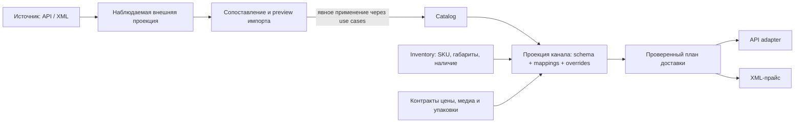

# План перестройки Catalog и последующего подключения каналов продаж

Дата обновления: 2026-10-07. Статус: целевой план; границы, помеченные как
предложения или открытые решения, требуют согласования перед реализацией.

Catalog строится как самостоятельная товарная модель. У WooCommerce заимствуется
подход к четырём видам товара, вариациям и дополнительным свойствам. Внутренние
классы, хранение и контракты следуют DDD + Clean Architecture этого проекта.
На эту модель затем накладываются проекции и синхронизация разных источников.

Связанные документы:

- [Архитектурные правила](../architecture/AGENTS.md).
- [Текущая реализация Catalog](../modules/catalog.md).
- [Текущая реализация Inventory](../modules/inventory.md).
- [Текущая реализация Channels](../modules/channels.md).
- [План интеграций и каналов](channels-integrations.md).

Этот документ заменяет прежний план Catalog. Сначала уточняются его объекты,
инварианты и публичные контракты, затем пересматриваются границы Inventory,
Channels, проекций и синхронизации. Описание будущего мастера каналов фиксирует
продуктовый результат, но не объявляет все его возможности уже реализованными.
Прежнее ограничение «внешние атрибуты не входят в MVP» описывало предыдущий срез:
в новом целевом плане их загрузка, управление и сопоставление обязательны для
этапа Channels. Очерёдность выпуска определяется этапами ниже.

## 1. Подтверждённые требования и исходное состояние

### Подтверждённые требования

1. Ровно четыре базовых вида: `simple`, `variable`, `grouped`, `external`.
2. `virtual` и `downloadable` («Загрузка файла») — дополнительные свойства,
   которые не расширяют перечисление видов товара.
3. `ProductType` — отдельный пользовательский тип **контента**. Он определяет
   набор блоков; системный Default / «Чистый» покрывает обычную карточку,
   пользовательские типы покрывают специальные задачи.
4. Контент локализуется: схема блока применяется к значениям для явных локалей.
   ProductType не является продаваемой вариацией размера, цвета и т. п.
5. SKU и складской учёт принадлежат Inventory. Виртуальная продаваемая позиция
   не требует доставки и не имеет связи с Inventory.SKU. Для физической позиции
   доступна связь с SKU; наличие карточки само по себе не создаёт SKU.
6. Габариты физического товара задаются через SKU.
7. Нужны варианты упаковки по количеству или другой единице измерения.
   Владелец этого контекста пока не определён.
8. После определения границы Catalog проектируются Channels, внешние проекции,
   сопоставления и синхронизация. Для канала выбирается способ доставки карточек:
   API либо XML-прайс, согласно возможностям источника.

### Что уже существует и что предстоит изменить

| Область | Текущий срез | Цель этого плана |
| --- | --- | --- |
| Виды товара | SIMPLE и VARIABLE | Все четыре вида с отдельными правилами структуры |
| Продаваемая позиция | Variant внутри Product; SKU обязателен | Variant сохраняется для SIMPLE/VARIABLE; SKU зависит от физической природы позиции |
| Контент | ProductType, блоки, PRODUCT/VARIANT, явные локали | Сохранить этот подход и применить его ко всем четырём видам |
| Inventory | Справочник SKU | Добавить согласованные контракты габаритов, единиц и дальнейшего складского учёта |
| Атрибуты, метки, медиа | Полного контракта Catalog ещё нет | Спроектировать по назначению и владельцу |
| Channels | Подключения и Read-импорт внешних публикаций | Мастер настройки, связи с Catalog, схемы, mappings, управление справочниками и доставка |

Архитектурные правила сейчас описывают два вида товара, обязательную SKU каждого
Variant и четыре корня Catalog. Перед внедрением новой модели нужно явно обновить
эти предметные положения: четыре вида, условную связь с SKU и согласованный набор
новых корней. Общие требования к слоям, агрегатам, DTO и транзакциям сохраняются.
Документ `docs/modules/catalog.md` до реализации продолжает описывать работающий
код; новый план не является доказательством готовности функций.

## 2. Термины и четыре вида товара

| Понятие | Значение |
| --- | --- |
| `ProductKind` | Фиксированная бизнес-структура: SIMPLE, VARIABLE, GROUPED, EXTERNAL |
| `ProductType` | Настраиваемая схема контента: Default, одежда, оборудование и другие пользовательские типы |
| `Variant` | Продаваемая позиция внутри SIMPLE или VARIABLE, например красная футболка размера M |
| `AttributeDefinition` | Определение характеристики; может участвовать в выборе вариации |
| `ExternalPublication` | Наблюдаемая карточка внешнего источника, ещё не обязательно связанная с Catalog |
| `PublicationSchema` | Будущий контракт структуры публикации конкретного источника и роли ресурса |

Создание нового ProductType не добавляет пятый ProductKind. Смена ProductType
не меняет автоматически вид товара, вариации, физическую природу или SKU.
`variation` из внешнего payload — дочерняя позиция, а не пятый вид Product.

| Вид | Смысл | Предлагаемая внутренняя структура | SKU и доставка |
| --- | --- | --- | --- |
| SIMPLE | Одна продаваемая позиция без выбора комбинации | Product и ровно один Variant | Через Variant, если он физический |
| VARIABLE | Выбор между вариациями по характеристикам | Product, оси выбора и минимум два Variant | Независимо для каждого физического Variant |
| GROUPED | Общая карточка нескольких самостоятельных товаров | Product и упорядоченные ссылки на другие Product | Участники сохраняют собственные позиции и складские связи |
| EXTERNAL | Карточка с переходом к покупке у внешнего продавца | Product и описание внешней покупки | Собственного складского исполнения в нашей системе нет |

Четыре вида и независимые признаки опираются на
[настройки товаров WooCommerce](https://woocommerce.com/document/managing-products/product-editor-settings/).
Вложенность классов и правила SKU в этом плане — решения нашей модели.

Для SIMPLE/VARIABLE сохраняется текущий инвариант один / минимум два Variant,
включая черновики. Изменение VARIABLE до одной позиции выполняется явным переходом
в SIMPLE в одной операции. Для незавершённой импортированной карточки существует
внешняя проекция: ради неё не создаётся некорректный канонический Product.

GROUPED хранит ссылки на самостоятельные товары, а не владеет их агрегатами.
Удаление группы не удаляет участников. Группа не означает комплект с одной ценой,
единым SKU или списанием нескольких компонентов: такой сценарий потребует
отдельного решения. Это соответствует исходной идее
[группированных товаров WooCommerce](https://woocommerce.com/document/managing-products/add-product/).
Предложение для первого среза — участники SIMPLE; поддержку VARIABLE и EXTERNAL
в составе группы согласовать отдельно. Самоссылки, повторы и циклы запрещены.

EXTERNAL содержит бизнес-ссылку покупки и локализованную подпись кнопки.
`purchase_url` отличается от ID внешней публикации и от URL подключения канала.
Покупка и исполнение происходят на стороне продавца; собственные Variant,
Inventory.SKU, доставка и выдача файлов для этой карточки не создаются.
Это предлагаемая граница EXTERNAL, которую нужно утвердить на этапе 0.

## 3. Объектная модель: из каких классов собирается Product

Предлагается композиция одного агрегата Product с типизированной структурой.
Наследование четырёх ORM-моделей или перенос классов `WC_Product_*` не требуется.
Имена ниже описывают целевые доменные роли; это не готовый программный код.

```text
Product                                      Aggregate Root
├── id: ProductIdVO
├── kind: ProductKind
├── product_type_id: ProductTypeIdVO          ссылка на другой Aggregate Root
├── revision, audit
├── content: ProductContent                  локализованные значения PRODUCT
│   └── translations[LocaleVO]
│       └── values[ContentBlockIdVO]: ContentValueVO
├── classifications: ProductClassifications
│   ├── category_ids + primary_category_id
│   └── tag_ids
├── attributes: ProductAttributeValues       общие характеристики
├── media: ProductMediaReference[]           ссылки на активы, порядок, подписи
├── relations: RelatedProductLink[]          ID для upsell/cross-sell, если включены
└── structure: ровно один из четырёх объектов
    ├── SimpleProductStructure
    │   └── variant: Variant
    ├── VariableProductStructure
    │   ├── axes: VariationAxis[]
    │   ├── default_selection: VariationSelectionVO | None
    │   └── variants: Variant[]
    ├── GroupedProductStructure
    │   └── members: GroupedProductLink[]     ID, порядок; не объекты Product
    └── ExternalProductStructure
        └── purchase: ExternalPurchaseVO     purchase_url, подписи по locale

Variant                                      Entity внутри Product
├── id: VariantIdVO
├── selected_attributes: VariationSelectionVO
├── virtual: bool
├── downloadable: bool
├── sku_id: SkuIdVO | None                    ссылка на Inventory
├── content: VariantContent
│   └── translations[LocaleVO]
│       └── values[ContentBlockIdVO]: ContentValueVO
├── media: VariantMediaReference[]
└── download: DownloadSpecification | None
    ├── files: DownloadAssetReference[]       стабильный asset ID, имя, порядок
    └── policy: DownloadPolicyVO             лимит и срок, если включены
```

`kind` и выбранная `structure` всегда согласованы. Их нельзя независимо менять
обычным обновлением полей. Product выполняет создание, восстановление и переходы
вида через доменные методы, проверяющие всю структуру и сохранённый контент.
Четыре объекта структуры — внутренние компоненты Product, не самостоятельные
агрегаты. Variant, его контент и связи не получают отдельных write repositories.

`ProductMediaReference`, `RelatedProductLink` и политика скачивания — предложения
к следующей детализации; они не означают наличие готового Media, Pricing или
Digital Delivery модуля. Загружать бинарные файлы внутрь агрегата нельзя.

### Самостоятельные корни и ссылки

| Aggregate Root | Владеет | Что хранит Product |
| --- | --- | --- |
| Product | Структура выбранного вида, Variant, значения контента, назначенные связи | Собственное состояние |
| ProductType | Версия схемы и упорядоченные связи с блоками | `product_type_id` |
| ContentBlockDefinition | Код, тип значения, системность, переводы подписи | Значения по ID блока, проверенные по снимку схемы |
| Category | Переводы и место в дереве категорий | Явно назначенные ID и основной ID |
| AttributeDefinition — предлагаемый новый корень | Тип значения, единица при необходимости, локализованные подписи и AttributeOption | Значения и ссылки на определения/options |
| Tag — предлагаемый новый корень | Стабильная идентичность и локализованные подписи метки | Назначенные ID |

AttributeOption принадлежит AttributeDefinition. Категории, метки и определения
не вкладываются в Product целиком. Brand и произвольные внутренние таксономии
требуют решения о самостоятельном корне или ограниченной модели Taxonomy;
универсальный конструктор любых сущностей в этот срез не закладывается.

Product получает неизменяемый снимок ProductType и необходимых определений через
Application-контракты. Инварианты контента проверяет доменная политика Product.
Общая служба, объединяющая жизненные циклы Product и ProductType, не нужна.

## 4. ProductType, блоки и локали

Схема контента образуется из определений и связей:

```text
ContentBlockDefinition                       Aggregate Root
  id, code, value_type, is_system, translations

ProductType                                  Aggregate Root
  id, code, is_system, schema_version, translations
  blocks: ProductTypeContentBlock[]
    block_id, scope: PRODUCT | VARIANT, required, position

Значение = (владелец Product/Variant, locale, block_id) → value
```

У определения блока нет scope. Одно определение можно включить в PRODUCT и
VARIANT с разными обязательностью и порядком. ProductType применим к любому
ProductKind; для GROUPED/EXTERNAL используются PRODUCT-блоки, поскольку у них
нет собственных Variant. Смена вида не должна молча уничтожать VARIANT-контент.

Системный тип отображается как **Default / «Чистый»**. Предлагается сохранить
существующий стабильный код `clean`, чтобы не создавать второй системный тип
`default` и не менять ссылки без миграции. При отсутствии выбора назначается
этот тип. Его базовая схема:

| Блок | Тип | PRODUCT | VARIANT |
| --- | --- | --- | --- |
| `title` | `text` | Обязателен при записи перевода | Необязателен |
| `description` | `rich_text` | Необязателен | Необязателен |
| `short_description` | `rich_text` | Необязателен | Необязателен |

Пользователь создаёт свои определения и ProductType, например `clothing` или
`equipment`, с нужными инструкциями, составом и описаниями. ProductType задаёт
контент; схема вариативных атрибутов проектируется отдельно. Пользовательский тип
может не иметь `title`: обязательность внешнего названия проверяет соответствующая
схема публикации и её mapping, а не универсальное правило всех ProductType.

Обязательные правила:

- Переводы создаются по явному BCP 47 коду из `reference_data`. При записи код
  должен быть активен; ранее сохранённый перевод читается и после его деактивации.
- Catalog не хранит разрешённые языки tenant или язык по умолчанию. Чтение требует
  locale; отсутствие перевода возвращает `null`, без автоматического fallback.
- PRODUCT и VARIANT локализуются независимо. Один перевод не копируется во все
  локали, и отсутствие значения Variant не означает наследование Product.
- Товар и вариация могут существовать без переводов. Обязательные поля проверяются
  при записи конкретного перевода и отдельно при подготовке публикации.
- `rich_text` очищается адаптером за Application-портом; домен проверяет результат,
  допустимые блоки, типы значений и обязательность.
- Код определения стабилен. Используемый блок нельзя удалить или несовместимо
  изменить. Системный тип и определения защищены от удаления; изменение их схемы
  выполняется версионированной миграцией, пользователь создаёт отдельный тип.
- Изменение ProductType требует `expected_schema_version`; изменение структуры
  увеличивает версию. Смена типа проверяет контент Product и всех его Variant.
  Конкурентные запись контента и изменение схемы не оставляют несовместимые данные.

## 5. Virtual и Downloadable

Признаки задаются на уровне продаваемой позиции: единственного Variant SIMPLE
или каждого Variant VARIABLE. В интерфейсе SIMPLE они выглядят как свойства
товара. Для VARIABLE допускается смешанный набор физических и виртуальных
вариаций; это предложение нашей модели, подлежащее проверке целевыми каналами.
У GROUPED свойства выводятся из выбранных участников, у EXTERNAL исполнением
управляет внешний продавец; фиктивные флаги исполнения на них не записываются.

| virtual | downloadable | Поведение | Inventory.SKU |
| --- | --- | --- | --- |
| false | false | Физическая позиция | Связь доступна |
| false | true | Физическая позиция плюс файл | Связь доступна; файл не отменяет доставку |
| true | false | Услуга или другая виртуальная позиция | Связь запрещена |
| true | true | Цифровая позиция с файлом | Связь запрещена |

`downloadable` не включает `virtual` автоматически. «Загрузка файла» означает
прикрепление выдаваемого покупателю цифрового материала, а не изображение карточки
и не XML-прайс канала. Свойства вариаций как отдельных продаваемых позиций
согласуются с [моделью вариаций WooCommerce](https://woocommerce.com/document/variable-product/).

Product защищает инвариант `virtual = true ⇒ sku_id = None`. Переход связанной
физической позиции в виртуальную требует явного снятия связи в том же сценарии;
сам Inventory.SKU и его остатки не удаляются. Обратный переход разрешает выбрать
SKU, но не создаёт её автоматически. Отсутствие SKU у физического черновика
не означает, что он виртуальный или что его остаток равен нулю.

Предлагается хранить в Catalog состав цифрового предложения: ссылки на файлы,
имена и шаблон ограничений. Право конкретного покупателя на скачивание, проверка
оплаты, срок доступа и счётчики скачиваний принадлежат будущему контексту исполнения
заказа / цифровой доставки. Файловое хранилище владеет бинарными данными и доступом.

В канонической политике отсутствие лимита и срока задаётся явно, например `None`;
значения источника вроде `-1` преобразует адаптер. При `downloadable=true` готовое
предложение должно иметь хотя бы один разрешённый файл. Возможность сохранить
незавершённый черновик и версия файла, закрепляемая за покупкой, согласуются до
реализации выдачи. Отключение свойства не отзывает уже выданные права автоматически.

## 6. Атрибуты, категории, метки и другие данные карточки

Контентные блоки, характеристики и классификация имеют разное назначение:

| Данные | Предлагаемая модель и поведение |
| --- | --- |
| Общая характеристика | ProductAttributeValues: ссылка на определение и типизированное значение |
| Ось вариации | VariationAxis: attribute ID, допустимые option ID, порядок |
| Выбор вариации | VariationSelectionVO: конкретное значение каждой объявленной оси |
| Подпись атрибута/option | Переводы определения; идентичность не зависит от текста перевода |
| Категория | Отдельный Category с деревом; Product хранит назначенные ID |
| Метка | Отдельный Tag; Product хранит ссылки |
| Бренд и другие таксономии | Требование к последующей детализации, не произвольные поля Product |
| Фото и галерея | Ссылки на активы, порядок, главное изображение, локализованные подписи |
| Upsell/cross-sell | Типизированные ссылки на Product ID; отдельны от состава GROUPED |

Начальные типы характеристик предлагаются как `text`, `number`, `boolean`,
`enum`, `multi_enum`. Число с единицей хранит значение и код единицы раздельно.
Первый срез осей вариации использует enum с устойчивыми ID значений: сочетание
должно быть полным, допустимым и уникальным внутри Product. Wildcard «любое
значение», автоматическое декартово произведение и числовые оси не включаются
без отдельного правила. Генерация комбинаций показывает количество заранее.

Свойства «показывать характеристику» и «использовать для вариаций» независимы.
Скрытая характеристика не является секретом или механизмом авторизации.
Общий attribute и локальная характеристика источника не объединяются по одному
названию. Первый вариант канонического редактора использует определения Catalog;
импорт локальных атрибутов требует явного выбора существующего определения или
создания нового. Оригинал остаётся во внешней проекции.

У Product могут быть несколько явно назначенных категорий. При непустом наборе
ровно одна основная; предки не добавляются автоматически. Дерево не допускает
циклов. Удаление используемых справочников или участников группы требует проверки
ссылок, а не каскадного удаления чужих агрегатов.

Цена, скидка, валюта, налоговый режим, доступность, условия покупки и публикационный
статус не копируются из Woo в Product без определения владельца. Предлагается:

- Prices/Pricing владеет ценой и скидками; название и граница этого контекста пока
  открыты. Существующий модуль `price_lists` не объявляется владельцем автоматически.
- Inventory владеет складским наличием; политика предзаказа и доступности канала
  уточняется на границе Inventory и продаж.
- Catalog может хранить собственный жизненный цикл карточки; `publish`, `private`,
  видимость и продвижение конкретного магазина разрешаются в Channels.
- Налоги, отзывы, рейтинги и `total_sales` требуют своих контекстов/проекций;
  их наличие во внешнем payload не расширяет автоматически агрегат Product.
- `meta_data`, HTML цены и поля темы/плагина сохраняются в native snapshot;
  в каноническую модель попадают только через явно определённое назначение.

## 7. Inventory, габариты и упаковка

Inventory владеет самостоятельным SKU, кодом и будущим складским учётом.
Catalog хранит только `sku_id` физической позиции. Ссылка проверяется в рамках
tenant через Application-порт; прямые импорты SQL-моделей Inventory запрещены.
Код внешнего источника и внутренний UUID SKU — разные идентичности.

Габариты единицы товара, масса и единицы измерения должны предоставляться
контрактом Inventory по SKU. Длина/ширина/высота и масса не становятся независимыми
полями Product или Variant. Для физической позиции без SKU эти данные неизвестны;
канал может потребовать связь и заполненные размеры перед доставкой публикации.
Нельзя подставлять нули как измеренные значения.

Одна SKU может использоваться несколькими карточками; это не создаёт новых остатков.
Предлагается сохранить запрет повторного использования одной SKU среди физических
Variant одного Product; отсутствие SKU у нескольких виртуальных вариантов не
нарушает уникальность. Остатки и резервы не вычисляются суммированием публикаций.
Текущий справочник Inventory ещё не реализует все эти складские возможности.

### Требование к вариантам упаковки

Нужно описывать доступные упаковки и правило выбора для количества заказа:

| Пример | Что требуется хранить |
| --- | --- |
| 1 шт. | Коробка A, размеры и масса тары |
| 4 шт. | Коробка B, вместимость и размеры |
| 10 шт. и больше | Палета, допустимая вместимость, число грузовых мест |
| Вес, длина, объём или другие единицы | Исходная единица, шаг, коэффициенты и правила упаковки |

Числа — примеры пользователя, а не полная таблица диапазонов. Для 2–3, 5–9,
11 и количества выше вместимости палеты нужно определить разбиение, частичную
упаковку, округление и выбор между допустимыми вариантами. «10 и больше» не
означает бесконечную вместимость одной палеты.

Предлагаемые объекты для обсуждения владельца:

```text
PackagingProfile                             кандидат в самостоятельный агрегат
  applicable_sku_ids / область применимости
  version
  options: PackagingOption[]
    unit_code, capacity, dimensions, tare_weight
  rules: PackagingRule[]
    quantity/range, unit_code, option_id, priority, partial_allowed

PackingPlan                                  результат расчёта, не состояние Product
  requested_quantity, unit_code, profile_version
  packages: (option_id, quantity_inside, gross_weight, dimensions)[]
```

Габариты самой единицы принадлежат SKU. Габариты коробки/палеты и правило укладки —
другие данные. Коробка для перевозки четырёх штук также отличается от продаваемой
упаковки «4 шт.»: последняя может быть отдельной учётной единицей с коэффициентом
списания, который определяет Inventory.

**Открытое решение:** статические упаковки SKU можно разместить в Inventory;
правила комплектации заказа, смешанных SKU и перевозчика — в будущем Fulfillment /
Shipping. Возможен отдельный Packaging-контекст при самостоятельном жизненном цикле.
До выбора владельца Product не получает вложенные коробки, палеты, тарифы или
алгоритм укладки. Общий справочник единиц также требует назначения владельца;
Tenancy не должен владеть этими бизнес-правилами.

## 8. Проверочные примеры из приложенного Woo payload

Источник примеров — переданный пользователем файл `Pasted text.txt` от 2026-10-07:
девять записей `raw_payload`, включая две дочерние variation. ID ниже — внешние
ID этого набора. Они не становятся UUID канонических Product/Variant/SKU.
Сам payload не является полной спецификацией WooCommerce.

| Внешняя запись | Целевая интерпретация после явного импорта в Catalog |
| --- | --- |
| 271, термобутылка, simple | SIMPLE, один физический Variant; SKU выбирается/создаётся отдельным сценарием Inventory |
| 272, консультация, simple + virtual | SIMPLE, один виртуальный Variant; внешний `CRM-VIR-001` не создаёт складскую SKU |
| 273, TXT-чеклист, simple + virtual + downloadable | SIMPLE, цифровой Variant, ссылки на файл и политика 3 скачивания / 30 дней как исходные настройки |
| 280, печатный чеклист + TXT, simple + downloadable | SIMPLE, физический Variant с файлом; доставка сохраняется |
| 275, футболка, variable | Один VARIABLE Product с осями цвета/размера |
| 276 и 277, variation с parent_id 275 | Два Variant L/M внутри этого Product, отдельные физические SKU при сопоставлении |
| 278, grouped со ссылками 271/272/273 | GROUPED с тремя ссылками на самостоятельные Product, без собственного общего остатка |
| 279, external | EXTERNAL с ссылкой внешней покупки и подписью кнопки |

В наборе у виртуальных 272/273 остались weight/dimensions и внешние SKU-коды.
Они сохраняются как наблюдённые данные источника, но не нарушают канонический
запрет складской связи виртуальной позиции. Значение `shipping_required` у
GROUPED/EXTERNAL также не создаёт собственного исполнения в нашей системе.

У 271 `stock_quantity=24`, а plugin metadata содержит другое число (`40`).
Адаптер не выбирает его произвольно и импорт карточки не записывает ни одно из
значений как внутренний складской остаток. Нужны отдельные правила владельца
данных и источник складских событий.

`attributes` включает глобальные ID, локальные записи с `id=0`, скрытые поля и
оси вариаций. `categories`, `tags`, `brands` — разные внешние справочники.
`woodmart_price_unit_of_measure` — поле плагина, а не универсальная единица Catalog.
Перевод описания из этого ответа нельзя угадать по тексту: locale задаётся явно
в настройке импорта. Проверочные fixtures перед реализацией переносятся в репозиторий
в минимальном обезличенном виде, без зависимости от пути вложения или живого сайта.

## 9. Сценарии Catalog и контракты реализации

Ниже — стартовый перечень сценариев новой модели, не утверждение о готовых классах.
У всех входов есть доверенный tenant/actor context; у изменений существующих
агрегатов — ожидаемая ревизия, у контента — также версия схемы. Эти общие поля
опущены в таблице. Каждый handler имеет явный `execute(...)` и отдельный контракт.

| Корень / сценарий | Вход | Возвращаемый тип `execute` | Порты помимо write repository |
| --- | --- | --- | --- |
| product/create_simple_product | CreateSimpleProductCommand: type ID, одна позиция | CreateSimpleProductResultDTO | Схема типа, SKU при наличии |
| product/create_variable_product | CreateVariableProductCommand: type ID, оси, позиции | CreateVariableProductResultDTO | Схема типа, атрибуты, SKU |
| product/create_grouped_product | CreateGroupedProductCommand: type ID, member IDs | CreateGroupedProductResultDTO | Схема типа, чтение участников |
| product/create_external_product | CreateExternalProductCommand: type ID, URL, подписи | CreateExternalProductResultDTO | Схема типа, локали |
| product/change_product_kind | ChangeProductKindCommand: целевой kind и полная структура | ChangeProductKindResultDTO | Контракты зависимостей новой структуры |
| product/change_product_type | ChangeProductTypeCommand: новый type ID | ChangeProductTypeResultDTO | Снимок схемы, версии |
| product/replace_variants | ReplaceVariantsCommand: оси, default selection, позиции с ID | ReplaceVariantsResultDTO | Атрибуты, SKU |
| product/set_variant_properties | SetVariantPropertiesCommand: variant ID, virtual/downloadable, явная операция SKU | SetVariantPropertiesResultDTO | SKU, файлы при наличии |
| product/set_variant_sku | SetVariantSkuCommand: variant ID, sku ID или снятие связи | SetVariantSkuResultDTO | Проверка SKU |
| product/set_download_specification | SetDownloadSpecificationCommand: variant ID, файлы, политика | SetDownloadSpecificationResultDTO | Файловый контракт |
| product/put_product_content | PutProductContentCommand: locale, blocks, schema version | PutProductContentResultDTO | Схема, локали, очистка rich text |
| product/put_variant_content | PutVariantContentCommand: variant ID, locale, blocks, schema version | PutVariantContentResultDTO | Схема, локали, очистка rich text |
| product/delete_product_content | DeleteProductContentCommand: locale | None | — |
| product/delete_variant_content | DeleteVariantContentCommand: variant ID, locale | None | — |
| product/set_product_attributes | SetProductAttributesCommand: типизированные значения | SetProductAttributesResultDTO | Определения атрибутов |
| product/set_product_categories | SetProductCategoriesCommand: category IDs, primary ID | SetProductCategoriesResultDTO | Чтение категорий |
| product/set_product_tags | SetProductTagsCommand: tag IDs | SetProductTagsResultDTO | Чтение меток |
| product/replace_group_members | ReplaceGroupMembersCommand: упорядоченные member IDs | ReplaceGroupMembersResultDTO | Проверка участников и использования |
| product/set_external_purchase | SetExternalPurchaseCommand: URL, подписи по locale | SetExternalPurchaseResultDTO | Локали |
| product/delete_product | DeleteProductCommand: product ID | None | Проверка использования, включая группы и будущие связи Channels |
| product/get_product | GetProductQuery: ID, locale | GetProductDetailsDTO | Query repository |
| product/list_products | ListProductsQuery: фильтры, locale, pagination | ListProductsPageDTO | Query repository |
| product/get_variant | GetVariantQuery: product ID, variant ID, locale | GetVariantDetailsDTO | Query repository |
| product/get_product_publication_snapshot | GetProductPublicationSnapshotQuery: ID, locale | GetProductPublicationSnapshotDTO | Query repository; будущий публичный контракт Channels |
| product_type/create_product_type | CreateProductTypeCommand: code, подписи, связи блоков | CreateProductTypeResultDTO | Блоки, локали |
| product_type/put_product_type_translation | PutProductTypeTranslationCommand: ID, locale, подпись | PutProductTypeTranslationResultDTO | Локали |
| product_type/replace_product_type_schema | ReplaceProductTypeSchemaCommand: связи, schema version | ReplaceProductTypeSchemaResultDTO | Проверка использования/контента |
| product_type/delete_product_type | DeleteProductTypeCommand: ID | None | Проверка использования |
| product_type/get_product_type | GetProductTypeQuery: ID, locale | GetProductTypeDetailsDTO | Query repository |
| product_type/list_product_types | ListProductTypesQuery: locale, pagination | ListProductTypesPageDTO | Query repository |
| content_block/create_content_block | CreateContentBlockCommand: code, value type, подписи | CreateContentBlockResultDTO | Локали |
| content_block/update_content_block | UpdateContentBlockCommand: ID, допустимые изменения | UpdateContentBlockResultDTO | Локали, проверка использования |
| content_block/delete_content_block | DeleteContentBlockCommand: ID | None | Проверка использования |
| content_block/get_content_block | GetContentBlockQuery: ID, locale | GetContentBlockDetailsDTO | Query repository |
| content_block/list_content_blocks | ListContentBlocksQuery: locale, pagination | ListContentBlocksPageDTO | Query repository |
| category/create_category | CreateCategoryCommand: parent ID, перевод | CreateCategoryResultDTO | Родитель, локали |
| category/move_category | MoveCategoryCommand: ID, parent ID | MoveCategoryResultDTO | Проверка дерева |
| category/put_category_content | PutCategoryContentCommand: ID, locale, название | PutCategoryContentResultDTO | Локали |
| category/delete_category | DeleteCategoryCommand: ID | None | Проверка дочерних категорий и использования |
| category/get_category | GetCategoryQuery: ID, locale | GetCategoryDetailsDTO | Query repository |
| category/list_categories | ListCategoriesQuery: parent/filter, locale | ListCategoriesResultDTO | Query repository |

Для предлагаемых AttributeDefinition и Tag этап 0 дополнит такую же матрицу
создания, изменения, удаления, чтения и управления options. Сценарии медиа и
связанных рекомендаций добавляются после выбора их границ. Они не реализуются
через универсальные `UpdateProduct(dict)` или `CatalogDTO`.

DTO каждой команды содержит нужный этому сценарию результат, например ID и новую
ревизию; общий набор полей не объединяет разные контракты. Для `-> None` нет
пустого DTO. GetProductPublicationSnapshotDTO — read-контракт для потребителя,
не Domain Entity, не ORM и не payload Woo; в нём нет секретных URL скачивания.
Изменения названий существующих сценариев требуют карты совместимости, а не
механической замены всех старых API.

## 10. Слои, обязательные файлы и применимые архитектурные требования

До реализации каждого сценария составляется конкретный перечень файлов и HTTP
контрактов по этой схеме. Пустые каталоги «на будущее» не создаются.

```text
src/modules/catalog2/
├── domain/<root>/
│   ├── aggregate.py
│   ├── entity/                         только внутренние сущности этого корня
│   ├── value_object/
│   ├── policy/                         при наличии чистых правил
│   ├── error.py
│   └── repository.py
├── application/<root>/
│   ├── command/<scenario>/command.py, handler.py, dto.py*
│   ├── query/<scenario>/query.py, handler.py, dto.py
│   └── port/<specific_contract>.py
├── infrastructure/
│   ├── <root>/persistence/mapper.py, repository.py
│   ├── <root>/persistence/query_mapper.py, query_repository.py
│   ├── <root>/<adapter>.py
│   └── persistence/models/<one_model>.py
└── presentation/<root>/
    ├── router.py
    ├── depends.py
    └── http/
        ├── controller/<http_scenario>.py
        ├── request/<http_scenario>.py**
        └── response/<http_scenario>.py***

* только если сценарий возвращает результат
** только если есть тело запроса
*** только если есть тело ответа; для 204 файл не нужен
```

Перечень применимых требований из архитектурного документа:

1. Организация `модуль → слой → Aggregate Root → назначение`; Product владеет
   Variant, самостоятельные агрегаты связаны ID.
2. Domain не импортирует внешние слои и не делает I/O. Application зависит от
   Domain и портов; Infrastructure реализует порты. Межмодульный доступ идёт
   через Application-контракты, без чужих SQL-моделей и внутренних агрегатов.
3. Aggregate/Entity имеют явные `create/restore`; изменения идут через доменные
   методы. `__post_init__` допустим только в VO. Mapper не исправляет инварианты.
4. Методы, включая `__init__ -> None` и `Handler.execute`, полностью аннотированы.
   Классы и методы имеют содержательные русские docstrings.
5. Command/Query, handler и результат принадлежат одному use case. Обработчики
   не вызывают друг друга; общая координация при необходимости выносится в
   небольшой Application service с ясной ответственностью.
6. Write repository загружает/сохраняет агрегат; Query repository возвращает
   отдельные проекции. Для списков агрегаты не восстанавливаются.
7. Depends открывает общий tenant UoW и собирает все репозитории на одной сессии.
   SQLAlchemy session не передаётся в Application. Репозитории не делают
   commit/rollback, не выбирают tenant-схему; ошибка commit не даёт успешный ответ.
8. Интеграционные сообщения записываются в Outbox вместе с изменением, до commit;
   доставка и повторы выполняются после commit.
9. Каждый HTTP-метод имеет собственные controller/request/response по необходимости.
   Router регистрирует маршруты, Depends собирает зависимости, controller переводит
   DTO и ошибки. Контекст пользователя приходит из Identity, изменения защищены CSRF.
10. SQL-модели определяются по одной в файле и регистрируются прямыми импортами;
    пакетные `__init__.py` пустые, реэкспортов нет.
11. Tenant isolation и передача контекста сохраняются на HTTP, jobs и CLI границах.
    Логи не содержат payload, токенов и персональных данных; Domain не логирует,
    факт commit логируется только после его успеха.

Перед принятием каждого среза проверяется весь diff по этому списку и наличие
файлов каждого реализованного use case. Функциональные тесты дополняются
архитектурными проверками; успех тестов не заменяет проверку правил.

## 11. Будущая граница Channels, проекций и синхронизации

Это требования к следующему этапу, после согласования Catalog. Окончательный
набор Aggregate Roots Channels и распределение с отдельным Sync-контекстом
определяются при пересмотре [плана интеграций](channels-integrations.md).

| Ответственность | Целевой владелец |
| --- | --- |
| Канонический товар, виды, контент, атрибуты и внутренние категории/метки | Catalog |
| SKU, размеры единицы, складские данные | Inventory |
| Схемы источника, внешние карточки, taxonomies, bindings и mappings | Channels — предложение к детализации |
| Разрешённое представление товара для канала и его overrides | Channels — предложение к детализации |
| Запуски синхронизации, конфликты, план доставки и статусы операций | Channels либо отдельный Sync; решение после Catalog |
| Протоколы платформ, API и сериализация XML | Infrastructure adapters за портами выбранного владельца |
| Очереди, jobs, Outbox и повторная доставка | Общая инфраструктура; бизнес-состояние остаётся у модуля-владельца |
| Локаль, формат и обязательные поля публикации | Настройки/схема конкретного канала |



### Три разных состояния публикации

1. **Observed:** что последний раз прочитано из источника. Сохраняются native
   payload, типизированная read-проекция, идентичность, версия схемы и время чтения.
2. **Desired:** что должно получиться из Catalog, схемы, mappings, overrides и
   данных других контекстов. Эта проекция вычисляется и может версионироваться.
3. **Delivery state:** какая версия подготовлена, отправлена, принята или проверена
   на стороне источника; ошибки и частичный успех по отдельным операциям.

Внешняя проекция может существовать без Catalog.Product. Повторный импорт не
переписывает канонический контент и локальные overrides автоматически. Режимы
«только наблюдать», «импортировать в Catalog», «выгружать» и «двусторонняя
синхронизация» требуют явной политики владельца каждого поля и разрешения конфликтов.
Источники, не поддерживающие чтение после записи, не получают вымышленный статус
подтверждённой синхронизации.

Внешний ключ включает tenant, канал/подключение, его область ревизии, тип ресурса
и external ID; для дочернего ресурса — parent ID. Текущая реализация изолирует
снимки через `channel_id + connection_revision`; будущие bindings должны учитывать
смену подключения и явное переподключение старых связей. Совпадение SKU/названия
показывает кандидата на сопоставление, но не доказывает идентичность товаров.

### Схемы и связи публикаций

Предлагаются `PublicationSchema`, `ProductRepresentation`, `RepresentationItem`
и отдельный binding внешнего ресурса. Схема описывает роли, поля, типы, локали,
обязательность, доступные таксономии и операции; она версионируется. Пользовательская
схема проекции может использовать только возможности адаптера: добавить локальное
поле не значит расширить API внешней платформы.

| Kind | Возможная форма проекции |
| --- | --- |
| SIMPLE | Один item, связанный с единственным Variant |
| VARIABLE | Parent + children либо отдельные items по Variant |
| GROUPED | Публикация группы со ссылками на публикации участников, если поддерживается |
| EXTERNAL | Карточка со ссылкой покупки, если поддерживается |

Топология, например `SINGLE_ITEM`, `PARENT_WITH_VARIANTS`, `VARIANTS_AS_ITEMS`,
`GROUP_WITH_REFERENCES`, не становится ProductKind. Woo simple использует один
внешний product, а не дочернюю variation для нашего единственного Variant.
Другие платформы получают проверенную стратегию по своим возможностям;
неподдерживаемый GROUPED/EXTERNAL нельзя молча превратить в SIMPLE.

Поле description у Woo variation существует в
[REST-контракте WooCommerce](https://woocommerce.github.io/woocommerce-rest-api-docs/).
Прежний общий запрет отправлять туда контент не переносится как правило Catalog:
какой VARIANT-блок туда направляется, решает явный mapping канала.
Нельзя автоматически копировать общий description во все дочерние карточки.

## 12. Мастер настройки канала продаж

Целевой пользовательский сценарий:

1. **Подключение и способ обмена.** Выбрать платформу, подключение и возможности:
   чтение API/XML, доставка API/XML, поддерживаемые виды и справочники. Входной
   источник и выходной способ задаются независимо; XML не предполагает обратную запись.
2. **Загрузка карточек.** Получить внешние публикации и дочерние ресурсы с прогрессом,
   пагинацией и повтором после сбоя. Показать полноту, предупреждения и последнюю загрузку.
3. **Загрузка структуры источника.** Получить доступные атрибуты, terms/options,
   категории, метки, бренды и другие taxonomies. Показать отдельные справочники
   источника; не создавать автоматически их копии в Catalog.
4. **Схемы публикаций.** Выбрать/сформировать схемы для поддерживаемых видов и ролей,
   локалей и особенностей источника. Сохранить их версии вместе с внешней проекцией.
5. **Сопоставление карточек.** Связать внешние записи с Product/Variant/участниками
   групп либо подготовить создание новых Product через сценарии Catalog.
   Предварительный просмотр показывает, что будет создано и какие связи неоднозначны.
6. **Сопоставление полей.** Настроить общие правила и правила для пользовательских
   ProductType. Например, `equipment.instructions` направить в разрешённое поле
   описания; задать источник названия, locale и преобразование значений.
7. **Сопоставление справочников.** Связать категории, атрибуты, значения, метки и
   taxonomies; отдельно определить локальные атрибуты источника и глобальные terms.
8. **Управление внешними справочниками.** Просматривать, обновлять, создавать,
   переименовывать или удалять элементы только для операций, поддержанных коннектором
   и правами подключения. Read-only источник показывает ограничение явно.
9. **Preview и готовность.** Показать конечную карточку, источник каждого поля,
   ошибки обязательных значений, SKU/габаритов, файлов, атрибутов и неподдерживаемых видов.
10. **Включение обмена.** Выбрать направление, владельцев полей, расписание и политику
    конфликтов; подготовить API-доставку либо XML-прайс. Показывать прогресс,
    частичный успех и причины, требующие исправления.

Мастер сохраняет прогресс. Открытие страницы читает локальные проекции; внешние
операции выполняются явными сценариями и заданиями. Пустой источник допустим:
после загрузки пользователь может настроить исходящую публикацию своих товаров.

### Правила сопоставления и overrides

- Mapping адресует источник/поле, направление, locale, scope PRODUCT/VARIANT,
  ProductKind, ProductType при необходимости, роль публикации и версию схемы.
- Специальное правило ProductType перекрывает общее только в явно заданной области.
  Неоднозначные правила дают ошибку настройки. Преобразования используют разрешённый
  набор операций, а не выполнение произвольного кода из payload.
- Внутренний ID атрибута/option и внешний ID сопоставляются отдельно. Область ключа
  включает подключение, taxonomy/attribute и внешнюю категорию, когда она задаёт схему.
  Одинаковый ID в другом магазине не является тем же объектом.
- Item override имеет приоритет над representation override и значением Catalog
  для допустимого поля. PRODUCT/VARIANT и разные локали не смешиваются автоматически.
- «Наследовать», «задать» и «очистить» — разные операции. Пустая строка, `0` и `false`
  не означают отсутствие значения. Очистка обязательного поля даёт ошибку готовности.
- Preview показывает происхождение значения. Сохранение override не изменяет Catalog.
- Импорт полей в Catalog требует отдельного mapping и разрешения конфликтов;
  экспортное правило не считается автоматически обратимым.

## 13. Доставка карточки: API и XML Price

Доставка карточки в канал отличается от физической доставки заказа.
Оба выходных способа получают одну проверенную проекцию из внутренних контрактов,
но имеют собственные схемы и возможности.

```text
Catalog snapshot + Inventory/price/media snapshots
    + PublicationSchema + field/taxonomy mappings + overrides
        → Resolver → EffectivePublication
        → PublicationPlan с версиями и зависимостями
        → API adapter ИЛИ XML feed builder
```

Resolver выбирает значения и проверяет готовность без внешних HTTP-вызовов.
Platform mapper преобразует уже разрешённые поля; он не выбирает произвольно
locale, цену, SKU или структуру товара. Специфика платформы находится в стратегии
и адаптере, а не в Product и не в общем handler с ветвлениями по Woo/Prom.

| API | XML-прайс |
| --- | --- |
| Операции создания/обновления согласно capabilities | Версионированный файл/URL по диалекту принимающего канала |
| External ID, зависимости parent/children и отдельный результат операции | Устойчивые ID позиций, структура категорий, кодировка, escaping и валидация |
| Повторы с идемпотентностью или сверкой результата | Атомарная замена готовой версии, без выдачи наполовину записанного файла |
| Ошибки, ограничения запросов, частичный успех | Время генерации, доступность URL и отдельный статус получения/обработки, если он известен |

XML не является универсальной схемой для всех площадок. Диалект, обязательные
поля, доступ к URL, период обновления и ограничения проверяются для каждого
принимающего канала. Генерация файла не означает, что площадка его прочитала
или применила. Входной XML-импорт и выходной XML-прайс — разные возможности.

Изменение Catalog, mapping или схемы помечает соответствующую проекцию устаревшей.
План фиксирует ревизии входов; поздний ответ старой отправки не подтверждает новую
версию. Сеть выполняется вне длительной SQL-транзакции; запись состояния задания
и продолжения атомарна. Смена вида, удаление Variant, группы или представления
требует плана обработки bindings; внешние ресурсы не удаляются неявно.

Собственная витрина в будущем может читать ту же разрешённую проекцию без
внешнего ID. GraphQL или другой протокол чтения выбирается отдельным этапом;
read model не становится вторым владельцем товарного контента.

## 14. Этапы реализации и переход через catalog2

| Этап | Результат | Условие завершения |
| --- | --- | --- |
| 0. Граница Catalog | Согласованы kinds, вложенность классов, инварианты, владельцы и матрица сценариев | Закрыты решения, блокирующие базовую модель; обновлены предметные положения архитектурных правил |
| 1. Domain catalog2 | Product с четырьмя структурами, Variant, ProductType, блоки, локализация и выбранные справочники | Доменные тесты создания, восстановления и переходов, архитектурный review |
| 2. Application и persistence | Сценарии, конкретные DTO, порты, adapters, tenant-хранение и миграции | Интеграционные тесты и полная карта чтения/записи данных старого Catalog |
| 3. API и Console | Четыре вида, свойства, редакторы схем/переводов/вариаций/групп | Проверенные HTTP-контракты и пользовательские сценарии на тестовой базе |
| 4. Замена Catalog | Переключение на новую реализацию и удаление старой после проверки | Репетиция переключения, сохранение ID/связей, проверенный откат в пределах совместимости данных |
| 5. Смежные контексты | Уточнённые планы Inventory, упаковки, файлов, цены и исполнения | У каждого используемого поля и операции один владелец и публичный контракт |
| 6. Channels и mappings | Пересмотр границ, наблюдаемые/желаемые проекции, мастер и справочники | Импорт и сопоставление всех согласованных типов, preview и конфликты |
| 7. Доставка и синхронизация | API/XML по capabilities, расписание, повторы и контроль ревизий | Проверенные сценарии полной/частичной доставки и повторного импорта |

Проектирование этапа 5 начинается после этапа 0; необходимые для Catalog порты
и блокирующие возможности соседних модулей реализуются до приёмки использующего
их среза. Например, редактор габаритов не объявляется готовым без контракта SKU,
а загрузка цифрового файла — без файлового сервиса. Полную архитектуру Channels
не нужно внедрять для проверки доменной модели Catalog.

`catalog2` — временная реализация того же bounded context. Она не импортирует
внутренности старого Catalog. Во время разработки рабочее приложение продолжает
использовать выбранную реализацию; новая проверяется отдельным запуском.

Переключение требует:

1. Зафиксировать совместимость URL, HTTP payload, статусов, Depends и публичных
   Application-контрактов; несовместимые изменения обновить вместе с потребителями.
2. Сохранить ID Product, Variant, ProductType, блоков и категорий, значения переводов
   и SKU-связи физических позиций. Новые flags не выводить из случайного текста.
3. Для изменений таблиц и ограничений подготовить tenant-миграции и проверку данных.
   История `0012_catalog` сохраняется; переименование папки не мигрирует БД.
   Рабочие данные не пересоздаются как тестовая база.
4. Не регистрировать две реализации одних таблиц одновременно в общем
   `TenantBase.metadata`. Выбор роутеров и выбор persistence должны быть согласованы.
5. Выполнить замену папки, внутренних абсолютных импортов, подключений в
   `src/modules/router.py`, `src/modules/tenant_persistence.py` и тестов одним
   согласованным изменением. Проверить отсутствие runtime-зависимостей от старого кода.
6. Проверить запуск, tenant isolation, API и сохранённые данные на копии базы.
   Удалить старую реализацию после проверки; возврат к старому коду допустим только
   пока миграции и новые данные совместимы. Git хранит историю исходников.

## 15. Критерии приёмки целевой модели

- Доступны ровно четыре ProductKind; custom ProductType и внешняя variation
  не добавляют значения в этот enum.
- SIMPLE имеет один Variant, VARIABLE — минимум два; комбинации осей уникальны.
  Смена вида не оставляет недопустимую структуру и не теряет контент молча.
- GROUPED ссылается на независимые Product; удаление группы не удаляет их.
  EXTERNAL хранит покупку у внешнего продавца без фиктивного складского исполнения.
- Все четыре сочетания virtual/downloadable проверены; виртуальная позиция не
  имеет SKU, а физическая с файлом сохраняет необходимость доставки.
- Default/clean и пользовательские ProductType формируют блоки PRODUCT/VARIANT.
  Локали независимы, отсутствующий перевод не подменяется другим языком.
- Версии схемы, конкурирующие изменения и смена ProductType защищают весь
  сохранённый контент. HTML очищается до сохранения.
- Габариты единицы приходят из SKU, неизвестные данные не заменяются нулём.
  Упаковка имеет выбранного владельца и проверенные правила количества/единиц
  до объявления соответствующего функционала готовым.
- Импорт примеров 271–280 покрывает четыре вида, variation, физический файл,
  цифровой товар, виртуальный внешний SKU и противоречивые складские поля.
- Внешняя проекция сохраняется независимо от Catalog; повтор импорта не создаёт
  дубликатов, не угадывает locale и не перезаписывает внутренние данные без политики.
- Мастер позволяет настроить mapping по ProductType и отдельные соответствия
  категорий, атрибутов/options, меток и таксономий; недоступные внешние операции явны.
- API и XML используют проверенную проекцию. Генерация, отправка, принятие и
  подтверждённое состояние различаются; устаревшая отправка не подтверждает новое.
- Проверены tenant isolation, ограничения ссылок, rollback и конфликт ревизий;
  выполнен архитектурный checklist и проверки обязательных файлов сценариев.

## 16. Открытые решения перед соответствующим этапом

| Решение | Когда закрыть |
| --- | --- |
| Состав GROUPED: только SIMPLE сначала или также VARIABLE/EXTERNAL; поведение при удалении участника | Этап 0 |
| Граница EXTERNAL, необходимость собственных продаваемых позиций для него | Этап 0; выше предложена модель без Variant |
| Жизненный цикл карточки и готовность физической позиции без SKU к продаже в разных каналах | До сценариев публикации/продаж |
| Допустимость смешанных физических/виртуальных вариаций и повторной SKU внутри одного Product | Этап 0 |
| AttributeDefinition, Tag, Brand и собственные taxonomies: окончательные корни, типы и набор сценариев | До реализации справочников Catalog |
| Владелец PackagingProfile, единиц, коэффициентов и PackingPlan; работа с несколькими SKU | До реализации упаковки |
| Файловый сервис и цифровые права: версии файлов, ограничения, отзыв и доступ после покупки | До готовой цифровой доставки |
| Владелец цены/скидки/налоговой политики и способы чтения для канала | До расчёта продаваемого представления |
| Граница Channels/Sync, история bindings при смене подключения, конфликты и удаления | При пересмотре плана интеграций |
| PublicationSchema, типовые mappings, locale, capabilities и XML-диалект каждой платформы | До подключения её исходящей доставки |

## 17. Источники и история решения

Проверено 2026-10-07 по официальным материалам:

- [Настройки редактора WooCommerce](https://woocommerce.com/document/managing-products/product-editor-settings/): четыре вида, Virtual и Downloadable.
- [Создание товаров WooCommerce](https://woocommerce.com/document/managing-products/add-product/): группированные и внешние товары.
- [Вариативные товары WooCommerce](https://woocommerce.com/document/variable-product/): вариации и их настройки.
- [WooCommerce REST API v3](https://woocommerce.github.io/woocommerce-rest-api-docs/): products, variations и поля внешнего контракта.

Эти источники подтверждают подход Woo, но не определяют границы нашей системы.
Решения о ProductType × locale, Inventory.SKU, упаковке, проекциях и DDD-структуре
следуют требованиям проекта и помеченным предложениям этого документа.

| Дата | Изменение |
| --- | --- |
| 2026-10-04–06 | Предыдущий срез: Inventory.SKU, SIMPLE/VARIABLE, категории, ProductType и блоки, четыре корня Catalog |
| 2026-10-07 | План переписан вокруг четырёх видов, отдельных virtual/downloadable, пользовательских схем контента и локалей |
| 2026-10-07 | Подтверждено, что ProductType задаёт контент и независим от ProductKind и Variant |
| 2026-10-07 | Добавлены структура классов, граница SKU/габаритов, требование упаковки, переход catalog2 и следующий этап мастера Channels/API/XML |
