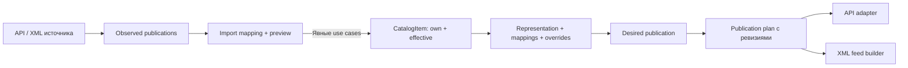

# План переработки Catalog: единая модель CatalogItem

Дата обновления: 2026-10-11. Статус: целевая архитектура и план замены текущей
реализации в существующем проекте. Изменение плана не означает, что описанные
ниже код, API и миграции уже реализованы.

Основное решение: SIMPLE, VARIABLE и VARIANT используют одну доменную модель
`CatalogItem`, один тип идентификатора и одну центральную SQL-модель
`CatalogItemModel` в `infrastructure/persistence/models/catalog_item.py`.
Имя центральной таблицы — `catalog_item`. Контент, галерея, атрибуты и остальные
принадлежащие карточке данные ссылаются на один `catalog_item_id`.
Связанные таблицы остаются нормализованными; «одна модель» не означает одну
таблицу для всех переводов, файлов и справочников.

Текущие Product/Variant заменяются в `src/modules/catalog/`, а их API,
регистрация моделей, тесты и Console переписываются в этом же проекте.
Совместимость со старой моделью, перенос данных и обновление существующей БД
не входят в задачу. Перед выкладкой база пересоздаётся; этот план не запускает
её удаление. Catalog-миграции удаляются и создаются заново при реализации
по разделу 11. Миграции остальных модулей сохраняются с необходимой корректировкой
зависимостей Alembic.

Нормативный источник: [архитектурные правила](../architecture/AGENTS.md).
Связанные документы: [текущая реализация Catalog](../modules/catalog.md),
[Files](../modules/files.md), [Channels](../modules/channels.md),
[план Channels](channels-integrations.md),
[исследование платформ](channel-platforms/README.md),
[tenant-миграции](../data/tenant-migrations.md),
[Console](../frontends/console.md).

Документы [старого среза 1](catalog-slice-1.md),
[старого среза 2](catalog-slice-2.md) и [старого среза 3](catalog-slice-3.md)
описывают реализацию Product/Variant до переработки. Они не являются контрактами
новой модели и не задают порядок её реализации.

## 1. Граница MVP и принятые решения

1. Виды записей: `simple`, `variable`, `variant`. Вложенность товарных записей —
   ровно один уровень. SIMPLE и VARIABLE не имеют родителя; VARIANT имеет
   единственного родителя VARIABLE и не имеет детей.
2. SIMPLE сам является продаваемой позицией. Скрытая запись Variant для SIMPLE
   больше не создаётся. Продаваемые виды — SIMPLE и VARIANT; VARIABLE задаёт
   семейство, общие значения и оси выбора.
3. `product_type` обозначает схему контента, а не вид товара. В MVP существует
   только системный Default, код `default`, версия 1, блоки `name`, `desc`,
   `short_desc`. Создание, изменение, удаление типов и блоков через API и UI
   недоступны. VARIANT использует схему родителя без собственного выбора типа.
4. Все три вида поддерживают локализованный контент, главное изображение и
   упорядоченную галерею. VARIANT наследует разрешённые значения родителя в той
   же locale и может их переопределить. Межъязыкового fallback нет.
5. Глобальные атрибуты имеют только тип `enum`, устойчивые option ID и переводы.
   Общие характеристики и оси выбора используют один справочник; произвольные
   локальные текстовые атрибуты и другие типы не входят в MVP.
6. Category образует дерево. Только SIMPLE получает несколько явно назначенных
   категорий, ровно одну основную при непустом наборе. Только SIMPLE получает теги.
   Назначения VARIABLE/VARIANT не включаются в MVP; проекция канала может иметь
   свою классификацию через mapping и overrides.
7. Catalog хранит SKU-код, базовую цену/скидку, массу/размеры и вручную заданные
   настройки наличия. Это полноценные поля нового MVP, а не условие подключения
   будущего Inventory. Код SKU не является идентификатором складского агрегата.
8. Catalog не реализует склады, резервы, движения, заказы, списание остатков,
   налоги, оплату и права на скачивание. Количество здесь — заявленное наличие
   карточки; будущий складской модуль подключается через публичный контракт.
9. `price`, `backorders_allowed`, `backordered` и effective stock status —
   вычисляемые поля чтения. Они не получают самостоятельных команд записи.
10. `virtual` входит в MVP. Downloadable, цифровая выдача, упаковка, бренды,
    связанные товары, конструктор типов и атрибуты других типов отложены.
11. Канальные schemas, mappings, overrides, observed/desired-проекции и delivery
    сохраняются. Их источники переходят на `CatalogItemIdVO`, kind и effective
    snapshot вместо пары ProductId/VariantId. Внешние parent ID независимы
    от `CatalogItem.parent_id`.

## 2. Aggregate Roots, единая модель и жизненный цикл

| Корень / компонент | Ответственность |
| --- | --- |
| CatalogItem SIMPLE | Одна самостоятельная продаваемая карточка, её значения и связи |
| CatalogItem VARIABLE | Семейство: общие значения, оси, default selection и дочерние CatalogItem VARIANT |
| CatalogItem VARIANT | Entity внутри VARIABLE, тот же тип товарной модели и идентификатора; самостоятельного write repository нет |
| ProductType | Системная схема контента; в MVP только неизменяемый Default, доступный для чтения |
| AttributeDefinition | Глобальное enum-определение, его переводы и принадлежащие ему options |
| Category | Переводы и место узла в дереве |
| Tag | Стабильный ID и переводы метки |
| Gallery, content, price/stock specifications | Внутренние компоненты CatalogItem, без собственных write repositories |

`CatalogItem` — одна модель товарного узла. Роль Aggregate Root определяется
жизненным циклом: SIMPLE/VARIABLE являются корнями, VARIANT существует только
внутри VARIABLE. Композиция корня VARIABLE содержит дочерние `CatalogItem`;
проверки запрещают дальнейшую вложенность. Второй товарный класс `Variant`
и отдельная центральная таблица вариантов не вводятся. Внутренние VO и компоненты
для контента, цены, наличия и галереи не являются вторыми товарными моделями.

```text
CatalogItem SIMPLE                       Aggregate Root, parent_id = None
  id, kind, status, product_type_id
  own content / media / attributes
  sku, price specification, stock specification, measurements
  category assignments + primary, tag assignments

CatalogItem VARIABLE                     Aggregate Root, parent_id = None
  те же общие компоненты
  variation axes + default selection
  children: CatalogItem[]                только kind = VARIANT
    id, parent_id = VARIABLE.id, status, sku
    own overrides / media / selected enum options
    price specification, stock specification, measurements
    children = []
```

`CatalogItemRepositoryProtocol` загружает и сохраняет корень и его принадлежащие
дочерние записи. Команда, адресующая VARIANT по item ID, получает root ID через
Application-порт поиска владельца, загружает VARIABLE и вызывает метод корня
с целевым item ID. Она не изменяет дочерний объект напрямую из Application.
Чтение одной позиции выполняется отдельной SQL-проекцией, без восстановления
всего агрегата.

Создание и восстановление имеют явные фабрики `create_simple`, `create_variable`,
`create_variant`, `restore`. Фабрика VARIANT используется в контексте создания
или изменения семьи; HTTP не создаёт его независимо от VARIABLE. Изменения
проводятся через методы корня, проверяющие итоговое состояние семьи.
Проверки не переносятся в mapper или VO ради обхода границы агрегата.

Сохраняем действующее правило структуры: VARIABLE имеет непустой набор осей
и минимум два VARIANT, включая черновики. Каждый selection полон, допустим
и уникален внутри родителя. Default selection отсутствует либо совпадает
с существующей комбинацией. Неполная внешняя карточка остаётся наблюдаемой
публикацией Channels до явного создания допустимого CatalogItem.

У каждого узла свои audit-поля и revision. Любая мутация дочерней записи
увеличивает revision корня и изменённого узла. Команды принимают
`expected_root_revision`; для SIMPLE root ID совпадает с item ID.
Ответы редакторов содержат item ID, root ID, item revision и root revision.
Общие значения родителя не копируются в строки детей и не изменяют их audit
при обычном переопределении родительского значения.

Все ID остаются UUID в соответствии с проектом. Приблизительное `integer`
в таблице Woo не меняет внутренний формат ID. Внешние числовые ID принадлежат
Channels и не используются как PK Catalog.

## 3. Поля CatalogItem и правила записи

Типы в Domain не повторяют строковые представления Woo. Денежные значения
и измерения используют Decimal/VO; HTTP передаёт точные числа строками,
SQL — NUMERIC. Время — timezone-aware UTC, SQL timestamptz.

| Поле | Канонический тип и владелец | Правила по kind и наследование |
| --- | --- | --- |
| id | CatalogItemIdVO / UUID | Собственная идентичность каждого узла, не наследуется |
| kind | CatalogItemKind: simple, variable, variant | Меняется только сценарием структуры, не обычным PATCH |
| parent_id | CatalogItemIdVO или None | Только VARIANT → VARIABLE; не поле свободного редактирования |
| product_type | ProductTypeIdVO; read code `default` | Хранится у корня; для VARIANT разрешается через родителя, override запрещён |
| status | CatalogItemStatus: draft, active, archived | Собственный у каждого узла; channel status преобразуется отдельно |
| sku | SkuCodeVO или None | Собственный код SIMPLE/VARIANT; у VARIABLE отсутствует, не наследуется |
| regular_price | Decimal или None в PriceSpecificationVO | SIMPLE — своё; VARIABLE — default для детей; VARIANT — наследование или полная своя спецификация |
| sale_price | Decimal или None в PriceSpecificationVO | Вместе с regular price, валютой и интервалом скидки |
| date_on_sale_from, date_on_sale_to | datetime или None | Часть единой спецификации цены, UTC |
| currency | CurrencyCodeVO | Обязательна при заданной цене; необходимое дополнение к исходной таблице |
| price | Decimal или None, вычисляется | Цена продажи SIMPLE/VARIANT на `as_of`; у VARIABLE отдельный диапазон цен детей |
| virtual | bool с режимом set/inherit у VARIANT | SIMPLE/VARIABLE — своё; VARIANT может переопределить, false является значением |
| manage_stock | StockManagement: none, own, parent | Нормализует Woo false/true/`parent`; parent допустим только VARIANT |
| stock_quantity | int или None | Хранится только у источника own; при parent читается из общего источника |
| stock_status | StockStatus: in_stock, out_of_stock, on_backorder | Вход только при none; при own/parent вычисляется; у VARIABLE отдельно availability summary |
| backorders | BackorderPolicy: no, notify, yes | Политика собственного источника наличия; parent использует политику источника |
| backorders_allowed | bool, вычисляется | backorders != no; не записывается независимо |
| backordered | bool или None, вычисляется | Признак effective stock status on_backorder; неизвестное наличие даёт None |
| weight | Decimal или None + каноническая единица g | Свойство карточки, может наследоваться; 0 отличается от отсутствия |
| dimensions | DimensionsVO или None, length/width/height в mm | Наследуется или переопределяется объектом целиком; размеры не смешиваются покомпонентно |
| meta_data | Упорядоченные записи CatalogMetadataEntry | Типизированные канонические ключи; не произвольный Woo payload |
| revision, created_at, updated_at, actor IDs | Системные поля | Собственные, не наследуются и не назначаются из внешнего payload |

`status` описывает локальный жизненный цикл Catalog, а не Woo publish/private.
Архивирование VARIABLE делает семью недоступной для новых публикаций без
перезаписи статусов всех детей. Позиция доступна только при active у себя
и у родителя, если он есть; наличие перевода и цена проверяются отдельно
схемой выбранного канала. Draft может существовать без цены и контента.

SKU-код уникален среди непустых кодов SIMPLE/VARIANT текущего tenant;
нормализация пробелов и правила регистра фиксируются в SkuCodeVO и одинаково
применяются индексом БД. MVP сохраняет регистр и сравнивает коды точно после trim.
Virtual не запрещает SKU-код: это идентификатор карточки, а не складская связь.
Если нужна ссылка на будущую Inventory.SKU, она будет отдельным ID и контрактом.

PriceSpecificationVO содержит regular price, optional sale price, валюту
и optional начало/конец скидки. Суммы неотрицательны; sale price не выше regular
price; без regular price sale price и интервал отсутствуют. Начало не позже
конца; интервал трактуется как `[from, to)`, отсутствующая граница не ограничивает
соответствующую сторону. Доменная политика определяет `price` по `as_of`,
переданному clock-портом; Domain не читает системные часы. VARIABLE возвращает
min/max effective prices активных детей с указанием неполноты, а не вымышленную
собственную продаваемую цену. В MVP цены семьи используют одну валюту.

Наличие в MVP вводится вручную, без расчёта движений. Режим own требует известное
неотрицательное stock quantity. При количестве > 0 статус in_stock; при 0
и backorders=no — out_of_stock; при 0 и разрешённом backorder — on_backorder.
Режим none хранит явно выбранный stock status без количества; on_backorder
требует разрешённого backorder. Отсутствие настройки означает неизвестное
наличие, а не нулевой остаток. `backordered` здесь — состояние карточки,
не количество уже заказанного долга.

VARIABLE может владеть stock specification own как общим источником семьи.
VARIANT с parent использует этот источник, его quantity и backorder policy.
Режим parent запрещён, если у родителя нет источника own. Режим own у VARIANT
создаёт независимый источник. Переключение режима очищает несовместимые локальные
поля только как явная часть команды; эти изменения показаны в результате.

Пример: у родителя общий quantity=10, два ребёнка с parent показывают один
`stock_source_id = parent.id` и количество 10. Нельзя объявлять наличие семьи
равным 20. Availability summary VARIABLE показывает доступность детей;
общая quantity не суммируется по публикациям и не дублируется при экспорте
семьи в несколько простых карточек. Channels показывает общий источник
и проверяет возможности управления наличием целевой платформы.

Virtual определяет необходимость доставки. Weight/dimensions можно хранить
как описание, но shipping-проекция не использует их для виртуальной позиции.
Виртуальная позиция может иметь ограничения наличия; виртуальность сама по себе
не включает бесконечный остаток и не меняет режим управления.

Metadata имеет явные key, value_type, value, position. MVP принимает только
text, decimal, boolean; один key на узел. Объектные и массивные Woo/plugin values
остаются в native snapshot Channels до появления отдельного согласованного
контракта. Зарезервированные ключи не позволяют обходить name, sku, price,
stock и остальные типизированные сценарии. Локализованный текст относится
к контенту, а не к metadata. Наследование metadata — по key с явным override
или clear. Родительские ключи сохраняют порядок; override заменяет значение
на прежнем месте, clear убирает ключ, новые собственные ключи идут следом
в порядке position. Это правило также определяет место нового ключа родителя.

## 4. Наследование, очистка и effective read model

Наследование идёт только VARIABLE → его VARIANT. SIMPLE ничего не наследует;
наследования между соседними вариантами и отдельного inheritance_parent_id нет.
В каждом случае различаются три действия: inherit, set(value), clear.
`false`, `0` и пустой необязательный текст являются собственными значениями.
Нельзя использовать проверку truthy или один nullable-столбец там, где нужно
отличать наследование от явной очистки.

| Группа | Правило VARIANT |
| --- | --- |
| name, desc, short_desc | Наследование каждого блока в той же locale, собственное значение или явная очистка optional блока |
| product_type | Всегда схема родителя, собственного выбора нет |
| status, SKU, selection, ID, audit | Всегда собственные, наследования нет |
| virtual | Inherit или set(bool); clear недопустим |
| Цена | Inherit, set всей PriceSpecificationVO или clear всей спецификации |
| Weight | Inherit, set или clear |
| Dimensions | Inherit, set полного DimensionsVO или clear |
| Наличие | Явный выбор none/own/parent; parent обозначает общий источник, не копирование числа |
| Общие enum-характеристики | По attribute ID: inherit, replace собственным набором options или clear |
| Оси/selection | Оси у VARIABLE; VARIANT выбирает ровно один option каждой оси |
| Галерея | Inherit той же locale, replace всей галереи или явно empty |
| Metadata | По key: inherit, set или clear; порядок разрешённых ключей задаётся явно |
| Category/Tag | Только SIMPLE; назначения VARIABLE/VARIANT и их наследование отсутствуют в MVP |

Состояние own и результат effective разделены. Хранение содержит только явно
заданные значения, режимы и связи; read DTO содержит собственное состояние,
effective значения и происхождение: item/parent/calculated/unknown,
source item ID и locale, когда применимо. Это вложенные структуры конкретного
read DTO, а не один универсальный CatalogDTO для всех сценариев.

На уровне persistence у наследуемых скалярных групп есть явный mode.
У контентного блока отсутствие записи означает inherit для VARIANT; запись
с mode=clear блокирует наследование; mode=set хранит значение. У корня отсутствие
значения означает отсутствие, режим inherit запрещён. Для необязательных групп
clear допустим; для обязательного name и virtual запрещён.

Сохранение VARIANT проверяет совместимость own и effective состояния по снимку
родителя. Изменение родительского значения проверяет детей, для которых меняется
effective состояние: валюту, совместимость stock source и другие инварианты.
Доменная политика `CatalogItemEffectiveValuesPolicy` чистая и используется
в командах и проекциях. Query mapper только преобразует уже разрешённые данные.
Реализация не должна дублировать расходящиеся правила в SQL COALESCE и Domain.

Read snapshot фиксирует root revision, собственные item revisions, schema version,
locale и `as_of`. Изменение родителя инвалидирует effective-проекции детей
и связанные Channels representations, хотя own-значения детей остаются прежними.
Наступление границы скидки тоже меняет desired price: срок актуальности snapshot
ограничивается ближайшей границей цены либо цена пересчитывается при preview.

## 5. ProductType и мультиязычный контент

ProductType — отдельная схема, не таблица товаров и не способ хранить варианты.
В MVP миграция создаёт единственный Default (`default`, schema_version=1)
и фиксированные определения блоков:

| Код | Тип | Обязательность и поведение |
| --- | --- | --- |
| name | text | Непустое имя при записи собственного перевода корня; VARIANT может наследовать имя той же locale |
| desc | rich_text | Необязательное описание у любого kind; VARIANT наследует или переопределяет |
| short_desc | rich_text | Необязательное краткое описание у любого kind; VARIANT наследует или переопределяет |

Коды `title`, `description`, `short_description` старой модели заменяются
на `name`, `desc`, `short_desc` в новых контрактах и seed. Переноса старых
значений и совместимых aliases нет. Внешние названия полей Woo преобразует
Channels mapper. PRODUCT/VARIANT scope дублированного хранения удаляется;
схема разрешает поля по роли kind, общий владелец значения — CatalogItem.

Схема валидирует состав, типы и обязательность контента. Мультиязычность
обеспечивается хранением значений по `(catalog_item_id, locale, block_id)`:
сама ссылка на ProductType не создаёт переводы. VARIANT не имеет собственного
product_type_id; read DTO возвращает effective тип родителя.

Сохраняется маркер перевода `(catalog_item_id, locale)` для различения
отсутствующего own-перевода и существующего набора значений. PUT передаёт полный
собственный набор блоков locale; отсутствие блока у VARIANT означает inherit,
clear передаётся явно. DELETE удаляет own-перевод и возвращает VARIANT
к наследованию; это не действие «скрыть контент родителя».

Все локализованные запросы требуют явную BCP 47 locale. Запись разрешена для
активных кодов `reference_data`; ранее сохранённые переводы деактивированной
locale читаются. Нет языка по умолчанию tenant, угадывания по тексту или fallback
на другую locale. Отсутствие обоих значений возвращает unknown/None.

Товар может быть создан без переводов. Сохранение own-перевода корня требует
name; у VARIANT допускается частичный набор override без собственного name.
Пустое name отклоняется, пустые desc/short_desc являются собственными значениями.
Обязательность effective name для публикации проверяет Channels preview.
Rich text очищается Infrastructure-адаптером за Application-портом до проверки
результата Domain; необработанный внешний HTML не показывается в Console.

В MVP доступны только запросы чтения Default и его схемы. Существующие команды,
HTTP-маршруты и экраны создания/изменения ProductType/ContentBlock удаляются.
Неизменяемый schema snapshot передаётся в Domain; обработчики контента принимают
expected_schema_version, чтобы будущая версия не применялась незаметно.

## 6. Главное изображение и локализованная галерея

Files владеет бинарными файлами, приватным хранилищем и потоками.
Catalog владеет товарными связями, locale, порядком, главным изображением
и текстовыми метаданными. Центральный FK всех товарных связей — `catalog_item_id`;
Files file UUID проверяется через публичный порт, чужая ORM-модель не импортируется.

Галерея объявляется для `(catalog_item_id, locale)` и содержит упорядоченный
набор `CatalogItemImage`: image ID, file ID, position, alt, caption.
У непустой галереи ровно одно явно выбранное главное изображение из её состава.
У пустой галереи главного нет. Главное изображение не дублируется отдельной
ссылкой на тот же файл вне галереи. Позиции уникальны и задаются полностью;
повтор одного file ID внутри одной галереи запрещён.

Locale относится ко всему набору: можно менять состав, порядок, главное
изображение и подписи по языкам. Один файл может использоваться в нескольких
локалях и карточках; бинарные данные не копируются. Межъязыкового fallback нет.

У VARIANT отсутствие own-галереи наследует галерею VARIABLE той же locale.
Режим replace задаёт собственный набор целиком, режим empty — явно пустой.
Частичное автоматическое смешивание галерей в MVP отсутствует. Изменение
главного или порядка у наследуемой галереи требует явного создания own-набора;
UI показывает это действие и исходные ссылки, которые будут сохранены.

Use cases включают upload главного/дополнительного изображения, прикрепление
существующих разрешённых файлов, замену полного набора, смену главного,
порядка/подписей и снятие own-галереи. При добавлении первого изображения
оно становится главным; назначение другого главным сохраняет прежнее в наборе.
Удаление главного из непустого набора требует указания нового главного
в той же команде. Удаление связи не удаляет физический файл и не влияет
на чужие галереи.

Catalog объявляет свой порт файлов и свои DTO. Его Infrastructure adapter
использует Files consumer contract и внешнюю сборку на той же tenant UoW session.
Upload принимает ограниченно читаемый поток, точный размер, filename и MIME;
валидирует допустимый формат изображения и лимит размера. Files знает только
файл, Catalog проверяет бизнес-ссылку и locale. Сбой записи связи откатывает
реестр вместе с Catalog; внешний orphan убирает штатный Files cleanup.

Catalog HTTP отдаёт изображения через собственный авторизованный endpoint
по image ID и locale с проверкой effective принадлежности карточке и tenant.
Поток закрывается при завершении/отмене ответа по контракту Files. В DTO нет
credentials, storage key и URL со случайным сроком жизни. Публикация изображения
в канал требует отдельной возможности доставки media: загрузка адаптером или
подходящий доступный каналу URL; приватный Console URL не считается таким URL.

## 7. Глобальные enum-атрибуты и варианты

AttributeDefinition — глобальный внутри tenant справочник: UUID, стабильный
code, тип enum, переводы label и упорядоченные AttributeOption с собственными
UUID/code/переводами. Option принадлежит своему определению. Подпись перевода
не устанавливает идентичность. Используемые определения/options не удаляются.

На CatalogItem назначаются attribute ID, упорядоченные option IDs, visible
и position. Несколько enum-options допустимы как множество значений;
это не новый value_type `multi_enum`. У SIMPLE характеристика может иметь одно
или несколько значений. У VARIABLE assignment с `is_variation=true` задаёт
ось и разрешённые варианты; visible и is_variation независимы.

Каждый VARIANT хранит отдельный selection: один option каждой оси родителя.
У option проверяется принадлежность определению и разрешённому набору родителя.
Комбинация уникальна внутри семьи. Для осевых атрибутов effective-характеристика
VARIANT берётся из selection; второе общее assignment того же атрибута у ребёнка
запрещено. Неосевые характеристики могут наследоваться и переопределяться.

Wildcard «любое значение», неограниченное декартово произведение, числовые оси,
локальные enum без глобального определения и угадывание атрибута по названию
не входят в MVP. Генерация комбинаций, если включена UI, показывает объём
и передаёт явно выбранные позиции в одну структурную команду.

Default selection хранится у VARIABLE и соответствует полной комбинации
существующего VARIANT. Изменение разрешённых options, selection, состава детей
и default выполняется одной командой семьи; нельзя временно сохранить
несовместимые selection. Общие неосевые характеристики не меняют структуру.

## 8. Категории, теги и переходы kind

Category имеет собственный parent ID и переводы. Дерево категорий не связано
с ограничением товарной вложенности: у категорий может быть несколько уровней.
Самоссылки, циклы и перемещение под собственного потомка запрещены.
Дерево читается по ветвям с серверной пагинацией.

Назначения доступны только SIMPLE. При пустом списке primary отсутствует;
при непустом ровно одна primary из списка. Назначаются только явные узлы,
предки не добавляются автоматически. Tag — отдельный справочник UUID/переводов;
набор тегов SIMPLE уникален. Категория с детьми или ссылками не удаляется;
используемая метка не удаляется. Эти ограничения проверяются под согласованной
защитой конкурентных изменений и дублируются FK там, где применимо.

Переход SIMPLE → VARIABLE сохраняет ID корня: прежняя SIMPLE-запись становится
семейством, дети получают новые CatalogItem ID. Команда содержит полную
структуру и явное правило, как применить прежние продаваемые значения к одному
из новых детей или к defaults семьи. SKU корня не остаётся SKU семейства.
Категории/теги не могут остаться у VARIABLE: при непустых назначениях переход
отклоняется до их явного снятия. Они не переносятся автоматически в Channels.

Переход VARIABLE → SIMPLE также сохраняет ID корня и явно выбирает ребёнка,
чьи effective продаваемые данные и локализованный контент/галерея будут
материализованы в SIMPLE. Own-данные корня и выбранного ребёнка разрешаются
по показанной пользователю политике; остальные дети удаляются только с явным
перечнем затрагиваемых ID и подтверждением потери их данных в команде.
Категории/теги новой SIMPLE назначаются отдельными сценариями.

ID удалённых детей не подменяется ID корня. После появления Channels bindings
переход/удаление с зависимостями требует согласованного плана обработки связей
либо отклоняется; внешние карточки не удаляются автоматически. Безопасность
идентичности проверяется по CatalogItem ID и роли, а не только по сохранению
одного прежнего UUID.

VARIANT → SIMPLE с отсоединением или перенос между семьями не входит в MVP.
Смена вида не выполняется произвольным обновлением kind/parent_id.

## 9. Application-сценарии, DTO и HTTP-контракты

Префикс HTTP: `/api/console/catalog`. Каждая строка ниже соответствует одному
Command/Query, Handler и отдельному DTO при наличии результата.
Изменения существующих CatalogItem получают доверенные tenant/actor,
item ID и expected_root_revision; структурные команды адресуют root ID.
Справочники используют expected_revision собственного корня.
Локализованные входы содержат явную locale; контент — expected_schema_version.
Эти общие поля не повторены во всех строках.

Команды принимают конкретные VO/input-структуры: PriceSpecificationInput,
StockSpecificationInput, ContentOverrideInput, GalleryImageInput,
EnumAttributeAssignmentInput и VariableStructureInput. Они не заменяются
свободным dict полей или generic UpdateCatalogItem. Входы и вложенные типы
каждого сценария уточняются в его файлах до реализации; результаты уже
разделены по use case.

### 9.1. CatalogItem

| Сценарий | Бизнес-вход | execute → | HTTP после префикса |
| --- | --- | --- | --- |
| create_simple_catalog_item | Default назначается автоматически, initial properties optional | CreateSimpleCatalogItemResultDTO | POST /items/simple |
| create_variable_catalog_item | Оси, минимум два дочерних item, defaults и selection | CreateVariableCatalogItemResultDTO | POST /items/variable |
| replace_catalog_item_structure | Полная структура, сохраняемые child ID, явные удаления и default | ReplaceCatalogItemStructureResultDTO | PUT /items/{root_id}/structure |
| change_catalog_item_kind | Целевой kind, полная структура и политика перехода из раздела 8 | ChangeCatalogItemKindResultDTO | PUT /items/{root_id}/kind |
| set_catalog_item_status | status | SetCatalogItemStatusResultDTO | PUT /items/{item_id}/status |
| set_catalog_item_sku | SKU-код либо None | SetCatalogItemSkuResultDTO | PUT /items/{item_id}/sku |
| set_catalog_item_virtual | set(bool) либо inherit | SetCatalogItemVirtualResultDTO | PUT /items/{item_id}/virtual |
| set_catalog_item_price | inherit/set/clear и полная спецификация цены | SetCatalogItemPriceResultDTO | PUT /items/{item_id}/price |
| set_catalog_item_stock | Полная none/own/parent спецификация | SetCatalogItemStockResultDTO | PUT /items/{item_id}/stock |
| set_catalog_item_measurements | Режим/weight и режим/полные dimensions | SetCatalogItemMeasurementsResultDTO | PUT /items/{item_id}/measurements |
| put_catalog_item_content | locale, полный own-набор блоков с set/clear | PutCatalogItemContentResultDTO | PUT /items/{item_id}/content/{locale} |
| delete_catalog_item_content | locale, удалить own-перевод | None | DELETE /items/{item_id}/content/{locale} |
| set_catalog_item_attributes | Полные неосевые assignments/overrides, порядок/visible | SetCatalogItemAttributesResultDTO | PUT /items/{item_id}/attributes |
| set_catalog_item_categories | Только SIMPLE: category IDs, primary ID | SetCatalogItemCategoriesResultDTO | PUT /items/{item_id}/categories |
| set_catalog_item_tags | Только SIMPLE: tag IDs | SetCatalogItemTagsResultDTO | PUT /items/{item_id}/tags |
| set_catalog_item_metadata | Полный own-набор typed entries/clear и собственный порядок | SetCatalogItemMetadataResultDTO | PUT /items/{item_id}/metadata |
| upload_catalog_item_image | locale, binary stream/size/MIME/name, роль main/additional, подписи | UploadCatalogItemImageResultDTO | POST /items/{item_id}/images/{locale}/upload |
| replace_catalog_item_gallery | locale, replace/empty, полный состав файлов/порядок/подписи/main | ReplaceCatalogItemGalleryResultDTO | PUT /items/{item_id}/gallery/{locale} |
| set_catalog_item_primary_image | locale, image ID в own-наборе | SetCatalogItemPrimaryImageResultDTO | PUT /items/{item_id}/gallery/{locale}/primary |
| delete_catalog_item_gallery | locale, удалить own-галерею / вернуть наследование | None | DELETE /items/{item_id}/gallery/{locale} |
| delete_catalog_item | SIMPLE либо вся семья; план зависимостей и явное удаление детей | None | DELETE /items/{root_id} |
| get_catalog_item | item ID, locale; own + effective + origins | GetCatalogItemDetailsDTO | GET /items/{item_id} |
| list_catalog_items | locale, поиск, kind/status, root/parent filter, page/page_size | ListCatalogItemsPageDTO | GET /items |
| list_catalog_item_variants | root ID, locale, filters, pagination | ListCatalogItemVariantsPageDTO | GET /items/{root_id}/variants |
| get_catalog_item_image_content | item ID, locale, effective image ID | GetCatalogItemImageContentResultDTO | GET /items/{item_id}/images/{locale}/{image_id}/content |
| get_catalog_items_publication_snapshot | item IDs, locale, as_of, ожидаемые ревизии optional | GetCatalogItemsPublicationSnapshotDTO | Межмодульный Application-контракт; отдельный HTTP не нужен |

Команды записи возвращают свой ResultDTO с item/root ID и актуальными revision,
плюс конкретный результат операции: созданные child/image ID, изменённые режимы,
сохранённые значения или явные удаления. Одинаковые поля не объединяют DTO
разных сценариев. Delete возвращает `-> None`, HTTP 204 без пустого DTO/Response.
Upload использует multipart request, не JSON с закодированным бинарным файлом.
Get image content возвращает потребительский DTO управляемого потока;
HTTP StreamingResponse не имеет фиктивной JSON response schema.

GetCatalogItemDetailsDTO отличается от строки ListCatalogItemsPageDTO:
детали содержат own/effective/origins, список — только необходимые экрану поля.
Список по умолчанию показывает корни SIMPLE/VARIABLE; VARIANT включается явным
kind/parent фильтром. Counts считаются по центральным записям, без умножения
из-за JOIN галереи/атрибутов. get одного VARIANT не читает всех братьев.

### 9.2. Схема и справочники

| Корень / сценарий | Бизнес-вход | execute → | HTTP после префикса |
| --- | --- | --- | --- |
| product_type/get_default_product_type | locale для подписей | GetDefaultProductTypeDTO | GET /product-types/default |
| attribute/create_attribute | code, locale, label, options(code/label) | CreateAttributeResultDTO | POST /attributes |
| attribute/put_attribute_translation | ID, locale, label | PutAttributeTranslationResultDTO | PUT /attributes/{id}/translations/{locale} |
| attribute/replace_attribute_options | ID, ordered options с сохранением ID/code и переводом locale | ReplaceAttributeOptionsResultDTO | PUT /attributes/{id}/options/{locale} |
| attribute/delete_attribute | ID | None | DELETE /attributes/{id} |
| attribute/get_attribute | ID, locale | GetAttributeDetailsDTO | GET /attributes/{id} |
| attribute/list_attributes | locale, search, page/page_size | ListAttributesPageDTO | GET /attributes |
| category/create_category | parent ID либо None, locale, label | CreateCategoryResultDTO | POST /categories |
| category/put_category_content | ID, locale, label | PutCategoryContentResultDTO | PUT /categories/{id}/translations/{locale} |
| category/move_category | ID, новый parent ID либо None | MoveCategoryResultDTO | PUT /categories/{id}/parent |
| category/delete_category | ID | None | DELETE /categories/{id} |
| category/get_category | ID, locale | GetCategoryDetailsDTO | GET /categories/{id} |
| category/list_categories | locale, parent/root/search filter, pagination | ListCategoriesPageDTO | GET /categories |
| tag/create_tag | locale, label | CreateTagResultDTO | POST /tags |
| tag/put_tag_translation | ID, locale, label | PutTagTranslationResultDTO | PUT /tags/{id}/translations/{locale} |
| tag/delete_tag | ID | None | DELETE /tags/{id} |
| tag/get_tag | ID, locale | GetTagDetailsDTO | GET /tags/{id} |
| tag/list_tags | locale, search, page/page_size | ListTagsPageDTO | GET /tags |

Нет сценариев create/change/delete ProductType или ContentBlock, смены типа
у item, иных attribute value types и независимого Variant CRUD.
Category/Tag/Attribute API сохраняют свои отдельные контракты и корни;
проверки использования переходят с Product/Variant ID на CatalogItem ID.

### 9.3. Порты и необходимые файлы

Для каждой команды: `application/<root>/command/<scenario>/command.py`,
`handler.py`, `dto.py` только при результате. Для каждого запроса:
`application/<root>/query/<scenario>/query.py`, `handler.py`, `dto.py`.
Классы именуются по строке сценария, например SetCatalogItemPriceCommand,
SetCatalogItemPriceHandler, SetCatalogItemPriceResultDTO.

Для каждого HTTP-метода: отдельные
`presentation/<root>/http/controller/<scenario>.py`,
`request/<scenario>.py` при теле, `response/<scenario>.py` при JSON-ответе;
`router.py` регистрирует метод, `depends.py` содержит именованный Depends handler.
Для `None`/204 Response не создаётся; для stream действует контракт выше.

```text
src/modules/catalog/
  domain/catalog_item/
    aggregate.py, repository.py, error.py
    entity/                 gallery image, metadata и другие внутренние entities
    value_object/           identifier, kind, status, price, stock, dimensions ...
    policy/                 effective values, structure, price, availability
  domain/product_type/      системная схема, VO и read snapshot
  domain/attribute/         aggregate, option entity, VO, errors, repository
  domain/category/          aggregate, VO, errors, repository
  domain/tag/               aggregate, VO, errors, repository
  application/catalog_item/
    command/<scenario>/, query/<scenario>/
    port/query_repository.py
    port/owner_lookup.py, content_schema.py, attribute_definitions.py
    port/classification_references.py, files.py, usage.py
  application/product_type/query/get_default_product_type/
  application/<dictionary_root>/command|query/<scenario>/
  application/port/         locales, currencies, rich_text, clock, uuid, locks
  infrastructure/catalog_item/persistence/
    mapper.py, repository.py, query_mapper.py, query_repository.py
  infrastructure/catalog_item/          Files/schema/references adapters
  infrastructure/<dictionary_root>/persistence/
  infrastructure/persistence/models/catalog_item.py
  infrastructure/persistence/models/<one_related_model>.py
  presentation/catalog_item/router.py, depends.py, http/...
  presentation/<dictionary_root>/router.py, depends.py, http/...
  presentation/product_type/             только чтение Default
```

Write port работает с корнем CatalogItem; query port принадлежит Application
и возвращает DTO конкретных use cases. Owner lookup возвращает только root ID
и role, schema/definition/reference ports — immutable snapshots.
Files port использует потребительские DTO и stream contract, не Files Entity.
Locale/currency adapters используют публичные Application-контракты reference_data.
Usage port нужен для удаления/переходов; до появления bindings адаптер явно
отражает отсутствие этого вида зависимостей, а не молча игнорирует их после
реализации Channels. HTTP-контракты не подменяют межмодульный snapshot.

## 10. SQL, ограничения, транзакции и запросы

### 10.1. Центральная модель и связанные таблицы

`CatalogItemModel`, файл `catalog_item.py`, `__tablename__ = "catalog_item"`:
UUID id, kind, parent_id, root product_type_id, status, sku, revision/audit,
virtual value/mode, price specification value/mode, stock specification,
weight value/mode, dimensions value/mode. Группы имеют явные режимы из раздела 4.
Вычисляемая price, inherited quantity, backorders_allowed/backordered и effective
контент в таблицу как независимые значения не записываются.

Связанные SQL-модели, по одной в файле:

| Таблица / модель | Назначение |
| --- | --- |
| catalog_product_types / ProductTypeModel | Только Default, версия схемы |
| catalog_content_block_definitions / ContentBlockModel | Защищённые name, desc, short_desc |
| catalog_product_type_content_blocks / ProductTypeBlockModel | Состав Default, типы, обязательность, порядок; без PRODUCT/VARIANT-дублирования |
| catalog_product_type_translations, catalog_content_block_translations | Системные подписи, чтение по явной locale |
| catalog_item_translations / CatalogItemTranslationModel | Own locale marker, единый FK CatalogItem |
| catalog_item_content_values / CatalogItemContentValueModel | Значения block/locale и set/clear, единый owner |
| catalog_item_galleries / CatalogItemGalleryModel | Locale, replace/empty, главное изображение |
| catalog_item_images / CatalogItemImageModel | Gallery item, file UUID, position, alt/caption |
| catalog_attributes, catalog_attribute_options и их translations | Глобальные enum definitions/options |
| catalog_item_attributes / CatalogItemAttributeModel | Assignment или clear; visible, is_variation, position |
| catalog_item_attribute_options / CatalogItemAttributeOptionModel | Ordered options assignment; принадлежат правильному definition |
| catalog_item_variant_selections / CatalogItemVariantSelectionModel | Выбранные options дочернего CatalogItem, не отдельная товарная модель |
| catalog_item_default_selections / CatalogItemDefaultSelectionModel | Default комбинация VARIABLE |
| catalog_categories, catalog_category_translations | Дерево и переводы |
| catalog_tags, catalog_tag_translations | Метки и переводы |
| catalog_item_categories / CatalogItemCategoryModel | Только SIMPLE, membership и is_primary |
| catalog_item_tags / CatalogItemTagModel | Только SIMPLE, уникальные tag ID |
| catalog_item_metadata / CatalogItemMetadataModel | Typed entries, set/clear, порядок |

Таблиц `catalog_products`, `catalog_variants`, раздельных product/variant
translations/content/media в новой схеме нет. Контент и metadata хранятся
нормализованно, без JSON/JSONB товарного документа. Native JSON остаётся у Channels.

### 10.2. Ограничения и индексы

- CHECK kind/status/modes, revision > 0, nonnegative measured values и prices.
- CHECK согласованности parent_id с kind: simple/variable → NULL,
  variant → NOT NULL, parent_id != id.
- Self FK parent_id → catalog_item.id. Дополнительная защита роли родителя
  обеспечивается составным FK `(parent_id, required_parent_kind)` на `(id, kind)`,
  где generated required_parent_kind равно variable только для VARIANT.
  UNIQUE(id, kind) — цель FK. Так глубина ограничивается схемой без рекурсии.
- Root product_type_id задан, VARIANT product_type_id отсутствует; собственный
  SKU только у SIMPLE/VARIANT. FK типов/blocks защищают системную схему.
- UNIQUE непустого SKU в tenant, индексы parent_id и owner-ссылок;
  частичный индекс списка корней по принятому фильтру и стабильному порядку.
- UNIQUE content(item, locale, block), gallery(item, locale), image(gallery, position),
  selection(item, attribute), assignments(item, attribute), tags(item, tag).
- Составные FK сохраняют принадлежность option своему attribute и selection
  семье. Уникальность полного selection и его полноту проверяет агрегат
  под блокировкой корня; simple CHECK не проверяет число других строк.
- Gallery хранит единственный primary_image_id; составной отложенный FK
  гарантирует принадлежность изображения той же gallery и разрешает атомарно
  заменить набор и primary. Домен требует primary у непустого набора
  и отсутствие primary у пустого.
- FK справочников используют RESTRICT для используемых объектов; внутренние
  дочерние записи могут каскадно удаляться только при явно разрешённом удалении
  агрегата. FK не заменяет usage check внешних модулей.
- Назначение категорий/тегов только SIMPLE защищается доменом и составной
  ссылкой на роль владельца. Непустой набор требует primary; partial unique
  защищает «не более одной», домен под lock — «ровно одна».

Составные FK/generated columns детализируются в baseline и проверяются реальным
PostgreSQL. План не утверждает, что один self FK проверяет kind родителя или
что CHECK может читать другие строки. Пользовательские SQL-функции/триггеры
для товарных бизнес-правил не нужны: финальное состояние проверяет Domain,
конкурентность — Application-порт блокировки и UoW.

### 10.3. Конкурентность и границы транзакций

Одна мутация семьи использует один внешний tenant UoW и одну session для всех
репозиториев и Outbox. Expected root revision проверяется после блокировки
корня. Разные семьи можно изменять параллельно; tenant-wide exclusive lock
не берётся для каждого обычного изменения контента/цены.

Для изменений item и чтения его изменяемых справочных ссылок используется общий
catalog reference guard в shared-режиме, затем family lock. Удаление/замена
используемых definitions/options, удаление Category/Tag и изменение дерева
берут reference guard exclusive. Порядок всегда reference guard → root locks
в отсортированном порядке. Это закрывает гонку «назначить / удалить» и циклы
категорий; блокировки реализует Infrastructure за Application-портом.
Домен проверяет снимок дерева/использования, не вызывает SQL.

Обычные query-сценарии не берут глобальную блокировку чтения: краткий read snapshot
на одной session обеспечивает согласованность parent/child/revisions.
Для нескольких SELECT используется согласованный транзакционный snapshot
либо единая SQL-проекция; частично прочитанные разные версии семьи не выдаются.
Repositories не делают commit/rollback и не выбирают tenant schema.

CatalogItemChanged фиксирует root ID, изменённые item ID и root revision;
после появления потребителя сообщение записывается в Outbox той же транзакции.
Channels обновляет готовность представлений после commit. Внешние HTTP-вызовы
доставки не выполняются внутри длительной SQL-транзакции Catalog.

### 10.4. Чтение и производительность

Текущие циклы запросов list/get_variant заменяются batch projections:

- list читает страницу центральных записей, перевод выбранной locale и нужные
  effective поля без восстановления агрегатов и SQL-запроса на каждую строку;
- get VARIANT читает только его own-данные, нужного родителя и связанные значения,
  без загрузки контента всех соседних вариантов;
- media/attributes для страницы загружаются одним batch по наборам item ID
  либо агрегируются в запросе, не отдельными запросами на каждого владельца;
- страницы вариантов имеют отдельный контракт и pagination;
- write repository сохраняет изменённые строки/связи, не переписывает всё
  семейство ради одной цены или подписи;
- counts и pagination вычисляются до размножающих JOIN либо через EXISTS.

Self JOIN и JOIN справочников допустимы. Цель — корректное и предсказуемое число
запросов, а не формальное отсутствие JOIN. Ускорение подтверждается SQL-count
проверками и EXPLAIN ANALYZE на representative fixtures; одна таблица сама
по себе не является доказательством большей скорости.

## 11. Перезапись Catalog-миграций и fresh database

Переноса Product/Variant, UUID, переводов и остатков не проектируем.
Нет backfill, dual write, bridge tables, aliases старых API и upgrade path
из старого Catalog. До выкладки новая история применяется к пустой БД;
удаление реальной БД — отдельное действие перед rollout.

При реализации удалить Catalog-ревизии:

- `0012_catalog.py`;
- `0015_remove_catalog.py`;
- `0017_catalog_simple.py`;
- `0018_catalog_variable.py`;
- `0019_catalog_classification.py`.

Создать одну новую Catalog baseline: `0021_catalog_item.py`,
revision `0021_catalog_item`, down_revision `0020_files`.
Она создаёт новую центральную модель, связанные таблицы, ограничения/индексы
и seed Default/name/desc/short_desc. До завершения этой переработки baseline
дополняется в рамках одной новой реализации; поэтапного сохранения старого
Catalog и цепочки переходов между его моделями нет.

В сохранённых ревизиях исправить только необходимые ссылки цепочки:

| Файл | Новый down_revision | Причина |
| --- | --- | --- |
| 0013_channels.py | 0011_inventory_skus | Удалён 0012_catalog |
| 0016_remove_inventory.py | 0014_channel_publications | Удалён 0015_remove_catalog |
| 0020_files.py | 0016_remove_inventory | Удалены 0017/0018/0019 Catalog |
| 0021_catalog_item.py | 0020_files | Files существует до нового Catalog |

Промежутки в числовых именах допустимы; порядок задаёт down_revision.
Создание/удаление Inventory и ревизии других модулей не переписываются под
Catalog. В новой цепочке один tenant head. Downgrade нового Catalog удаляет
только его таблицы/seed, не восстанавливает Product/Variant и не удаляет Files.
Ревизии не импортируют текущие ORM-модели, не выполняют commit/autocommit
и не содержат фиксированные имена tenant.

Обновить прямую регистрацию ORM в `src/modules/tenant_persistence.py`,
табличный ownership/autogenerate, migration fixtures и документацию
`docs/data/tenant-migrations.md`. Имена старых таблиц в историческом реестре
можно сохранить согласно действующему правилу ownership, но они не становятся
новыми runtime models или таблицами fresh baseline.

Проверить ScriptDirectory: нет ссылок на удалённые revision ID, один head,
полный upgrade от base для двух пустых tenant-схем, rollback неудачного onboarding,
downgrade/upgrade новой baseline и отсутствие autogenerate drift.
Тесты «сохранить старые Product/Variant при upgrade» заменяются проверками fresh
schema; их успешное выполнение для старой истории не является критерием новой.
Глобальные миграции и команды tenant bootstrap сохраняют своих владельцев.

## 12. Channels: bindings, representations, mappings и overrides

Channels остаётся владельцем внешних публикаций и способов их представления.
Catalog предоставляет канонический effective snapshot; платформенные поля
и внешний статус не переносятся в CatalogItem. Текущие read-коннекторы и загрузка
native/типизированных observed-проекций сохраняются; наличие плана не включает
автоматически исходящую запись адаптеров.

| Состояние | Содержание |
| --- | --- |
| Observed | Последнее чтение источника, raw payload, read projection, внешняя идентичность и время |
| Desired | Effective CatalogItem snapshot + publication schema + mappings + overrides |
| Delivery | Зафиксированная версия плана, операции, отправка, принятие/проверка и ошибки |



### 12.1. Независимая топология и единая идентичность

ProductRepresentation сохраняется как модель представления Channels;
слово Product в её имени не означает сохранение старого агрегата Product.
RepresentationItem имеет роль external parent/variant/single и optional
`source_catalog_item_id`. Набор source items representation не ограничен
одним root ID: допускается объединение нескольких SIMPLE.
Synthetic parent в Channels не требует фиктивного VARIABLE в Catalog.

Binding связывает внешнюю публикацию с representation item. У источника
representation item один CatalogItem ID либо synthetic role без источника.
Много источников в одном внешнем parent задаётся явными правилами композиции
представления; scalar FK не заменяет эту политику.

| Каталог | Стратегия Channels | Внешняя структура |
| --- | --- | --- |
| SIMPLE A | SINGLE_ITEM | Один simple item из A |
| VARIABLE P с VARIANT V1/V2 | PARENT_WITH_VARIANTS | Parent из P и variations из V1/V2 |
| VARIABLE P с VARIANT V1/V2 | VARIANTS_AS_ITEMS | Несколько simple items из effective V1/V2; external parent не нужен |
| Несколько SIMPLE A/B | ITEMS_AS_VARIANTS | Synthetic external parent и variations из A/B; оси/selection принадлежат representation |

Один CatalogItem может участвовать в нескольких representations и каналах.
Канонический parent_id не обязан совпадать с external parent. Нельзя менять
kind только потому, что площадка требует другую форму публикации.

Для группирования SIMPLE задаются внешние оси, selection каждого source,
источник name/description/галереи/категорий внешнего родителя и общие defaults.
Противоречащие значения не выбираются случайно; preview требует явного mapping
или override. Это особенно важно, поскольку классификация MVP назначена
только SIMPLE, а не VARIABLE/VARIANT.

Экспорт общего stock source в независимые простые публикации не создаёт
независимые остатки. Resolver явно сообщает source ID и проверяет, можно ли
передать общий учёт или нужна отдельная стратегия обновления/ограничения.
Поддержка topology задаётся capabilities платформы, а не только типом CatalogItem.

### 12.2. Мапперы, приоритеты и импорт

Mapping адресует direction, CatalogItem kind, effective field/block code,
locale, product_type code/version, external resource role и schema version.
Старый discriminator PRODUCT/VARIANT заменяется kind/ролью источника;
внешние поля `description`, `short_description` и прочие адресует platform mapper.
В MVP внутренний тип только default, но mapping не зашивает его поля в коннектор.

Приоритет для допустимого external поля:

```text
item override
  → representation override
  → явное field mapping из effective CatalogItem / источников композиции
  → разрешённый default PublicationSchema
```

Catalog наследование вычисляется перед этими уровнями. Channels override
не становится own CatalogItem value и не меняет родителя/детей в Catalog.
Inherit/set/clear различаются на каждом уровне; locale и source ID показаны
в preview. Пустая строка, false, 0 не означают отсутствие override.

Атрибуты, options, категории и теги имеют отдельные mappings внешних ID.
Ключи включают channel ID, connection revision и область внешнего справочника;
совпадение названия/SKU только предлагает кандидата. Никаких автоматических
bindings или группирования по похожим названиям.

External identity сохраняет channel ID, connection revision, resource type,
external ID и parent scope, когда его требует адаптер. Смена подключения
не переносит bindings в новый магазин автоматически. Binding creation,
rebind, remove и изменение topology — отдельные сценарии Channels.

Импорт направляется через единые CatalogItem use cases и отдельный import
mapping. External variable может создать VARIABLE+VARIANT либо несколько
SIMPLE по выбранному плану. Несколько external simple могут составить семейство
после явного сопоставления осей и defaults. Экспортное преобразование не считается
обратимым автоматически. Повтор загрузки observed не переписывает Catalog,
локальные overrides или заявленное наличие без политики владельца поля.

GetCatalogItemsPublicationSnapshotDTO поддерживает batch item IDs и возвращает
только согласованные данные: role/kind/root/parent IDs, revisions, schema,
locale/as_of, effective контент/enum/медиа, sellable price, stock source,
measurements и доступную классификацию. Нет ORM, Aggregate objects, secrets
и платформенного JSON. Channels объявляет свой потребительский порт;
Infrastructure adapter вызывает публичный Application-контракт Catalog.

### 12.3. Мастер и доставка

Сохраняются шаги мастера: подключение/capabilities, загрузка публикаций,
внешних справочников, PublicationSchema, связи CatalogItem и topology,
field mappings, dictionary mappings, разрешённые внешние операции,
preview, направление обмена и расписание. Прогресс хранится на сервере;
открытие экрана читает локальные проекции без скрытого внешнего вызова.

Preview показывает own/effective Catalog origin, Channels override origin,
ошибки контента/атрибутов/медиа/цены/stock source и неподдерживаемых операций.
Нельзя обещать создание публикации или запись справочника, если коннектор
поддерживает только read. Пустой внешний источник допускает настройку экспорта.

API/XML используют одну проверенную desired-проекцию. Platform mapper
сериализует её, не выбирает произвольно владельца цены или locale.
API поддерживает зависимости внешних parent/children, отдельные результаты,
повторы с идемпотентностью/сверкой. XML имеет свой диалект, стабильные ID,
escaping/валидацию и атомарную замену готового файла.

План фиксирует source revisions, schema/mapping/override versions,
connection revision, locale/as_of и срок актуальности цены. Изменение Catalog,
родительского default, topology или настроек помечает desired устаревшим.
Поздний ответ старой отправки не подтверждает новый план. Генерация,
отправка, принятие и подтверждение различаются; XML/read-only канал
не получает вымышленного подтверждения без наблюдаемого результата.
Удаление CatalogItem/binding/topology не удаляет внешние ресурсы неявно.

## 13. Console и замена публичных контрактов

Работа выполняется в `frontends/apps/console/src/modules/catalog/`,
на существующих Vue 3/TypeScript, Vue Query и UI Kit. HTTP DTO и frontend-модели
разделены. Страницы координируют queries/mutations/routes, UI-компоненты
используют props/emits без API/router/query зависимостей.

| Экран | Целевой маршрут | Действия и контракты |
| --- | --- | --- |
| Список корней | /catalog/items | list_catalog_items, create simple/variable, delete; поиск/kind/status/locale/pagination |
| Новая карточка | /catalog/items/new | SIMPLE или VARIABLE; Default назначен и не редактируется; create use case |
| Карточка | /catalog/items/:itemId | get_catalog_item; контент, status, virtual, sku, цена, наличие, размеры, metadata, enum |
| Семья VARIABLE | Раздел структуры карточки | list_catalog_item_variants, replace structure, change kind; оси, default, явные удаления |
| Дочерний item | /catalog/items/:rootId/variants/:itemId | Тот же read/command API item; own/effective, inherit/set/clear, root revision |
| Галерея | Раздел media карточки выбранной locale | upload, replace gallery, primary, порядок/подписи, empty/inherit |
| SIMPLE classification | Разделы categories/tags | set categories/primary, set tags; у других kinds отсутствуют |
| Глобальные атрибуты | /catalog/attributes | enum definition/options/переводы, protection использования |
| Категории | /catalog/categories | Дерево по ветвям, create/move/translation/delete |
| Теги | /catalog/tags | create/translation/delete/list |
| Channels | Существующие маршруты /channels/... | Master/bindings/mappings/override/preview/delivery из раздела 12 |

ProductType/ContentBlock редакторы и меню удаляются; доступен read-only просмотр
фиксированной схемы Default. Старые Product/Variant HTTP DTO, mapper и запросы
заменяются, параллельных legacy endpoints нет. Навигация, lazy routes и query keys
переходят на item/root ID. Прикладное слово «товар» может остаться в UI;
техническая модель CatalogItem не должна перегружать пользовательские формы.

Список по умолчанию содержит SIMPLE/VARIABLE, но поиск источника для Channels
может включать VARIANT. Цены и наличие редактора используют канонические
спецификации, вычисляемые поля read-only. Parent stock показывает общий
источник, а не редактируемую локальную копию. VARIANT редактор показывает
наследуемые значения и отдельные действия переопределения/очистки.

Locale выбирается явно и включается в URL/query key. Галерея не переключает
язык скрыто. Query keys включают tenant, сценарий, item/root ID, locale,
filters/pagination; Channels дополнительно channel/connection revision.
После изменения parent инвалидируются effective данные детей и preview.

Каждый раздел сохраняет свой use case. В UI есть dirty/pending/error, отмена
к последнему подтверждённому состоянию и защита ухода/смены locale.
Конфликт root revision сохраняет ввод и предлагает явно загрузить новое
состояние; прежняя команда не получает свежую revision автоматически.
Mutation успех показывается после ответа сервера и успешного UoW commit.
204 имеет клиентский `Promise<void>`; необходимые read данные обновляются отдельно.
Сбой с неизвестным исходом сначала сверяется чтением, не слепым повтором команды.

Формы новой структуры и смены kind показывают сохраняемые/новые/удаляемые ID,
контент/галереи и зависимости. Browser проверки охватывают все UI-действия
таблиц 9.1/9.2, отсутствие редактирования Default, ограничения simple categories/tags,
неполный контент, empty/error/no-access, tenant switch и конфликты.

## 14. Этапы замены реализации в проекте

| Этап | Изменяемые части проекта | Результат и условие приёмки |
| --- | --- | --- |
| 0. Контракты и границы | Новый catalog_item Domain, матрицы раздела 9, schema/Files/reference ports | Детализированы сигнатуры/DTO/HTTP; правила наследования, stock source и роли согласованы с архитектурой |
| 1. Domain | Product/Variant заменены CatalogItem; enum, Category/Tag адаптированы | Фабрики/методы защищают итоговую семью, Default read-only; доменные тесты и audit |
| 2. Persistence и миграции | Один CatalogItemModel, общие связи, repositories/mappers, tenant registration, новая baseline и цепочка | Fresh upgrade, реальные FK/индексы, rollback, один head, autogenerate без drift |
| 3. Application и HTTP | Все MVP-команды/запросы раздела 9, Depends, публичный batch snapshot | Отдельные DTO/request/response, общий UoW, tenant/CSRF/409, нет старых Product/Variant API |
| 4. Медиа и Console | Files consumer adapter, upload/stream, galleries; существующий Catalog frontend | Рабочее главное/порядок/локали/наследование, формы цены/наличия/размеров, справочники, UI static/browser checks |
| 5. Channels representations | CatalogItem bindings/порт, четыре topology, schemas/mappings/overrides и import preview | Все связи используют один item ID, grouping/splitting независимы от kind, origin/conflicts проверены |
| 6. Доставка и синхронизация | Адаптеры по capabilities, API/XML планы, версии/расписание/повторы | Полный/частичный успех, outdated plans, общий stock source, цена на as_of, честные статусы |

Этапы 1–4 заменяют текущий Catalog и образуют MVP этой переработки.
Этапы 5–6 сохраняют и адаптируют направление Channels; завершение Catalog
не объявляет исходящую синхронизацию уже реализованной. Необходимый snapshot
и usage port включаются в этап 3, чтобы дальнейшие связи не требовали
возвращения к двум товарным моделям.

Старая реализация не получает совместимый слой и не остаётся вторым владельцем.
Существующие тесты инвариантов справочников/локалей/tenant можно адаптировать;
тесты скрытого SIMPLE Variant, scope PRODUCT/VARIANT и сохранения старых
миграционных данных заменяются. Все вспомогательные paths/fixtures/imports,
API registration и frontend routes пересматриваются в том же проекте.
После замены актуализируются `docs/modules/catalog.md`, tenant migration docs,
Channels contracts и документы срезов. Исторические отчёты не выдаются
за проверки новой модели.

## 15. Архитектурный checklist и проверка реализации

Применимые требования `docs/architecture/AGENTS.md`, прочитанного полностью:

1. Структура модуль → слой → Aggregate Root → назначение; variant принадлежит
   корню VARIABLE, таблица не определяет отдельный write repository.
2. Domain чистый, без SQLAlchemy/HTTP/I/O/logging; Application зависит от Domain
   и портов. Infrastructure реализует порты, ORM не выходит наружу.
3. Межмодульные связи только IDs/Application contracts/immutable snapshots,
   без чужой ORM или внутреннего агрегата. Files/Channels/reference_data
   адаптеры находятся в Infrastructure потребителя.
4. Aggregate/Entity создаются и восстанавливаются явными фабриками;
   состояние меняется доменными методами. `__post_init__` только VO.
5. Все методы полностью аннотированы, включая `__init__ -> None` и execute;
   классы/методы имеют содержательные русские docstrings.
6. DTO/Command/Query/Handler принадлежат конкретным use cases. None-операции
   не имеют пустых DTO. Handlers одного модуля не вызывают друг друга;
   допускается потребительский Files adapter через его публичный контракт.
7. Write repositories возвращают агрегаты; Query repositories в Application
   возвращают конкретные DTO без восстановления агрегатов. Mapper без I/O
   и бизнес-правил; effective policy не переезжает в persistence mapper.
8. Depends открывает внешний общий tenant UoW, все repositories/Outbox используют
   его session. Session не передаётся в Application. Commit/rollback не в repo;
   ошибка commit не выдаёт успешный ответ.
9. Outbox записывается вместе с изменением до commit, внешняя доставка после
   commit. Tenant isolation сохраняется для HTTP, workers и CLI.
10. HTTP методы имеют отдельные controller/request/response при необходимости;
    router только регистрирует, Depends собирает, controller переводит контракт
    и ошибки. Доверенный Identity context и CSRF для мутаций обязательны.
11. SQL-модель одна в файле, registration — прямые imports, `__init__.py` пустые,
    реэкспорты и фиктивные каталоги «на будущее» не создаются.
12. Логи не содержат payload, credentials и пользовательский контент; подтверждение
    commit логируется только после его успеха. Проверяется весь diff, а не только
    новый основной файл.

Перед завершением каждого среза проверить обязательные файлы по каждой
реализованной строке раздела 9, направление импортов, фабрики, границы aggregate,
аннотации/docstrings и транзакции. Функциональные тесты не доказывают
соблюдение архитектуры и не заменяют этот review.

| Проверка | Обязательные сценарии |
| --- | --- |
| Domain / roles | SIMPLE без ребёнка, VARIABLE ≥ 2 VARIANT, parent kind/depth, полные уникальные selection, default |
| Inheritance | same locale, set/clear/inherit, false/0/empty optional text, no sibling inheritance, изменение defaults проверяет детей |
| Default content | Только name/desc/short_desc, read-only схема, own marker, schema version, rich text sanitizer |
| Price | Decimal/currency, интервал UTC и границы, full-spec override/clear, min/max, price as_of и устаревание |
| Stock | none/own/parent, общий source без удвоения, нулевой/unknown quantity, backorders/status computed, запрещённый parent |
| Measurements / metadata | Канонические units, целые dimensions overrides, типы/keys/order/clear, отсутствие native payload в Catalog |
| Media / Files | Main принадлежит набору, порядок, localized replace/empty/inherit, tenant/file validation, upload rollback, stream close |
| Classifications | Только SIMPLE, primary membership, cycles, delete protection и concurrent assign/delete |
| HTTP / UoW | Request/Response на сценарий, 204/stream, CSRF/tenant, 404/409/422, rollback и commit failure |
| Persistence | Self/composite FK, роли владельцев, нормализованные значения, optimistic revision/family lock, независимые семьи параллельны |
| Migrations | Удалены старые Catalog revisions, один head, base→head в двух tenants, новый downgrade, onboarding rollback, no drift |
| Queries | Counts без JOIN-умножения, batch locale/content/media, SQL-count не растёт на строку списка, get child без братьев |
| Channels | Четыре topology, synthetic parent, единый item ID, mapping/origins/overrides, import conflicts и rebind/deletion policy |
| Delivery | Capabilities, stock source, source/schema revisions, partial retry, stale reply, API/XML state и media access |
| Console | Все MVP use cases, own/effective, no editable Default, locale/media, dirty/pending/409/204, tenant switch |

Переписать `test/test_catalog.py`, `test/test_catalog_variable.py`,
`test/test_catalog_classification.py` и соответствующие `_postgres.py` suites
под новую модель. Проверки архитектуры и SQL-count должны ловить реальные
границы/регрессии, а не повторять реализацию построчно.
Проверки `test.test_architecture_boundaries`, `test.test_module_ownership`
и tenant migration/Files suites покрывают затронутые границы соседних модулей.
Реальные PostgreSQL/Files integration tests используют disposable окружение,
не пользовательскую БД.

После реализации запускать целевые unit/architecture tests, Black,
PostgreSQL migration/persistence tests; для frontend из `frontends/`:

```sh
npm run lint:console
npm run typecheck:console
npm run build:console
```

Выполнить браузерные сценарии для реализованного UI. Проверять EXPLAIN ANALYZE
там, где заявлено улучшение запросов; без замеров не объявлять новую схему
быстрее. В итоговом отчёте разделять выполненные проверки, пропуски окружения
и отложенные этапы Channels.

## 16. Что уточняется при детализации, а не меняет выбранную архитектуру

- Конкретные лимиты изображений/размера файла и поддержанные MIME, cache policy
  consumer endpoint и способ доставки media каждой внешней платформе.
- Payload input/result DTO каждой строки раздела 9 и точные SQL precision/scale,
  длины строк/ограничения pagination, индексы под реальные фильтры.
- Матрицы capabilities исходящего Prom/Woo/других коннекторов, XML-диалекты,
  правила rebind/deletion и идемпотентности каждой внешней операции.
- Дальнейшая граница Inventory/Pricing, если появится самостоятельный учёт:
  новый владелец вводится отдельным решением, без двух одновременно изменяемых
  источников цены/наличия. Текущий Catalog MVP от этого не зависит.

Единая CatalogItem-модель, фиксированный Default, enum-only атрибуты,
категории/теги только SIMPLE, локализованные галереи, наследование одного уровня
и fresh database уже являются решениями этого плана, а не открытыми вопросами.
