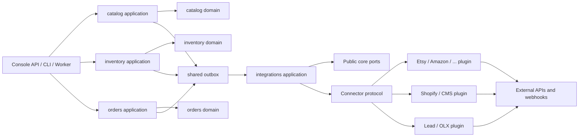
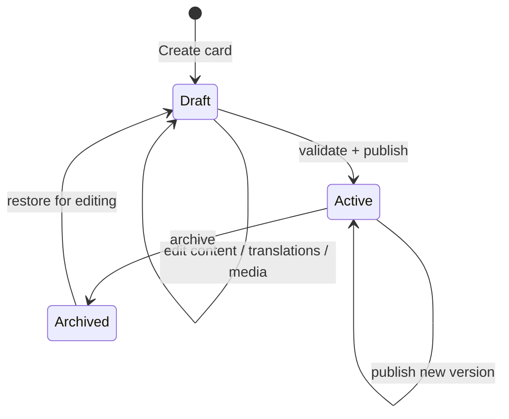
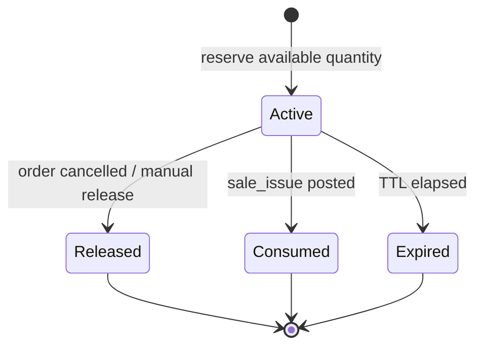
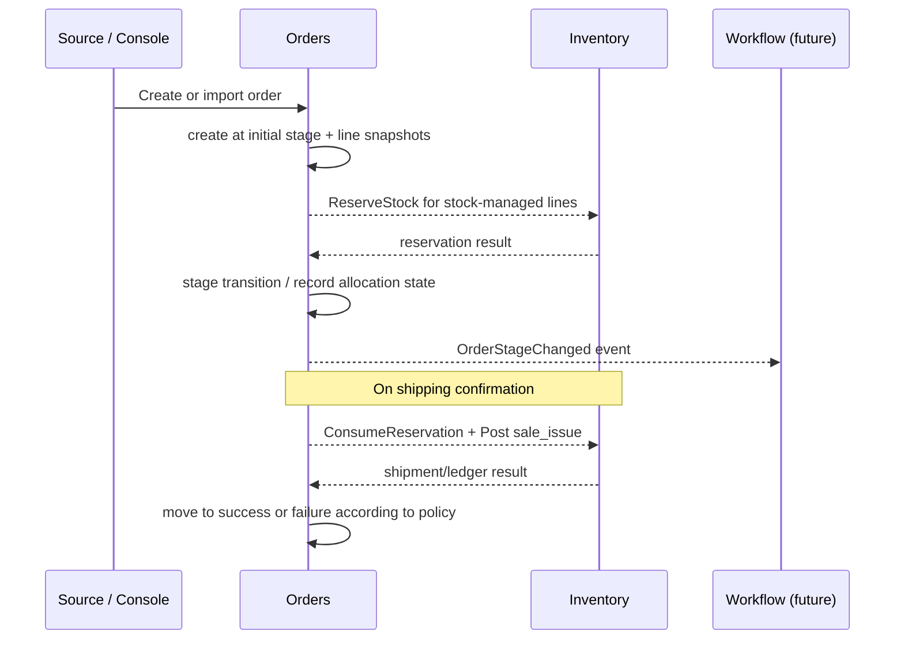
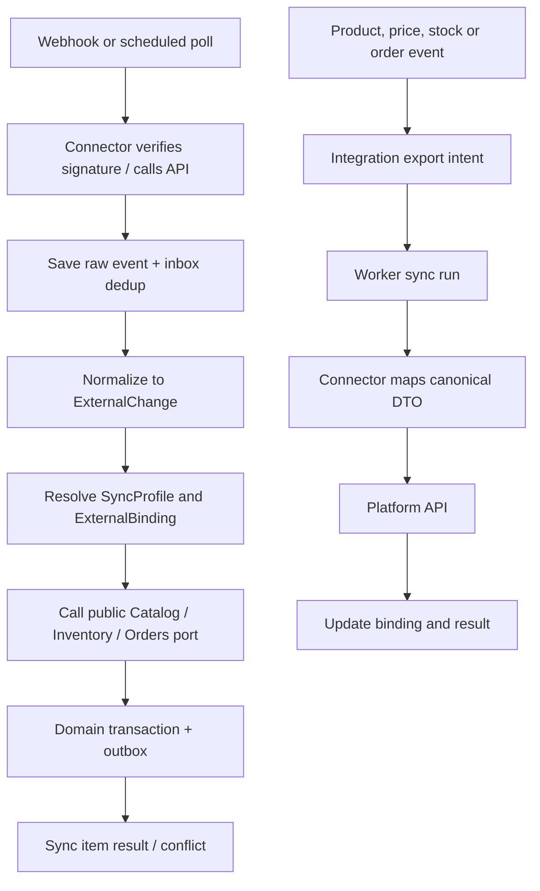

# План: Commerce Core — каталог, склад, заказы и платформенные интеграции

## Статус и цель

Это целевая архитектура и поэтапный план реализации. Описанные ниже модули, кроме базовой сущности
`inventory.warehouse`, пока **не реализованы**. Документ не является описанием текущего HTTP API или схемы БД.

Уточнение от 2026-09-22: [спецификация каталога, цен и Channel](catalog-content-pricing-channels.md) имеет приоритет
для соответствующих разделов этого плана. В ней `simple/variable` отделены от независимых флагов
`is_virtual/is_downloadable`, ProductType определяет схему контента, учётная номенклатура существует независимо
от карточки, а pricing выделен в собственный модуль. Прежние описания этих решений ниже сохранены как контекст
исходного плана и не должны использоваться как конкурирующий контракт реализации.

Цель — построить tenant-scoped commerce core, в котором:

- каталог владеет товарной карточкой и её контентом;
- склад владеет физическим наличием, движениями и резервами;
- заказы владеют коммерческим процессом и воронками;
- интеграции синхронизируют товары, контент, цены, остатки и заказы с внешними платформами;
- коннектор платформы остаётся заменяемым Adapter/Connector и не получает прямого доступа к таблицам бизнес-модулей.

## Архитектурное решение

### Модульные границы

Каждый модуль использует принятые в Runtime слои `domain`, `application`, `infrastructure`, `presentation`.
Статические tenant-модели хранятся в tenant schema и добавляются только через tenant Alembic migrations. Внешние
сервисы и плагины зависят от публичных application contracts, а не от domain entities или persistence models.

| Модуль | Владеет | Не владеет |
|---|---|---|
| `catalog` | карточками товаров, контентом, категориями, атрибутами, шаблонами, медиа и переводами | остатками, резервами, проводками, жизненным циклом заказа, API конкретной платформы |
| `inventory` | складами, местами хранения, складскими единицами, партиями/серийными данными, документами движений, проводками и резервами | редактированием товарного контента, ценами канала, стадиями заказа |
| `orders` | заказом, строками-снимками, воронками, стадиями, правилами переходов и ссылками на резерв/отгрузку | бухгалтерскими или складскими проводками, содержимым карточки товара, HTTP-клиентами платформ |
| `integrations` | подключениями, профилями синхронизации, external bindings, sync runs, конфликтами и доставкой интеграционных задач | инвариантами товара, склада и заказа; платформенным SDK/API |
| `plugins` | протоколом конкретной внешней платформы: OAuth/API key, webhook signature, pagination, rate limits, payload mapping | внутренними бизнес-правилами и прямыми SQL-запросами к `catalog`, `inventory`, `orders` |
| `shared` | UoW, outbox/inbox, clock, UUID, request context, jobs, технические ошибки и observability | commerce workflows и provider-specific логику |



### Направление зависимостей

1. `catalog`, `inventory` и `orders` могут зависеть только от `shared` и друг от друга через явно определённые
   application ports. Прямой импорт чужих domain entities, ORM-моделей и репозиториев запрещён.
2. `orders` вызывает порт резервирования `inventory`; `inventory` хранит лишь ссылку `order_id`/`reservation_owner`,
   но не импортирует агрегат заказа.
3. `catalog` публикует событие об изменении продаваемой сущности. `inventory` ссылается на стабильный
   `catalog_sellable_id`, не редактируя сам товар.
4. `integrations` вызывает фасады `CatalogIntegrationPort`, `InventoryIntegrationPort` и
   `OrderIntegrationPort`. Фасады принимают canonical DTO и возвращают DTO/ошибки, а не ORM-объекты.
5. Коннектор вызывается только из `integrations.application`/worker. HTTP webhook не может обращаться к бизнес-модулю
   или БД напрямую.
6. Все межмодульные побочные эффекты публикуются через общий transactional outbox; входящие сообщения проходят
   inbox/idempotency boundary.

### Целевая структура пакетов

```text
src/
  modules/
    catalog/
      domain/{product,category,attribute,template,media}/
      application/{commands,queries,contracts,services}/
      infrastructure/{persistence,media}/
      presentation/http/
    inventory/
      domain/{warehouse,location,stock_item,document,reservation,ledger}/
      application/{commands,queries,contracts,services}/
      infrastructure/persistence/
      presentation/http/
    orders/
      domain/{order,pipeline,stage,transition}/
      application/{commands,queries,contracts,services}/
      infrastructure/persistence/
      presentation/http/
    integrations/
      domain/{connection,sync_profile,binding,sync_run,conflict}/
      application/{contracts,ingest,export,reconciliation}/
      infrastructure/{persistence,secrets,queue}/
      presentation/{http,webhooks}/
  plugins/
    commerce/
      shopify/                 # пример release-installed connector package
      amazon/
      facebook_leads/
```

Плагины разворачиваются как проверенные пакеты вместе с Runtime (или отдельным worker image), а не загружаются
пользователем как произвольный Python-код. Для каждого плагина обязателен manifest с `connector_code`, версией,
поддерживаемыми capabilities, схемой конфигурации и списком webhook event types. Discovery выполняется при старте
worker через зарегистрированный entry point; несовместимый manifest не активируется.

## Общие принципы работы

### Tenant, идентификаторы и аудит

- Каждый запрос и каждая job получают `tenant_id` только из request/job context; внешний клиент не передаёт его в
  публичном payload.
- Внутри домена используются конкретные `*IdVO`, на границах транспорта — UUID/string с явной конвертацией.
- Все изменяемые бизнес-объекты имеют `created_at`, `updated_at`, `created_by`, `updated_by`. Импортированные
  изменения дополнительно содержат `connection_id`, `external_id`, `correlation_id` и автора вида
  `integration:<connection_id>`.
- Tenant schema изолирует данные; ссылки между модулями внутри схемы являются UUID-ссылками. Наличие цели проверяется
  application port, чтобы избежать жёсткой связности миграций и ORM.

### Источник истины, идемпотентность и версии

- Для каждого ресурса профиля синхронизации (`content`, `price`, `availability`, `orders`) выбираются направление
  (`import`, `export`, `bidirectional`) и authority: `core`, `platform` или правило приоритета. Два авторитетных
  источника для одного поля запрещены.
- Входящий webhook/polling event дедуплицируется по `(tenant_id, connection_id, resource_type, external_event_id)`.
  Если платформа не даёт event id, используется стабильно вычисленный fingerprint исходного payload.
- Export задание идемпотентно по `(connection_id, resource_type, internal_id, version/hash, operation)`.
- `ExternalBinding` уникально связывает внутренний объект с внешним id в рамках подключения и типа ресурса. В нём
  хранятся remote version/etag, last imported/exported hash, статус и время последней успешной синхронизации.
- Конфликт не перезаписывается молча: он фиксируется как `SyncConflict` и решается политикой профиля или оператором.
  Повторная доставка не создаёт новый товар, заказ, документ или резерв.

### Неизменяемые факты и исправления

- Проведённый складской документ и его проводки неизменяемы. Ошибка исправляется отменяющим документом или новым
  документом корректировки, никогда редактированием исторического баланса.
- Строка заказа хранит коммерческий snapshot товара: название, SKU, цена, налог/скидка, валюта и атрибуты на момент
  заказа. Последующая правка карточки не меняет историю заказа.
- Raw webhook/API payload сохраняется только в integration audit store с retention policy и маскированием секретных
  данных. Нормализованные команды и доменные события versioned.

### Согласованность и производительность

- Проверка доступного остатка и создание/подтверждение резерва выполняются в одной транзакции с блокировкой нужной
  позиции либо атомарным condition update. Нельзя рассчитывать доступность по устаревшей read projection.
- Баланс — производная от проведённых проводок. Для быстрого чтения поддерживается rebuildable projection, но
  ledger остаётся источником истины.
- Интеграции асинхронны: HTTP-запрос создаёт команду/запись и outbox event, а worker выполняет polling и export с
  ограничениями платформы. Синхронный ответ API не зависит от доступности Etsy, Shopify или другого provider.
- Все записи поддерживают pagination, versioning и optimistic concurrency там, где пользователь редактирует
  карточку, настройку или воронку.

## Каталог (`catalog`)

### Назначение и модель

`catalog` — единственный владелец контентной части продукта. Он не хранит остаток, reserved quantity или состояние
внешнего листинга. Для витрин и интеграций он выдаёт canonical published representation товара.

| Сущность | Назначение и ключевые правила |
|---|---|
| `ProductCard` | Корневая карточка: код, статус `draft/active/archived`, тип, шаблон, основная категория, категории, теги, медиа, локализованный контент и meta. |
| `SellableItem` | Продаваемая единица карточки. Для simple — сама карточка; для variable — конкретная variation. Это единственная ссылка, которую могут использовать цена, строка заказа и складская единица. |
| `ProductVariation` | Simple-подтип внутри variable product с набором option values, собственным SKU/штрихкодами, медиа и доступностью. Нельзя создавать variation без полного набора option values. |
| `Category` | Дерево категорий. Связь `ProductCategory` many-to-many допускает несколько категорий; одна может быть отмечена primary для канала/навигации. Циклы запрещены. |
| `Tag` | Tenant-scoped нормализованный тег; связь с карточкой many-to-many. |
| `AttributeDefinition` / `AttributeValue` | Типизированный атрибут: text, number, boolean, date, select, multiselect, measurement. Definition может быть общей либо локальной для шаблона. |
| `ProductTemplate` | Versioned набор полей, обязательных атрибутов, допустимых значений и default values, например `simple` или `vitamins`. Применение создаёт значения карточки; изменение шаблона не меняет опубликованные карточки без явной миграции. |
| `MediaAsset` / `ProductMedia` | Файл и его ссылка на продукт/вариацию, роль (`primary`, `gallery`, `document`), порядок и alt text per locale. Файл хранится через media storage port, в БД — метаданные и ссылка. |
| `LocalizedContent` | Переводимые поля: title, description, short description, SEO title/description, URL slug и alt text. У каждой карточки есть default locale; fallback задаётся явной политикой публикации. |
| `ProductMetaField` | Кастомное поле с namespace/key, типом и валидируемым JSON value. Схема meta field регистрируется заранее; произвольный невалидируемый JSON не является публичным контрактом. |

#### Типы карточек

| Тип | Правило |
|---|---|
| `simple` | Обычный товар и `SellableItem`; может быть stock-managed или non-stock-managed. |
| `virtual` | Подвид simple: не требует отгрузки. Может участвовать в заказе, но не создаёт складскую отгрузку. |
| `downloadable` | Подвид simple: содержит одну или несколько защищённых ссылок/прав доступа на файл. Поставка выдаётся только после бизнес-события успешной оплаты/выполнения, а не ссылкой в публичной карточке. |
| `variable` | Контейнер с option definitions и variations. Сам контейнер не резервируется и не списывается; продаются только variations. |
| `external` | Карточка-ссылка на внешнюю страницу/магазин. Не имеет собственной отгрузки и не может быть stock-managed, пока не создан локальный `SellableItem`. |

Шаблон `simple` создаётся системно для каждого tenant или доступен как системный read-only default. Шаблон `vitamins`
может заранее потребовать, например, состав, дозировку, форму, возрастное ограничение и срок годности. Переход типа
карточки проходит отдельную команду с validation: нельзя превратить variable в simple, пока существуют variations и
внешние bindings, без явно выбранной стратегии миграции.

### Основные use cases

- `CreateProductCard`, `UpdateProductContent`, `ChangeProductType`, `ArchiveProductCard`;
- `CreateVariation`, `UpdateVariation`, `RemoveVariation`;
- `CreateCategory`, `MoveCategory`, `AssignProductCategory`, `AssignTag`;
- `CreateAttributeDefinition`, `CreateProductTemplate`, `ApplyProductTemplate`;
- `AttachMedia`, `ReorderMedia`, `SetLocalizedContent`, `SetMetaField`;
- `ValidateProductForPublication` и `PublishProduct` — создают versioned canonical snapshot для каналов;
- query surface: карточка, tree категорий, фильтры атрибутов, published product DTO и export feed page.

Публикация не означает отправку на все платформы. Она лишь делает карточку пригодной к экспорту; конкретный канал
выбирается в `integrations.SyncProfile`.

### Каталожный процесс



Перед `publish` система проверяет тип карточки, обязательные атрибуты шаблона, primary image, default locale,
продаваемые variation options, валидность meta fields и канал-агностические данные. Дополнительные требования
маркетплейса (например, обязательное поле конкретной категории) валидирует connector capability до постановки
export job, не загрязняя core-модель полями Amazon или Rozetka.

## Складской учёт (`inventory`)

### Расширение существующего модуля

Существующий `Warehouse` остаётся корнем складской структуры. В первой миграции его необходимо расширить
`code`, `kind` (`physical`/`virtual`), status и, при необходимости, contact/address metadata. Его текущий `parent_id`
означает логическую вложенность складов. Детальные места внутри склада моделируются отдельно, чтобы склад не
смешивался с полкой или ячейкой.

| Сущность | Назначение |
|---|---|
| `Warehouse` | Логическое место учёта: физический или виртуальный склад, с опциональным parent warehouse. |
| `StorageLocation` | Иерархия внутри одного склада: zone, rack, shelf, bin или tenant-defined type. Каждый node имеет `warehouse_id`; циклы и межскладское parent-child запрещены. |
| `StockItem` | Складская единица, привязанная к `catalog.SellableItem` по id. Содержит inventory SKU, global identifiers (GTIN/EAN/UPC/ISBN и др.), base UoM и режим serial/lot tracking. |
| `StockLot` / `StockSerial` | Необязательные batch, серийный номер, срок годности, лицензия, акцизная марка и другие регулируемые данные. Конкретный тип compliance data делается через versioned schema/meta policy. |
| `InventoryDocument` | Намерение и бизнес-основание операции: номер, тип, статус, source reference, строки и ссылки на заказ/поставку/ревизию. |
| `InventoryPosting` | Неизменяемая двойная проводка количества между двумя inventory accounts. Создаётся только при проведении документа. |
| `InventoryBalanceProjection` | Восстанавливаемая проекция on-hand/reserved/available на уровне item + warehouse/location + lot/serial. |
| `StockReservation` | Выделение available quantity под владельца (обычно order line) с TTL, статусом и ссылкой на item/location. |

### Двойная запись

Проводка имеет как минимум `from_account`, `to_account`, `stock_item_id`, `quantity_base_uom`, при необходимости
`lot_id`, `serial_id`, `source_document_id`, время и idempotency key. `InventoryAccount` абстрагирует как физические
места (`warehouse/location`), так и технические counter-accounts: `supplier_receipt`, `adjustment_gain`,
`adjustment_loss`, `outbound_shipment`, `stocktake_variance`. Поэтому каждая проведённая строка всегда отвечает на
вопрос «откуда» и «куда» переместилось количество.

| Документ | Пример проводки | Бизнес-смысл |
|---|---|---|
| `receipt` (приход по закупке) | `supplier_receipt -> warehouse/location` | Приём поставки на остаток. |
| `capitalization` (оприходование) | `adjustment_gain -> warehouse/location` | Увеличение остатка без закупки. |
| `transfer` | `warehouse A/location -> warehouse B/location` | Внутреннее перемещение; один документ может содержать несколько строк. |
| `sale_issue` (реализация/отгрузка) | `warehouse/location -> outbound_shipment` | Уменьшение доступного остатка как следствие подтверждённой отгрузки заказа. |
| `write_off` | `warehouse/location -> adjustment_loss` | Списание без заказа: порча, утрата, истечение срока. |
| `stocktake` (ревизия) | `adjustment_gain/loss <-> warehouse/location` | Документ создаёт отдельные проводки из выявленной фактической разницы. |
| `reversal` | обратная исходной проводка | Исправляет проведённый документ, сохраняя след аудита. |

`draft` документ можно редактировать. При `post` он проверяет существование и состояние всех позиций, неотрицательные
количества, serial/lot правила, доступный остаток при расходе и баланс всех строк. Затем в одной UoW создаёт
проводки, обновляет projection, меняет статус на `posted` и записывает outbox event. `posted` документ нельзя
удалить; его можно только отменить разрешённым reversal document.

### Резервирование



- `available = on_hand - active_reserved - blocked_quantity`; формула определяется на том же ключе
  `stock_item + warehouse/location + lot`, на котором проходит allocation.
- У резерва есть неизменяемый владелец (`orders.order_line_id` либо другой explicitly supported owner), required
  quantity, allocated lines и expires_at. Частичное резервирование возвращает явный результат, а не скрытое
  округление.
- Создание резерва, release, expire и consume идемпотентны. Фоновая job освобождает просроченные резервы и публикует
  событие, но перед списанием всегда повторно валидируется статус.
- Виртуальный и downloadable товар не создают складской резерв. Простая карточка может быть non-stock-managed;
  это решается политикой `StockItem`, а не отрицательными остатками без журнала.

### Основные use cases

- управление складом и местами: `CreateWarehouse`, `ChangeWarehouseHierarchy`, `CreateStorageLocation`,
  `MoveStorageLocation`;
- master data: `CreateStockItem`, `LinkStockItemToSellable`, `RegisterLotOrSerial`;
- документы: `CreateInventoryDocument`, `AddDocumentLine`, `PostInventoryDocument`, `ReverseInventoryDocument`,
  `RunStocktake`;
- availability: `GetAvailability`, `ReserveStock`, `ReleaseReservation`, `ConsumeReservation`,
  `RebuildBalanceProjection`;
- интеграционный фасад: import/export availability только через policy profile; прямое изменение balance external
  payload не допускается.

## Заказы (`orders`)

### Модель и инварианты

| Сущность | Назначение |
|---|---|
| `Pipeline` | Воронка обработки заказов с code, названием, status и набором стадий/переходов. |
| `Stage` | Стадия имеет системный kind: `initial`, `processing`, `success`, `failure`; цвет/сортировку и настройки действий. |
| `StageTransition` | Разрешённый направленный переход с optional conditions и required reason для отдельных переходов. |
| `Order` | Коммерческий агрегат: номер, источник, покупатель/контакты, валюта, totals, pipeline/stage, адреса, external references и audit. |
| `OrderLine` | Snapshot продаваемой позиции и цены; может ссылаться на `catalog_sellable_id` и `stock_item_id`, но не зависит от live content. |
| `OrderReservationLink` | Ссылка на reservation и состояние fulfilment по строке; резерв остаётся владением `inventory`. |
| `OrderExternalReference` | Ссылка на внешний заказ/lead и источник, уникальная в рамках integration connection. |

Инварианты `Pipeline`:

- ровно одна активная `initial` stage; в неё создаётся заказ;
- как минимум одна `success` и одна `failure` stage; пользователь вправе создавать дополнительные финальные стадии;
- пользовательские обычные стадии имеют kind `processing`; системные kinds не заменяются произвольным текстовым
  статусом;
- stage нельзя удалить, пока в ней есть заказы или переходы; сначала требуется migration/архивация;
- order может перейти только по разрешённому transition. Перенос в другую воронку делается отдельной командой,
  которая проверяет явное сопоставление целевой стадии.

### Процесс заказа и связь со складом



Резервирование не является неявным побочным эффектом каждого перехода. Для pipeline задаётся явная политика:
например, `reserve_on = confirmed`, `consume_on = shipped`, `release_on = cancelled` и reservation TTL. Первый MVP
может ограничиться одной такой политикой на pipeline; сложные правила не должны быть зашиты в connector.

Создание заказа не должно превращаться в частично записанный заказ, если каталог/склад не может подтвердить строку.
Для импортов допускается controlled режим `needs_resolution`: заказ и raw source reference сохраняются, но не создаётся
резерв и не происходит списание, пока оператор не сопоставит внешний SKU с `SellableItem`/`StockItem`.

### Роботы и триггеры

Заказ и воронка публикуют события `OrderCreated`, `OrderStageChanged`, `OrderCancelled`, `OrderFulfilmentChanged`.
Будущий модуль automation/workflow подписывается на них и выполняет роботов/триггеры. `orders` хранит определение
стадий и проверяет переход, но не становится workflow engine: он не выполняет произвольный код, задержки и provider
calls в транзакции перехода.

### Формы лидов

Facebook Leads и TikTok Leads — inbound source категории `lead_capture`, а не складской канал. Профиль подключения
должен явно выбрать mapping:

- создать `Order` в initial stage как черновик без строк;
- обновить существующий draft по configured deduplication key;
- либо записать `CapturedLead` в отдельный будущий `leads` bounded context.

Ни один connector не создаёт заказ автоматически без такой настройки, а неполный контакт не резервирует товар.

### Основные use cases

- `CreatePipeline`, `AddStage`, `ConfigureTransition`, `ArchiveStage`;
- `CreateOrder`, `AddOrderLine`, `RepriceOrder` (до бизнес-точки фиксации), `MoveOrderStage`, `MoveOrderPipeline`;
- `RequestOrderReservation`, `ReleaseOrderReservation`, `ConfirmShipment`, `CancelOrder`;
- `ImportExternalOrder`, `ResolveImportedOrder`, `LinkExternalOrder`;
- query surface: kanban/list, order detail, order history, unresolved imports и fulfilment status.

## Интеграции и коннекторы (`integrations` + `plugins`)

### Базовые сущности и capabilities

| Сущность | Назначение |
|---|---|
| `IntegrationConnection` | Tenant-подключение к платформе: connector code, display name, status, credential secret reference, timezone и допустимые webhook endpoints. Секреты не лежат в JSON config или логах. |
| `SyncProfile` | Правила для одной connection: включённые resources/capabilities, направление, source of truth, mapping полей, складов и stages, schedule и conflict policy. |
| `ExternalBinding` | Стойкое соответствие internal id ↔ external id/resource; защита от дубликатов и основание для update вместо create. |
| `SyncRun` / `SyncItemResult` | Наблюдаемая попытка import/export: cursor, count, status, retry, error category, correlation id. |
| `SyncConflict` | Конфликт версий/authority/mapping, требующий rule-based или ручного решения. |
| `PlatformCapability` | Версионированная декларация connector-а: `catalog_content`, `media`, `price`, `availability`, `orders`, `fulfilment`, `webhooks`, `lead_capture`. |

Общие resource contracts:

- `CanonicalProduct`, `CanonicalVariant`, `CanonicalMedia`, `CanonicalPrice`;
- `CanonicalAvailability` с `stock_item`, warehouse allocation и point-in-time;
- `CanonicalOrder`, `CanonicalOrderLine`, `CanonicalCustomer`, `CanonicalFulfilment`;
- `CanonicalLead` для форм;
- `ExternalChange` и `ExternalOperationResult` с идентификаторами, version/etag, occurred/received timestamps и
  correlation id.

Плагин обязан реализовать только объявленные capabilities. Если платформа не поддерживает реальное изменение остатков
или заказов, capability отсутствует, профиль не позволяет её включить, а UI объясняет ограничение. Таким образом,
`integration` никогда не обещает одинаковый функционал всем платформам.

### Контракт Connector-а

Упрощённый Python protocol, который станет частью `integrations.application.contracts`:

```python
class CommerceConnector(Protocol):
    manifest: ConnectorManifest

    async def validate_connection(self, request: ConnectionRequest) -> ConnectionCheck: ...
    async def pull_changes(self, request: PullRequest) -> AsyncIterator[ExternalChange]: ...
    async def push_products(self, request: PushProductsRequest) -> PushResult: ...
    async def push_prices(self, request: PushPricesRequest) -> PushResult: ...
    async def push_availability(self, request: PushAvailabilityRequest) -> PushResult: ...
    async def pull_orders(self, request: PullOrdersRequest) -> AsyncIterator[ExternalChange]: ...
    async def parse_webhook(self, request: WebhookRequest) -> ExternalChange: ...
```

Методы, не покрытые manifest capabilities, не вызываются. Внутренний контракт требует pagination cursor,
rate-limit hints, retryable/non-retryable errors и opaque provider metadata. Коннектор не получает `AsyncSession`,
repository, UoW или прямой доступ к секретам другого подключения.

### Входящий и исходящий обмен



**Inbound:** connector сначала проверяет подпись/webhook secret или credentials, нормализует транспортные ошибки и
передаёт `ExternalChange`. `integrations` сохраняет raw audit record, применяет deduplication, находит profile/binding
и вызывает публичный core port. Нераспознанный SKU, нарушение schema или конфликт создают `SyncConflict`/item result
без тихого пропуска и без повторного создания заказа.

**Outbound:** опубликованная карточка, изменение цены, availability projection или экспортируемое изменение заказа
создают outbox event. `integrations` формирует одну или несколько export intents по включённым профилям. Worker
получает canonical DTO, connector преобразует его в provider payload, соблюдает batching/rate limits, сохраняет
external binding и только затем отмечает intent успешным. Повторная задача делает update по binding либо безопасный
idempotent create.

**Reconciliation:** периодический job сравнивает cursor/version/hash внутренних и внешних объектов. Он обнаруживает
пропущенные webhooks и дрейф, но не выполняет массовую перезапись без policy/preview. Массовые исправления проходят
отдельный `SyncRun` с отчётом и обратимой очередью повторов.

### Платформенный каталог

Каждый пункт ниже — отдельный connector package/configuration, а не ветвление `if platform` внутри core. Реальная
матрица возможностей формируется manifest-ом конкретной версии после проверки API и коммерческих ограничений
платформы.

| Группа | Connector codes | Целевые направления |
|---|---|---|
| Маркетплейсы | `etsy`, `amazon`, `ebay`, `prom_ua`, `rozetka`, `allo`, `kasta`, `epicentr` | product/content, media, price, availability, order import, fulfilment — если capability доступна. |
| Облачные магазины | `shopify`, `horoshop`, `tilda`, `wix`, `weblium`, `shop_express`, `webflow` | storefront catalog/content, price, availability и order import в зависимости от API. |
| CMS магазины | `opencart`, `wordpress_woocommerce`, `magento`, `prestashop`, `okay_cms`, `cs_cart` | API connector или self-hosted bridge для catalog, price, stock, orders. |
| Формы | `facebook_leads`, `tiktok_leads` | webhook/poll lead capture, mapping в draft order или будущий lead. |
| Другое | `olx` | Платформенно доступные listing/order flows; отдельная capability декларация. |
| Расширяемое | `custom_source` | Signed generic webhook, CSV/SFTP или custom connector только по отдельному контракту; не обход интеграционного ядра. |

Для CMS/self-hosted систем connector может состоять из Runtime worker и лёгкого установленного у клиента bridge.
Bridge аутентифицируется отдельно, имеет минимальные scoped credentials и отправляет те же canonical contracts. Он не
получает доступ к tenant database.

## API, события и хранение

### Публичные application facades

Минимальные стабильные boundary contracts:

- `CatalogIntegrationPort`: find published product/variant, validate channel payload, import/update content по policy,
  publish product snapshot;
- `InventoryIntegrationPort`: query availability, import authorised adjustment/receipt, reserve/release/consume via
  explicit command;
- `OrderIntegrationPort`: import order idempotently, resolve external mapping, move stage under configured policy,
  report fulfilment;
- `IntegrationConnectorPort`: validate/pull/push/parse webhook; реализуется только plugin-ом.

Все mutating calls содержат `tenant_id`, `actor`, `correlation_id`, `idempotency_key`, source metadata и expected
version при необходимости. DTO versioned по явному `schema_version`; удаление поля проходит deprecation period.

### Доменные события

Начальный набор событий для outbox:

- `CatalogProductPublished`, `CatalogProductArchived`, `CatalogProductContentChanged`;
- `InventoryDocumentPosted`, `InventoryAvailabilityChanged`, `InventoryReservationChanged`;
- `OrderCreated`, `OrderStageChanged`, `OrderReservationRequested`, `OrderFulfilmentChanged`;
- `IntegrationSyncIntentCreated`, `IntegrationSyncCompleted`, `IntegrationSyncConflictDetected`.

Событие содержит `event_id`, `tenant_id`, aggregate type/id, `occurred_at`, `correlation_id`, `causation_id`, schema
version и минимальный payload. Нельзя передавать credential, raw secret, полный payment data или неограниченный
media binary в broker.

### Минимальные таблицы первой реализации

| Модуль | Таблицы / проекции |
|---|---|
| `catalog` | `product_cards`, `product_variations`, `sellable_items`, `categories`, `product_categories`, `tags`, `product_tags`, `attribute_definitions`, `product_attribute_values`, `product_templates`, `product_media`, `localized_content`, `product_meta_fields` |
| `inventory` | расширенная `warehouses`, `storage_locations`, `stock_items`, `stock_lots`, `stock_serials`, `inventory_documents`, `inventory_document_lines`, `inventory_postings`, `inventory_balance_projection`, `stock_reservations`, `stock_reservation_allocations` |
| `orders` | `pipelines`, `pipeline_stages`, `stage_transitions`, `orders`, `order_lines`, `order_reservation_links`, `order_external_references`, `order_stage_history` |
| `integrations` | `integration_connections`, `sync_profiles`, `external_bindings`, `sync_runs`, `sync_item_results`, `sync_conflicts`, `integration_inbox`, `integration_raw_events` |

`integration_inbox` может использовать общий shared inbox, если его unique key и retention достаточны для provider
events. Дублировать техническую inbox-таблицу без причины не следует. Индексы обязательны на tenant-scoped external
ids, document number/status, posting balance key, availability key, reservation expiry, stage status и sync cursor.

## Поэтапная реализация

### M0 — решения, контракты и тестовый каркас

1. Утвердить ADR по модулям, canonical DTO, source-of-truth profile, naming identifiers и policy конфликтов.
2. Создать пустые module packages с architecture-boundary tests: domain не импортирует infrastructure/connector,
   plugin не импортирует ORM/business internals.
3. Определить tenant migrations, API error envelope, pagination, audit/correlation/idempotency conventions.
4. Зафиксировать event schema и outbox/inbox contract; подготовить fixture builders и integration-test PostgreSQL.

**Критерий готовности:** можно подключить mock connector к стабильному application port без доступа к бизнес-таблицам.

### M1 — каталог и content lifecycle

1. Реализовать ProductCard/SellableItem, типы simple/virtual/downloadable/variable/external и validation переходов.
2. Добавить категории, теги, attributes, templates, meta schemas, media storage port и translations.
3. Добавить publication snapshot, REST query/command API, migrations и tests для type/template/localization invariants.
4. Публиковать catalog domain events через outbox.

**Критерий готовности:** пользователь создаёт multilingual simple или variable карточку, применяет шаблон, валидирует и
публикует стабильный canonical snapshot без интеграции с конкретной платформой.

### M2 — складской ledger и резервы

1. Расширить существующий `Warehouse`, добавить storage locations и StockItem link к SellableItem.
2. Реализовать документный workflow, двойные проводки и rebuildable balance projection.
3. Добавить receipt, capitalization, transfer, write-off, sale issue, stocktake и reversal.
4. Реализовать atomic reservations, expiry job, availability queries и полное audit trail тестирование.

**Критерий готовности:** баланс может быть пересчитан из проводок; нельзя дважды списать или зарезервировать одно и то
же available quantity; исправление не меняет историю.

### M3 — заказы, воронки и fulfilment boundary

1. Реализовать Pipeline/Stage/Transition с обязательными start/success/failure инвариантами.
2. Добавить Order и line snapshots, stage history, order source/external refs и kanban/list API.
3. Связать configured pipeline policy с reserve/release/consume через `InventoryIntegrationPort`.
4. Выпускать события переходов; оставить robots/triggers подписчикам будущего automation module.

**Критерий готовности:** заказ проходит контролируемую воронку, резервируется, отгружается с документом реализации и
освобождает резерв при отмене; витринная правка товара не меняет его строку заказа.

### M4 — integration kernel и эталонные коннекторы

1. Реализовать connection, encrypted secret reference, profile, binding, sync run, inbox/dedup, conflict и worker
orchestration.
2. Ввести connector manifest/protocol и mock/fake connector contract test suite.
3. Реализовать один reference storefront connector (рекомендуемый порядок — Shopify), один marketplace connector и
   один lead connector (Facebook Leads или TikTok Leads) для проверки всех направлений.
4. Добавить webhook endpoint, signature validation, rate-limit/retry policy, reconciliation и observability dashboard.

**Критерий готовности:** incoming order не дублируется, published product/price/availability экспортируются повторно
без создания дублей, а конфликт и ошибка видны оператору.

### M5 — масштабирование матрицы платформ

1. Добавлять connector по одному, начиная с подтверждённого business priority и матрицы capabilities.
2. Для каждого connector-а подготовить auth flow, field/category mapping, binding migration, contract tests, sandbox
   tests и operational runbook.
3. Добавить CMS bridge там, где облачного API недостаточно; внедрить OLX и custom source как отдельные пакеты.
4. После стабильного ядра добавить pipeline robots/trigger module и расширенные pricing/fulfilment policies.

**Критерий готовности:** новый connector добавляется без изменения domain-кода `catalog`/`inventory`/`orders`; его
capabilities ограничивают UI и sync profile автоматически.

## Тестирование, безопасность и эксплуатация

### Обязательные тесты

- unit: инварианты product type/template/translation, дерево категорий и locations, balanced postings,
  reservation state machine, pipeline transitions;
- PostgreSQL integration: tenant schema isolation, unique external bindings, concurrent reservations, document posting
  rollback, outbox/inbox transactionality и миграции;
- contract: fake connector проходит те же pull/push/webhook scenarios, что и каждый plugin;
- end-to-end sandbox: create/publish product → export → remote id binding → incoming order → reserve → sale issue;
- replay: повтор webhook/event/export intent не меняет результат и не создаёт дубликат;
- performance: массовая availability export queue, pagination, rate-limit/backoff и balance projection rebuild.

### Security и наблюдаемость

- Credentials и webhook secrets хранятся по encrypted secret reference; API возвращает только masked metadata.
- Webhooks проверяют signature, timestamp/replay window и connection routing до нормализации payload.
- Provider payloads, PII и downloadable URLs проходят redaction/retention policy; доступ к raw audit ограничен ролями.
- Логи и метрики включают tenant-safe connection id, sync run id, capability, result category, latency и rate-limit,
  но не token или полные персональные данные.
- Ретраи применяются только к retryable ошибкам. Exponential backoff, dead-letter/failed sync result и ручной replay
  обязательны; бесконечный silent retry запрещён.

## Открытые продуктовые решения до начала M1/M4

Следующие решения не блокируют создание границ, но должны быть утверждены до реализации соответствующей фазы:

1. Валюта, налоги, скидки, прайс-листы и правила округления: отдельный pricing/tax subdomain либо минимальный
   snapshot в заказе на M3.
2. Мультискладская стратегия резервирования: приоритет складов, partial allocation и разрешён ли negative stock.
3. Источник истины для каждой пары «канал + ресурс» и процедура ручного разрешения конфликтов.
4. Каталог регулируемых данных: какие лицензии, акцизные марки, серийные номера, срок годности и traceability
   обязательны по конкретным категориям товара.
5. Lifecycle оплаты, доставки, возвратов и refunds: M3 хранит ссылочные статусы/события; полноценные payment/shipping
   bounded contexts следует вводить отдельным решением.
6. Приоритет платформ для M4/M5, доступность их sandbox/API и необходимость CMS bridge.

## Связь с текущим Runtime

- Существующий `inventory.Warehouse` и tenant migration `0001_warehouses` — стартовая точка M2, а не готовый
  складской учёт.
- Модуль обязан следовать tenant/UoW/migration правилам из [ограничений и соглашений](../quality/constraints-and-conventions.md).
- Общий outbox/inbox используется для надёжной межмодульной и интеграционной доставки; см. существующий
  [External Events roadmap](../modules/external-events.md) для аналогичных правил ingestion/normalization.
- В дальнейшем `external_events` может быть техническим ingestion boundary для generic inbound events, но ownership
  `IntegrationConnection`, platform mapping и commerce sync process остаётся у `integrations`.
