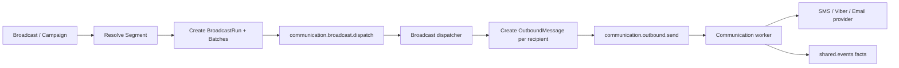
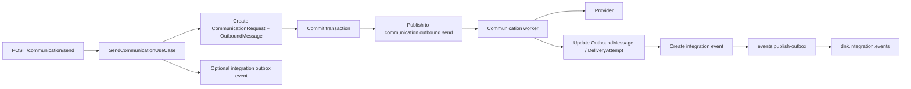

## 1. Должны ли рассылки публиковать в очередь shared.events?

**Нет, не для команды “отправь сообщение”.**

`shared.events` должен использоваться для публикации **фактов**, которые уже произошли:

```text
OutboundMessageQueued
OutboundMessageSent
OutboundMessageFailed
OutboundMessageDelivered
OutboundMessageBounced
BroadcastStarted
BroadcastFinished
BroadcastFailed
```

Но не для команд:

```text
Send this SMS now
Send this email now
Process broadcast batch
Retry outbound message
```

Для команд выполнения работы нужна отдельная operational queue.

---

## Правильное разделение

### `shared.events`

Это **integration event bus** между bounded contexts.

Его задача:

```text
Модуль A сообщает остальной системе: "факт произошел".
```

Примеры:

```text
communication.outbound_message.sent.v1
communication.outbound_message.failed.v1
communication.delivery_status.changed.v1
campaign.broadcast.finished.v1
segment.materialized.v1
```

Свойства:

```text
- topic exchange
- много потенциальных consumers
- inbox idempotency
- outbox publication
- события являются фактами
- consumer сам решает, реагировать или нет
```

---

### `communication.outbound.send`

Это **рабочая очередь доставки сообщений**.

Ее задача:

```text
Выполнить конкретную работу: отправить конкретный OutboundMessage.
```

Пример payload:

```json
{
  "tenant_id": "tenant-id",
  "outbound_message_id": "message-id",
  "correlation_id": "request-id"
}
```

Свойства:

```text
- один тип worker'а
- retry policy
- DLQ
- rate limit
- provider throttling
- recover stuck
- idempotent send
- payload минимальный
```

---

## Рекомендация по рассылкам

Для массовых рассылок я бы не отправлял каждое сообщение напрямую через `shared.events`.

Правильнее так:



То есть можно иметь минимум две operational queues:

```text
communication.broadcast.dispatch   # fan-out / подготовка пачек
communication.outbound.send        # отправка одного сообщения
```

А `shared.events` использовать только для событий:

```text
BroadcastStarted
BroadcastBatchProcessed
OutboundMessageQueued
OutboundMessageSent
OutboundMessageFailed
OutboundMessageDelivered
```

---

# 2. Как оформить общий брокер и общий порт

Главная идея:

```text
Общее подключение к RabbitMQ — в shared.infrastructure.messaging.

Но очереди, exchange names и application-порты остаются в конкретных модулях.
```

То есть **RabbitMQ connection общий**, но **семантические порты разные**.

---

## Рекомендуемая структура

```text
src/modules/shared/
  application/
    messaging/
      ports.py
    events/
      ports.py
      use_case.py
      consumer.py

  infrastructure/
    messaging/
      rabbitmq/
        connection.py
        publisher.py
        consumer.py
        topology.py
        settings.py

    events/
      rabbitmq_integration_event_publisher.py
      sqlalchemy_outbox_repository.py
      sqlalchemy_inbox_repository.py

src/modules/communication/
  application/
    outbound_message/
      ports.py
      use_cases/
        send_communication.py
        process_outbound_message.py

  infrastructure/
    messaging/
      rabbitmq_outbound_message_publisher.py
      rabbitmq_worker.py
      topology.py
```

---

## Общий низкоуровневый порт публикации сообщений

В `shared.application.messaging.ports` можно сделать технический порт:

```python
from __future__ import annotations

from dataclasses import dataclass
from typing import Any, Mapping, Protocol


@dataclass(frozen=True, slots=True)
class BrokerMessage:
    body: dict[str, Any]
    headers: Mapping[str, str] | None = None
    message_id: str | None = None
    correlation_id: str | None = None
    content_type: str = "application/json"


class MessagePublisherPort(Protocol):
    async def publish(
        self,
        *,
        exchange: str,
        routing_key: str,
        message: BrokerMessage,
    ) -> None:
        ...
```

Это **не доменный порт**. Это общий application-level/infra-level контракт для публикации сообщений в broker.

Его могут использовать разные adapters:

```text
RabbitMQIntegrationEventPublisher
RabbitMQOutboundMessagePublisher
RabbitMQBroadcastDispatchPublisher
```

---

## Общий RabbitMQ adapter

В `shared.infrastructure.messaging.rabbitmq.publisher`:

```python
class RabbitMQMessagePublisher(MessagePublisherPort):
    def __init__(self, connection_provider: RabbitMQConnectionProvider) -> None:
        self._connection_provider = connection_provider

    async def publish(
        self,
        *,
        exchange: str,
        routing_key: str,
        message: BrokerMessage,
    ) -> None:
        connection = await self._connection_provider.get_connection()
        channel = await connection.channel()

        exchange_obj = await channel.get_exchange(exchange)

        await exchange_obj.publish(
            message=self._to_rabbit_message(message),
            routing_key=routing_key,
        )
```

То есть подключение, reconnect, JSON serialization, confirms, базовая публикация — общие.

Но этот класс **ничего не знает** про:

```text
communication.outbound.send
dnk.integration.events
BroadcastRun
OutboundMessage
IntegrationEvent
```

---

## Порт для integration events

В `shared.application.events.ports`:

```python
from typing import Protocol

from src.modules.shared.domain.events.integration_event import IntegrationEvent


class IntegrationEventPublisherPort(Protocol):
    async def publish(self, event: IntegrationEvent) -> None:
        ...
```

Адаптер:

```python
class RabbitMQIntegrationEventPublisher(IntegrationEventPublisherPort):
    def __init__(
        self,
        message_publisher: MessagePublisherPort,
        exchange_name: str,
    ) -> None:
        self._message_publisher = message_publisher
        self._exchange_name = exchange_name

    async def publish(self, event: IntegrationEvent) -> None:
        await self._message_publisher.publish(
            exchange=self._exchange_name,
            routing_key=event.event_type,
            message=BrokerMessage(
                body=event.payload,
                headers={
                    "event_id": str(event.id),
                    "event_type": event.event_type,
                    "occurred_at": event.occurred_at.isoformat(),
                    "schema_version": str(event.schema_version),
                },
                message_id=str(event.id),
                correlation_id=event.correlation_id,
            ),
        )
```

---

## Порт для Communication outbound queue

В `communication.application.outbound_message.ports`:

```python
from typing import Protocol

from src.modules.shared import EntityIdVO


class OutboundMessageQueuePort(Protocol):
    async def enqueue(
        self,
        *,
        tenant_id: EntityIdVO,
        outbound_message_id: EntityIdVO,
        correlation_id: str | None = None,
    ) -> None:
        ...
```

Адаптер:

```python
class RabbitMQOutboundMessagePublisher(OutboundMessageQueuePort):
    def __init__(
        self,
        message_publisher: MessagePublisherPort,
        exchange_name: str,
        routing_key: str,
    ) -> None:
        self._message_publisher = message_publisher
        self._exchange_name = exchange_name
        self._routing_key = routing_key

    async def enqueue(
        self,
        *,
        tenant_id: EntityIdVO,
        outbound_message_id: EntityIdVO,
        correlation_id: str | None = None,
    ) -> None:
        await self._message_publisher.publish(
            exchange=self._exchange_name,
            routing_key=self._routing_key,
            message=BrokerMessage(
                body={
                    "tenant_id": str(tenant_id),
                    "outbound_message_id": str(outbound_message_id),
                },
                headers={
                    "message_kind": "communication.outbound.send",
                },
                message_id=str(outbound_message_id),
                correlation_id=correlation_id,
            ),
        )
```

Так ты получаешь:

```text
1 общий RabbitMQ connection/publisher
2 разные application-порты
3 разные очереди
4 разные семантики
```

---

# Важное замечание: domain events ≠ integration events

Я бы не называл публикацию в RabbitMQ “публикацией доменных событий” напрямую.

Лучше разделить:

```text
DomainEvent
  внутреннее событие внутри bounded context

IntegrationEvent
  публичный контракт между модулями
```

Например внутри Communication может быть доменное событие:

```text
OutboundMessageMarkedAsSent
```

А наружу оно превращается в integration event:

```text
communication.outbound_message.sent.v1
```

Почему так лучше:

```text
DomainEvent может содержать внутренние детали агрегата.
IntegrationEvent должен быть стабильным публичным контрактом.
```

---

## Правильный flow для Communication

Я бы оформил так:



Ключевой момент:

```text
Очередь communication.outbound.send выполняет работу.
shared.events сообщает другим модулям о результате.
```

---

# Что делать с надежностью publish после commit

В описании сейчас указано:

```text
HTTP send создает outbound и после commit публикует job в RabbitMQ
```

Это нормально для MVP, но есть риск:

```text
DB commit прошел
RabbitMQ publish упал
OutboundMessage остался queued
```

У тебя уже есть `communication publish-queued`, `recover-stuck`, `process-queued`. Поэтому можно зафиксировать правило:

```text
DB является source of truth.
RabbitMQ — ускоритель доставки, а не единственный источник задания.
```

То есть надежная модель такая:

```text
1. Создаем OutboundMessage(status=queued) в БД.
2. Commit.
3. Пробуем опубликовать в communication.outbound.send.
4. Если publish упал — ничего страшного.
5. CLI/worker publish-queued позже найдет queued messages и переопубликует.
```

Worker при получении сообщения должен не доверять RabbitMQ payload полностью, а идти в БД:

```text
1. Получил outbound_message_id.
2. Открыл UoW.
3. Забрал OutboundMessage.
4. Проверил status.
5. Выполнил claim/lock.
6. Отправил provider'у.
7. Записал DeliveryAttempt / DeliveryEvent.
8. Перевел status.
9. Создал integration outbox event.
```

---

# Топология очередей

Я бы разделил так:

```text
dnk.integration.events
  type: topic
  purpose: межмодульные integration events

communication.outbound
  type: direct или topic
  purpose: отправка конкретных сообщений

communication.outbound.send
  queue для отправки сообщений

communication.outbound.send.retry
  retry/delay queue

communication.outbound.send.dlq
  dead-letter queue

communication.broadcast
  type: direct/topic
  purpose: fan-out массовых рассылок

communication.broadcast.dispatch
  queue для обработки batch'ей рассылки
```

---

# Когда Communication должен публиковать integration events

Минимальный набор событий:

```text
communication.outbound_message.queued.v1
communication.outbound_message.sent.v1
communication.outbound_message.failed.v1
communication.outbound_message.delivered.v1
communication.outbound_message.bounced.v1
communication.delivery_status.changed.v1
```

Для рассылок:

```text
communication.broadcast.created.v1
communication.broadcast.started.v1
communication.broadcast.batch_processed.v1
communication.broadcast.completed.v1
communication.broadcast.failed.v1
communication.broadcast.canceled.v1
```

Но событие `queued` я бы публиковал только если другим модулям действительно нужно знать, что сообщение поставлено в очередь. Иначе оно может создать слишком много шума.

---

# Итоговая рекомендация

Архитектурно зафиксировал бы так:

```text
Communication не использует shared/events как транспорт доставки.
Communication использует собственные operational queues.
shared/events используется только для межмодульных фактов.
RabbitMQ connection/publisher общий и находится в shared.infrastructure.messaging.
Application-порты остаются семантическими и модульными.
```

Лучшее целевое состояние:

```text
shared.infrastructure.messaging
  общий RabbitMQ foundation

shared.events
  integration event outbox/inbox + topic publisher

communication
  outbound queue publisher/worker
  broadcast dispatch queue
  provider workers
  delivery state machine

campaigns / broadcast / workflow
  создают задания/сообщения
  получают факты через shared.events
```

То есть твоя текущая связка:

```text
communication -> shared core primitives
communication -X-> shared/events delivery transport
shared/events -> independent integration event foundation
```

правильная. Я бы ее не ломал. Нужно только вынести общий RabbitMQ foundation ниже, в `shared.infrastructure.messaging`, и заставить и `shared.events`, и `communication` использовать его через свои адаптеры.
