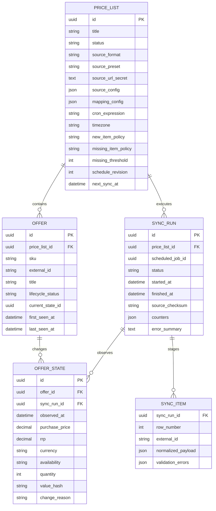
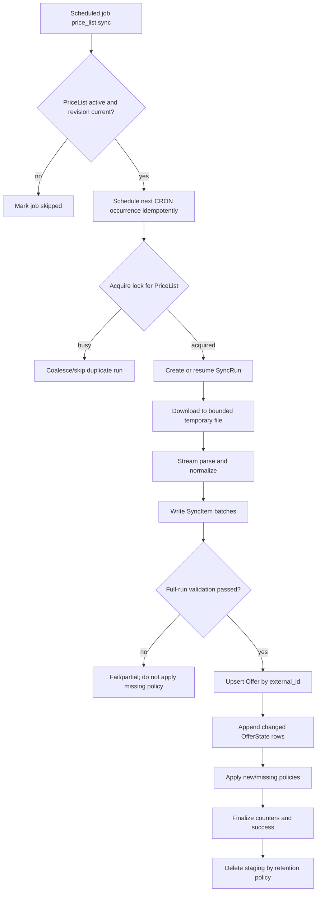

# План реализации модуля партнерских прайс-листов

## 1. Цель

Добавить отдельный tenant-scoped модуль `price_lists`, который:

- создает и настраивает источники партнерских предложений (`PriceList`);
- загружает удаленные XML, YAML и XLSX-файлы по URL;
- позволяет предварительно прочитать произвольный файл и сопоставить его поля с полями системы;
- выполняет первую загрузку сразу после активации прайс-листа;
- запускает следующие синхронизации по CRON-расписанию;
- хранит карточку партнерского предложения отдельно от изменяемого состояния цены и остатка;
- записывает новую версию цены/остатка только при фактическом изменении;
- явно обрабатывает новые, пропавшие, повторно появившиеся и некорректные позиции.

Модуль не изменяет локальный складской баланс и не становится частью `inventory`. Его задача — наблюдение за внешним
ассортиментом партнера. Связь партнерского offer с будущим локальным товаром или `catalog.SellableItem` должна
добавляться отдельным use case и не входит в первый этап.

## 2. Зафиксированные термины и допущения

- `PriceList` — конфигурация одного удаленного источника, его формата, сопоставления полей и расписания.
- `Offer` — стабильная позиция партнера. Бизнес-поля: `id`, `sku`, `external_id`, `title`.
- `OfferState` — неизменяемый снимок цены и доступности, действующий с момента конкретной синхронизации.
- `purchase_price` — закупочная цена товара у партнера. Исходное поле партнера может называться `price`, но после
  mapping в доменной модели и API используется однозначное имя `purchase_price`.
- `rrp` — рекомендованная розничная цена (РРЦ).
- `recommended_retail_income` — рекомендованный розничный доход (РРД), вычисляемый как
  `rrp - purchase_price`.
- `margin_percent` — валовая маржа относительно РРЦ: `(rrp - purchase_price) / rrp * 100`.
- Указанный тип `int | NULL` относится к количественному остатку `quantity`: `NULL` означает, что источник сообщает
  только факт наличия, но не точное количество.
- В требованиях перечислены XML, YAML и XLSX. Prom/YML catalog при этом является XML-документом и обрабатывается
  XML-парсером с отдельным preset `prom_xml`.
- Деньги хранятся как `NUMERIC`, а не `float`. Валюта обязательна либо в строке файла, либо как значение по умолчанию
  в настройках прайс-листа.
- История хранит начальное состояние offer и последующие изменения. Одинаковое состояние при каждом опросе повторно
  не записывается; сам факт успешной проверки остается в `PriceListSyncRun`.

РРД и маржа не вычисляются, если РРЦ отсутствует или равна нулю. Отрицательные значения не обрезаются: они должны
показывать оператору, что закупочная цена выше рекомендованной розничной. Перед разработкой продукта остается
подтвердить требуемый срок хранения истории; остальные решения ниже можно использовать как безопасные значения по
умолчанию.

## 3. Проверенные примеры источников

### 3.1. Prom XML

Источник:
`https://proteinplus.pro/api/xml2/74a8b9ef74e225ee45a25d0bb88e8102ec7a71df.xml`

Фактическая структура проверенного файла:

```text
yml_catalog
└── shop
    └── offers
        └── offer[]
```

Стартовый preset `prom_xml`:

| Поле системы | Селектор источника | Примечание |
|---|---|---|
| `external_id` | `@id` | Атрибут `offer` |
| `sku` | `vendorCode` | Код поставщика |
| `title` | `name` | Название позиции |
| `purchase_price` | `price` | Закупочная цена партнера |
| `rrp` | `priceRRP` | РРЦ |
| `currency` | `currencyId` | Например, `UAH` |
| `availability` | `@in_stock` | Нормализация `true/false` |
| `quantity` | константа `NULL` | В примере точного количества нет |

`item_path` для этого файла: `yml_catalog.shop.offers.offer`. Preset должен заполнять путь и mapping автоматически,
но перед активацией пользователь все равно видит preview и может изменить соответствия.

### 3.2. Пользовательский XLSX

Источник:
`https://dsn.ua/content/export/wholesale/dsn.ua_eccbc87e4b5ce2fe28308fd9f2a7baf3.xlsx`

В проверенном файле есть лист `Sheet1`, строка заголовков `1` и, среди прочих, колонки:
`Артикул`, `Название (UA)`, `Название (RU)`, `РРЦ`, `Цена`, `Валюта`, `Наличие`, `Количество`.

Предлагаемое начальное сопоставление:

| Поле системы | Колонка/выражение |
|---|---|
| `external_id` | `Артикул` |
| `sku` | `Артикул` |
| `title` | `coalesce("Название (UA)", "Название (RU)")` |
| `purchase_price` | `Цена` |
| `rrp` | `РРЦ` |
| `currency` | `Валюта` |
| `availability` | нормализатор колонки `Наличие` |
| `quantity` | `Количество` |

Этот источник не должен быть зашит в код отдельным адаптером. Он проходит общий шаг предзагрузки, выбора листа,
строки заголовков и ручного подтверждения mapping.

## 4. Граница и структура модуля

Новый bounded context размещается в `src/modules/price_lists` и следует текущему четырехслойному правилу проекта:

```text
src/modules/price_lists/
├── domain/
│   ├── price_list/
│   ├── offer/
│   └── sync/
├── application/
│   ├── price_list/
│   ├── preview/
│   ├── sync/
│   └── ports/
├── infrastructure/
│   ├── fetch/
│   ├── parser/
│   ├── persistence/
│   └── scheduling/
└── presentation/
    ├── depends/
    ├── http/
    └── jobs/
```

Ответственность слоев:

- `domain` содержит состояния, политики и инварианты, но ничего не знает об HTTP, SQLAlchemy, XLSX и CRON-библиотеках;
- `application` оркестрирует мастер создания, preview, активацию и синхронизацию через порты;
- `infrastructure` реализует безопасную загрузку, парсеры, SQLAlchemy repositories и CRON calculation;
- `presentation` предоставляет Console HTTP API и регистрирует handler `price_list.sync` в существующем dispatcher
  scheduled jobs.

Все repository methods получают `tenant_id` из command/job context и используют
`schema_translate_map={"tenant": tenant_schema_name(tenant_id)}`. Публичный HTTP payload не принимает `tenant_id`.

## 5. Модель данных



### 5.1. `price_lists`

Tenant table и aggregate root:

- `id UUID PK`;
- `title VARCHAR NOT NULL`;
- `status`: `draft`, `ready`, `active`, `paused`, `invalid`;
- `source_format`: `xml`, `yaml`, `xlsx`;
- `source_preset`: `prom_xml | NULL`;
- полный URL хранится как секретное значение; в API, логах и UI возвращается только маскированное представление;
- `source_config JSONB`: `item_path`, `sheet_name`, `header_row`, `data_start_row`, encoding и допустимые parser options;
- `mapping_config JSONB`: versioned mapping и нормализаторы;
- `mapping_version INT` для контроля изменения конфигурации;
- `cron_expression`, `timezone`, `next_sync_at`;
- `new_item_policy`, `missing_item_policy`, `missing_threshold`;
- `schedule_revision INT`: делает старые, уже поставленные jobs безопасными no-op после pause/edit;
- `last_sync_run_id`, `last_success_at`, `last_error_at` для быстрого отображения статуса;
- стандартные `created_at`, `updated_at`, `created_by`, `updated_by`.

URL может содержать токен в path/query, поэтому запрещено включать полный URL в exception, access log, метрики,
job payload и ответ list endpoint. Если в проекте нет общего secret store для таких значений, первый этап должен
использовать прикладное шифрование и хранить отдельно ciphertext и masked display value.

### 5.2. `partner_offers`

Бизнес-поля, требуемые задачей:

- `id UUID PK` — внутренний стабильный идентификатор;
- `sku VARCHAR NOT NULL`;
- `external_id VARCHAR NOT NULL`;
- `title VARCHAR NOT NULL`.

Технические поля:

- `price_list_id UUID NOT NULL`;
- `lifecycle_status`: `active`, `missing`, `ignored`, `archived`;
- `current_state_id UUID | NULL` для быстрого чтения актуального состояния;
- `first_seen_at`, `last_seen_at`, `missing_since`, `consecutive_missing_runs`;
- стандартный audit.

Ограничение `UNIQUE(price_list_id, external_id)` является основным ключом сопоставления между синхронизациями.
`external_id` нельзя выводить из номера строки. Изменение `sku` или `title` обновляет текущий offer, но не создает
новую позицию. Пустой `external_id`, `sku` или `title` делает строку невалидной, если mapping не задает явный fallback.

### 5.3. `partner_offer_states`

Append-only история цены и остатка:

- `id`, `offer_id`, `sync_run_id`, `observed_at`;
- `purchase_price NUMERIC(19, 4) NOT NULL CHECK (purchase_price >= 0)`;
- `rrp NUMERIC(19, 4) NULL CHECK (rrp >= 0)`;
- `currency CHAR(3) NOT NULL` в ISO 4217;
- `availability`: `in_stock`, `out_of_stock`, `unknown`;
- `quantity INTEGER NULL CHECK (quantity >= 0)`;
- `value_hash` от канонического набора `(purchase_price, rrp, currency, availability, quantity)`;
- `change_reason`: `initial`, `source_change`, `missing_policy`, `reappeared`.

Новая строка создается только если `value_hash` отличается от последнего состояния. Инварианты:

- `quantity > 0` требует `availability = in_stock`;
- `quantity = 0` нормализуется в `out_of_stock`;
- `quantity IS NULL` допустим для любого availability, включая `unknown`;
- изменение только `title` или `sku` не создает ценовой snapshot;
- исторические строки не обновляются и не удаляются обычными use cases.

Индексы: `(offer_id, observed_at DESC)`, `(sync_run_id)`, `(observed_at)` для retention/export.

### 5.4. `price_list_sync_runs`

Аудит каждой попытки:

- `status`: `queued`, `downloading`, `parsing`, `applying`, `succeeded`, `partial`, `failed`, `skipped`;
- trigger: `initial`, `cron`, `manual`, `retry`;
- `scheduled_job_id` и `planned_at` для идемпотентности;
- HTTP metadata без секретов: status, ETag, Last-Modified, размер, checksum;
- counters: прочитано, валидно, отклонено, создано, обновлено, без изменений, пропало, восстановлено;
- длительность фаз и краткое безопасное описание ошибки.

Ограничение `UNIQUE(price_list_id, scheduled_job_id)` не позволяет повторной доставке scheduled job создать второй run.

### 5.5. `price_list_sync_items`

Staging-модель на время синхронизации. Она хранит нормализованные строки до атомарного применения результата:

- composite key `(sync_run_id, row_number)`;
- `external_id`, `sku`, `title`, `purchase_price`, `rrp`, `currency`, `availability`, `quantity`;
- `value_hash`, `validation_errors`, при необходимости ограниченный raw fragment без секретов/HTML;
- уникальный индекс `(sync_run_id, external_id)`.

После успешного применения staging-строки удаляются. Для failed runs они могут сохраняться ограниченное время
(например, 7 дней) для диагностики, после чего очищаются отдельной job. Исходный файл в БД не хранится.

## 6. Конфигурация источника и mapping

Пример внутреннего контракта:

```json
{
  "format": "xml",
  "preset": "prom_xml",
  "source": {
    "item_path": "yml_catalog.shop.offers.offer"
  },
  "mapping": {
    "external_id": {"selector": "@id", "required": true, "trim": true},
    "sku": {"selector": "vendorCode", "required": true, "trim": true},
    "title": {"selector": "name", "required": true, "trim": true},
    "purchase_price": {"selector": "price", "type": "decimal", "required": true},
    "rrp": {"selector": "priceRRP", "type": "decimal"},
    "currency": {"selector": "currencyId", "default": "UAH"},
    "availability": {
      "selector": "@in_stock",
      "map": {"true": "in_stock", "false": "out_of_stock", "": "unknown"}
    },
    "quantity": {"constant": null}
  }
}
```

Правила selector DSL должны быть ограниченными и декларативными, без Python/Jinja/eval:

- XML/YAML: dot path относительно текущего item; `@name` для XML-атрибута;
- XLSX: имя колонки или индекс, лист и строка заголовка задаются в `source_config`;
- допустимые функции: `trim`, `lower`, `replace`, `decimal`, `integer`, `coalesce`, lookup-map и constant;
- locale-aware decimal normalization задается явно; неоднозначные `1,234` нельзя угадывать молча;
- missing, empty string и `NULL` различаются до этапа нормализации.

Конфигурация проходит server-side validation и версионируется. Изменение URL, структуры или mapping у активного
прайс-листа создает новый draft revision: сначала preview, затем подтверждение и только потом переключение active
config. Текущая рабочая синхронизация продолжает использовать ту версию config, с которой стартовала.

## 7. Мастер создания PriceList

### Шаг 1. Источник

Пользователь задает:

- название прайс-листа;
- URL;
- формат `XML`, `YAML` или `XLSX` либо auto-detect с обязательным подтверждением;
- preset, если он известен (`Prom XML`);
- для древовидного формата — `item_path`;
- для XLSX — лист, строку заголовков и первую строку данных.

Кнопка «Предзагрузить» выполняет ограниченную preview-загрузку, но еще не создает offers. Ответ содержит:

- определенный content type/format;
- доступные XML/YAML paths или XLSX sheets/columns;
- первые 20–50 item rows;
- число просмотренных строк и предупреждения;
- предложенный mapping с confidence только для UI-подсказки.

### Шаг 2. Сопоставление полей

Пользователь сопоставляет обязательные поля `external_id`, `sku`, `title`, `purchase_price`, `currency`,
`availability` и необязательные `rrp`, `quantity`. В UI поле подписано «Закупочная цена». UI показывает исходное и
нормализованное значение, а также ошибки для каждой preview-строки.

Переход дальше запрещен, пока:

- обязательные selectors не заданы;
- preview не содержит хотя бы одну валидную строку;
- `external_id` в preview не дублируется;
- цена/РРЦ/количество приводятся к нужным типам;
- значения availability покрыты mapping-правилами или переходят в `unknown` явно.

### Шаг 3. Расписание и политики

Пользователь задает:

- CRON expression;
- timezone (по умолчанию timezone tenant, хранить IANA name);
- политику новых позиций;
- политику пропавших позиций;
- количество последовательных полных синхронизаций до применения missing policy (по умолчанию `2`).

UI показывает следующие 5 запусков с учетом timezone и DST. Минимальная частота ограничивается конфигурацией
сервиса, например одним запуском в 15 минут.

### Финал. Активация

`ActivatePriceList` в одной транзакции:

1. повторно валидирует полный draft;
2. переводит его в `active` и увеличивает `schedule_revision`;
3. создает немедленную job `price_list.sync` с trigger `initial`;
4. вычисляет и ставит следующую CRON job;
5. возвращает `202 Accepted` с идентификатором initial sync run/job.

Загрузка асинхронна. «Создать прайс-лист» не должно держать HTTP-соединение до скачивания и разбора большого XLSX.

## 8. Политики новых и пропавших позиций

### Новая позиция

Поддержать три режима:

- `create` — создать `Offer` и начальный `OfferState`;
- `quarantine` — сохранить строку staging/review без публикации в основном списке;
- `ignore` — учесть в counters и не создавать offer.

Безопасное значение по умолчанию для MVP — `create`, так как цель модуля состоит в наблюдении полного ассортимента.

### Позиция пропала из файла

Поддержать:

- `mark_out_of_stock` — оставить offer active и добавить state `out_of_stock`, `quantity=0`;
- `mark_missing` — изменить lifecycle status без подмены последней цены;
- `keep_last` — сохранить последнее состояние и только увеличить счетчик отсутствия;
- `archive` — архивировать после достижения threshold.

Рекомендуемое значение по умолчанию: `mark_out_of_stock` после двух последовательных полных успешных загрузок.
Это защищает от временно обрезанного/пустого файла. Missing policy применяется только если:

- файл скачан и разобран полностью;
- найдено больше нуля валидных строк;
- доля ошибок не превысила настроенный порог;
- нет конфликтующих duplicate `external_id`;
- run завершил staging, а не оборвался на limit/timeout.

При повторном появлении offer сбрасывается missing counter, status возвращается в `active`, а новый state записывается
только если цена/остаток изменились относительно последнего состояния.

## 9. Процесс синхронизации



Детали выполнения:

1. Job payload содержит только `price_list_id`, `schedule_revision`, `planned_at`, trigger и config version; URL и
   mapping читаются из tenant schema и не попадают в глобальную `scheduled_jobs` таблицу.
2. Перед сетевым вызовом handler идемпотентно ставит следующую CRON occurrence. Ее UUID детерминирован из
   `(tenant_id, price_list_id, schedule_revision, planned_at)`, чтобы crash/retry не создал дубликат.
3. Для shared jobs следует добавить операцию `schedule_once` с caller-provided deterministic UUID и
   `INSERT ... ON CONFLICT (id) DO NOTHING`; новая глобальная таблица или второй scheduler не нужны.
4. На `(tenant_id, price_list_id)` берется PostgreSQL advisory lock. Одновременно разрешена только одна
   синхронизация одного прайс-листа; ручной запуск не конкурирует с CRON.
5. Сетевое скачивание и parsing не держат долгую DB transaction. Короткие транзакции фиксируют run state и staging
   batches. Применение успешно сформированного staging выполняется отдельной согласованной транзакцией.
6. Повторная доставка той же job находит тот же `SyncRun`. Уже успешно примененный run отвечает idempotent success.
7. Transient ошибки (timeout, 429, 5xx, кратковременная БД) пробрасываются в shared scheduled-jobs retry policy.
   Некорректный mapping/файл фиксируется как permanent failed run, после чего очередной CRON запуск все равно остается
   запланированным.
8. `pause` увеличивает `schedule_revision`; все jobs со старой revision становятся no-op. `resume` создает новую
   occurrence. Изменение CRON работает аналогично.

## 10. Парсеры

### XML

- безопасный streaming `iterparse`, без DTD/external entities/network resolution;
- ограничение глубины дерева, длины text node и числа элементов;
- поддержка атрибутов и namespaces в ограниченном selector DSL;
- parser preset `prom_xml`, но не отдельная бизнес-ветка синхронизации.

В проверенном Prom XML присутствует `DOCTYPE`; парсер должен игнорировать декларацию и не загружать `shops.dtd`.

### YAML

- только safe parser, без конструкторов произвольных Python objects;
- лимиты на aliases, nesting, nodes и итоговый размер;
- item path выбирает массив объектов;
- YAML timestamp/bool coercion нормализуется явно, чтобы SKU вроде `00123` не превратился в число.

### XLSX

- режим `read_only=True`, `data_only=True`;
- выбор sheet и header row;
- чтение строк итератором, без загрузки workbook целиком в память;
- защита от ZIP bomb по compressed/uncompressed size и количеству entries;
- формулы не исполняются: читается только сохраненное cached value; отсутствие cached value является validation error;
- лимит строк/колонок и пропуск полностью пустых строк.

Проверенный DSN XLSX имеет размер около 9.5 MB, а XML одного worksheet внутри архива — более 60 MB, поэтому обычная
загрузка всего листа в память не допускается.

## 11. Безопасная загрузка файлов

`RemoteFileFetcherPort` и его `httpx` adapter должны обеспечивать:

- только `https` по умолчанию; `http` — отдельная явно включаемая policy;
- запрет localhost, link-local, private, multicast и metadata IP ranges для IPv4/IPv6;
- повторную DNS/IP проверку каждого redirect, лимит redirects;
- connect/read/total timeout;
- лимит compressed download size и parser-specific uncompressed size;
- streaming во временный файл с SHA-256;
- проверку MIME, magic bytes и выбранного пользователем формата; расширение URL не является источником истины;
- allowlist исходящих портов (`443`, при необходимости `80`);
- redaction query/path secrets в логах и ошибках;
- `If-None-Match`/`If-Modified-Since`: ответ `304` завершает успешный run без новых state rows;
- удаление временного файла в `finally`.

Preview и настоящая синхронизация обязаны использовать один и тот же fetch/parser pipeline и одинаковые ограничения.

## 12. HTTP API Console

Предлагаемый tenant-aware API под существующим `/api/console`:

| Method | Path | Назначение |
|---|---|---|
| `POST` | `/price-lists` | Создать draft и сохранить шаг 1 |
| `POST` | `/price-lists/{id}/preview` | Безопасно предзагрузить sample |
| `PUT` | `/price-lists/{id}/mapping` | Сохранить и проверить шаг 2 |
| `PUT` | `/price-lists/{id}/schedule` | Сохранить шаг 3 и политики |
| `POST` | `/price-lists/{id}/activate` | Активировать и поставить initial sync |
| `POST` | `/price-lists/{id}/sync` | Поставить ручную синхронизацию |
| `POST` | `/price-lists/{id}/pause` | Приостановить расписание |
| `POST` | `/price-lists/{id}/resume` | Возобновить расписание |
| `GET` | `/price-lists` | Список и агрегированный sync status |
| `GET` | `/price-lists/{id}` | Конфигурация без раскрытия URL-secret |
| `GET` | `/price-lists/{id}/runs` | История запусков и counters |
| `GET` | `/price-lists/{id}/offers` | Текущие offers с фильтрами |
| `GET` | `/price-lists/{id}/offers/{offer_id}/history` | История цены/остатка |

Все mutation endpoints используют authenticated request context, authorization boundary и одну request-scoped UoW.
Для редактирования draft можно добавить optimistic version (`If-Match`/version field), чтобы вкладки не затирали
mapping друг друга.

## 13. Наблюдаемость и эксплуатация

Метрики без tenant/URL/offer labels высокой кардинальности:

- `price_list_sync_runs_total{status,format,trigger}`;
- `price_list_sync_duration_seconds{phase,format}`;
- `price_list_sync_rows_total{result}`;
- `price_list_sync_download_bytes{format}`;
- `price_list_sync_last_success_timestamp` — лучше как DB/readiness query, а не metric label per list;
- число due/running/stuck jobs уже наблюдается общим jobs worker.

Structured logs содержат `tenant_id`, `price_list_id`, `sync_run_id`, `scheduled_job_id`, phase и counters, но не
полный URL, raw rows, названия товаров и токены. Для оператора нужны alerts на последовательные failed runs,
устаревший `last_success_at`, необычно большое падение числа строк и превышение error ratio.

Retention должен быть конфигурируемым отдельно для:

- истории `OfferState` (по умолчанию хранить бессрочно до продуктового решения);
- `SyncRun` (например, 180 дней);
- failed staging rows (например, 7 дней);
- временных файлов (удалять сразу после run).

## 14. Зависимости и миграции

Потребуются runtime dependencies:

- безопасный XML parser, например `defusedxml`;
- `PyYAML` в runtime dependencies, а не только в dev group;
- `openpyxl` для streaming XLSX;
- `croniter` либо эквивалент для расчета следующих CRON occurrences.

Tenant Alembic revision после текущего head создает пять таблиц модуля, constraints и indexes. Модели наследуют
`TenantBase`, audit-поля — принятый tenant system mixin. Bootstrap нового tenant и upgrade существующих tenant schemas
проверяются интеграционными тестами.

Глобальная миграция не нужна, если идемпотентное `schedule_once` использует детерминированный существующий PK
`scheduled_jobs.id`. Изменение shared jobs должно оставаться общим техническим механизмом без импорта business-модуля
в `shared`.

## 15. Этапы реализации

### Этап 1. Domain и persistence foundation

1. Создать пакет `price_lists` и concrete ID value objects.
2. Реализовать `PriceList`, `Offer`, policies, statuses и domain errors.
3. Добавить ORM models, repository protocols/adapters и tenant migration.
4. Покрыть constraints, tenant isolation и repository mapping тестами.

Результат: данные можно безопасно создать/прочитать, но удаленные файлы еще не загружаются.

### Этап 2. Fetch, parsers и preview

1. Реализовать SSRF-safe streaming fetcher.
2. Реализовать XML/YAML/XLSX parser ports и adapters.
3. Добавить restricted selectors, transforms, type normalization и validation report.
4. Добавить preset `prom_xml`.
5. Реализовать draft + preview + mapping endpoints.

Результат: пользователь проходит первые два шага мастера на обоих указанных примерах без записи offers.

### Этап 3. Initial sync и история

1. Реализовать `SyncRun`/`SyncItem` staging pipeline.
2. Реализовать bulk upsert offers и append-only changed states.
3. Добавить new/missing/reappeared policies и защиту от partial feed.
4. Добавить activation endpoint и manual sync.
5. Добавить offers/runs/history query endpoints.

Результат: активация загружает все позиции, а повторная загрузка пишет только реальные изменения.

### Этап 4. CRON и worker wiring

1. Добавить проверку CRON/timezone и расчет preview следующих запусков.
2. Расширить shared jobs идемпотентной `schedule_once` операцией.
3. Реализовать `PriceListSyncJobHandler`, lock, retries и schedule revision fencing.
4. Зарегистрировать handler в management/worker composition root.
5. Добавить pause/resume/edit schedule и cleanup job.

Результат: синхронизация выполняется регулярно и восстанавливается после crash/retry без дублей.

### Этап 5. Production hardening

1. Добавить metrics, structured logging, alerts и retention jobs.
2. Нагрузочно проверить большие XML/XLSX, batch sizes и память.
3. Добавить rate/concurrency limits на tenant и host партнера.
4. Провести security tests для SSRF, XML entities, YAML bombs, ZIP bombs и secret redaction.
5. Добавить runbook: повторить run, исправить mapping, rotation URL token, pause проблемного источника.

## 16. Тестовая стратегия

### Unit

- переходы состояний мастера и PriceList;
- CRON/timezone/DST calculation;
- mapping selectors и transforms;
- decimal, currency, availability и quantity normalization;
- `value_hash` и правило «не писать одинаковый state»;
- new/missing/reappeared policies;
- schedule revision и deterministic job ID.

### Parser fixtures

- минимальный Prom XML и XML с namespace/атрибутами/CDATA;
- XML с DTD/entity bomb;
- YAML list, nested item path, aliases и неоднозначными scalar values;
- XLSX с несколькими sheets, смещенным header, формулами и отсутствующими cached values;
- duplicate IDs, пустой feed, битый archive, слишком большой файл.

Большие внешние файлы не коммитятся в Git: в fixtures остаются минимальные обезличенные фрагменты, отражающие их
структуру.

### Application/integration

- мастер из трех шагов и запрет activation неполного draft;
- первая загрузка создает offers и initial states;
- второй идентичный файл не создает states;
- изменение цены, РРЦ, availability или quantity создает ровно один новый state;
- title/SKU обновляются без ценового state;
- partial/failed run не помечает отсутствующие позиции;
- missing threshold и повторное появление;
- повторная доставка job идемпотентна;
- параллельные manual/cron runs не применяются одновременно;
- tenant A не может прочитать или изменить PriceList tenant B;
- миграция устанавливается новому tenant и upgrade существующего tenant проходит без потери данных.

### HTTP/acceptance

- URL-secret маскируется во всех ответах и ошибках;
- preview возвращает реальные колонки/paths и sample errors;
- activation отвечает `202`, затем run становится `succeeded`;
- pause не удаляет историю и блокирует старые scheduled occurrences;
- pagination и filters работают для offers/runs/history.

## 17. Критерии готовности MVP

MVP считается готовым, если:

1. Пользователь создает PriceList через источник, mapping и расписание.
2. Prom XML предзаполняется preset-ом и успешно импортируется по пути `yml_catalog.shop.offers.offer`.
3. Указанный XLSX предзагружается потоково, показывает лист/колонки и импортируется после ручного mapping.
4. После активации асинхронно создаются все валидные `Offer` и их начальные `OfferState`.
5. Повторный неизмененный импорт не раздувает историю.
6. Изменение цены или остатка добавляет новый исторический state с датой run.
7. Новые и исчезнувшие позиции обрабатываются выбранными политиками; неполный/ошибочный файл не вызывает массовое
   исчезновение.
8. CRON запускается в выбранной timezone, не создает дубли при retry и переживает рестарт worker.
9. Все данные tenant-isolated, URL-secret не попадает в job payload/log/API.
10. Есть unit, parser, PostgreSQL integration и HTTP acceptance tests, метрики и операторская история запусков.

## 18. Решения вне MVP

- автоматическое сопоставление offer с внутренним каталогом по SKU/штрихкоду;
- расчет лучшего предложения среди нескольких партнеров;
- уведомления об изменении цены/остатка;
- загрузка по SFTP, email attachment, API с OAuth или вручную загружаемому файлу;
- импорт описаний, категорий, изображений и брендов;
- конвертация валют и сравнение цен;
- полноценный review UI для quarantined rows;
- webhook/push вместо polling.

Эти возможности должны опираться на сохраненные `Offer`, `OfferState` и `SyncRun`, но не усложнять первый контракт
модуля.
