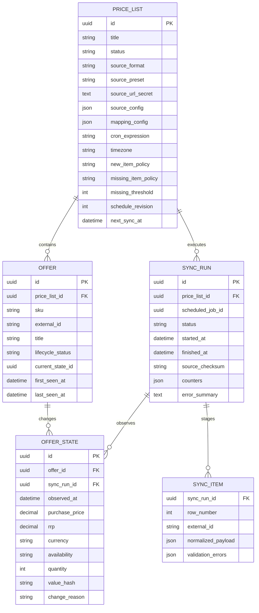
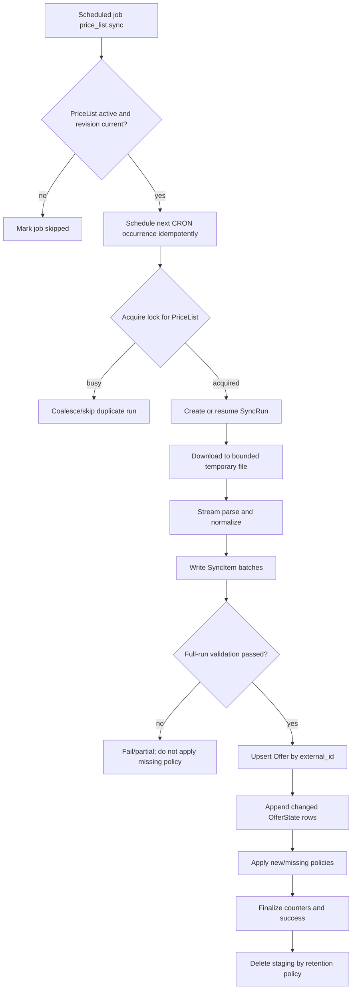

# План реализации модуля закупочных прайс-листов партнеров

## 1. Цель

Добавить отдельный tenant-scoped модуль `price_lists`, который:

- создает и настраивает источники партнерских предложений (`PriceList`);
- загружает удаленные XML, YAML и XLSX-файлы по URL;
- позволяет предварительно прочитать произвольный файл и сопоставить его поля с полями системы;
- выполняет первую загрузку сразу после активации прайс-листа;
- запускает следующие синхронизации по CRON-расписанию;
- хранит карточку партнерского предложения отдельно от изменяемого состояния цены и остатка;
- записывает новую версию цены/остатка только при фактическом изменении;
- явно обрабатывает новые, пропавшие, повторно появившиеся и некорректные позиции;
- предоставляет в Console мастер настройки и таблицу для анализа закупочной цены, РРЦ, РРД и маржи.

Модуль не изменяет локальный складской баланс и не становится частью `inventory`. Его задача — наблюдение за внешним
ассортиментом партнера. Связь партнерского offer с будущим локальным товаром или `catalog.SellableItem` должна
добавляться отдельным use case и не входит в первый этап.

## 2. Зафиксированные термины и допущения

- `PriceList` — конфигурация одного удаленного источника, его формата, сопоставления полей и расписания.
- `Offer` — стабильная позиция партнера. Бизнес-поля: `id`, `sku`, `external_id`, `title`.
- `OfferState` — неизменяемый снимок цены и доступности, действующий с момента конкретной синхронизации.
- `purchase_price` — закупочная цена товара у партнера. Исходное поле партнера может называться `price`, но после
  mapping в доменной модели и API используется однозначное имя `purchase_price`.
- `rrp` — рекомендованная розничная цена (РРЦ).
- `recommended_retail_income` — рекомендованный розничный доход (РРД), вычисляемый как
  `rrp - purchase_price`.
- `margin_percent` — валовая маржа относительно РРЦ: `(rrp - purchase_price) / rrp * 100`.
- Указанный тип `int | NULL` относится к количественному остатку `quantity`: `NULL` означает, что источник сообщает
  только факт наличия, но не точное количество.
- В требованиях перечислены XML, YAML и XLSX. Prom/YML catalog при этом является XML-документом и обрабатывается
  XML-парсером с отдельным preset `prom_xml`.
- Деньги хранятся как `NUMERIC`, а не `float`. Валюта обязательна либо в строке файла, либо как значение по умолчанию
  в настройках прайс-листа.
- История хранит начальное состояние offer и последующие изменения. Одинаковое состояние при каждом опросе повторно
  не записывается; сам факт успешной проверки остается в `PriceListSyncRun`.

РРД и маржа не вычисляются, если РРЦ отсутствует или равна нулю. Отрицательные значения не обрезаются: они должны
показывать оператору, что закупочная цена выше рекомендованной розничной. Перед разработкой продукта остается
подтвердить требуемый срок хранения истории; остальные решения ниже можно использовать как безопасные значения по
умолчанию. `margin_percent` намеренно не является торговой наценкой: наценка делила бы РРД на закупочную цену и при
необходимости должна добавляться отдельным показателем.

## 3. Проверенные примеры источников

### 3.1. Prom XML

Источник:
`https://proteinplus.pro/api/xml2/74a8b9ef74e225ee45a25d0bb88e8102ec7a71df.xml`

Фактическая структура проверенного файла:

```text
yml_catalog
└── shop
    └── offers
        └── offer[]
```

Стартовый preset `prom_xml`:

| Поле системы | Селектор источника | Примечание |
|---|---|---|
| `external_id` | `@id` | Атрибут `offer` |
| `sku` | `vendorCode` | Код поставщика |
| `title` | `name` | Название позиции |
| `purchase_price` | `price` | Закупочная цена партнера |
| `rrp` | `priceRRP` | РРЦ |
| `currency` | `currencyId` | Например, `UAH` |
| `availability` | `@available` | `склад/true` → в наличии; `false` и пусто → нет в наличии |
| `quantity` | константа `NULL` | В примере точного количества нет |

`item_path` для этого файла: `yml_catalog.shop.offers.offer`. Preset должен заполнять путь и mapping автоматически,
но перед активацией пользователь все равно видит preview и может изменить соответствия.

### 3.2. Пользовательский XLSX

Источник:
`https://dsn.ua/content/export/wholesale/dsn.ua_eccbc87e4b5ce2fe28308fd9f2a7baf3.xlsx`

В проверенном файле есть лист `Sheet1`, строка заголовков `1` и, среди прочих, колонки:
`Артикул`, `Название (UA)`, `Название (RU)`, `РРЦ`, `Цена`, `Валюта`, `Наличие`, `Количество`.

Предлагаемое начальное сопоставление:

| Поле системы | Колонка/выражение |
|---|---|
| `external_id` | `Артикул` |
| `sku` | `Артикул` |
| `title` | `coalesce("Название (UA)", "Название (RU)")` |
| `purchase_price` | `Цена` |
| `rrp` | `РРЦ` |
| `currency` | `Валюта` |
| `availability` | нормализатор колонки `Наличие` |
| `quantity` | `Количество` |

Этот источник не должен быть зашит в код отдельным адаптером. Он проходит общий шаг предзагрузки, выбора листа,
строки заголовков и ручного подтверждения mapping.

## 4. Граница и структура модуля

Новый bounded context размещается в `src/modules/price_lists` и следует текущему четырехслойному правилу проекта:

```text
src/modules/price_lists/
├── domain/
│   ├── price_list/
│   ├── offer/
│   └── sync/
├── application/
│   ├── price_list/
│   ├── preview/
│   ├── sync/
│   └── ports/
├── infrastructure/
│   ├── fetch/
│   ├── parser/
│   ├── persistence/
│   └── scheduling/
└── presentation/
    ├── depends/
    ├── http/
    └── jobs/
```

Ответственность слоев:

- `domain` содержит состояния, политики и инварианты, но ничего не знает об HTTP, SQLAlchemy, XLSX и CRON-библиотеках;
- `application` оркестрирует мастер создания, preview, активацию и синхронизацию через порты;
- `infrastructure` реализует безопасную загрузку, парсеры, SQLAlchemy repositories и CRON calculation;
- `presentation` предоставляет Console HTTP API и регистрирует handler `price_list.sync` в существующем dispatcher
  scheduled jobs.

Все repository methods получают `tenant_id` из command/job context и используют
`schema_translate_map={"tenant": tenant_schema_name(tenant_id)}`. Публичный HTTP payload не принимает `tenant_id`.

## 5. Модель данных



### 5.1. `price_lists`

Tenant table и aggregate root:

- `id UUID PK`;
- `title VARCHAR NOT NULL`;
- `status`: `draft`, `ready`, `active`, `paused`, `invalid`;
- `source_format`: `xml`, `yaml`, `xlsx`;
- `source_preset`: `prom_xml | NULL`;
- полный URL хранится как секретное значение; в API, логах и UI возвращается только маскированное представление;
- `source_config JSONB`: `item_path`, `sheet_name`, `header_row`, `data_start_row`, encoding и допустимые parser options;
- `mapping_config JSONB`: versioned mapping и нормализаторы;
- `mapping_version INT` для контроля изменения конфигурации;
- `cron_expression`, `timezone`, `next_sync_at`;
- `new_item_policy`, `missing_item_policy`, `missing_threshold`;
- `schedule_revision INT`: делает старые, уже поставленные jobs безопасными no-op после pause/edit;
- `last_sync_run_id`, `last_success_at`, `last_error_at` для быстрого отображения статуса;
- стандартные `created_at`, `updated_at`, `created_by`, `updated_by`.

URL может содержать токен в path/query, поэтому запрещено включать полный URL в exception, access log, метрики,
job payload и ответ list endpoint. Если в проекте нет общего secret store для таких значений, первый этап должен
использовать прикладное шифрование и хранить отдельно ciphertext и masked display value.

### 5.2. `partner_offers`

Бизнес-поля, требуемые задачей:

- `id UUID PK` — внутренний стабильный идентификатор;
- `sku VARCHAR NOT NULL`;
- `external_id VARCHAR NOT NULL`;
- `title VARCHAR NOT NULL`.

Технические поля:

- `price_list_id UUID NOT NULL`;
- `lifecycle_status`: `active`, `missing`, `ignored`, `archived`;
- `current_state_id UUID | NULL` для быстрого чтения актуального состояния;
- `first_seen_at`, `last_seen_at`, `missing_since`, `consecutive_missing_runs`;
- стандартный audit.

Ограничение `UNIQUE(price_list_id, external_id)` является основным ключом сопоставления между синхронизациями.
`external_id` нельзя выводить из номера строки. Изменение `sku` или `title` обновляет текущий offer, но не создает
новую позицию. Пустой `external_id`, `sku` или `title` делает строку невалидной, если mapping не задает явный fallback.

### 5.3. `partner_offer_states`

Append-only история цены и остатка:

- `id`, `offer_id`, `sync_run_id`, `observed_at`;
- `purchase_price NUMERIC(19, 4) NOT NULL CHECK (purchase_price >= 0)`;
- `rrp NUMERIC(19, 4) NULL CHECK (rrp >= 0)`;
- `currency CHAR(3) NOT NULL` в ISO 4217;
- `availability`: `in_stock`, `out_of_stock`, `unknown`;
- `quantity INTEGER NULL CHECK (quantity >= 0)`;
- `value_hash` от канонического набора `(purchase_price, rrp, currency, availability, quantity)`;
- `change_reason`: `initial`, `source_change`, `missing_policy`, `reappeared`.

Новая строка создается только если `value_hash` отличается от последнего состояния. Инварианты:

- `quantity > 0` требует `availability = in_stock`;
- `quantity = 0` нормализуется в `out_of_stock`;
- `quantity IS NULL` допустим для любого availability, включая `unknown`;
- изменение только `title` или `sku` не создает ценовой snapshot;
- исторические строки не обновляются и не удаляются обычными use cases.

Индексы: `(offer_id, observed_at DESC)`, `(sync_run_id)`, `(observed_at)` для retention/export.

### 5.4. `price_list_sync_runs`

Аудит каждой попытки:

- `status`: `queued`, `downloading`, `parsing`, `applying`, `succeeded`, `partial`, `failed`, `skipped`;
- trigger: `initial`, `cron`, `manual`, `retry`;
- `scheduled_job_id` и `planned_at` для идемпотентности;
- HTTP metadata без секретов: status, ETag, Last-Modified, размер, checksum;
- counters: прочитано, валидно, отклонено, создано, обновлено, без изменений, пропало, восстановлено;
- длительность фаз и краткое безопасное описание ошибки.

Ограничение `UNIQUE(price_list_id, scheduled_job_id)` не позволяет повторной доставке scheduled job создать второй run.

### 5.5. `price_list_sync_items`

Staging-модель на время синхронизации. Она хранит нормализованные строки до атомарного применения результата:

- composite key `(sync_run_id, row_number)`;
- `external_id`, `sku`, `title`, `purchase_price`, `rrp`, `currency`, `availability`, `quantity`;
- `value_hash`, `validation_errors`, при необходимости ограниченный raw fragment без секретов/HTML;
- уникальный индекс `(sync_run_id, external_id)`.

После успешного применения staging-строки удаляются. Для failed runs они могут сохраняться ограниченное время
(например, 7 дней) для диагностики, после чего очищаются отдельной job. Исходный файл в БД не хранится.

## 6. Конфигурация источника и mapping

Пример внутреннего контракта:

```json
{
  "format": "xml",
  "preset": "prom_xml",
  "source": {
    "item_path": "yml_catalog.shop.offers.offer"
  },
  "mapping": {
    "external_id": {"selector": "@id", "required": true, "trim": true},
    "sku": {"selector": "vendorCode", "required": true, "trim": true},
    "title": {"selector": "name", "required": true, "trim": true},
    "purchase_price": {"selector": "price", "type": "decimal", "required": true},
    "rrp": {"selector": "priceRRP", "type": "decimal"},
    "currency": {"selector": "currencyId", "default": "UAH"},
    "availability": {
      "selector": "@available",
      "default": "out_of_stock",
      "map": {"склад": "in_stock", "true": "in_stock", "false": "out_of_stock", "": "out_of_stock"}
    },
    "quantity": {"constant": null}
  }
}
```

Правила selector DSL должны быть ограниченными и декларативными, без Python/Jinja/eval:

- XML/YAML: dot path относительно текущего item; `@name` для XML-атрибута;
- XLSX: имя колонки или индекс, лист и строка заголовка задаются в `source_config`;
- допустимые функции: `trim`, `lower`, `replace`, `decimal`, `integer`, `coalesce`, lookup-map и constant;
- locale-aware decimal normalization задается явно; неоднозначные `1,234` нельзя угадывать молча;
- missing, empty string и `NULL` различаются до этапа нормализации.

Конфигурация проходит server-side validation и версионируется. Изменение URL, структуры или mapping у активного
прайс-листа создает новый draft revision: сначала preview, затем подтверждение и только потом переключение active
config. Текущая рабочая синхронизация продолжает использовать ту версию config, с которой стартовала.

## 7. Мастер создания PriceList

### Шаг 1. Источник

Пользователь задает:

- название прайс-листа;
- URL;
- формат `XML`, `YAML` или `XLSX` либо auto-detect с обязательным подтверждением;
- preset, если он известен (`Prom XML`);
- для древовидного формата — `item_path`;
- для XLSX — лист, строку заголовков и первую строку данных.

Кнопка «Предзагрузить» выполняет ограниченную preview-загрузку, но еще не создает offers. Ответ содержит:

- определенный content type/format;
- доступные XML/YAML paths или XLSX sheets/columns;
- первые 20–50 item rows;
- число просмотренных строк и предупреждения;
- предложенный mapping с confidence только для UI-подсказки.

### Шаг 2. Сопоставление полей

Пользователь сопоставляет обязательные поля `external_id`, `sku`, `title`, `purchase_price`, `currency`,
`availability` и необязательные `rrp`, `quantity`. В UI поле подписано «Закупочная цена». UI показывает исходное и
нормализованное значение, а также ошибки для каждой preview-строки.

Переход дальше запрещен, пока:

- обязательные selectors не заданы;
- preview не содержит хотя бы одну валидную строку;
- `external_id` в preview не дублируется;
- цена/РРЦ/количество приводятся к нужным типам;
- значения availability покрыты mapping-правилами или переходят в `unknown` явно.

### Шаг 3. Расписание и политики

Пользователь задает:

- CRON expression;
- timezone (по умолчанию timezone tenant, хранить IANA name);
- политику новых позиций;
- политику пропавших позиций;
- количество последовательных полных синхронизаций до применения missing policy (по умолчанию `2`).

UI показывает следующие 5 запусков с учетом timezone и DST. Минимальная частота ограничивается конфигурацией
сервиса, например одним запуском в 15 минут.

### Финал. Активация

`ActivatePriceList` в одной транзакции:

1. повторно валидирует полный draft;
2. переводит его в `active` и увеличивает `schedule_revision`;
3. создает немедленную job `price_list.sync` с trigger `initial`;
4. вычисляет и ставит следующую CRON job;
5. возвращает `202 Accepted` с идентификатором initial sync run/job.

Загрузка асинхронна. «Создать прайс-лист» не должно держать HTTP-соединение до скачивания и разбора большого XLSX.

## 8. Политики новых и пропавших позиций

### Новая позиция

Поддержать три режима:

- `create` — создать `Offer` и начальный `OfferState`;
- `quarantine` — сохранить строку staging/review без публикации в основном списке;
- `ignore` — учесть в counters и не создавать offer.

Безопасное значение по умолчанию для MVP — `create`, так как цель модуля состоит в наблюдении полного ассортимента.

### Позиция пропала из файла

Поддержать:

- `mark_out_of_stock` — оставить offer active и добавить state `out_of_stock`, `quantity=0`;
- `mark_missing` — изменить lifecycle status без подмены последней цены;
- `keep_last` — сохранить последнее состояние и только увеличить счетчик отсутствия;
- `archive` — архивировать после достижения threshold.

Рекомендуемое значение по умолчанию: `mark_out_of_stock` после двух последовательных полных успешных загрузок.
Это защищает от временно обрезанного/пустого файла. Missing policy применяется только если:

- файл скачан и разобран полностью;
- найдено больше нуля валидных строк;
- доля ошибок не превысила настроенный порог;
- нет конфликтующих duplicate `external_id`;
- run завершил staging, а не оборвался на limit/timeout.

При повторном появлении offer сбрасывается missing counter, status возвращается в `active`, а новый state записывается
только если цена/остаток изменились относительно последнего состояния.

## 9. Процесс синхронизации



Детали выполнения:

1. Job payload содержит только `price_list_id`, `schedule_revision`, `planned_at`, trigger и config version; URL и
   mapping читаются из tenant schema и не попадают в глобальную `scheduled_jobs` таблицу.
2. Перед сетевым вызовом handler идемпотентно ставит следующую CRON occurrence. Ее UUID детерминирован из
   `(tenant_id, price_list_id, schedule_revision, planned_at)`, чтобы crash/retry не создал дубликат.
3. Для shared jobs следует добавить операцию `schedule_once` с caller-provided deterministic UUID и
   `INSERT ... ON CONFLICT (id) DO NOTHING`; новая глобальная таблица или второй scheduler не нужны.
4. На `(tenant_id, price_list_id)` берется PostgreSQL advisory lock. Одновременно разрешена только одна
   синхронизация одного прайс-листа; ручной запуск не конкурирует с CRON.
5. Сетевое скачивание и parsing не держат долгую DB transaction. Короткие транзакции фиксируют run state и staging
   batches. Применение успешно сформированного staging выполняется отдельной согласованной транзакцией.
6. Повторная доставка той же job находит тот же `SyncRun`. Уже успешно примененный run отвечает idempotent success.
7. Transient ошибки (timeout, 429, 5xx, кратковременная БД) пробрасываются в shared scheduled-jobs retry policy.
   Некорректный mapping/файл фиксируется как permanent failed run, после чего очередной CRON запуск все равно остается
   запланированным.
8. `pause` увеличивает `schedule_revision`; все jobs со старой revision становятся no-op. `resume` создает новую
   occurrence. Изменение CRON работает аналогично.

### 9.1. Процесс `CronWorker`

Регулярные задачи выполняет отдельный постоянно работающий процесс `CronWorker` на базе `shared.jobs`. Предлагаемый
entrypoint: `dnk-manage jobs worker`; проверка процесса: `dnk-manage jobs healthcheck`.

Это Deployment/Compose service, а не Kubernetes `CronJob`. Пользовательские CRON expressions создаются и меняются во
время работы приложения, тогда как Kubernetes `CronJob` является статическим объектом deployment-конфигурации.
`CronWorker` читает динамическое расписание из PostgreSQL и может обслуживать все tenant schedules одним процессом.

Worker выполняет цикл:

1. при старте проверяет установленную global migration revision и собирает dispatcher с зарегистрированным
   `price_list.sync -> PriceListSyncJobHandler`;
2. каждые `poll_interval_seconds` короткой транзакцией выбирает due jobs через `FOR UPDATE SKIP LOCKED`, переводит их
   в `running`, фиксирует `lock_token/locked_until` и коммитит захват до запуска handler;
3. выполняет каждую job вне транзакции захвата; handler открывает отдельные короткие UoW для `SyncRun`, staging batches,
   следующей CRON occurrence и финального применения;
4. отдельной транзакцией помечает job как `done`, `scheduled` для retry или `failed`;
5. каждые `recover_interval_seconds` возвращает просроченные `running` jobs в очередь либо завершает их как `failed`
   после `max_attempts`;
6. после успешного poll/recovery cycle обновляет локальный heartbeat-файл; healthcheck проверяет его свежесть и
   доступность PostgreSQL;
7. по `SIGTERM/SIGINT` прекращает захватывать новые jobs, дает текущей job завершиться в пределах termination grace
   period и закрывает session factory. Если контейнер принудительно остановлен, expired lock подхватит recovery loop.

Текущий `dnk-manage jobs process-due` сохраняется как диагностическая one-shot команда, но production workload
использует `jobs worker`. Существующую реализацию необходимо переразбить: сейчас одна UoW охватывает claim, handler и
финальный status всей пачки, что неприемлемо для длительного скачивания/разбора XLSX.

Добавить настройки `SCHEDULED_JOBS`:

- `poll_interval_seconds` — пауза между пустыми poll cycles, например `2`;
- `recover_interval_seconds` — период recovery, например `30`;
- `lock_ttl_seconds` — стартовый lease;
- `lock_heartbeat_seconds` — период продления lease для долгой синхронизации;
- `shutdown_grace_seconds`;
- существующие `process_limit`, `recover_limit`, `retry_base_seconds`, `max_attempts`.

Для длинной job worker продлевает `locked_until` только при совпадающем `lock_token`. Перед `mark_done`, применением
staging и созданием следующей occurrence повторно проверяется владение lease. Это не позволяет старому процессу
записать результат после того, как job уже была восстановлена другим worker.

При простое сервиса пропущенные интервалы объединяются: overdue job запускается один раз, а следующая occurrence
рассчитывается как ближайшее будущее время по CRON относительно текущего времени. Worker не создает очередь из всех
пропущенных запусков. Ручная синхронизация имеет trigger `manual` и не создает новую CRON-цепочку.

### 9.2. Docker Compose

В `docker-compose.yml` добавить сервис:

```yaml
cron-worker:
  <<: *backend-common
  container_name: dnk-cron-worker
  restart: unless-stopped
  command: [dnk-manage, jobs, worker]
  environment:
    <<: *backend-environment
    RABBITMQ__ENABLED: "false"
  depends_on:
    migrations:
      condition: service_completed_successfully
    postgres:
      condition: service_healthy
  healthcheck:
    test: [CMD, dnk-manage, jobs, healthcheck]
    interval: 10s
    timeout: 5s
    retries: 3
  stop_grace_period: 60s
```

Worker использует тот же Runtime image, `.env`, PostgreSQL и migration gate, что и API. RabbitMQ для `shared.jobs` не
требуется: очередь хранится в PostgreSQL. В `docker-compose.control-plane.yml` отдельное переопределение не нужно,
если базовый service уже получает необходимые tenant/runtime settings; overlay может только добавить общие secrets,
если они понадобятся fetcher-у.

Compose acceptance проверяет, что после `docker compose up` service остается running/healthy, видит выполненные
миграции, забирает due `price_list.sync` и корректно восстанавливает job после принудительного restart.

### 9.3. Helm

В chart добавить `workers.cron` рядом с `publisher`, `console` и `lifecycle`:

```yaml
workers:
  cron:
    enabled: true
    replicas: 1
    image:
      repository: ghcr.io/dinikon/runtime/runtime
      tag: latest
      pullPolicy: Always
    pollIntervalSeconds: 2
    recoverIntervalSeconds: 30
    lockTtlSeconds: 300
    lockHeartbeatSeconds: 60
    shutdownGraceSeconds: 60
    resources:
      requests:
        cpu: 100m
        memory: 256Mi
      limits:
        memory: 1Gi
    probes:
      readiness:
        exec:
          command: [dnk-manage, jobs, healthcheck]
        periodSeconds: 10
        timeoutSeconds: 5
        failureThreshold: 3
      liveness:
        exec:
          command: [dnk-manage, jobs, healthcheck]
        periodSeconds: 20
        timeoutSeconds: 5
        failureThreshold: 3
```

Изменения chart:

- добавить `cron` в worker map/list `helm/templates/workloads.yaml`;
- для component `cron` установить args `[dnk-manage, jobs, worker]`, не создавать Service и не открывать порт;
- использовать runtime image, общий migration gate, DB secrets/config и `/tmp` `emptyDir` для загружаемых файлов;
- установить `terminationGracePeriodSeconds` из `shutdownGraceSeconds` и `preStop`, если worker требует время на drain;
- передать параметры как `SCHEDULED_JOBS__*` env через общий config template;
- описать весь `workers.cron` contract в `helm/values.schema.json` с `additionalProperties: false`;
- добавить настройки в `helm/README.md` и example values;
- обновить Helm render/lint tests: enabled/disabled worker, image/tag propagation, command/args, env, probes, resources,
  pod settings, отсутствие Service и корректное количество Deployments.

По умолчанию `workers.cron.enabled=true`, иначе созданные PriceList schedules никогда не будут выполнены. Начальное
значение `replicas=1`; несколько replicas разрешаются после PostgreSQL concurrency tests, поскольку `SKIP LOCKED`,
lease token и advisory lock PriceList предотвращают двойную обработку. Pod не требует RabbitMQ credentials и должен
запускаться только после успешной migration Job.

## 10. Парсеры

### XML

- безопасный streaming `iterparse`, без DTD/external entities/network resolution;
- ограничение глубины дерева, длины text node и числа элементов;
- поддержка атрибутов и namespaces в ограниченном selector DSL;
- parser preset `prom_xml`, но не отдельная бизнес-ветка синхронизации.

В проверенном Prom XML присутствует `DOCTYPE`; парсер должен игнорировать декларацию и не загружать `shops.dtd`.

### YAML

- только safe parser, без конструкторов произвольных Python objects;
- лимиты на aliases, nesting, nodes и итоговый размер;
- item path выбирает массив объектов;
- YAML timestamp/bool coercion нормализуется явно, чтобы SKU вроде `00123` не превратился в число.

### XLSX

- режим `read_only=True`, `data_only=True`;
- выбор sheet и header row;
- чтение строк итератором, без загрузки workbook целиком в память;
- защита от ZIP bomb по compressed/uncompressed size и количеству entries;
- формулы не исполняются: читается только сохраненное cached value; отсутствие cached value является validation error;
- лимит строк/колонок и пропуск полностью пустых строк.

Проверенный DSN XLSX имеет размер около 9.5 MB, а XML одного worksheet внутри архива — более 60 MB, поэтому обычная
загрузка всего листа в память не допускается.

## 11. Безопасная загрузка файлов

`RemoteFileFetcherPort` и его `httpx` adapter должны обеспечивать:

- только `https` по умолчанию; `http` — отдельная явно включаемая policy;
- запрет localhost, link-local, private, multicast и metadata IP ranges для IPv4/IPv6;
- повторную DNS/IP проверку каждого redirect, лимит redirects;
- connect/read/total timeout;
- лимит compressed download size и parser-specific uncompressed size;
- streaming во временный файл с SHA-256;
- проверку MIME, magic bytes и выбранного пользователем формата; расширение URL не является источником истины;
- allowlist исходящих портов (`443`, при необходимости `80`);
- redaction query/path secrets в логах и ошибках;
- `If-None-Match`/`If-Modified-Since`: ответ `304` завершает успешный run без новых state rows;
- удаление временного файла в `finally`.

Preview и настоящая синхронизация обязаны использовать один и тот же fetch/parser pipeline и одинаковые ограничения.

## 12. HTTP API Console

Предлагаемый tenant-aware API под существующим `/api/console`:

| Method | Path | Назначение |
|---|---|---|
| `POST` | `/price-lists` | Создать draft и сохранить шаг 1 |
| `POST` | `/price-lists/{id}/preview` | Безопасно предзагрузить sample |
| `PUT` | `/price-lists/{id}/mapping` | Сохранить и проверить шаг 2 |
| `PUT` | `/price-lists/{id}/schedule` | Сохранить шаг 3 и политики |
| `POST` | `/price-lists/{id}/activate` | Активировать и поставить initial sync |
| `POST` | `/price-lists/{id}/sync` | Поставить ручную синхронизацию |
| `POST` | `/price-lists/{id}/pause` | Приостановить расписание |
| `POST` | `/price-lists/{id}/resume` | Возобновить расписание |
| `GET` | `/price-lists` | Список и агрегированный sync status |
| `GET` | `/price-lists/{id}` | Конфигурация без раскрытия URL-secret |
| `GET` | `/price-lists/{id}/runs` | История запусков и counters |
| `GET` | `/price-lists/{id}/offers` | Offers одного прайс-листа с тем же query contract |
| `GET` | `/price-list-offers` | Общая tenant-таблица offers с фильтрами, поиском и сортировкой |
| `GET` | `/price-list-offers/{offer_id}/history` | История закупочной цены/остатка |

`GET /price-list-offers` выполняет фильтрацию, сортировку, расчет производных показателей и пагинацию на backend.
Клиентская сортировка только загруженной страницы запрещена, поскольку она даст неверный результат для общего набора.

Query contract:

- `price_list_id` — один или несколько прайс-листов;
- `purchase_price_min`, `purchase_price_max`;
- `recommended_retail_income_min`, `recommended_retail_income_max`;
- `margin_percent_min`, `margin_percent_max`;
- `availability=in_stock|out_of_stock|unknown` — multi-value;
- `has_rrp=true|false`;
- `q` — полнотекстовый поиск по `title`, `sku`, `external_id` и названию PriceList;
- `sort=title|sku|purchase_price|rrp|recommended_retail_income|margin_percent|availability|observed_at`;
- `direction=asc|desc`; для первого клика по денежным колонкам используется `desc`;
- параметры offset/cursor pagination согласно выбранному общему контракту Console.

Полнотекстовый поиск реализуется в PostgreSQL, а не фильтрацией загруженного массива в браузере. Для
`partner_offers` создается нормализованный search document из `title`, `sku` и `external_id` с GIN index; запрос
строится безопасно через `websearch_to_tsquery`/эквивалент для выбранной конфигурации языка. Название PriceList
участвует через join и нормализованный text predicate либо через read projection, если query plan покажет
необходимость. SKU/external ID дополнительно поддерживают точное и prefix-сопоставление. Пустой или слишком короткий
`q` не запускает дорогой full scan. Search implementation и индексы проверяются через `EXPLAIN` на объемах,
сопоставимых с production.

Backend вычисляет показатели на текущем `OfferState`:

```text
recommended_retail_income = rrp - purchase_price
margin_percent = recommended_retail_income / rrp * 100, если rrp > 0
```

`recommended_retail_income` и `margin_percent` возвращаются как `NULL`, если РРЦ отсутствует или равна нулю.
Вычисления выполняются через PostgreSQL `NUMERIC`; округление для отображения не влияет на фильтр и sort. Для
стабильной пагинации backend всегда добавляет `offer.id` как последний tie-breaker. Если выражения станут узким
местом на большом объеме, их следует вынести в обновляемую current-state read projection, а не хранить в append-only
истории как отдельные бизнес-факты.

Ответ строки списка содержит:

- offer: `id`, `sku`, `external_id`, `title`, `lifecycle_status`;
- PriceList: `id`, `title`;
- current state: `purchase_price`, `rrp`, `currency`, `availability`, `quantity`, `observed_at`;
- derived: `recommended_retail_income`, `margin_percent`.

Денежные значения передаются в JSON decimal-строками, чтобы JavaScript не терял точность. DTO mapper отвечает за
форматирование, но не пересчитывает РРД или маржу.

Все mutation endpoints используют authenticated request context, authorization boundary и одну request-scoped UoW.
Для редактирования draft можно добавить optimistic version (`If-Match`/version field), чтобы вкладки не затирали
mapping друг друга.

## 13. Frontend Console

Frontend реализуется в существующем Vue 3 приложении `frontends/apps/console` и следует правилам
[`docs/frontends/console.md`](../frontends/console.md): route page является orchestrator, API/DTO/model разделены,
бизнес-компоненты находятся внутри feature module, а UI primitives не знают о PriceList, API или TanStack Query.

### 13.1. Пользовательские разделы и маршруты

В `workspaceNavigation` добавляется группа «Закупки»:

- «Прайс-листы» — управление источниками и синхронизациями;
- «Офферы партнеров» — единая таблица закупочных предложений всех прайс-листов.

Маршруты регистрируются через feature-owned `price-lists/routes.ts`, а корневой `app/router.ts` только подключает
экспортированный массив:

| Route | Page | Назначение |
|---|---|---|
| `/purchasing/price-lists` | `PriceListsPage.vue` | Список прайс-листов и состояние синхронизаций |
| `/purchasing/price-lists/new` | `CreatePriceListPage.vue` | Мастер из трех шагов |
| `/purchasing/price-lists/:priceListId` | `PriceListDetailsPage.vue` | Overview, offers, runs и settings одного прайса |
| `/purchasing/offers` | `PurchaseOffersPage.vue` | Общая таблица offers с аналитикой РРД/маржи |

Страница detail использует query parameter `tab=overview|offers|runs|settings`, чтобы выбранная вкладка сохранялась
при refresh/back. Вкладка offers повторно использует общую таблицу, но фиксирует `price_list_id` текущего прайса и
не показывает фильтр выбора PriceList.

### 13.2. Структура frontend-модуля

Новый модуль развивается по целевой структуре из Console architecture:

```text
frontends/apps/console/src/modules/price-lists/
├── api/
│   ├── price-lists.api.ts
│   ├── price-lists.dto.ts
│   └── price-lists.mapper.ts
├── model/
│   ├── price-list.types.ts
│   ├── purchase-offer.types.ts
│   ├── price-list.constants.ts
│   ├── price-list.query-keys.ts
│   ├── use-price-lists-query.ts
│   ├── use-price-list-query.ts
│   ├── use-purchase-offers-query.ts
│   ├── use-price-list-runs-query.ts
│   ├── use-create-price-list.ts
│   ├── use-preview-price-list.ts
│   ├── use-activate-price-list.ts
│   ├── use-sync-price-list.ts
│   ├── use-update-price-list.ts
│   └── use-purchase-offers-page-state.ts
├── ui/
│   ├── price-lists/
│   ├── wizard/
│   ├── details/
│   ├── offers/
│   └── runs/
├── pages/
│   ├── PriceListsPage.vue
│   ├── CreatePriceListPage.vue
│   ├── PriceListDetailsPage.vue
│   └── PurchaseOffersPage.vue
├── routes.ts
└── index.ts
```

Зависимости направлены в одну сторону:

```text
Page -> model composables + feature UI
model composables -> API client + query keys + mappers
feature UI -> frontend model types + shared/UI primitives
API -> shared Axios client
```

Компоненты из `ui/` не импортируют `api/*.dto.ts`, Axios, query keys или query composables. DTO mapper преобразует
snake_case backend contracts в frontend types один раз на API boundary.
`price-lists.api.ts` использует существующий shared Axios client с `withCredentials: true`; отдельный HTTP client или
feature-specific auth handling не создается.

### 13.3. Экран списка прайс-листов

`PriceListsPage.vue` является orchestrator и собирает:

```text
PriceListsPage
|-- PriceListsHeader
|-- PriceListsToolbar
|-- PriceListsSearchBar
|-- PriceListsBody
|   |-- PriceListsSkeleton
|   |-- PriceListsEmpty
|   |-- PriceListsError
|   `-- PriceListsResults
|       `-- PriceListsTable
|-- PriceListsFooter
`-- PausePriceListConfirmDialog
```

Таблица прайс-листов показывает название, формат, masked URL/host, status, число active offers, последний успешный
запуск, следующий запуск и last run status. Primary action — «Создать прайс-лист». Row actions: открыть, запустить
сейчас, pause/resume и перейти к runs. Во время initial sync отображается progress/status без обещания точного процента,
если backend еще не знает полного числа строк.

### 13.4. Мастер создания

`CreatePriceListPage.vue` владеет server draft, текущим шагом, route guards и mutation orchestration. Поля и
валидация разбиты на компоненты:

```text
CreatePriceListPage
|-- PriceListWizardHeader
|-- PriceListWizardStepper
|-- PriceListWizardBody
|   |-- PriceListSourceForm
|   |-- PriceListMappingForm
|   `-- PriceListScheduleForm
|-- PriceListPreviewTable
`-- PriceListWizardFooter
```

- `PriceListSourceForm` собирает title, URL, format/preset, item path или XLSX sheet/header.
- «Предзагрузить» вызывает preview mutation и блокирует переход к mapping до успешного ответа.
- `PriceListMappingForm` показывает source column/path, target field, transform/default и sample values рядом.
- В preview явно подписывается «Закупочная цена» и «Рекомендованная розничная цена».
- `PriceListScheduleForm` содержит CRON, timezone, пять следующих запусков, new/missing policies и threshold.
- Footer выполняет back/next; финальная кнопка «Создать и загрузить» вызывает activation и переводит на detail page.
- Draft ID остается в URL/route state, поэтому refresh не теряет уже сохраненные шаги.
- Несохраненные локальные изменения защищаются navigation guard с confirm dialog.

Формы используют `vee-validate` + `zod`, уже установленные в Console. Клиентская схема улучшает UX, но server errors
остаются авторитетными и привязываются к конкретным полям/строкам mapping.

### 13.5. Таблица закупочных offers

`PurchaseOffersPage.vue` следует page/body/results ответственности:

```text
PurchaseOffersPage
|-- PurchaseOffersHeader
|-- PurchaseOffersToolbar
|   |-- PurchaseOffersFilters
|   `-- ActiveOfferFilterChips
|-- PurchaseOffersSearchBar
|-- PurchaseOffersBody
|   |-- PurchaseOffersSkeleton
|   |-- PurchaseOffersEmpty
|   |-- PurchaseOffersError
|   `-- PurchaseOffersResults
|       `-- PurchaseOffersTable
|-- PurchaseOffersFooter
|   `-- OffsetPagination
`-- OfferHistoryDrawer
```

`PurchaseOffersTable` строится на установленном `@tanstack/vue-table` в controlled/manual режиме. Backend владеет
sorting, filtering и pagination; таблица только эмитит их изменение. Состояние страницы хранится в URL query через
`usePurchaseOffersPageState`, поэтому ссылку с выбранными фильтрами можно скопировать, refresh не сбрасывает вид, а
Back возвращает предыдущий набор.

Колонки первой версии:

| Колонка | Значение и отображение | Sort |
|---|---|---|
| Товар | `title`, вторичной строкой `external_id` | текстовый |
| SKU | `sku` | текстовый |
| Прайс-лист | название PriceList | текстовый |
| Закупочная цена | `purchase_price` + currency | числовой, первый клик `desc` |
| РРЦ | `rrp` + currency или `—` | числовой, первый клик `desc` |
| РРД | `recommended_retail_income` + currency или `—` | числовой, первый клик `desc` |
| Маржа | `margin_percent` или `—` | числовой, первый клик `desc` |
| Наличие | status badge + quantity, если известно | status sort |
| Обновлено | `observed_at` в timezone пользователя | date sort, default `desc` |

Правила отображения:

- деньги форматируются через `Intl.NumberFormat` по currency и locale пользователя;
- процент показывается с 1–2 знаками, но сортируется по неокругленному backend value;
- положительный, нулевой и отрицательный РРД различаются знаком, текстом и цветом; цвет не является единственным
  индикатором;
- отсутствие РРЦ дает `—` одновременно в РРЦ, РРД и марже;
- `quantity=NULL` показывает только availability, а не фиктивный `0`;
- заголовок таблицы sticky, числовые колонки выровнены вправо, длинные title сокращаются с доступным tooltip;
- клик по строке открывает `OfferHistoryDrawer`, не меняя фильтры таблицы.

`OfferHistoryDrawer` загружает данные лениво и показывает дату, закупочную цену, РРЦ, РРД, маржу, availability,
quantity и причину изменения. РРД и маржа для исторической строки вычисляются backend теми же формулами, что и для
current state.

### 13.6. Фильтры, поиск и сортировка

`PurchaseOffersFilters` предоставляет:

- multi-select PriceList;
- диапазон закупочной цены `от/до`;
- диапазон РРД `от/до`, включая отрицательные значения;
- диапазон маржи `% от/до`, включая отрицательные значения;
- multi-select availability: «В наличии», «Нет в наличии», «Неизвестно»;
- опциональный переключатель «Только с РРЦ»;
- «Сбросить все» и chips каждого активного фильтра.

Изменение фильтра сбрасывает pagination на первую страницу. Диапазоны применяются после подтверждения или короткого
debounce, чтобы каждый ввод символа не создавал запрос. Невалидный диапазон (`min > max`) показывается до запроса.

`PurchaseOffersSearchBar` реализует один глобальный поиск по видимым текстовым идентификаторам: title, SKU,
external ID и названию прайс-листа. Ввод debounced на 300–500 ms, `q` нормализуется и передается на backend.
Числовые денежные колонки ищутся диапазонами, а не преобразованием decimal в текст: это сохраняет предсказуемые
индексы и числовую семантику.

Каждый sortable header поддерживает `desc`, `asc` и reset. Для закупочной цены, РРЦ, РРД, маржи и даты первое
нажатие означает сортировку от большего к меньшему. Активное направление обозначается иконкой и `aria-sort`.
Одновременная multi-sort в MVP не требуется; backend всегда применяет стабильный secondary sort по `offer.id`.

### 13.7. Frontend state и запросы

TanStack Query является server-state boundary:

- query keys включают tenant-independent route context и весь нормализованный filter/sort/page state;
- search/filter transitions используют `placeholderData`, чтобы таблица не исчезала между запросами;
- stale response не перезаписывает более новый query state;
- после activation/manual sync invalidates detail/runs, но offers обновляются после успешного run;
- list/detail polling включается только пока есть `queued`, `downloading`, `parsing` или `applying` run, например раз
  в 5 секунд; в стабильном состоянии polling выключен;
- `AbortSignal` TanStack Query передается в Axios, чтобы отменять устаревший поиск;
- mutation buttons имеют pending state и защищены от повторного submit.

Pinia не хранит offers, filters или wizard server draft. Глобальные stores остаются границей user/tenant session,
а feature state находится в route query, локальной форме и TanStack Query cache.

### 13.8. Loading, empty и error состояния

- Первичная загрузка показывает table skeleton с сохраненной шириной колонок.
- Пустой tenant показывает CTA «Создать прайс-лист».
- Пустой результат фильтра показывает «Ничего не найдено» и кнопку сброса фильтров, без CTA создания источника.
- Background refetch сохраняет строки и показывает ненавязчивый progress indicator.
- Ошибка list query имеет retry; mapping validation показывает ошибки около соответствующей строки.
- Failed sync не очищает последнюю успешную таблицу и отображается banner со ссылкой на run details.
- `401/403` обрабатываются общими Axios interceptors/session flow, а не feature-компонентами.

### 13.9. Доступность и responsive behavior

- Все controls доступны с клавиатуры, dialog/drawer удерживают focus, ошибки связаны с полями через ARIA.
- Значения sort доступны через `aria-sort`, badge наличия имеет текст, а не только цвет.
- На узком экране таблица сохраняет горизонтальный scroll; ключевые «Товар» и «Закупочная цена» остаются первыми.
- Filter panel на mobile открывается в Sheet/Drawer, desktop использует Popover или боковую панель.
- Необязательные колонки можно скрывать через toolbar; выбор хранится локально как пользовательское UI preference,
  но не влияет на URL query и backend response.

### 13.10. Frontend verification

Минимальная проверка реализации:

- `npm run typecheck:console`;
- `npm run lint:console`;
- `npm run build:console`;
- component tests для mapper, URL query state, отображения derived/null values, filters и sort emits;
- browser acceptance: мастер создания, preview/mapping, initial sync status, фильтры, descending sorts, search,
  pagination, pause/resume и открытие истории offer;
- responsive и keyboard smoke tests для wizard, filters и table.

Если в workspace к моменту реализации все еще нет test runner, добавить Vitest + Vue Test Utils отдельным техническим
шагом; отсутствие runner не является причиной переносить filter/query logic внутрь компонентов.

## 14. Наблюдаемость и эксплуатация

Метрики без tenant/URL/offer labels высокой кардинальности:

- `price_list_sync_runs_total{status,format,trigger}`;
- `price_list_sync_duration_seconds{phase,format}`;
- `price_list_sync_rows_total{result}`;
- `price_list_sync_download_bytes{format}`;
- `price_list_sync_last_success_timestamp` — лучше как DB/readiness query, а не metric label per list;
- `scheduled_job_worker_poll_total{result}`, `scheduled_job_worker_heartbeat_age_seconds` и длительность poll/recovery;
- число due/running/stuck jobs уже наблюдается общим jobs worker.

Structured logs содержат `tenant_id`, `price_list_id`, `sync_run_id`, `scheduled_job_id`, phase и counters, но не
полный URL, raw rows, названия товаров и токены. Для оператора нужны alerts на последовательные failed runs,
устаревший `last_success_at`, необычно большое падение числа строк и превышение error ratio.

Retention должен быть конфигурируемым отдельно для:

- истории `OfferState` (по умолчанию хранить бессрочно до продуктового решения);
- `SyncRun` (например, 180 дней);
- failed staging rows (например, 7 дней);
- временных файлов (удалять сразу после run).

## 15. Зависимости и миграции

Потребуются runtime dependencies:

- безопасный XML parser, например `defusedxml`;
- `PyYAML` в runtime dependencies, а не только в dev group;
- `openpyxl` для streaming XLSX;
- `croniter` либо эквивалент для расчета следующих CRON occurrences.

Tenant Alembic revision после текущего head создает пять таблиц модуля, constraints и indexes. Модели наследуют
`TenantBase`, audit-поля — принятый tenant system mixin. Bootstrap нового tenant и upgrade существующих tenant schemas
проверяются интеграционными тестами.

Глобальная миграция не нужна, если идемпотентное `schedule_once` использует детерминированный существующий PK
`scheduled_jobs.id`. Изменение shared jobs должно оставаться общим техническим механизмом без импорта business-модуля
в `shared`.

## 16. Этапы реализации

### Этап 1. Domain и persistence foundation

1. Создать пакет `price_lists` и concrete ID value objects.
2. Реализовать `PriceList`, `Offer`, policies, statuses и domain errors.
3. Добавить ORM models, repository protocols/adapters и tenant migration.
4. Покрыть constraints, tenant isolation и repository mapping тестами.

Результат: данные можно безопасно создать/прочитать, но удаленные файлы еще не загружаются.

### Этап 2. Fetch, parsers и preview

1. Реализовать SSRF-safe streaming fetcher.
2. Реализовать XML/YAML/XLSX parser ports и adapters.
3. Добавить restricted selectors, transforms, type normalization и validation report.
4. Добавить preset `prom_xml`.
5. Реализовать draft + preview + mapping endpoints.

Результат: пользователь проходит первые два шага мастера на обоих указанных примерах без записи offers.

### Этап 3. Initial sync и история

1. Реализовать `SyncRun`/`SyncItem` staging pipeline.
2. Реализовать bulk upsert offers и append-only changed states.
3. Добавить new/missing/reappeared policies и защиту от partial feed.
4. Добавить activation endpoint и manual sync.
5. Добавить offers/runs/history query endpoints.

Результат: активация загружает все позиции, а повторная загрузка пишет только реальные изменения.

### Этап 4. CRON и worker wiring

1. Добавить проверку CRON/timezone и расчет preview следующих запусков.
2. Расширить shared jobs идемпотентной `schedule_once` операцией.
3. Переработать выполнение shared jobs на короткие транзакции claim/execute/finalize и добавить lease heartbeat.
4. Реализовать long-running `dnk-manage jobs worker`, recovery loop, healthcheck и graceful shutdown.
5. Реализовать `PriceListSyncJobHandler`, lock, retries и schedule revision fencing.
6. Зарегистрировать handler в management/worker composition root.
7. Добавить pause/resume/edit schedule и cleanup job.
8. Добавить `cron-worker` в `docker-compose.yml` с migration dependency, healthcheck и restart policy.
9. Добавить `workers.cron` в Helm values/schema/workload template, probes, resources и chart documentation.
10. Добавить Compose smoke и Helm render/lint tests для CronWorker.

Результат: синхронизация выполняется регулярно и восстанавливается после crash/retry без дублей.

### Этап 5. Frontend Console

1. Добавить feature routes и группу «Закупки» в workspace navigation.
2. Реализовать API DTO/mappers, query keys, TanStack Query queries/mutations и URL page state.
3. Реализовать список прайс-листов и мастер source → mapping → schedule → activation.
4. Реализовать detail page с overview, offers, runs и settings.
5. Реализовать общую таблицу offers, серверные filters/search/sort/pagination и историю offer.
6. Проверить accessibility, responsive behavior, typecheck, lint, build и browser acceptance flows.

Результат: оператор полностью создает прайс-лист и анализирует закупочные предложения из Console без ручных API
вызовов.

### Этап 6. Production hardening

1. Добавить metrics, structured logging, alerts и retention jobs.
2. Нагрузочно проверить большие XML/XLSX, batch sizes и память.
3. Добавить rate/concurrency limits на tenant и host партнера.
4. Провести security tests для SSRF, XML entities, YAML bombs, ZIP bombs и secret redaction.
5. Добавить runbook: повторить run, исправить mapping, rotation URL token, pause проблемного источника.

## 17. Тестовая стратегия

### Unit

- переходы состояний мастера и PriceList;
- CRON/timezone/DST calculation;
- mapping selectors и transforms;
- decimal, currency, availability и quantity normalization;
- `value_hash` и правило «не писать одинаковый state»;
- new/missing/reappeared policies;
- schedule revision и deterministic job ID.

### Parser fixtures

- минимальный Prom XML и XML с namespace/атрибутами/CDATA;
- XML с DTD/entity bomb;
- YAML list, nested item path, aliases и неоднозначными scalar values;
- XLSX с несколькими sheets, смещенным header, формулами и отсутствующими cached values;
- duplicate IDs, пустой feed, битый archive, слишком большой файл.

Большие внешние файлы не коммитятся в Git: в fixtures остаются минимальные обезличенные фрагменты, отражающие их
структуру.

### Application/integration

- мастер из трех шагов и запрет activation неполного draft;
- первая загрузка создает offers и initial states;
- второй идентичный файл не создает states;
- изменение цены, РРЦ, availability или quantity создает ровно один новый state;
- title/SKU обновляются без ценового state;
- partial/failed run не помечает отсутствующие позиции;
- missing threshold и повторное появление;
- повторная доставка job идемпотентна;
- параллельные manual/cron runs не применяются одновременно;
- tenant A не может прочитать или изменить PriceList tenant B;
- миграция устанавливается новому tenant и upgrade существующего tenant проходит без потери данных.

### HTTP/acceptance

- URL-secret маскируется во всех ответах и ошибках;
- preview возвращает реальные колонки/paths и sample errors;
- activation отвечает `202`, затем run становится `succeeded`;
- pause не удаляет историю и блокирует старые scheduled occurrences;
- pagination и filters работают для offers/runs/history.

### CronWorker и deployment

- worker забирает due job после commit захвата и не держит транзакцию во время сетевого скачивания;
- два worker replicas не захватывают одну job и один PriceList одновременно;
- lease heartbeat продлевает долгую job, а процесс со старым `lock_token` не применяет результат;
- recovery возвращает job после аварийного завершения worker и соблюдает `max_attempts`;
- после простоя создается одна актуальная синхронизация без catch-up storm;
- `SIGTERM` прекращает новый claim и дает активной job завершиться в пределах grace period;
- Docker Compose config содержит healthy `cron-worker`, зависящий от успешных migrations и PostgreSQL;
- Helm render создает CronWorker Deployment с правильными args/env/probes/resources и без Service;
- `workers.cron.enabled=false` полностью убирает workload, а default values запускают один replica;
- Helm schema отклоняет неизвестные и некорректные `workers.cron` значения.

### Frontend

- DTO mapper сохраняет decimal values и корректно обрабатывает `rrp=NULL`;
- URL query round-trip сохраняет price-list, purchase price, РРД, margin, availability, search и sort;
- table headers отправляют `desc` первым направлением для денежных показателей;
- фильтры сбрасывают pagination и не отправляют невалидные диапазоны;
- поиск debounced и отменяет устаревший запрос;
- loading/empty/error/results выбираются в `PurchaseOffersBody`, а не внутри table;
- wizard нельзя активировать до успешных preview и mapping validation;
- manual sync/pause/resume инвалидируют только связанные query keys;
- РРЦ/РРД/маржа показывают `—` при отсутствии РРЦ, отрицательный доход отображается явно;
- keyboard и responsive acceptance для мастера, фильтров, сортировки, пагинации и history drawer.

## 18. Критерии готовности MVP

MVP считается готовым, если:

1. Пользователь создает PriceList через источник, mapping и расписание.
2. Prom XML предзаполняется preset-ом и успешно импортируется по пути `yml_catalog.shop.offers.offer`.
3. Указанный XLSX предзагружается потоково, показывает лист/колонки и импортируется после ручного mapping.
4. После активации асинхронно создаются все валидные `Offer` и их начальные `OfferState`.
5. Повторный неизмененный импорт не раздувает историю.
6. Изменение цены или остатка добавляет новый исторический state с датой run.
7. Новые и исчезнувшие позиции обрабатываются выбранными политиками; неполный/ошибочный файл не вызывает массовое
   исчезновение.
8. CRON запускается в выбранной timezone, не создает дубли при retry и переживает рестарт worker.
9. Все данные tenant-isolated, URL-secret не попадает в job payload/log/API.
10. Есть unit, parser, PostgreSQL integration и HTTP acceptance tests, метрики и операторская история запусков.
11. В Console есть раздел «Закупки», мастер PriceList, список синхронизаций и общая таблица партнерских offers.
12. Таблица показывает закупочную цену, РРЦ, РРД и маржу; корректно обрабатывает отсутствующую РРЦ и отрицательный
    доход.
13. Фильтры по прайс-листу, закупочной цене, РРД, марже и availability работают на всем tenant dataset, а не только на
    текущей странице.
14. Полнотекстовый поиск, descending sort и pagination сохраняются в URL и воспроизводятся после refresh.
15. Docker Compose и Helm по умолчанию запускают здоровый `CronWorker`, который обрабатывает due jobs, восстанавливает
    зависшие задачи и продолжает расписание после рестарта без дублирования синхронизаций.

## 19. Решения вне MVP

- автоматическое сопоставление offer с внутренним каталогом по SKU/штрихкоду;
- расчет лучшего предложения среди нескольких партнеров;
- уведомления об изменении цены/остатка;
- загрузка по SFTP, email attachment, API с OAuth или вручную загружаемому файлу;
- импорт описаний, категорий, изображений и брендов;
- конвертация валют и сравнение цен;
- полноценный review UI для quarantined rows;
- webhook/push вместо polling.

Эти возможности должны опираться на сохраненные `Offer`, `OfferState` и `SyncRun`, но не усложнять первый контракт
модуля.
